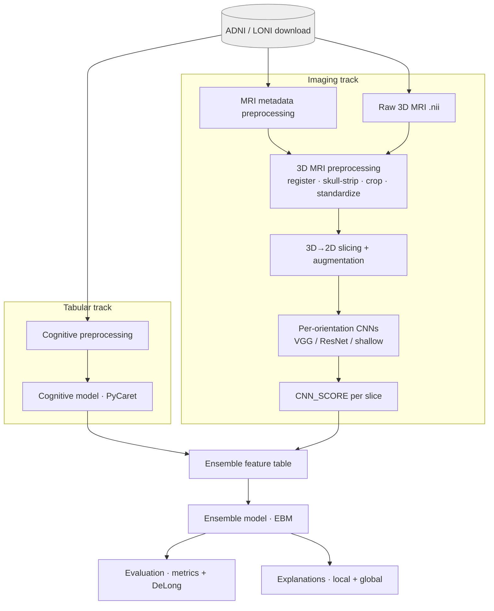
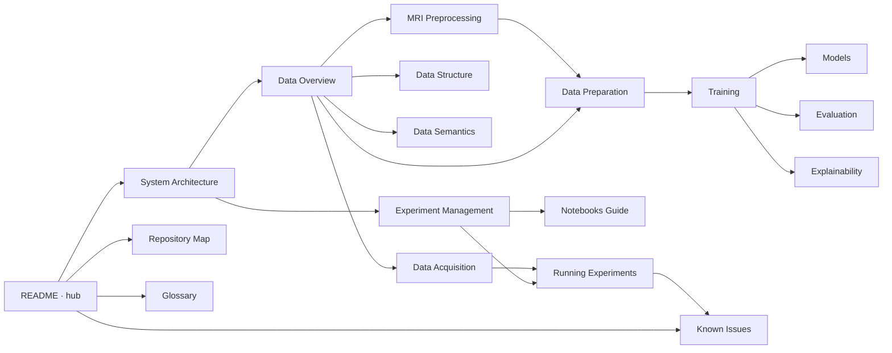

# MMML-Alzheimer Documentation

**Explainable Ensemble Learning for Alzheimer's Disease Diagnosis** — a multi-modal
machine-learning research codebase (PhD work) that diagnoses Alzheimer's Disease by
fusing two data modalities from the [ADNI](https://adni.loni.usc.edu) study:

1. **Tabular** — neuropsychological/cognitive test scores + patient demographics.
2. **Imaging** — 3D T1 MP-RAGE brain MRI scans.

Each modality has its own preprocessing and model pipeline; their predictions are
fused by a final **ensemble** classifier (an Explainable Boosting Machine). Predictions
are explained at the **patient level** (local) and the **population level** (global).

> This documentation was reconstructed from the source code. The `data/`, `models/`,
> and `reports/` directories are gitignored and empty in the repo, so on-disk data layout
> and column semantics are reconstructed from how the code reads/writes files — every
> claim is cited as `path:line`.

---

## Start here — task-oriented entry points

| If you want to… | Read this |
|---|---|
| Understand the whole system in 5 minutes | [System Architecture](architecture/system-architecture.md) |
| **Re-download the ADNI data (images + tables)** | [Data Acquisition](data/data-acquisition.md) |
| **Rebuild `ADNIMERGE.csv`** (ADNI now ships the ADNIMERGE2 R package) | [ADNIMERGE2 Rebuild](data/adnimerge2.md) |
| **Run an experiment end-to-end** | [Running Experiments](experiments/running-experiments.md) |
| Find a file or module | [Repository Map](architecture/repository-map.md) |
| Know what a column / label means | [Data Semantics](data/data-semantics.md) |
| Understand how experiments were tracked | [Experiment Management](experiments/experiment-management.md) |
| See what every notebook does | [Notebooks Guide](experiments/notebooks-guide.md) |
| Fix something that's broken/stubbed | [Known Issues](reference/known-issues.md) |
| Look up a term | [Glossary](reference/glossary.md) |

---

## The pipeline at a glance

Detailed walkthrough: [System Architecture](architecture/system-architecture.md) ·
ordered runbook: [Running Experiments](experiments/running-experiments.md).

---

## Documentation map

The docs form a web — every page links to its neighbors and ends with a **See also**
section. Five themed areas plus a reference section:

### Architecture
- [System Architecture](architecture/system-architecture.md) — the three modalities, the ensemble fusion, end-to-end data flow.
- [Repository Map](architecture/repository-map.md) — directory-by-directory tour of `src/` and `notebooks/`; what's implemented vs. stubbed.

### Data
- [Data Overview](data/data-overview.md) — the ADNI sources, the table lineage, how imaging and tabular data join. *(hub for the data docs)*
- [Data Acquisition](data/data-acquisition.md) — **re-download guide**: what to fetch from LONI/IDA and where to put it.
- [ADNIMERGE2 Rebuild](data/adnimerge2.md) — rebuild `ADNIMERGE.csv` from the ADNIMERGE2 R package (ADNI's new tabular format; covers reading `.rda`, the column map, ADASQ4, IMAGEUID).
- [Data Structure](data/data-structure.md) — on-disk layout, file catalogue, naming conventions, formats.
- [Data Semantics](data/data-semantics.md) — the data dictionary: columns, the diagnostic label scheme, the ID system.
- [MRI Preprocessing](data/mri-preprocessing.md) — the 3D pipeline: registration, skull-stripping, cropping, standardization.
- [Data Preparation](data/data-preparation.md) — 3D→2D slicing, augmentation, subject-level cross-validation folds, ensemble alignment.

### Modeling
- [Models](modeling/models.md) — CNN architectures (shallow / VGG / ResNet) and the focal loss.
- [Training](modeling/training.md) — MRI (offline/online), cognitive, and ensemble training; how artifacts are saved.
- [Evaluation](modeling/evaluation.md) — metrics and the DeLong AUC-comparison test.
- [Explainability](modeling/explainability.md) — local (patient) and global (population) explanations via Captum and EBM.

### Experiments
- [Experiment Management](experiments/experiment-management.md) — how experiments were tracked (dated notebooks + output-file naming; no MLflow).
- [Notebooks Guide](experiments/notebooks-guide.md) — catalogue of all ~50 notebooks, grouped and ordered.
- [Running Experiments](experiments/running-experiments.md) — **the end-to-end runbook** to reproduce or extend results.

### Reference
- [Glossary](reference/glossary.md) — clinical, neuroimaging, and project-specific terms.
- [Known Issues](reference/known-issues.md) — bugs, stubs, hardcoded paths, and must-fix-before-running gotchas.

---

## How the docs link together

---

## Repository quick facts

- **Importable library:** [src/](../src/) (package name `mmmlalzheimer`, see [setup.py](../setup.py)). The orchestration layer under `src/run/` and `src/experiment/` is **stubbed/empty** — experiments run from notebooks. See [Repository Map](architecture/repository-map.md).
- **Runners & history:** [notebooks/](../notebooks/) (~50 notebooks). The dated notebook names are the de-facto experiment log — see [Experiment Management](experiments/experiment-management.md).
- **Data & models:** live outside the repo (gitignored). Reconstructed layout in [Data Structure](data/data-structure.md); how to get the data in [Data Acquisition](data/data-acquisition.md).
- **Built for Google Colab** on Google Drive — paths are hardcoded; expect to fix them for a fresh run ([Known Issues](reference/known-issues.md)).

For agents and AI tooling working in this repo, see [CLAUDE.md](../CLAUDE.md) at the repo root.
