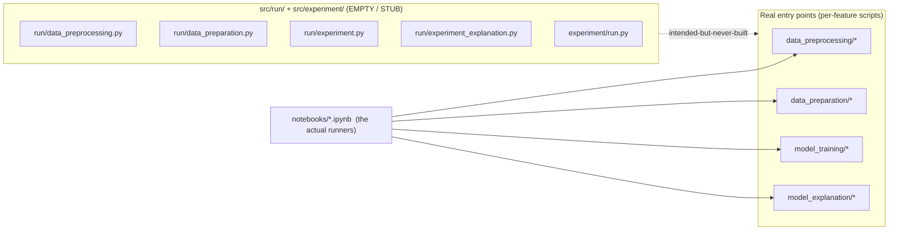

*Part of the [MMML-Alzheimer documentation](../README.md). A directory-by-directory tour of the repository: every package, file, and its status.*

# Repository Map

This is the navigational index to the codebase. Two things to internalize before exploring:

1. **`src/` is the importable library; the [notebooks](../../notebooks/) are the runners.** Every real experiment was driven from a dated notebook that imports functions out of `src/`. There is no single command-line entry point.
2. **A whole orchestration layer is empty.** [src/run/](../../src/run/) (4 files) and parts of [src/experiment/](../../src/experiment/) were placeholders for a unified pipeline driver that was never built. They are 0-byte or `pass`-only stubs — see [Empty and stub files](#empty-and-stub-files) and the full catalogue in [../reference/known-issues.md](../reference/known-issues.md).

The packaging metadata in [setup.py](../../setup.py) declares the distribution name **`mmmlalzheimer`** (version `0.2.0`, MIT), but it has no `package_dir={'': 'src'}` and no `install_requires`, so the name does not actually map onto `src/`. In practice the project is never consumed as an installed package — scripts resolve their sibling imports at runtime via `sys.path.append("./../utils")`-style hacks, which means a script only imports correctly when launched from inside its own subdirectory. Details in [../reference/known-issues.md](../reference/known-issues.md).

## Top-level layout

```text
mmml-alzheimer-diagnosis/
├── src/                  # the importable library (8 packages)
│   ├── data_preprocessing/   # raw ADNI -> cleaned tables + 3D MRI volumes
│   ├── data_preparation/     # 3D -> 2D slices, augmentation, CV folds, ensemble prep
│   ├── model_training/       # CNN / cognitive / ensemble trainers + datasets
│   ├── models/               # CNN architectures + focal loss
│   ├── model_evaluation/     # metrics, DeLong test, ensemble eval
│   ├── model_explanation/    # local + global XAI (Captum, EBM)
│   ├── utils/                # MRI I/O, reference-table helpers, ANTs env
│   ├── experiment/           # config + Experiment class (STUB)
│   ├── run/                  # intended pipeline driver (ALL EMPTY)
│   └── __init__.py           # one-line comment only
├── notebooks/            # 50 notebooks (the actual experiment runners) + loose .py scripts
│   ├── early_mri_exploration/   # 12 EDA / pipeline-prototype notebooks
│   ├── mri_preprocessing/       # 10 preprocessing-run notebooks
│   ├── final_studies/           # 7 dissertation-figure notebooks (+ committed images/)
│   └── 2021*.ipynb              # 21 loose dated experiment notebooks
├── data/                # gitignored, EMPTY (only reconstructed layout exists)
├── models/              # gitignored, only models/.gitkeep
├── reports/             # gitignored, only reports/.gitkeep
├── docs/                # this documentation
├── setup.py             # package name 'mmmlalzheimer' (see note above)
├── requirements.txt     # 6 unpinned deps, INCOMPLETE (8 more used in code)
├── README.md
└── LICENSE
```

For the conceptual flow through these directories see [../architecture/system-architecture.md](../architecture/system-architecture.md); for where files land on disk at runtime see [../data/data-structure.md](../data/data-structure.md).

## The `src/` library, package by package

Statuses used below: **implemented** (working code), **partial** (works but has dead/broken parts), **EMPTY STUB** (0 bytes), **commented-out** (file is entirely comments), **TODO stub** (a class/function whose body is `pass`).

### `src/data_preprocessing/` — raw ADNI to cleaned tables and 3D volumes

Turns raw ADNI downloads into cleaned cognitive tables and registered/skull-stripped/cropped 3D MRI volumes. Pipeline detail in [../data/mri-preprocessing.md](../data/mri-preprocessing.md).

| File | Role | Status |
|------|------|--------|
| [mri_preprocessing.py](../../src/data_preprocessing/mri_preprocessing.py) | Main 3D pipeline driver: standardize → register → skull-strip → crop(100³) → integrity check → write `.nii.gz` + `REFERENCE.csv`. Has `argparse`/`__main__`. | implemented |
| [mri_standardize.py](../../src/data_preprocessing/mri_standardize.py) | Clip to 0.02/99.8 percentiles and rescale to atlas intensity range. Hardcoded atlas thresholds `(0.05545412003993988, 92.05744171142578)` at [mri_standardize.py#L74](../../src/data_preprocessing/mri_standardize.py#L74). | implemented |
| [antspy_registration.py](../../src/data_preprocessing/antspy_registration.py) | ANTs affine registration to atlas (`type_of_transform='Affine'`, `grad_step=0.1`). `ATLAS_PATH` hardcoded at [antspy_registration.py#L15](../../src/data_preprocessing/antspy_registration.py#L15). | implemented |
| [deepbrain_skull_strip.py](../../src/data_preprocessing/deepbrain_skull_strip.py) | DeepBrain 3D U-Net `Extractor`, probability threshold `0.5`. Requires `deepbrain` + `tensorflow`. | implemented |
| [mri_crop.py](../../src/data_preprocessing/mri_crop.py) | `crop_mri_at_center(box=100)` → 100×100×100 volume. | implemented |
| [cognitive_tests_preprocessing.py](../../src/data_preprocessing/cognitive_tests_preprocessing.py) | Reads `ADNIMERGE.csv`, selects/renames/encodes cognitive + demographic columns → `COGNITIVE_DATA_PREPROCESSED.csv`. Column scheme in [../data/data-semantics.md](../data/data-semantics.md). | implemented |
| [mri_metadata_preprocessing.py](../../src/data_preprocessing/mri_metadata_preprocessing.py) | Concatenates 5 raw MRI metadata refs → `RAW_MRI_REFERENCE.csv`; later concatenates per-folder `REFERENCE.csv` → `PREPROCESSED_MRI_REFERENCE.csv`. | implemented |
| [mri_selection.py](../../src/data_preprocessing/mri_selection.py) | Emits `SELECTED_IMAGES_REFERENCE.csv` (single `IMAGEUID` column) — the list of MRIs to download from ADNI. | implemented |
| [ensemble_preprocessing.py](../../src/data_preprocessing/ensemble_preprocessing.py) | Merges cognitive × MRI on `['SUBJECT','IMAGEUID']`, adds `CONFLICT_DIAGNOSIS`, drops 3 hardcoded missing MRIs `[293688, 274525, 280596]` ([ensemble_preprocessing.py#L62](../../src/data_preprocessing/ensemble_preprocessing.py#L62)) → `PREPROCESSED_ENSEMBLE_REFERENCE.csv`. | implemented |
| [mri_label.py](../../src/data_preprocessing/mri_label.py) | Image-renaming-by-label. **Entirely commented out** — abandoned; referenced only as comments in [mri_preprocessing.py#L24](../../src/data_preprocessing/mri_preprocessing.py#L24). | **commented-out** |
| [\_\_init\_\_.py](../../src/data_preprocessing/__init__.py) | Package marker. | empty (0 bytes) |

### `src/data_preparation/` — 3D to 2D slices, augmentation, CV folds, ensemble prep

Converts 3D volumes into 2D `.npz` slices, applies augmentation, builds CV folds and the ensemble reference. See [../data/data-preparation.md](../data/data-preparation.md). Note the **two competing 2D layouts** here (flat per-orientation vs per-subject `storage/<ID>/`).

| File | Role | Status |
|------|------|--------|
| [mri_preparation.py](../../src/data_preparation/mri_preparation.py) | Flat 2D output: slices each 3D `.nii.gz`, optionally augments, saves `<stem>_<orientation>_<slice>.npz` + a `REFERENCE.csv`. | implemented |
| [mri_batch_preparation.py](../../src/data_preparation/mri_batch_preparation.py) | Per-subject "storage" output: `<out>/<IMAGE_DATA_ID>/<orientation>_<NN>.npz`. Has a **dict-key collision bug** in default `orientations` ([mri_batch_preparation.py#L20](../../src/data_preparation/mri_batch_preparation.py#L20)): duplicate `axial`/`sagittal` keys silently drop the first range. | partial |
| [mri_augmentation.py](../../src/data_preparation/mri_augmentation.py) | Image-level primitives: `slice_image`, `generate_augmented_slice`, `sample_from_neighborhood`, rotation. | implemented |
| [mri_metadata_preparation.py](../../src/data_preparation/mri_metadata_preparation.py) | Builds/writes the processed 2D-slice reference CSVs consumed by training. | implemented |
| [ensemble_preparation.py](../../src/data_preparation/ensemble_preparation.py) | Adds `DATASET ∈ {train, validation, test}` via subject-level stratified split (`random_seed=151`, `test_size=validation_size=0.25`), rebuilds `IMAGE_DATA_ID` → `PROCESSED_ENSEMBLE_REFERENCE.csv`. | implemented |
| [stratified_fold_split.py](../../src/data_preparation/stratified_fold_split.py) | Stratified-by-subject K-fold splitting helper. | implemented |
| [train_test_split.py](../../src/data_preparation/train_test_split.py) | `train_test_split_by_subject` helper (keeps a subject's scans on one side of the split). | implemented |
| [\_\_init\_\_.py](../../src/data_preparation/__init__.py) | Package marker. | empty (0 bytes) |

### `src/model_training/` — trainers + dataset classes

Three model families plus the PyTorch `Dataset` classes and the reference-table generator. Full behavior, hyperparameters, and save format in [../modeling/training.md](../modeling/training.md). All MRI slices are reshaped to the hardcoded `X.view(-1, 1, 100, 100)`.

| File | Role | Status |
|------|------|--------|
| [mri_train.py](../../src/model_training/mri_train.py) | **Primary offline CNN trainer** (27 KB). Reads pre-extracted 2D `.npz` via `MRIDataset`. Entry points `run_mris_experiments`, `run_experiments_for_ensemble`, `compute_predictions_for_ensemble`. Persists CNN scores as column `CNN_SCORE`. | partial |
| [mri_train_online.py](../../src/model_training/mri_train_online.py) | **Legacy online trainer** (slices 3D volumes on the fly via `MRIDatasetOnline`). Superseded by `mri_train.py`. Its `__main__` block passes nonexistent kwargs → `TypeError`. Predictions use `CNN_PREDICTION`/`CNN_PREDICT_PROBA`. | partial |
| [mri_dataset.py](../../src/model_training/mri_dataset.py) | `MRIDataset` (offline): loads `np.load(IMAGE_PATH)['arr_0']`, optional rotation, normalizes `X/X.max()`, target `MACRO_GROUP`. | implemented |
| [mri_dataset_online.py](../../src/model_training/mri_dataset_online.py) | `MRIDatasetOnline` (reads 3D NIfTI, slices live; lowercase columns `orientation`/`slice_num`/`rotation_angle`). Also contains `MRIDatasetOnline2`, a **dead/broken duplicate** (references undefined `transforms`/`rgb_mean`/`self.T`). | partial |
| [mri_dataset_generation.py](../../src/model_training/mri_dataset_generation.py) | `generate_mri_dataset_reference` — builds the in-memory slice/rotation reference table (no image files written). | implemented |
| [cognitive_tests_train.py](../../src/model_training/cognitive_tests_train.py) | Tabular branch via **PyCaret** `compare_models` + an EBM. **Model saving is a `# TODO ... pass`** ([cognitive_tests_train.py#L100](../../src/model_training/cognitive_tests_train.py#L100)). The `__main__` cells call undefined `run_ensemble_experiment` → `NameError`. | partial |
| [ensemble_train.py](../../src/model_training/ensemble_train.py) | Late-fusion layer: pivots CNN scores into `CNN_SCORE_<ORIENT>_<SLICE>` columns, merges cognitive `COGTEST_SCORE`, fits `[EBM, LogisticRegression]`. No ensemble model is persisted. `DummyModel.predict` returns `None` (only `predict_proba` is used). | partial |
| [\_\_init\_\_.py](../../src/model_training/__init__.py) | Package marker. | empty (0 bytes) |

### `src/models/` — architectures + loss

| File | Role | Status |
|------|------|--------|
| [neural_network.py](../../src/models/neural_network.py) | Architectures + factory. `NeuralNetwork` (`shallow_cnn`), `SuperShallowCNN`, and adapted torchvision `vgg11/11_bn/13/13_bn/19/19_bn` + `resnet34/50/101` (1-channel input, single-logit output, **no pretrained weights**). `load_model` falls through to `NeuralNetwork()` on any unrecognized string; `load_trained_model` loads `state_dict` with `strict=True`. | implemented |
| [loss.py](../../src/models/loss.py) | `WeightedFocalLoss` (`alpha=.25, gamma=2` defaults). **Hardcodes `.cuda()` in `__init__` ([loss.py#L10](../../src/models/loss.py#L10)) → crashes on CPU-only machines.** | partial |

### `src/model_evaluation/` — metrics + statistical tests

| File | Role | Status |
|------|------|--------|
| [base_evaluation.py](../../src/model_evaluation/base_evaluation.py) | `compute_metrics_binary` (auc/accuracy/f1/precision/recall/conf_mat), ROC plotting, AUC confidence intervals, optimal-cutoff. Shared by both trainers. See [../modeling/evaluation.md](../modeling/evaluation.md). | implemented |
| [de_long_evaluation.py](../../src/model_evaluation/de_long_evaluation.py) | DeLong test (`delong_roc_test`) for comparing two AUCs. | implemented |
| [ensemble_evaluation.py](../../src/model_evaluation/ensemble_evaluation.py) | Ensemble ROC/threshold evaluation. `compare_ensembles_performance_on_dataset` is a `pass` stub ([ensemble_evaluation.py#L9](../../src/model_evaluation/ensemble_evaluation.py#L9)). | partial |
| [mri_evaluation.py](../../src/model_evaluation/mri_evaluation.py) | — | **EMPTY STUB (0 bytes)** |

### `src/model_explanation/` — local + global XAI

CNN saliency and EBM-based ensemble explanations. See [../modeling/explainability.md](../modeling/explainability.md). Both files need third-party deps missing from [requirements.txt](../../requirements.txt) (`captum`, `interpret`).

| File | Role | Status |
|------|------|--------|
| [mri_explanation.py](../../src/model_explanation/mri_explanation.py) | `MRIExplainer` — Captum saliency (`DeepLift`, `GuidedGradCam`, `NoiseTunnel`) over CNN slices. Consumes a prediction reference carrying `MODEL`, `MODEL_PATH`, `IMAGE_PATH`, `ORIENTATION`, `SLICE`, `CNN_SCORE`. | implemented |
| [ensemble_explanation.py](../../src/model_explanation/ensemble_explanation.py) | `EnsembleExplainer` — global + local EBM explanations over slice scores + demographics; `prepare_patient_data_for_explanations`. | implemented |

### `src/utils/` — MRI I/O, reference-table helpers, environment

The shared helper layer that every preprocessing/preparation script imports via `from utils import *` / `from base_mri import *`. Full helper signatures in [../data/data-structure.md](../data/data-structure.md).

| File | Role | Status |
|------|------|--------|
| [utils.py](../../src/utils/utils.py) | 6 helpers for image listing and reference tables: `list_available_images`, `delete_useless_images`, `create_file_name_from_path`, `load_reference_table`, `create_reference_table`, `create_image_references`. Establishes the `REFERENCE.csv` filename, `<patient_id>#<image_id>` ID join, and UPPER_SNAKE_CASE columns. **Default reference path is a hardcoded Linux path** ([utils.py#L71](../../src/utils/utils.py#L71)). | implemented |
| [base_mri.py](../../src/utils/base_mri.py) | MRI I/O + ANTs env: `save_batch_mri`, `save_mri`, `load_mri`, `set_env_variables`, `check_mri_integrity`. Default on-disk format is compressed `.npz` with array key `arr_0`. `set_env_variables` **hardcodes ANTs/NiftyReg paths on the Linux box** ([base_mri.py#L83](../../src/utils/base_mri.py#L83)). | implemented |
| [extract_zip.sh](../../src/utils/extract_zip.sh) | One-line Colab-only bulk `unzip` of raw ADNI `.zip` archives (Google Drive mount paths, no shebang). First step after downloading raw data — see [../data/data-acquisition.md](../data/data-acquisition.md). | implemented (one-liner) |
| [\_\_init\_\_.py](../../src/utils/__init__.py) | Package marker. | empty (0 bytes) |

### `src/experiment/` — config + Experiment class (stub)

The intended config-driven experiment runner. **Never implemented and never read by any code.**

| File | Role | Status |
|------|------|--------|
| [run.py](../../src/experiment/run.py) | An `Experiment` class meant to read a config and run/store results. `Experiment.run()` is `pass`; the ctor has a `#TODO`. Config loading is only a comment. | **TODO stub** |
| [experiment_config.json](../../src/experiment/experiment_config.json) | Skeleton config `{"mri":{}, "cognitive_tests":{}, "ensemble":{}}` — all three sub-dicts empty; `grep experiment_config` finds **no reader** anywhere. | dead skeleton |

### `src/run/` — intended pipeline driver (all empty)

The planned single-command pipeline driver, mirroring the real feature directories by name. **All four files are 0 bytes; there is no `__init__.py`.** The actual working entry points live inside the feature directories instead (e.g. [mri_preprocessing.py](../../src/data_preprocessing/mri_preprocessing.py), [mri_train.py](../../src/model_training/mri_train.py)).

| File | Intended role | Status |
|------|---------------|--------|
| [data_preprocessing.py](../../src/run/data_preprocessing.py) | Drive `src/data_preprocessing/*`. | **EMPTY STUB (0 bytes)** |
| [data_preparation.py](../../src/run/data_preparation.py) | Drive `src/data_preparation/*`. | **EMPTY STUB (0 bytes)** |
| [experiment.py](../../src/run/experiment.py) | Drive model training. | **EMPTY STUB (0 bytes)** |
| [experiment_explanation.py](../../src/run/experiment_explanation.py) | Drive explanations. | **EMPTY STUB (0 bytes)** |

## Empty and stub files

The non-functional files in one place, for the returning maintainer. Full diagnosis in [../reference/known-issues.md](../reference/known-issues.md).

| File | Kind |
|------|------|
| [src/run/data_preprocessing.py](../../src/run/data_preprocessing.py) | 0 bytes |
| [src/run/data_preparation.py](../../src/run/data_preparation.py) | 0 bytes |
| [src/run/experiment.py](../../src/run/experiment.py) | 0 bytes |
| [src/run/experiment_explanation.py](../../src/run/experiment_explanation.py) | 0 bytes |
| [src/model_evaluation/mri_evaluation.py](../../src/model_evaluation/mri_evaluation.py) | 0 bytes |
| [src/experiment/run.py](../../src/experiment/run.py) | TODO stub (`Experiment.run()` → `pass`) |
| [src/data_preprocessing/mri_label.py](../../src/data_preprocessing/mri_label.py) | fully commented out (abandoned) |
| [src/model_training/\_\_init\_\_.py](../../src/model_training/__init__.py), [src/utils/\_\_init\_\_.py](../../src/utils/__init__.py), [src/data_preparation/\_\_init\_\_.py](../../src/data_preparation/__init__.py), [src/data_preprocessing/\_\_init\_\_.py](../../src/data_preprocessing/__init__.py) | empty package markers |



## `notebooks/` — the actual runners

50 notebooks total, plus 4 loose `.py` scripts. They import from `src/` and contain the hardcoded paths, hyperparameters, and `to_csv` targets that make experiments concrete. The full annotated catalogue (groups, order, timeline) is in [../experiments/notebooks-guide.md](../experiments/notebooks-guide.md); how runs are tracked is in [../experiments/experiment-management.md](../experiments/experiment-management.md).

Three curated groups plus the loose dated experiment notebooks:

| Location | Count | What it is |
|----------|------:|------------|
| [notebooks/early_mri_exploration/](../../notebooks/early_mri_exploration/) | 12 | Earliest EDA and pipeline prototyping (`00_initial_EDA_with_TADPOLE_Data` … `11_MRI_creating_reference_for_images`): TADPOLE EDA, ANTsPy registration/skull-strip trials, cropping, standardization, augmentation tests. |
| [notebooks/mri_preprocessing/](../../notebooks/mri_preprocessing/) | 10 | The actual preprocessing runs (`01_Data_Analysis…` through `06_MRI_null_checks`), including the five `04_MRI_Preprocessing_0{1..5}` batch runs and ensemble-data alignment. Includes a helper script [preprocess_utils.py](../../notebooks/mri_preprocessing/preprocess_utils.py). |
| [notebooks/final_studies/](../../notebooks/final_studies/) | 7 | The dissertation-figure notebooks: `00_3d_brain_mri_scans`, `00_results_preprocessed_data_assessment`, `01_results_mri_slice_choice`, `02_results_separate_learning_results`, `03_results_ensemble_learning_results`, `04_explanations_global`, `05_explanations_local_ensemble`. Generated PNGs are committed under [notebooks/final_studies/images/](../../notebooks/final_studies/images/) (subfolders `appendix`, `explanations`, `explanations-ensemble`, `explanations-mri`, `results`). |
| `notebooks/*.ipynb` (loose) | 21 | Dated CNN/ensemble experiment runners, `20211011`–`20220120`, e.g. [20211027_Run_CNN_VGG19_for_ensemble.ipynb](../../notebooks/20211027_Run_CNN_VGG19_for_ensemble.ipynb), [20211227_Ensemble_Results_AD.ipynb](../../notebooks/20211227_Ensemble_Results_AD.ipynb), [20220120_explanations_local_ensemble_prediction_proba_evaluation.ipynb](../../notebooks/20220120_explanations_local_ensemble_prediction_proba_evaluation.ipynb). The dated prefix encodes run order. |

Loose `.py` scripts in [notebooks/](../../notebooks/): [ebm_feature_importance.py](../../notebooks/ebm_feature_importance.py), [playground.py](../../notebooks/playground.py), [playground_ensemble_results_ad.py](../../notebooks/playground_ensemble_results_ad.py) (scratch/exploration), plus the preprocessing helper noted above.

## `data/`, `models/`, `reports/` — gitignored

- `data/` — **not committed.** [.gitignore](../../.gitignore) excludes `/data/` and `/src/data/`. The expected on-disk layout is reconstructed from path strings in code; see [../data/data-structure.md](../data/data-structure.md) and the re-download runbook in [../data/data-acquisition.md](../data/data-acquisition.md).
- [models/](../../models/) — **not committed.** `.gitignore` excludes `/models/` and `/models/*`; only `models/.gitkeep` is tracked. CNN `.pth` weights and (non-persisted) tabular/ensemble models go here at runtime.
- [reports/](../../reports/) — only `reports/.gitkeep` is tracked.
- [docs/](../../docs/) — this documentation set (plus research notes under `docs/_research/`).

## Dependencies

[requirements.txt](../../requirements.txt) lists only 6 unpinned packages (`numpy`, `pandas`, `matplotlib`, `sklearn`, `torch`, `antspyx`) and is **incomplete**: it lists the deprecated stub name `sklearn` instead of `scikit-learn`, and omits 8 packages the code actually imports — `scipy`, `torchvision`, `nibabel`, `captum`, `interpret`, `pycaret`, `deepbrain`, `tensorflow`. The dev conda env is named `alzheimer` (from `src/.vscode/settings.json`). Reproducing the environment is the main 4-year-return hazard; full breakdown in [../reference/known-issues.md](../reference/known-issues.md).

## See also

- [../architecture/system-architecture.md](../architecture/system-architecture.md) — end-to-end flow through these packages
- [../experiments/notebooks-guide.md](../experiments/notebooks-guide.md) — the 50 notebooks in detail
- [../data/data-structure.md](../data/data-structure.md) — on-disk file catalogue and helper signatures
- [../modeling/training.md](../modeling/training.md) — what the trainers in `src/model_training/` actually do
- [../reference/known-issues.md](../reference/known-issues.md) — stubs, bugs, and gotchas catalogue
- [../README.md](../README.md) — documentation hub
