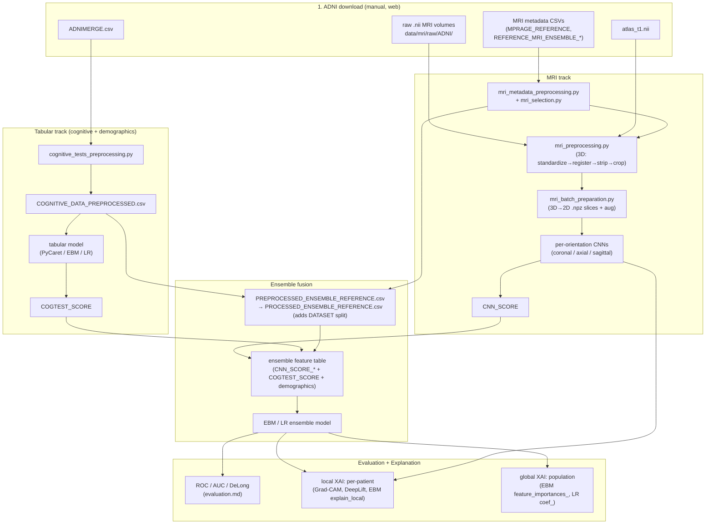
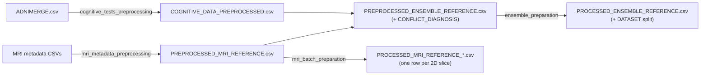

*Part of the [MMML-Alzheimer documentation](../README.md). End-to-end orientation map of the multi-modal pipeline — from ADNI download to ensemble diagnosis and explanation.*

# System Architecture

This project diagnoses Alzheimer's disease by **fusing three input modalities**, each with its own preprocessing and its own classifier, then stacking their outputs into a final **Explainable Boosting Machine (EBM)** ensemble. The result is both predicted (binary AD-vs-CN by default) and explained — locally for a single patient and globally for the population.

The three modalities:

| Modality | Raw source | Preprocessing track | Model | Output column |
|---|---|---|---|---|
| **3D MRI scans** | ADNI NIfTI volumes (`.nii`) + per-batch metadata CSVs | 3D pipeline (register → skull-strip → crop → standardize) then 3D→2D slicing | one **2D CNN per (orientation, slice)** | `CNN_SCORE` |
| **Neuropsychological / cognitive tests** | `ADNIMERGE.csv` | tabular cleaning + encoding | tabular classifier (PyCaret / EBM / LR) | `COGTEST_SCORE` |
| **Demographics** | `ADNIMERGE.csv` (same table) | folded into the tabular cleaning | merged as raw features into the ensemble | demographic columns |

Demographics and cognitive tests share one input file and one preprocessing module ([cognitive_tests_preprocessing.py](../../src/data_preprocessing/cognitive_tests_preprocessing.py)); they diverge only at the modeling layer, where demographics enter the ensemble as raw features while cognitive tests are first scored by a tabular model. The MRI track is a fully separate pipeline with its own multi-stage 3D preprocessing.

> The deep-dives for each stage are linked throughout. This page is the map, not the territory — it routes you to the right doc and shows how the stages hand data to each other.

## What "ensemble" means here

"Ensemble" is **late fusion of multiple classifiers**, not bagging or boosting of one model family. Each per-orientation/slice CNN produces a probability, the cognitive model produces a probability, demographics come in as raw features, and a **final meta-classifier** (the EBM, with Logistic Regression as a baseline) is trained on that stacked feature table to make the diagnosis. The CNNs and the cognitive model are never retrained by the ensemble step — it consumes their saved prediction CSVs and fits on top. See [training.md](../modeling/training.md) for the fusion mechanics and [ensemble_train.py](../../src/model_training/ensemble_train.py).

## The full pipeline at a glance

The canonical, copy-pasteable ordering is in [End-to-end ordering](#end-to-end-ordering) at the bottom.

## The data-flow contract between stages

The pipeline has no central config and no formal experiment tracker — `src/experiment/run.py` is a stub, `experiment_config.json` is an empty skeleton, and all four files in [src/run/](../../src/run/) are 0 bytes. Stages communicate entirely through **CSV reference tables**, **`.npz` slice files**, and a few **score columns** with fixed names. Understanding those three contracts is enough to understand how the system fits together; details on each are in [data-structure.md](../data/data-structure.md) and [data-semantics.md](../data/data-semantics.md).

### Contract 1 — the reference CSVs (the spine)

A chain of reference tables threads the whole pipeline together. Each stage reads the previous table, adds columns or rows, and writes the next one:

- **`COGNITIVE_DATA_PREPROCESSED.csv`** — cleaned cognitive + demographic table, one row per ADNI visit. Produced by [cognitive_tests_preprocessing.py#L57](../../src/data_preprocessing/cognitive_tests_preprocessing.py#L57).
- **`PREPROCESSED_MRI_REFERENCE.csv`** — 3D-image metadata (post skull-strip), keyed by `IMAGE_DATA_ID` (`I######`). Produced by [mri_metadata_preprocessing.py#L45](../../src/data_preprocessing/mri_metadata_preprocessing.py#L45).
- **`PREPROCESSED_ENSEMBLE_REFERENCE.csv`** — the join of cognitive × MRI on `(SUBJECT, IMAGEUID)`, carrying the `CONFLICT_DIAGNOSIS` flag (true when the cognitive label disagrees with the MRI macro-group). Produced by [ensemble_preprocessing.py#L42](../../src/data_preprocessing/ensemble_preprocessing.py#L42).
- **`PROCESSED_ENSEMBLE_REFERENCE.csv`** — adds the `DATASET` ∈ {train, validation, test} split, assigned at the **subject level** (leakage-safe, `random_seed=151`). Produced by [ensemble_preparation.py](../../src/data_preparation/ensemble_preparation.py).
- **`PROCESSED_MRI_REFERENCE_*.csv`** — one row per 2D slice, the reference the CNN trainer iterates. Produced by [mri_batch_preparation.py#L101](../../src/data_preparation/mri_batch_preparation.py#L101).

The join keys are `SUBJECT` (ADNI subject id, e.g. `002_S_4270`), `IMAGEUID` (integer, cognitive side) and `IMAGE_DATA_ID` (`I######` string, MRI side); the two image ids bridge via `str.replace('I','').astype(int64)`. Full column dictionaries are in [data-semantics.md](../data/data-semantics.md).

### Contract 2 — the `.npz` 2D slices

The 3D preprocessing pipeline emits **100×100×100** skull-stripped `.nii.gz` volumes; the preparation stage slices those into **100×100** 2D arrays saved as compressed `.npz` (single array under the default key `arr_0`). Each slice file's path lands in the reference table's `IMAGE_PATH` column, and the CNN dataset loads exactly that: `np.load(sample['IMAGE_PATH'])['arr_0']`, normalized `X = X/X.max()`, reshaped to `(-1, 1, 100, 100)` ([mri_dataset.py#L46](../../src/model_training/mri_dataset.py#L46)). The `100×100` size is a hardcoded magic number repeated in every training loop. Slicing axis conventions and the two competing on-disk layouts (flat vs per-subject `storage/`) are covered in [data-preparation.md](../data/data-preparation.md).

### Contract 3 — the score columns (`CNN_SCORE` / `COGTEST_SCORE`)

This is where the three tracks converge into one feature table:

- **`CNN_SCORE`** — each CNN's sigmoid probability, appended per (image, orientation, slice) row by [mri_train.py#L582](../../src/model_training/mri_train.py#L582). The ensemble step pivots these wide so each (orientation, slice) model becomes its own column, e.g. `CNN_SCORE_CORONAL_43`, `CNN_SCORE_AXIAL_23`, `CNN_SCORE_SAGITTAL_26` ([ensemble_train.py#L20](../../src/model_training/ensemble_train.py#L20)).
- **`COGTEST_SCORE`** — the cognitive model's probability. The tabular trainer actually writes `Score_1` / `Label` / `TABULAR_MODEL`; the rename to `COGTEST_SCORE` happens manually inside the ensemble notebooks (see [known-issues.md](../reference/known-issues.md)).
- The two are merged on `(SUBJECT, IMAGE_DATA_ID, DATASET)`, demographics are added in the notebooks, missing per-slice CNN scores are `fillna(0)`, and the result — indexed by `IMAGE_DATA_ID`, with `DIAGNOSIS` as the label — is the **ensemble feature table** fed to the EBM. See [training.md](../modeling/training.md) §6.

## The three tracks in more detail

### MRI track

The heaviest pipeline. Raw ADNI `.nii` volumes pass through a fixed six-step 3D pipeline ([mri_preprocessing.py#L86](../../src/data_preprocessing/mri_preprocessing.py#L86)): intensity **standardize** (atlas-anchored, with hardcoded thresholds `(0.05545412003993988, 92.05744171142578)`) → affine **register** to `atlas_t1.nii` → DeepBrain **skull-strip** (`probability=0.5`) → center **crop** to `100³` → integrity check → save as `.nii.gz`. Then [mri_batch_preparation.py](../../src/data_preparation/mri_batch_preparation.py) slices each volume into 2D `.npz` files across coronal/axial/sagittal orientations with optional rotation and neighborhood-sampling augmentation. A **separate 2D CNN is trained per (orientation, slice)** — custom shallow CNNs plus adapted (1-channel input, single-logit output) torchvision VGG and ResNet backbones — each producing a `CNN_SCORE`. Pipeline details: [mri-preprocessing.md](../data/mri-preprocessing.md), [data-preparation.md](../data/data-preparation.md), [models.md](../modeling/models.md), [training.md](../modeling/training.md).

### Tabular track (cognitive tests)

[cognitive_tests_preprocessing.py](../../src/data_preprocessing/cognitive_tests_preprocessing.py) selects the cognitive and demographic columns out of `ADNIMERGE.csv`, normalizes the 3-class diagnosis taxonomy (`CN`, `MCI`, `AD`; encoded `CN=0, AD=1, MCI=2`), and one-hot-encodes categoricals. The cognitive columns (`CDRSB`, `ADAS11/13`, `MMSE`, `RAVLT_*`, `MOCA`, `FAQ`, `TRABSCOR`, …) are scored by a tabular classifier — PyCaret's `compare_models` over `lr`/`svm`/`lightgbm`/`et` plus a direct `ExplainableBoostingClassifier` — yielding `COGTEST_SCORE`. Column dictionary in [data-semantics.md](../data/data-semantics.md); modeling in [training.md](../modeling/training.md) §5.

### Demographics

Not a standalone model. The demographic columns (`AGE`, `MALE`, `YEARS_EDUCATION`, `HISPANIC`, `RACE`/`RACE_WHITE/BLACK/ASIAN`, marital one-hots) are cleaned alongside the cognitive tests and merged directly into the ensemble feature table as raw features in the notebooks, where they sharpen the EBM's per-patient explanations.

## Evaluation and explanation

Once the EBM (and baselines) are fit, results are scored with shared metric primitives in [base_evaluation.py](../../src/model_evaluation/base_evaluation.py): AUC, F1, accuracy, precision, recall, ROC curves with confidence intervals, and the **DeLong test** for comparing two correlated AUCs on the same cohort ([de_long_evaluation.py](../../src/model_evaluation/de_long_evaluation.py)). Test-set thresholds are chosen on the validation set (no leakage). Details in [evaluation.md](../modeling/evaluation.md).

Explanation runs on two levels and two modalities:

- **Local (patient-level):** Captum **Guided Grad-CAM** + **DeepLift** saliency over the CNN slices ([mri_explanation.py](../../src/model_explanation/mri_explanation.py)), and the EBM's `explain_local` signed feature weights for the fused decision ([ensemble_explanation.py](../../src/model_explanation/ensemble_explanation.py)).
- **Global (population-level):** EBM `feature_importances_` and LR `coef_` rendered as feature-weight bar charts.

There is no SHAP/LIME and no MRI-specific evaluation module — `mri_evaluation.py` is empty; CNN scores are evaluated by treating their columns as named "models" in the generic ROC/metrics functions. Full treatment in [explainability.md](../modeling/explainability.md).

> Several stages will not run as-is after four years (e.g. `np.float` removed in NumPy ≥1.24 breaks the DeLong test; `.cuda()` hardcoded in the focal loss; broken CLIs; two competing MRI-prep layouts). These are catalogued in [known-issues.md](../reference/known-issues.md). The canonical base path everything assumes is the Google-Drive Colab mount `/content/gdrive/MyDrive/Lucas_Thimoteo/data/`, with one inconsistent nested variant; see [data-structure.md](../data/data-structure.md).

## End-to-end ordering

The canonical sequence to reproduce a run, from a cold start, is:

1. **Download** from ADNI: `ADNIMERGE.csv`, the per-batch MRI metadata CSVs, the raw `.nii` MRI volumes, and the `atlas_t1.nii` template — see [data-acquisition.md](../data/data-acquisition.md).
2. **Preprocess cognitive/demographic** data: `ADNIMERGE.csv` → [cognitive_tests_preprocessing.py](../../src/data_preprocessing/cognitive_tests_preprocessing.py) → `COGNITIVE_DATA_PREPROCESSED.csv`.
3. **Preprocess MRI metadata + select** which MRIs to download: [mri_metadata_preprocessing.py](../../src/data_preprocessing/mri_metadata_preprocessing.py) + [mri_selection.py](../../src/data_preprocessing/mri_selection.py).
4. **Preprocess MRI volumes** (3D): [mri_preprocessing.py](../../src/data_preprocessing/mri_preprocessing.py) → `100³` `.nii.gz` + per-folder `REFERENCE.csv` → concatenated into `PREPROCESSED_MRI_REFERENCE.csv`. See [mri-preprocessing.md](../data/mri-preprocessing.md).
5. **Join modalities** into the ensemble reference: [ensemble_preprocessing.py](../../src/data_preprocessing/ensemble_preprocessing.py) → `PREPROCESSED_ENSEMBLE_REFERENCE.csv` (with `CONFLICT_DIAGNOSIS`).
6. **Prepare 2D slices + splits**: [mri_batch_preparation.py](../../src/data_preparation/mri_batch_preparation.py) → `.npz` slices + `PROCESSED_MRI_REFERENCE_*.csv`; [ensemble_preparation.py](../../src/data_preparation/ensemble_preparation.py) → `PROCESSED_ENSEMBLE_REFERENCE.csv` (adds `DATASET`). See [data-preparation.md](../data/data-preparation.md).
7. **Train per-orientation CNNs**: [mri_train.py](../../src/model_training/mri_train.py) → `.pth` weights + `PREDICTIONS_*.csv` carrying `CNN_SCORE`.
8. **Train the cognitive model**: [cognitive_tests_train.py](../../src/model_training/cognitive_tests_train.py) → predictions carrying `COGTEST_SCORE` (after the notebook rename).
9. **Fuse + train the ensemble**: [ensemble_train.py](../../src/model_training/ensemble_train.py) pivots CNN scores wide, joins the cognitive score and demographics → feature table → fit EBM / LR. See [training.md](../modeling/training.md).
10. **Evaluate**: [evaluation.md](../modeling/evaluation.md) (ROC/AUC/DeLong, validation-chosen thresholds).
11. **Explain**: local + global, image + tabular — [explainability.md](../modeling/explainability.md).

For the actual runbook (commands, hardcoded paths, notebook order), see [running-experiments.md](../experiments/running-experiments.md) and the [notebooks-guide.md](../experiments/notebooks-guide.md).

## See also

- [repository-map.md](repository-map.md) — directory-by-directory map of the code
- [data-overview.md](../data/data-overview.md) — the data landscape, sources and lineage
- [data-structure.md](../data/data-structure.md) — on-disk layout, file catalogue, path roots
- [data-semantics.md](../data/data-semantics.md) — column dictionaries and label scheme
- [training.md](../modeling/training.md) — CNN / cognitive / ensemble training and fusion
- [running-experiments.md](../experiments/running-experiments.md) — end-to-end runbook
- [known-issues.md](../reference/known-issues.md) — bugs, stubs, and 4-year-rot hazards
