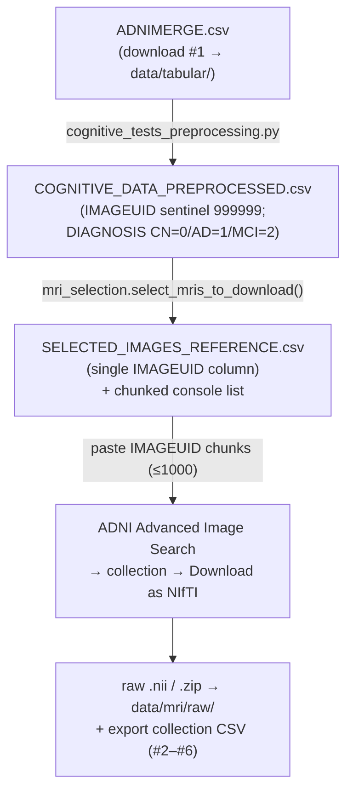

*Part of the [MMML-Alzheimer documentation](../README.md). How to re-download every external ADNI input (plus the registration atlas) and assemble it into the on-disk layout the code expects.*

# Data Acquisition (Re-download Guide)

This is the doc to start from after time away. **Nothing under `data/` or `models/` is committed** — both are gitignored and empty in the repo, so every input must be re-obtained from ADNI/LONI (or, for the atlas, sourced separately) before any pipeline step can run. This guide covers only acquisition: what to download, from where, and to which exact path. Once the files below are in place, hand off to [running-experiments.md](../experiments/running-experiments.md).

> **⚠️ Update (2026): `ADNIMERGE.csv` is no longer distributed as a flat file.** ADNI now ships the tabular data as the **ADNIMERGE2 R data package** (~200 normalized per-instrument `.rda` tables); the merged `adnimerge` table was explicitly discontinued. You **rebuild** `data/tabular/ADNIMERGE.csv` from it with [scripts/rebuild_adnimerge_from_adnimerge2.py](../../scripts/rebuild_adnimerge_from_adnimerge2.py) — full workflow in **[adnimerge2.md](adnimerge2.md)**. Everything about the **MRI images and the atlas** below is unchanged and still applies. Where this guide says "download `ADNIMERGE.csv`", read it as "download the ADNIMERGE2 package, then rebuild".

## The short version

You need **one pre-named file from ADNI**, plus material you assemble yourself, plus one non-ADNI file:

1. `ADNIMERGE.csv` — the merged study-data table that drives the entire tabular track and the MRI-selection logic. **This is the only genuinely external, pre-named, searchable download** (see [§1](#1-acquisition-checklist)).
2. The **five MRI image-collection metadata CSVs** (`MPRAGE_REFERENCE.csv`, `REFERENCE_MRI_ENSEMBLE_CN_AD.csv`, `REFERENCE_MRI_ENSEMBLE_0{1,2,3}.csv`) — **NOT pre-named ADNI downloads.** You create and name these yourself: each is the CSV metadata export of an MRI image collection you build, or is hand-assembled. (Confirmed by the repo owner: these were made manually — so re-creating them means re-doing the image search/collection, not finding a file.) See [§1.2](#12-how-the-metadata-exports-and-the-images-relate).
3. The **raw T1 MP-RAGE NIfTI image collection** — the actual `.nii` brain scans, one per selected `IMAGEUID`.
4. The **registration atlas** `atlas_t1.nii` — a T1 template, **not an ADNI download** and **not in the repo**.

**TADPOLE is NOT needed.** No code in [src/](../../src) reads any TADPOLE file (`TADPOLE_D1_D2.csv` and friends are never referenced). The project uses `ADNIMERGE.csv` directly as its master tabular source ([cognitive_tests_preprocessing.py#L23](../../src/data_preprocessing/cognitive_tests_preprocessing.py#L23)). Do not waste time on the TADPOLE challenge tables.

### ADNI access caveat (start this first — it has the longest lead time)

Everything from ADNI requires an **approved LONI/ADNI account** and an accepted **Data Use Agreement (DUA)**. Apply at [adni.loni.usc.edu](https://adni.loni.usc.edu) → "Apply for Access". **Approval can take days to weeks**, so submit the request before anything else. You cannot script these downloads anonymously — both the image search/download and the study-data/spreadsheet downloads sit behind the authenticated IDA (Image & Data Archive) portal. *(Access requirement inferred from `README.md` line 4 "Data ... collected from the ADNI initiative" plus the fact that all paths point at user-private data.)*

> **Two sites — don't confuse them (this is the #1 reason files seem "missing").** The public info/apply site is **[adni.loni.usc.edu](https://adni.loni.usc.edu)**. The actual file downloads live in the **IDA (Image & Data Archive) at [ida.loni.usc.edu](https://ida.loni.usc.edu)**, behind login. There is **no anonymous direct link** to any file (`ADNIMERGE.csv` included) — every download is gated by your authenticated IDA session. Log in to `ida.loni.usc.edu` first, with the study/project set to **ADNI**.

## 1. Acquisition checklist

Every external file to obtain, where it comes from on the LONI/IDA portal, the destination folder, and the exact filename the code reads. The path-root column shows where the code looks today; **read the [path-root gotcha](#13-path-root-gotcha) before you commit to a root** — two roots are interleaved in the code and you must pick one.

| # | File / collection | What it is | Where on adni.loni.usc.edu | Destination folder | Exact filename the code reads |
|---|---|---|---|---|---|
| 1 | `ADNIMERGE.csv` | The **merged ADNI study-data table** — one row per subject-visit: diagnosis (`DX`/`DX_bl`), demographics (`PTGENDER`/`PTEDUCAT`/`PTRACCAT`/...), cognitive tests (`CDRSB`/`ADAS`/`MMSE`/`RAVLT`/`MOCA`/`FAQ`/...), and the **`IMAGEUID`** that links a visit to its MRI. | Log in to **[ida.loni.usc.edu](https://ida.loni.usc.edu)** (project = ADNI) → **Download → Study Data**, then **use the page's search box and type `ADNIMERGE`** — the left-hand category tree gets reorganized between releases, so search is the reliable route. The item is listed as *"ADNIMERGE – Key ADNI tables merged into one table [ADNI1,GO,2,3]"*. It downloads as a **zip** containing a **date-stamped** `ADNIMERGE_<DDMonYYYY>.csv` (+ the data dictionary, also under **Study Info → Data & Database**). **Rename it to exactly `ADNIMERGE.csv`** — the code hardcodes that name. *(Alternative: the ADNIMERGE R/SAS/SPSS/Stata "Merged Data Packages" on the same page bundle the identical data. Navigation verified Jun 2026.)* | `data/tabular/` | `ADNIMERGE.csv` — read at [cognitive_tests_preprocessing.py#L23](../../src/data_preprocessing/cognitive_tests_preprocessing.py#L23); default input dir at [#L127](../../src/data_preprocessing/cognitive_tests_preprocessing.py#L127). |
| 2 | `MPRAGE_REFERENCE.csv` | Per-batch **MRI image-collection metadata** export. Columns map to `Image Data ID`→`IMAGE_DATA_ID`, `Subject`, `Group`, `Visit`, `Acq Date`, `Format`, `Type`, `Modality`, `Downloaded`. | IDA → **Image Collections → Advanced Search** (or "My Collections"); after building a collection, **export its CSV metadata** (the "CSV" button). Name the file `MPRAGE_REFERENCE.csv`. ("MPRAGE" = the MR processing type, see [§1.1](#11-which-mr-processing-type-to-request).) | `data/reference/` | `MPRAGE_REFERENCE.csv` — [mri_metadata_preprocessing.py#L21](../../src/data_preprocessing/mri_metadata_preprocessing.py#L21). |
| 3 | `REFERENCE_MRI_ENSEMBLE_CN_AD.csv` | Same kind of collection-metadata export — the original **CN-vs-AD batch**. | Same as #2 (one collection export per batch). | `data/reference/` | [mri_metadata_preprocessing.py#L22](../../src/data_preprocessing/mri_metadata_preprocessing.py#L22). |
| 4 | `REFERENCE_MRI_ENSEMBLE_01.csv` | Collection-metadata export, batch 01. | Same as #2. | `data/reference/` | [mri_metadata_preprocessing.py#L23](../../src/data_preprocessing/mri_metadata_preprocessing.py#L23). |
| 5 | `REFERENCE_MRI_ENSEMBLE_02.csv` | Collection-metadata export, batch 02. | Same as #2. | `data/reference/` | [mri_metadata_preprocessing.py#L24](../../src/data_preprocessing/mri_metadata_preprocessing.py#L24). |
| 6 | `REFERENCE_MRI_ENSEMBLE_03.csv` | Collection-metadata export, batch 03. | Same as #2. | `data/reference/` | [mri_metadata_preprocessing.py#L25](../../src/data_preprocessing/mri_metadata_preprocessing.py#L25). |
| 7 | **Raw MRI NIfTI collection** (many `.nii` files + `.zip` archives) | The actual T1 brain scans, one `.nii` per selected `IMAGEUID`. Naming: `ADNI_<subj>_MR_<...>_I<imageuid>.nii`. | IDA → **Image Collections → Advanced Image Search**: paste the `IMAGEUID` list from `SELECTED_IMAGES_REFERENCE.csv` ([§2](#2-producing-the-imageuid-download-list)), add to a collection, **Download → as NIfTI** (zips arrive by batch). | zips land in `data/mri/raw/`, unzip in place into `data/mri/raw/ADNI/` | Discovered by `list_available_images(input_path, file_format='.nii')` ([utils.py#L34](../../src/utils/utils.py#L34)); default `__main__` input is `.../mmml-alzheimer-diagnosis/data/mri/raw/ADNI/` ([mri_preprocessing.py#L140](../../src/data_preprocessing/mri_preprocessing.py#L140)). |
| 8 | `atlas_t1.nii` (registration template) | T1-weighted **fixed image** every scan is affine-registered to. **NOT an ADNI download** and **not in the repo** — source it separately ([§4](#4-the-registration-atlas-non-adni)). | Not ADNI. *(Inferred: a generic T1 template such as MNI/ICBM152 T1; the literal filename is all the evidence the repo gives.)* | `data/mri/atlas/` | `atlas_t1.nii` — `ATLAS_PATH` at [antspy_registration.py#L6](../../src/data_preprocessing/antspy_registration.py#L6). |

> **Only row #1 (`ADNIMERGE.csv`) is a file you "find and download" by name.** Rows #2–#6 are not searchable ADNI files — they are CSV metadata exports of MRI image collections you build (or hand-assembled tables), which you name yourself. Row #7 (the `.nii` scans) and rows #2–#6 come from the *same* image-collection step ([§1.2](#12-how-the-metadata-exports-and-the-images-relate)). Row #8 (`atlas_t1.nii`) is non-ADNI ([§4](#4-the-registration-atlas-non-adni)).

For the full on-disk tree these files slot into, see [data-structure.md](data-structure.md); for what the columns mean, see [data-semantics.md](data-semantics.md).

### 1.1 Which MR processing type to request

The metadata file is named **MPRAGE**, and the raw filenames carry processing tokens like `MT1__N3m`, e.g.

```
ADNI_002_S_4270_MR_MT1__N3m_Br_20111015081648646_S125083_I261073.nii
```

(quoted in [antspy_registration.py#L7](../../src/data_preprocessing/antspy_registration.py#L7) and the [mri_preprocessing.py](../../src/data_preprocessing/mri_preprocessing.py) docstrings). So these are **T1-weighted MP-RAGE / MPRAGE** structural scans (the standard ADNI T1 sequence), in the **gradwarp + B1 + N3-corrected** family (`N3m`).

When building the ADNI image collection, filter to **MRI → MP-RAGE / MPRAGE T1**. The exact corrected variant matters less than getting T1 MP-RAGE, because the pipeline re-standardizes intensities and re-registers to the atlas anyway ([mri_standardize.py](../../src/data_preprocessing/mri_standardize.py), [antspy_registration.py](../../src/data_preprocessing/antspy_registration.py)). See [mri-preprocessing.md](mri-preprocessing.md) for what happens to the scans next.

### 1.2 How the metadata exports and the images relate

Files #2–#6 (the `*REFERENCE*.csv` exports) are **per-batch metadata**, not the images. You download the images (#7) and the metadata (#2–#6) together from the same collections: build a collection, download it as NIfTI, then export that collection's CSV. The [mri_selection.py#L15](../../src/data_preprocessing/mri_selection.py#L15) docstring is explicit: *"After downloading the images, make sure to download the corresponding metadata reference file."* The five exports later get concatenated into `RAW_MRI_REFERENCE.csv` (see [data-preparation.md](data-preparation.md) and [running-experiments.md](../experiments/running-experiments.md)).

### 1.3 Path-root gotcha

Two roots are interleaved in the code. Most modules read from one root; MRI preprocessing writes to a different, nested one:

```
Most modules:        /content/gdrive/MyDrive/Lucas_Thimoteo/data/...
MRI preprocessing:   /content/gdrive/MyDrive/Lucas_Thimoteo/mmml-alzheimer-diagnosis/data/...
```

The second appears at [mri_preprocessing.py#L140](../../src/data_preprocessing/mri_preprocessing.py#L140) and in [extract_zip.sh#L1](../../src/utils/extract_zip.sh#L1). **Pick one root, put all data under it, and fix the preprocessing `__main__` paths and `extract_zip.sh` to match before running.** This and the other run-time hazards are catalogued in [known-issues.md](../reference/known-issues.md). The original code assumed **Google Colab mounted on Google Drive** (hence the `/content/gdrive/...` prefix); running locally means either reproducing that directory under a Drive mount or replacing the path roots throughout.

## 2. Producing the `IMAGEUID` download list

You do not download "all of ADNI." The set of scans to fetch is **derived from the cognitive table**, not from any image metadata: the logic intersects the subjects that have cognitive data with the desired diagnosis classes, and emits their `IMAGEUID`s. You then paste those IDs into the ADNI image search.



### Trace

1. **`ADNIMERGE.csv` → `COGNITIVE_DATA_PREPROCESSED.csv`** ([cognitive_tests_preprocessing.py](../../src/data_preprocessing/cognitive_tests_preprocessing.py)). This cleans/encodes the tabular data and, critically, fills missing `IMAGEUID` with the sentinel **`999999`** ("no MRI this visit") and casts to int ([#L97](../../src/data_preprocessing/cognitive_tests_preprocessing.py#L97)), and encodes `DIAGNOSIS` as **CN=0, AD=1, MCI=2** ([#L100](../../src/data_preprocessing/cognitive_tests_preprocessing.py#L100)).

2. **`COGNITIVE_DATA_PREPROCESSED.csv` → `SELECTED_IMAGES_REFERENCE.csv`** ([mri_selection.py](../../src/data_preprocessing/mri_selection.py)). `select_mris_to_download(...)`:
   - Reads the cognitive CSV, then `.dropna().query("IMAGEUID != 999999 and DIAGNOSIS in @classes")` with default `classes=[0,1]` = **CN and AD** (MCI=2 excluded by default) ([#L18](../../src/data_preprocessing/mri_selection.py#L18)).
   - Prints the unique `IMAGEUID`s in **chunks of 1000** to the console ([#L24-L30](../../src/data_preprocessing/mri_selection.py#L24)) so each chunk can be pasted into the ADNI search.
   - Writes the unique `IMAGEUID` list (single column `IMAGEUID`) to `SELECTED_IMAGES_REFERENCE.csv`, via `cognitive_data_path.replace('COGNITIVE_DATA_PREPROCESSED','SELECTED_IMAGES_REFERENCE')` — i.e. the same `data/tabular/` folder ([#L31](../../src/data_preprocessing/mri_selection.py#L31)).

The metadata-concat step (#2–#6 → `RAW_MRI_REFERENCE.csv`) runs separately and **does not decide what to download** — see [data-preparation.md](data-preparation.md).

### How to actually use the list

- Open `data/tabular/SELECTED_IMAGES_REFERENCE.csv` (or read the chunked console output).
- In the IDA portal: **Image Collections → Advanced Image Search → Image ID** field, paste a chunk of `IMAGEUID`s. The search accepts comma/space-separated IDs — that is why `mri_selection.py` prints them in batches of 1000. Add the results to a collection, repeat per chunk, then **Download as NIfTI**. *(Inferred from the docstring and the chunked-print design; ADNI's exact UI label may have changed since.)*
- After downloading, **also export that collection's metadata CSV** — those exports are files #2–#6.

### Do NOT rely on the CLI for this step

Both selection scripts crash when run as `__main__`. **Call the functions directly** from a notebook/REPL:

- `mri_selection.py` crashes as `__main__`: it references `args.cognitive_data_path` (the arg dest is actually `cognitive`) and `--classes type=list` mis-parses ([#L73](../../src/data_preprocessing/mri_selection.py#L73), [#L80](../../src/data_preprocessing/mri_selection.py#L80)). Call `select_mris_to_download(...)` directly.
- The `existing_reference_path` branch (subtract already-downloaded images) is dead — `filter_images` references an undefined `df_cog` and never returns ([#L34-L40](../../src/data_preprocessing/mri_selection.py#L34)). Leave `existing_reference_path=None`.

These and related run-time bugs are catalogued in [known-issues.md](../reference/known-issues.md).

## 3. Step-by-step acquisition runbook

| Step | Action | Output |
|---|---|---|
| 0 | Submit the ADNI/LONI access request + DUA ([§ access caveat](#adni-access-caveat-start-this-first--it-has-the-longest-lead-time)). Build the env and place `atlas_t1.nii` ([§4](#4-the-registration-atlas-non-adni)). | account + DUA approved; `data/mri/atlas/atlas_t1.nii` in place |
| 1 | Download `ADNIMERGE.csv` (file #1) from IDA → Study Data → ADNIMERGE. | `data/tabular/ADNIMERGE.csv` |
| 2 | Run cognitive/tabular preprocessing: `execute_cognitive_data_preprocessing(input_path, output_path, exclude_ecog_tests=True)` ([cognitive_tests_preprocessing.py#L5](../../src/data_preprocessing/cognitive_tests_preprocessing.py#L5)). The CLI works here (`-i/-o/-e`). | `data/tabular/COGNITIVE_DATA_PREPROCESSED.csv` |
| 3 | Produce the download list: call `select_mris_to_download(cognitive_data_path, classes=[0,1], chunks=1000)` directly ([mri_selection.py#L5](../../src/data_preprocessing/mri_selection.py#L5)). | `data/tabular/SELECTED_IMAGES_REFERENCE.csv` + chunked console list |
| 4 | Paste the `IMAGEUID` chunks into ADNI Advanced Image Search, **download as NIfTI**, **and** export each collection's metadata CSV. | raw `.nii`/`.zip` under `data/mri/raw/` (file #7); metadata CSVs #2–#6 under `data/reference/` |
| 5 | Unzip the raw archives with [extract_zip.sh](../../src/utils/extract_zip.sh) (`bash extract_zip.sh`, or paste into a Colab cell). One-liner: `unzip .../data/mri/raw/*.zip -d .../data/mri/raw/` ([#L1](../../src/utils/extract_zip.sh#L1)). **Fix the hardcoded nested Colab path first** ([§1.3](#13-path-root-gotcha)). | `.nii` files extracted under `data/mri/raw/ADNI/` |

After step 5 you have every input on disk. Everything downstream (metadata concat, 3D preprocessing, slicing, training, evaluation, explanation) is **regeneration, not download** — pick it up in [running-experiments.md](../experiments/running-experiments.md). For the preprocessing that consumes the raw `.nii` files, see [mri-preprocessing.md](mri-preprocessing.md).

## 4. The registration atlas (non-ADNI)

`data/mri/atlas/atlas_t1.nii` is required by the 3D MRI preprocessing step (`ATLAS_PATH` hardcoded at [antspy_registration.py#L6](../../src/data_preprocessing/antspy_registration.py#L6)) but is **not in the repo and is not an ADNI download**. Source a T1 template (*inferred:* MNI/ICBM152 T1) and save it at exactly `data/mri/atlas/atlas_t1.nii`.

**One catch:** the standardization step bakes in **precomputed 0.02/99.8 percentiles of this exact atlas** — the constants `(0.05545412003993988, 92.05744171142578)` at [mri_standardize.py#L69](../../src/data_preprocessing/mri_standardize.py#L69). If you use a different atlas with a different intensity range, those constants are wrong and you must recompute them via `get_atlas_thresholds(atlas_path=...)`. See [mri-preprocessing.md](mri-preprocessing.md) for how the atlas is used in registration and standardization.

## 5. What you do NOT need to download

- **TADPOLE tables** (`TADPOLE_D1_D2.csv`, etc.) — never referenced anywhere in [src/](../../src). The master tabular source is `ADNIMERGE.csv`.
- **FreeSurfer** — the tarball `freesurfer-Linux-centos6_x86_64-stable-pub-v6.0.0.tar.gz` is gitignored and vestigial; no `src/` module imports FreeSurfer. Skull-stripping uses `deepbrain`, registration uses `antspyx`. *(Inferred.)*

## See also

- [adnimerge2.md](adnimerge2.md) — **rebuild `ADNIMERGE.csv` from the ADNIMERGE2 R package** (the tabular data's new form)
- [running-experiments.md](../experiments/running-experiments.md) — the next step: run the pipeline once the data is on disk.
- [data-structure.md](data-structure.md) — the on-disk `data/` tree and file catalogue these downloads fill.
- [data-semantics.md](data-semantics.md) — the data dictionary: columns, `IMAGEUID`, the CN/AD/MCI label scheme.
- [mri-preprocessing.md](mri-preprocessing.md) — what happens to the raw `.nii` scans and the atlas next.
- [data-overview.md](data-overview.md) — the data landscape hub (sources, tables, lineage).
- [known-issues.md](../reference/known-issues.md) — the broken CLIs, path-root split, and other gotchas referenced above.
