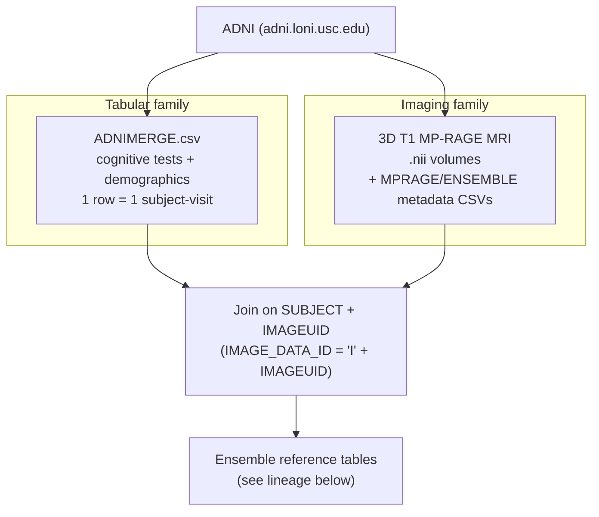
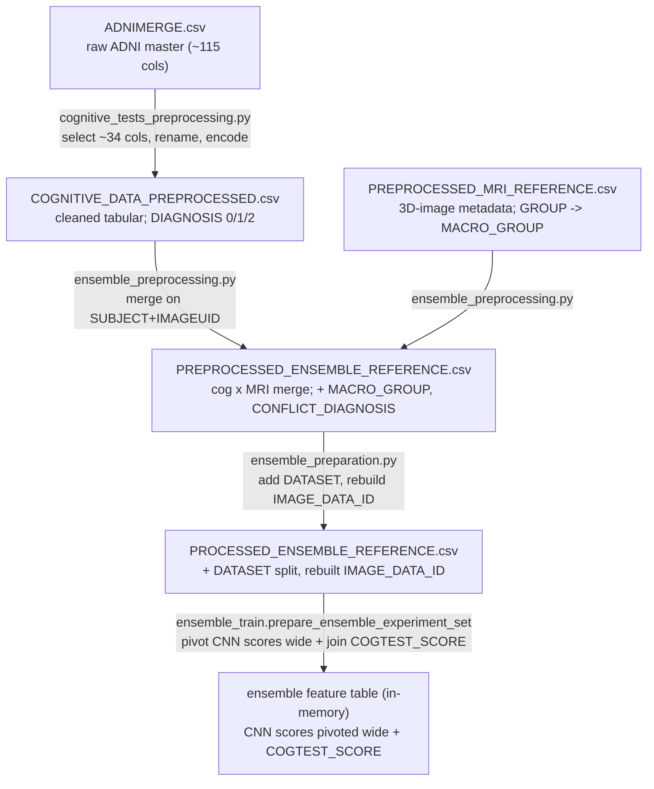

*Part of the [MMML-Alzheimer documentation](../README.md). The hub for everything about the data: where it comes from, the two modalities, how they are joined, and the chain of reference tables that feed every model.*

# Data Overview

Everything in this project is built from **one external source: ADNI** ([adni.loni.usc.edu](https://adni.loni.usc.edu)). There is no synthetic data and no second provider. From ADNI the pipeline pulls **two families** of data and fuses them:

1. **Tabular** — cognitive-test scores + demographics, exported as the ADNI master spreadsheet [`ADNIMERGE.csv`](data-structure.md). One row per subject-visit, ~115 columns; the repo touches only ~34 of them. **As of 2026 ADNI no longer distributes this flat file** — it must be rebuilt from the ADNIMERGE2 R package; see [adnimerge2.md](adnimerge2.md).
2. **Imaging** — 3D T1-weighted MP-RAGE structural MRI volumes (`.nii` downloads), one per qualifying visit.

The two families are joined on ADNI's image and subject identifiers, cleaned into a chain of reference CSVs, and the result drives the MRI CNNs, the cognitive model, and the EBM ensemble that combines them.

> `data/` and `models/` are gitignored and **empty** in the repo (only `.gitkeep` placeholders). Every schema, path, and column described across the data docs was reconstructed from the code that reads/writes those files, not from inspecting real CSVs. Facts labelled **(inferred)** could not be confirmed against committed code.

## Where to go next

| You want to… | Go to |
|---|---|
| **Rebuild `ADNIMERGE.csv`** — ADNI now ships tabular data as the ADNIMERGE2 R package | [adnimerge2.md](adnimerge2.md) |
| **Re-download** ADNI tables, MRI, and the atlas after time away | [data-acquisition.md](data-acquisition.md) |
| Know the **on-disk layout**, folder tree, and file catalogue | [data-structure.md](data-structure.md) |
| Look up what a **column means** or how labels are encoded | [data-semantics.md](data-semantics.md) |
| Understand the **3D MRI processing** (register / skull-strip / crop / standardize) | [mri-preprocessing.md](mri-preprocessing.md) |
| Understand **2D slicing, augmentation, and CV folds** | [data-preparation.md](data-preparation.md) |

## The two data families



### Tabular
The cognitive/demographic side is a single download: [`ADNIMERGE.csv`](data-structure.md), the same merged spreadsheet the TADPOLE challenge distributed. The pipeline selects ~34 columns in `select_cognitive_data` ([cognitive_tests_preprocessing.py:69-82](../../src/data_preprocessing/cognitive_tests_preprocessing.py#L69)), renames and encodes them, and writes `COGNITIVE_DATA_PREPROCESSED.csv`. The modelled feature set is **9 categorical + 14 numeric = 23 features** predicting `DIAGNOSIS`; see [data-semantics.md](data-semantics.md) for the full dictionary and the per-model feature lists. Notably, **`APOE4` is never used** despite being ADNI's headline genetic risk feature.

### Imaging
The imaging side is 3D T1 MP-RAGE MRI in ADNI's NIfTI export (`.nii`), named on the ADNI convention, e.g.

```
ADNI_002_S_4270_MR_MT1__N3m_Br_20111015081648646_S125083_I261073.nii
```

The trailing `I######` token is the image's unique id; the three tokens after `ADNI_` are the subject id (`002_S_4270`). MRI volumes ship with their own metadata exports (`MPRAGE_REFERENCE.csv` plus per-batch `REFERENCE_MRI_ENSEMBLE_*.csv`), which carry the MRI-side diagnosis field `GROUP`. The 3D volumes are registered, skull-stripped, and cropped to **100×100×100** ([mri-preprocessing.md](mri-preprocessing.md)), then sliced into **100×100** 2D `.npz` arrays for the CNNs ([data-preparation.md](data-preparation.md)).

## How the two families are joined

The join hinges on two equivalent identifiers for the same MRI:

- **`IMAGEUID`** — ADNI's *integer* image id, used on the tabular side (e.g. `261073`). On `ADNIMERGE.csv` a visit with no MRI leaves this blank; the code fills it with the sentinel **`999999`** and casts to int ([cognitive_tests_preprocessing.py:97-98](../../src/data_preprocessing/cognitive_tests_preprocessing.py#L97)).
- **`IMAGE_DATA_ID`** — ADNI's *string* image id, used on the MRI-metadata side (e.g. `I261073`). It is literally `'I'` + `IMAGEUID`.

**(pre-2026)** [ensemble_preprocessing.py](../../src/data_preprocessing/ensemble_preprocessing.py) merged cognitive × MRI on `['SUBJECT','IMAGEUID']` after stripping the leading `I` off the MRI side's `IMAGE_DATA_ID`. **In 2026** that merge is gone (single diagnosis source); the module just reads the cognitive table and drops `IMAGEUID == 999999` rows. The reverse direction (`'I' + IMAGEUID`) is rebuilt later in [ensemble_preparation.py:49](../../src/data_preparation/ensemble_preparation.py#L49).

The full ID system (`SUBJECT`, `SUBJECT_IMAGE_ID`, `SLICE_ID`, `RUN_ID`, …) is catalogued in [data-semantics.md](data-semantics.md).

## The reference-table lineage

Six tables form a chain from the raw ADNI master spreadsheet to the dataset-split reference that every modeling step reads. Each arrow is one preprocessing module.



`PREPROCESSED_MRI_REFERENCE.csv` is itself the tail of a separate MRI-metadata chain (`MPRAGE_REFERENCE.csv` + per-batch refs → `RAW_MRI_REFERENCE.csv` → `PREPROCESSED_MRI_REFERENCE.csv`); see [data-structure.md](data-structure.md) §3-4 for that branch and the per-folder `REFERENCE.csv` files written during 3D preprocessing.

## Key tables at a glance

The seven tables you will touch most. Producer/consumer wiring and full column lists live in [data-structure.md](data-structure.md); column meanings and encodings live in [data-semantics.md](data-semantics.md).

| Table | One-line meaning | Produced by |
|---|---|---|
| `ADNIMERGE.csv` | Raw ADNI master spreadsheet — the single tabular download (1 row = 1 subject-visit). | **External** (ADNI) |
| `MPRAGE_REFERENCE.csv` + `REFERENCE_MRI_ENSEMBLE_*.csv` | Raw per-batch MRI metadata exports; carry the `GROUP` diagnosis field. | **External** (ADNI) |
| `COGNITIVE_DATA_PREPROCESSED.csv` | Cleaned cognitive + demographics; `DIAGNOSIS` encoded `CN=0, AD=1, MCI=2`. | [cognitive_tests_preprocessing.py:57](../../src/data_preprocessing/cognitive_tests_preprocessing.py#L57) |
| `PREPROCESSED_MRI_REFERENCE.csv` | 3D-image metadata after skull-strip; `IMAGE_DATA_ID` is `I######`; `MACRO_GROUP` from `GROUP`. | [mri_metadata_preprocessing.py:45](../../src/data_preprocessing/mri_metadata_preprocessing.py#L45) |
| `PREPROCESSED_ENSEMBLE_REFERENCE.csv` | **2026:** cognitive rows with a real MRI id, in the class pair; `MACRO_GROUP = DIAGNOSIS`, `CONFLICT_DIAGNOSIS` always `False`, optional `HAS_PREPROCESSED_MRI`. (**pre-2026:** cognitive × MRI merge with a real conflict flag.) | [ensemble_preprocessing.py](../../src/data_preprocessing/ensemble_preprocessing.py) |
| `PROCESSED_ENSEMBLE_REFERENCE.csv` | Adds the `DATASET` split (train/validation/test) and rebuilds `IMAGE_DATA_ID`. | [ensemble_preparation.py:52](../../src/data_preparation/ensemble_preparation.py#L52) |
| `PROCESSED_MRI_REFERENCE_*.csv` | Per-slice (2D) reference for CNN training; one row per (image, orientation, slice). | [mri_batch_preparation.py:101](../../src/data_preparation/mri_batch_preparation.py#L101) |

> **Naming bug:** `README.md` and one notebook call the cleaned tabular file `COGNITIVE_DATA_PROCESSED.csv`, but the code writes `COGNITIVE_DATA_PREPROCESSED.csv` ([cognitive_tests_preprocessing.py:57](../../src/data_preprocessing/cognitive_tests_preprocessing.py#L57)). More such gotchas are catalogued in [known-issues.md](../reference/known-issues.md).

## Three diagnosis labels, one taxonomy

Three label columns flow through the chain and **must not be confused** — this is the single most common source of mistakes when re-reading the data:

| Column | Side | Type | Source field |
|---|---|---|---|
| `DIAGNOSIS` | cognitive / ADNIMERGE | numeric 0/1/2 | `DX` |
| `DIAGNOSIS_BASELINE` | cognitive / ADNIMERGE | **string** (`CN`/`MCI`/`AD`), never numerically encoded | `DX_bl` |
| `MACRO_GROUP` | MRI metadata | string → numeric 0/1/2 after the ensemble merge | MRI `GROUP` |

Both sides collapse the raw ADNI vocabulary into the same three-class taxonomy and the same encoding — `CN=0, AD=1, MCI=2`. The 0/1/2 codes are a **storage convention, not three model classes**: every classifier is binary. The primary task is AD-vs-CN (class pair `[0,1]`, MCI excluded); MCI-vs-CN is a separate binary run in which MCI is re-coded to the positive class `1`. The label scheme end-to-end, the `CONFLICT_DIAGNOSIS` reconciliation, and the hardcoded missing-MRI blacklist `[293688, 274525, 280596]` are all detailed in [data-semantics.md](data-semantics.md).

## Caveats worth knowing up front

- **No central config.** Paths are hardcoded per module, mostly in `if __name__ == '__main__':` blocks and notebook cells. [`src/experiment/experiment_config.json`](../../src/experiment/experiment_config.json) is an empty 3-key stub and the `src/run/*.py` orchestration files are all 0 bytes. See [data-structure.md](data-structure.md) §0 and [known-issues.md](../reference/known-issues.md).
- **Two base roots disagree.** The MRI preprocessing entry point writes to `.../mmml-alzheimer-diagnosis/data/...` while everything downstream reads from the shorter `.../Lucas_Thimoteo/data/...` ([mri_preprocessing.py:140-142](../../src/data_preprocessing/mri_preprocessing.py#L140)). (inferred: data was moved between runs.)
- **Two competing 2D-slice layouts** exist on disk — a flat per-orientation folder and a per-subject `storage/<IMAGE_DATA_ID>/` layout. See [data-preparation.md](data-preparation.md) and [data-structure.md](data-structure.md) §3.5.

## See also

- [adnimerge2.md](adnimerge2.md) — rebuild `ADNIMERGE.csv` from the ADNIMERGE2 R package
- [data-acquisition.md](data-acquisition.md) — re-download ADNI tables, MRI, and the atlas
- [data-structure.md](data-structure.md) — on-disk layout, full file catalogue, naming conventions
- [data-semantics.md](data-semantics.md) — data dictionary, column meanings, label scheme, ID system
- [mri-preprocessing.md](mri-preprocessing.md) — 3D MRI register / skull-strip / crop / standardize
- [data-preparation.md](data-preparation.md) — 3D→2D slicing, augmentation, CV folds, ensemble prep
- [system-architecture.md](../architecture/system-architecture.md) — end-to-end system & data flow
- [known-issues.md](../reference/known-issues.md) — bugs, stubs, path inconsistencies
