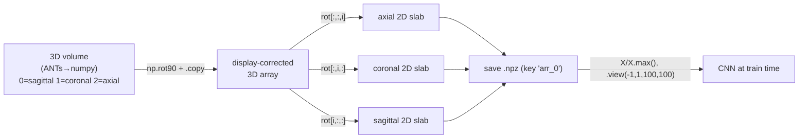
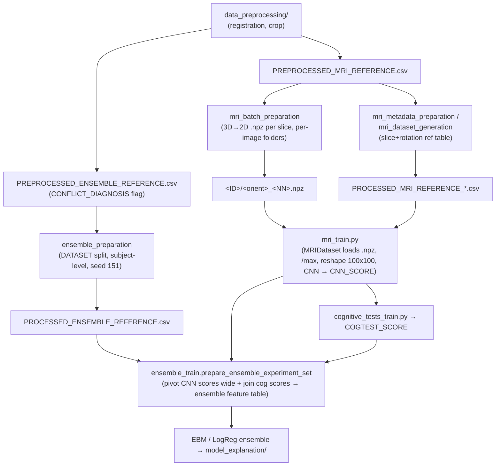

*Part of the [MMML-Alzheimer documentation](../README.md). How preprocessed 3D MRI volumes become 2D slice arrays, how subjects are split leakage-safely, and how per-modality predictions are assembled into the ensemble feature table.*

# Data Preparation (3D→2D, Augmentation, Splits)

This subsystem ([src/data_preparation/](../../src/data_preparation/)) sits between [MRI preprocessing](mri-preprocessing.md) (which registers, skull-strips and crops the 3D volumes) and [model training](../modeling/training.md). It does four jobs:

1. **3D→2D slicing** — cut registered volumes into 2D slabs, optionally augmented, saved as compressed `.npz`.
2. **Subject-level splitting** — assign whole patients (never individual slices) to train/validation/test, plus K-fold CV primitives. This is the leakage-avoidance layer.
3. **Ensemble dataset assignment** — fix one shared train/validation/test `DATASET` split across all three modalities.
4. **Ensemble feature-table assembly** — pivot CNN per-slice scores wide and join cognitive scores. (This last step physically lives in [model_training/ensemble_train.py](../../src/model_training/ensemble_train.py), not in `data_preparation/` — documented here because it is conceptually the final preparation step.)

> Reminder for future-you: `data/` and [models/](../../models/) are gitignored (`.gitignore:133-137`: `/src/data/`, `/data/`, `/models/`, `/models/*`) and empty in the repo. All paths, array shapes and column names below are reconstructed from the code that reads/writes them. Anything not visible in a literal is marked **(inferred)**.

---

## Files in this subsystem

| File | Lines | Purpose |
|---|---|---|
| [__init__.py](../../src/data_preparation/__init__.py) | 1 (empty) | Package marker, no exports. |
| [mri_preparation.py](../../src/data_preparation/mri_preparation.py) | 154 | Single-config 3D→2D + augmentation, saves `.npz` flat into one folder. The "Colab era" pipeline (earliest, standalone). |
| [mri_batch_preparation.py](../../src/data_preparation/mri_batch_preparation.py) | 243 | Batch 3D→2D over many orientations / slice ranges, saves `.npz` into per-image subfolders. **The production "storage" pipeline.** |
| [mri_augmentation.py](../../src/data_preparation/mri_augmentation.py) | 179 | Slicing + rotation + neighborhood-sampling augmentation helpers (used by `mri_preparation.py`). |
| [mri_metadata_preparation.py](../../src/data_preparation/mri_metadata_preparation.py) | 126 | Builds a *reference table* of slices+rotations WITHOUT writing image files. Reference-only; superseded. |
| [stratified_fold_split.py](../../src/data_preparation/stratified_fold_split.py) | 207 | Subject-level stratified K-fold (function + sklearn-style class). |
| [train_test_split.py](../../src/data_preparation/train_test_split.py) | 64 | Subject-level stratified single split. |
| [ensemble_preparation.py](../../src/data_preparation/ensemble_preparation.py) | 60 | Assigns `DATASET` ∈ {train, validation, test} onto the ensemble reference. |

Two execution-flow files are **empty stubs (0/1 lines, dead)**: [src/run/data_preparation.py](../../src/run/data_preparation.py) (1 line) and [src/experiment/run.py](../../src/experiment/run.py). The actual orchestration lives inside each module's `if __name__ == '__main__'` block (most commented out) and in [src/model_training/](../../src/model_training/).

Heavy helper dependencies: [src/utils/base_mri.py](../../src/utils/base_mri.py) (`load_mri`, `save_mri`, `save_batch_mri`, `check_mri_integrity`, `set_env_variables`) and [src/utils/utils.py](../../src/utils/utils.py) (`list_available_images`, `create_file_name_from_path`, `create_reference_table`, `create_image_references`, `load_reference_table`).

Library stack (`requirements.txt`): `numpy`, `pandas`, `matplotlib`, `sklearn`, `torch`, `antspyx`. [mri_augmentation.py](../../src/data_preparation/mri_augmentation.py) additionally imports `ants`, `nibabel`, `scipy` (`from scipy import ndimage, misc`).

---

## 1. The 3D → 2D conversion

### 1.1 Axis convention — the single most important fact

Both slicers document the same mapping ([mri_batch_preparation.py#L111](../../src/data_preparation/mri_batch_preparation.py#L111), [mri_augmentation.py#L148](../../src/data_preparation/mri_augmentation.py#L148)):

```
Axis orientation (of the ANTs→numpy array, BEFORE rotation):
0 - Sagittal
1 - Coronal
2 - Axial
```

But the code does **not** index those raw axes directly. The comment in every slicer ([mri_batch_preparation.py#L149](../../src/data_preparation/mri_batch_preparation.py#L149), [mri_augmentation.py#L146](../../src/data_preparation/mri_augmentation.py#L146)) explains why:

> "Since ANTsImage to Numpy convertion makes the image lose the reference, we rotate it some times to the correct the axis visualization."

So each orientation first rotates the volume with `np.rot90(...)` to fix display orientation, then takes a 2D slab. The two modules use the **same** rotation/index recipe:

| Orientation | Rotation applied | 2D slab taken | Source |
|---|---|---|---|
| `axial` | `np.rot90(img, k=3, axes=(0,1))` | `rot[:,:,i]` | [mri_batch_preparation.py#L152](../../src/data_preparation/mri_batch_preparation.py#L152); [mri_augmentation.py#L177](../../src/data_preparation/mri_augmentation.py#L177) |
| `coronal` | `np.rot90(img, k=3, axes=(0,2))` | `rot[:,i,:]` | [mri_batch_preparation.py#L168](../../src/data_preparation/mri_batch_preparation.py#L168); [mri_augmentation.py#L173](../../src/data_preparation/mri_augmentation.py#L173) |
| `sagittal` | `np.rot90(img, k=3, axes=(1,2))` then `np.rot90(rot, k=2, axes=(0,2))` | `rot[i,:,:]` | [mri_batch_preparation.py#L184](../../src/data_preparation/mri_batch_preparation.py#L184); [mri_augmentation.py#L168](../../src/data_preparation/mri_augmentation.py#L168) |

`'sagital'` (one t) is accepted as an alias in batch mode ([mri_batch_preparation.py#L134](../../src/data_preparation/mri_batch_preparation.py#L134)).

Loading: `load_mri(path, as_ants=True)` returns an `ants.ANTsImage` ([base_mri.py#L64](../../src/utils/base_mri.py#L64)). `slice_image` (single-config path) calls `image_3d.numpy()` ([mri_augmentation.py#L167](../../src/data_preparation/mri_augmentation.py#L167)); `generate_slices` (batch path) calls `load_mri(...).numpy()` ([mri_batch_preparation.py#L132](../../src/data_preparation/mri_batch_preparation.py#L132)). A `.copy()` after each `np.rot90` materializes a contiguous array (`rot90` returns a view).



### 1.2 Which slices, and how many

There are **three distinct slice-selection strategies**, depending on the entry point:

**(A) [mri_preparation.py](../../src/data_preparation/mri_preparation.py) — single orientation + single slice (+ neighborhood samples).**
Defaults ([mri_preparation.py#L21](../../src/data_preparation/mri_preparation.py#L21)): `orientation='coronal'`, `orientation_slice=50`, `num_augmented_images=5`, `sampling_range=3`. The `__main__` block (lines 146-153) reuses these. Three branches (lines 93-116):
- `num_augmented_images == 0` → just the single slice, saved via `save_mri`.
- `num_augmented_images == 1` → `augmentation_type='simple'` (chosen slice + its rotations only).
- `else` → `augmentation_type='neighborhood_sampling'` (chosen slice + `num_augmented_images` neighbor slices, each rotated).

**(B) [mri_batch_preparation.py](../../src/data_preparation/mri_batch_preparation.py) — many orientations, each a *range* of slices.**
Default `orientations` dict ([mri_batch_preparation.py#L20](../../src/data_preparation/mri_batch_preparation.py#L20)):
```python
orientations = {
    'coronal':range(35,66),
    'axial':range(15,36),
    'sagittal':range(15,36),
    'axial':range(65,86),     # ← duplicate key
    'sagittal':range(65,86)   # ← duplicate key
}
```
**Bug — duplicate dict keys.** Python dict literals collapse duplicate keys to the last value, so the effective dict is `{'coronal':range(35,66), 'axial':range(65,86), 'sagittal':range(65,86)}`. The intended `range(15,36)` ranges for axial/sagittal are silently dropped. Net actual output: coronal slices 35–65 (31 slices), axial 65–85 (21), sagittal 65–85 (21). See [known issues](../reference/known-issues.md).

**(C) [mri_metadata_preparation.py](../../src/data_preparation/mri_metadata_preparation.py) / [mri_dataset_generation.py](../../src/model_training/mri_dataset_generation.py) — reference-only, slices materialized at train time.**
No images written. Picks `orientation_slice` plus `num_sampled_images` random neighbors within `sampling_range`, and tags `num_of_image_rotations` rotation angles per slice. Defaults ([mri_metadata_preparation.py#L17](../../src/data_preparation/mri_metadata_preparation.py#L17)): `orientation='coronal'`, `orientation_slice=50`, `num_sampled_images=5`, `sampling_range=3`, `num_of_image_rotations=3`.

Slice index range note in all docstrings: "Values range from 0 to 100." A recurring TODO appears in 5+ docstrings: *"TODO: fix future bug if sampling_range is outside of the image"* (e.g. [mri_preparation.py#L50](../../src/data_preparation/mri_preparation.py#L50), [mri_augmentation.py#L34](../../src/data_preparation/mri_augmentation.py#L34)) — there is no bounds check on `slice ± sampling_range` against the volume size.

### 1.3 Output array shape and dtype

- Slices are 2D numpy arrays; **no explicit resize in this subsystem**. The 2D dims equal the in-plane dims of the registered/cropped 3D volume **(inferred)**. Downstream the CNN reshapes every input to `100×100` (`mri_train.py:451,493,610`: `X.view(-1,1,100,100)`), so the prepared slices are 100×100 **(inferred from the consumer)**.
- dtype is whatever the registered MRI stores (float) **(inferred)**. `validate_slice` replaces NaNs with `np.nanmin` ([mri_batch_preparation.py#L220](../../src/data_preparation/mri_batch_preparation.py#L220)), and at load time `MRIDataset` does `X = X/X.max()` to normalize to [0,1] (`mri_dataset.py:51`).
- **No channel dimension is stored**; the single channel is added at train time via `.view(-1,1,100,100)`.

### 1.4 File format and naming

Everything is saved as **compressed numpy `.npz`** via `np.savez_compressed`, keyed under the default array name `'arr_0'`. `save_mri` ([base_mri.py#L32](../../src/utils/base_mri.py#L32)):
- `.npz` branch: `if type(image) is not np.ndarray: image = image.numpy()` then `np.savez_compressed(output_path/name.npz, image)`.
- A `.nii.gz` branch also exists (writes ANTs Nifti) but the preparation calls always pass `file_format='.npz'`.

Load mirror ([base_mri.py#L64](../../src/utils/base_mri.py#L64)): `np.load(path)['arr_0']`. `MRIDataset.__getitem__` reads exactly that `'arr_0'` key (`mri_dataset.py:46`).

**Naming — single-config path ([mri_preparation.py](../../src/data_preparation/mri_preparation.py)):** flat output dir, filename = `create_file_name_from_path(image_path)` (strips two extensions, e.g. `.nii.gz` → base, [utils.py#L68](../../src/utils/utils.py#L68)) plus:
- no-aug: `..._{orientation}_{orientation_slice}.npz` (line 99), e.g. `<base>_coronal_50.npz`.
- aug: `save_batch_mri` appends `_<dict_key>` where keys are `orientation_slice` and `orientation_slice_rot_<angle>` (e.g. `coronal_50`, `coronal_50_rot_-7`). Final form `<base>_coronal_50_rot_-7.npz` ([base_mri.py#L28](../../src/utils/base_mri.py#L28), [mri_augmentation.py#L91](../../src/data_preparation/mri_augmentation.py#L91)).

**Naming — batch path ([mri_batch_preparation.py](../../src/data_preparation/mri_batch_preparation.py)):** per-image subfolders. Rule documented at [mri_batch_preparation.py#L199](../../src/data_preparation/mri_batch_preparation.py#L199):
```
<output_path>/<IMAGE_DATA_ID>/<orientation>_<2-digit slice number>.npz
Example: /data/storage/I124661/coronal_50.npz
```
Zero-padding logic ([mri_batch_preparation.py#L208](../../src/data_preparation/mri_batch_preparation.py#L208)):
```python
slice_num = str(slice['SLICE']) if slice['SLICE'] < 10 else '0'+str(slice['SLICE'])
```
**Bug — inverted zero-pad condition.** This pads numbers **≥10** (prefixing `'0'`, giving e.g. `050`) and does **not** pad numbers <10. The comment promises 2-digit padding but the condition is reversed. Because the default ranges are all ≥15, every saved file gets a spurious leading zero: `coronal_050.npz`, `axial_065.npz`, etc. See [known issues](../reference/known-issues.md).

`save_mri` returns the full saved path, captured into each slice dict's `IMAGE_PATH` ([mri_batch_preparation.py#L212](../../src/data_preparation/mri_batch_preparation.py#L212)) — this is the absolute path the dataset loader later opens.

---

## 2. Augmentation ([mri_augmentation.py](../../src/data_preparation/mri_augmentation.py))

Augmentation uses `scipy.ndimage.rotate` for in-plane 2D rotation. `nibabel`/`misc` are imported but unused.

### 2.1 Rotation augmentation — `generate_augmented_slice` ([mri_augmentation.py#L65](../../src/data_preparation/mri_augmentation.py#L65))
- Rotation angles sampled from `list(np.arange(-15,16,2))` = `[-15,-13,...,13,15]` (16 candidate angles), via `random.sample(..., k=num_of_rotations)` with `num_of_rotations=3` default.
- `random.seed(a=None, version=2)` → reseeded from OS entropy each call, so rotations are **non-deterministic** (line 87).
- `ndimage.rotate(image_2d, sample, reshape=False)` keeps the original shape (line 97).
- Returns a dict: key `<orientation>_<slice>` → original 2D image, plus `<orientation>_<slice>_rot_<angle>` → each rotated copy.
- Lines 101-111 are commented-out dead code (an earlier version with a copy/paste bug — all three keys used `samples[0]`).

### 2.2 Neighborhood slice sampling — `sample_from_neighborhood` ([mri_augmentation.py#L114](../../src/data_preparation/mri_augmentation.py#L114))
- Candidate slices = `set(range(slice-sampling_range, slice+sampling_range+1)) - {slice}` (the `2*sampling_range` neighbors, excluding the center).
- `random.sample(neighbor_samples, k=num_augmented_images)` — again `random.seed(a=None, ...)`, **non-deterministic**.

### 2.3 Top-level — `generate_augmented_images` ([mri_augmentation.py#L10](../../src/data_preparation/mri_augmentation.py#L10))
Pipeline: slice the center → augment it with rotations → if `augmentation_type=='neighborhood_sampling'`, also slice each sampled neighbor and rotate it. Returns the merged dict. Returns `None` (skipped) if the center slice is all-zeros (`image_2d is None` from `slice_image`... but note `slice_image` never actually returns `None`; the all-zero guard lives in the callers via `check_mri_integrity`, see §5).

### 2.4 Metadata-level augmentation (no images) — [mri_metadata_preparation.py](../../src/data_preparation/mri_metadata_preparation.py)
`generate_augmented_slices` (lines 103-108): per image, `random.sample` of `num_sampled_images` neighbor slices **plus the center slice** appended. `generate_augmented_rotations` (lines 110-114): per slice-id, `random.sample(np.arange(-15,16,2), k=3)` **plus angle 0** appended. The same two helpers are duplicated in [mri_batch_preparation.py#L227](../../src/data_preparation/mri_batch_preparation.py#L227) (`generate_augmented_rotations`) and in [model_training/mri_dataset_generation.py#L87](../../src/model_training/mri_dataset_generation.py#L87). The dataset-generation variant `explode`s into long format, producing columns `IMAGE_DATA_ID, SLICE, SLICE_ID, ROTATION_ANGLE`. Rotations are then applied **lazily at load time**: `MRIDataset.__getitem__` does `ndimage.rotate(X, sample['ROTATION_ANGLE'], reshape=False)` when the angle ≠ 0 (`mri_dataset.py:48-49`).

> Reproducibility warning: because every augmentation path reseeds with `random.seed(a=None)`, the augmented slice/rotation choices change run to run even though the data *splits* use fixed seeds. To reproduce a past experiment exactly, you need the generated reference CSV, not just the code. See [known issues](../reference/known-issues.md).

---

## 3. Train/Validation/Test split and cross-validation

### 3.1 Subject-level grouping = leakage avoidance (the core idea)
Both [train_test_split.py](../../src/data_preparation/train_test_split.py) and [stratified_fold_split.py](../../src/data_preparation/stratified_fold_split.py) split on **`SUBJECT`** (patient ID), never on row/slice. Every image/slice from a subject lands in the same fold/set. Docstring ([stratified_fold_split.py#L7](../../src/data_preparation/stratified_fold_split.py#L7)): "Provides train/test fold indices to split data at patient level, in order to avoid data leakage." This matters because one subject contributes many slices and often multiple longitudinal scans; row-level splitting would leak.

### 3.2 `train_test_split_by_subject` ([train_test_split.py#L4](../../src/data_preparation/train_test_split.py#L4))
```python
train_test_split_by_subject(df, test_size=0.3, labels=['AD','CN'],
                            label_column='MACRO_GROUP', random_seed=42)
```
- Filters `df` to `label_column ∈ labels`.
- RNG: `np.random.default_rng(seed=random_seed)`.
- For each class: take that class's unique `SUBJECT`s, **shuffle**, take the first `ceil(test_size * n_subjects)` as test, the rest as train — done per-class so class proportions are preserved (stratified by class).
- **Converter handling (lines 39-48, the subtle part):** computes `patients_all_classes` = subjects that appear in *all* classes (a patient labeled both CN and AD over time, i.e. a converter), splits those shared subjects into `len(labels)` disjoint groups via `np.array_split`, and for each class excludes the shared subjects assigned to the *other* classes' groups (`patients_from_other_fold_classes`). This is the mechanism that keeps a converter patient from being split across train and test. Handles exactly 2 or 3 classes.
- Returns `(df_train, df_test)` as full reference DataFrames (not indices).

### 3.3 `stratified_fold_split_by_subject` ([stratified_fold_split.py#L4](../../src/data_preparation/stratified_fold_split.py#L4))
```python
stratified_fold_split_by_subject(df, n_splits=10, labels=['AD','CN'],
                                 label_column='MACRO_GROUP', random_seed=42,
                                 return_indices=False)
```
- Same per-class converter-disjoint logic as §3.2.
- Assigns each class's shuffled subjects into `n_splits` near-equal groups via `np.array_split(subjects, n_splits)` and writes a `FOLD` column (0..n_splits-1) onto the filtered copy `df_classes`.
- If `return_indices=True`: a **generator** yielding `(train_index, test_index)` per fold (fold == split → test, else train), using the DataFrame's pandas index. If `False`: returns the labeled `df_classes`.
- `n_splits=10` default, `random_seed=42`.

### 3.4 `StratifiedSubjectKFold` class ([stratified_fold_split.py#L97](../../src/data_preparation/stratified_fold_split.py#L97))
A sklearn-compatible wrapper of the same algorithm. Implements `.split(X, y, groups=None)` (generator of index pairs) and `.get_n_splits(...)`. **Defaults differ slightly:** `labels=[0,1]` (numeric, vs `['AD','CN']` in the function). The docstrings show its intended use as `cv=StratifiedSubjectKFold(...)` passed to `sklearn.model_selection.cross_validate`.

### 3.5 Stratification keys / random seeds — summary

| Function | stratify column (default) | seed (default) | n folds / test_size | leakage unit |
|---|---|---|---|---|
| `train_test_split_by_subject` | `MACRO_GROUP` | 42 | `test_size=0.3` | `SUBJECT` |
| `stratified_fold_split_by_subject` | `MACRO_GROUP` | 42 | `n_splits=10` | `SUBJECT` |
| `StratifiedSubjectKFold` | `MACRO_GROUP` | 42 | `n_splits=10` | `SUBJECT` |
| `ensemble_preparation` (uses `train_test_split`) | `DIAGNOSIS` | **151** | val 0.25, test corrected (§4) | `SUBJECT` |

### 3.6 Class label vocabulary
- `MACRO_GROUP` string values: `CN`, `MCI`, `AD` (the raw `GROUP` collapses `SMC→CN`, `EMCI/LMCI→MCI`, [utils.py#L82](../../src/utils/utils.py#L82)).
- Numeric encoding used downstream: `AD=1, CN=0, MCI=2` (`ensemble_preprocessing.py:34`; `cognitive_tests_preprocessing.py:100-102`). The MRI training code re-maps strings to 0/1 per the chosen class pair in `return_sets` (`mri_train.py:316-324`).

See [data semantics](data-semantics.md) for the full label scheme and column dictionary.

---

## 4. Ensemble dataset assignment ([ensemble_preparation.py](../../src/data_preparation/ensemble_preparation.py))

```python
execute_ensemble_preparation(ensemble_data_path, output_data_path,
                             classes=[0,1,2], test_size=0.25, validation_size=0.25)
```
([ensemble_preparation.py#L6](../../src/data_preparation/ensemble_preparation.py#L6))

What it does, step by step:

1. Reads the preprocessed ensemble reference, sorts by `SUBJECT`, drops conflicting-diagnosis rows (`query("CONFLICT_DIAGNOSIS == False")`, line 36).
2. **First split** — validation carved off: `train_test_split_by_subject(df_no_conflict, test_size=validation_size, labels=classes, label_column='DIAGNOSIS', random_seed=151)` → `(df_train, df_validation)`.
3. **Recomputes a corrected test size** so the test fraction is relative to the *original* dataset, not the post-validation remainder:
   ```python
   corrected_test_size = test_size * (df_no_conflict.shape[0] / df_train.shape[0])   # line 38
   ```
4. **Second split** on `df_train` → `(df_train, df_test)` (same seed 151).
5. Tags the `DATASET` column: train rows `'train'`, validation `'validation'`, test `'test'`; anything not in those three (e.g. conflicting rows added back via `df_ensemble['DATASET']=np.nan`) stays `NaN`. Concatenates and writes.
6. Adds `IMAGE_DATA_ID = 'I' + IMAGEUID.astype(str)` (line 49).
7. Prints AD-vs-CN and MCI-vs-CN `DATASET` value-counts (lines 50-51), then `df_ensemble_processed.to_csv(output_data_path)` (line 52).

**Bug — missing `index=False`** at line 52: `to_csv(output_data_path)` writes an extra unnamed index column into the CSV. See [known issues](../reference/known-issues.md).

**Design rule (lines 11-14):** the validation and test sets are **fixed across all three experiments** (MRI, cognitive, ensemble). Only the training set may differ per modality — CNN training can use *more* images than the ensemble-aligned set.

`label_column='DIAGNOSIS'` is used here with numeric `classes` like `[0,1]` (the AD/CN encoding). `MACRO_GROUP` is the MRI-side label; `DIAGNOSIS` is the cognitive/ADNIMERGE-side label. Rows where they disagree are the `CONFLICT_DIAGNOSIS` rows removed upstream (`ensemble_preprocessing.py:54-59`).

---

## 5. Conflicting-diagnosis filtering (in 3 places)

Every MRI-preparation entry point removes images whose MRI label and cognitive label disagree, by joining on the ensemble reference's `CONFLICT_DIAGNOSIS == True` flag and excluding those `IMAGE_DATA_ID`s:
- [mri_preparation.py#L65](../../src/data_preparation/mri_preparation.py#L65): `invalid_images = ['I'+str(x) for x in df_ensemble_reference.query("CONFLICT_DIAGNOSIS == True")['IMAGEUID']]`, then keep `IMAGE_DATA_ID not in @invalid_images`.
- [mri_batch_preparation.py#L55](../../src/data_preparation/mri_batch_preparation.py#L55) and [mri_metadata_preparation.py#L60](../../src/data_preparation/mri_metadata_preparation.py#L60): same idea, building `IMAGE_DATA_ID = 'I'+str(IMAGEUID)` on the ensemble side first.

All-zero / invalid image skipping:
- `check_mri_integrity(image) → image.sum().sum().sum() > 0` ([base_mri.py#L83](../../src/utils/base_mri.py#L83)); used by [mri_preparation.py#L86](../../src/data_preparation/mri_preparation.py#L86).
- `validate_slice(image)` ([mri_batch_preparation.py#L219](../../src/data_preparation/mri_batch_preparation.py#L219)): NaN→`nanmin`, returns `False` if the slice sums to zero. Invalid slices are *not* saved and `VALID_IMAGE=False` is recorded.

---

## 6. Ensemble feature-table assembly (aligning per-modality predictions)

This step is **not** in [src/data_preparation/](../../src/data_preparation/); it lives in [model_training/ensemble_train.py#L9](../../src/model_training/ensemble_train.py#L9). It is documented here because it is conceptually the last data-preparation step: turning the two streams of per-modality predictions into one feature table the ensemble can train on. See [training](../modeling/training.md) for how the upstream prediction CSVs are produced.

### 6.1 Inputs
- **MRI predictions CSV** (`mri_predictions_path`) — produced by `mri_train.evaluate_trained_model` / `compute_predictions_for_ensemble` (`mri_train.py:532-590`). One row per (image, orientation, slice), with `CNN_SCORE` = `sigmoid(logit)` probability (`mri_train.py:503,582`). Columns used: `SUBJECT, IMAGE_DATA_ID, ORIENTATION, SLICE, CNN_SCORE, MACRO_GROUP, DATASET`.
- **Cognitive predictions CSV** (`cognitive_predictions_path`) — produced by `cognitive_tests_train.py`. Provides `COGTEST_SCORE` ([ensemble_train.py#L13](../../src/model_training/ensemble_train.py#L13)) plus `SUBJECT, IMAGE_DATA_ID, DATASET, DIAGNOSIS`. (In `cognitive_tests_train.py` the pycaret prediction probability is `Score_1`; the renamed `COGTEST_SCORE` column is what `ensemble_train` reads, but the rename point isn't in the files read — **(inferred to happen in a notebook / not-committed glue step)**.)

### 6.2 Alignment — `prepare_mri_predictions` ([ensemble_train.py#L18](../../src/model_training/ensemble_train.py#L18))
1. `RUN_ID = ORIENTATION + '_' + SLICE.astype(str)` (e.g. `coronal_50`).
2. `DATASET` NaN → `'train_cnn'` (images used for CNN training but outside the ensemble's train set).
3. **Pivot to wide**: `pivot_table(index=['SUBJECT','IMAGE_DATA_ID','DATASET','MACRO_GROUP'], values=['CNN_SCORE'], columns=['RUN_ID'])` → one row per image, one column per orientation+slice.
4. Flatten the MultiIndex columns to `CNN_SCORE_<RUN_ID upper>`, e.g. `CNN_SCORE_CORONAL_50`.

So each image becomes a feature vector of one CNN score per (orientation, slice) model, indexed by `IMAGE_DATA_ID`.

### 6.3 Join — `prepare_ensemble_experiment_set` ([ensemble_train.py#L9](../../src/model_training/ensemble_train.py#L9))
Merges the wide MRI table with the cognitive table on `['SUBJECT','IMAGE_DATA_ID','DATASET']` (inner join; drops `MACRO_GROUP` from the MRI side to avoid a duplicate column), then `set_index('IMAGE_DATA_ID').sort_index()`. The result `df_ensemble` is the **ensemble feature table**: index `IMAGE_DATA_ID`, columns = the CNN per-slice scores + `COGTEST_SCORE` + `DIAGNOSIS` (label) + `SUBJECT`, `DATASET`.

### 6.4 Split for modeling — `get_experiment_sets` ([ensemble_train.py#L28](../../src/model_training/ensemble_train.py#L28))
Splits `df_ensemble` by the `DATASET` column into train/validation/test, drops `['SUBJECT','DATASET']`, and **`fillna(0)`** (missing per-slice CNN scores → 0). Ensemble models: `ExplainableBoostingClassifier`, `LogisticRegression`, plus several `DummyModel` subclasses (`CNNCoronal`, `CNNAxial`, `CNNSagittal`, `CNN3Slices`, `CNN3SlicesCogScore`, `CNN3SlicesDemographics`, `CDRSB`, lines 41-64) that simply threshold a single column — used as baselines.

---

## 7. Reconstructed data artifacts (filenames, columns, shapes)

> Paths are mostly Google-Colab Drive absolute paths hardcoded in `__main__` blocks. Filenames marked `*` carry a `YYYYMMDD_HHMM` timestamp. See [data structure](data-structure.md) for the full on-disk layout.

### 7.1 Reference / tabular CSVs

| Artifact | Produced by | Key columns (verbatim) |
|---|---|---|
| `PREPROCESSED_MRI_REFERENCE.csv` | upstream `data_preprocessing` (consumed here) | `SUBJECT, IMAGE_DATA_ID, IMAGE_PATH, GROUP, MACRO_GROUP, SEX, AGE, VISIT, ACQ_DATE, ...` (inferred from reads at `mri_batch_preparation.py:98-100`, `ensemble_preprocessing.py:23-32`) |
| `PREPROCESSED_ENSEMBLE_REFERENCE.csv` | `data_preprocessing/ensemble_preprocessing.py` | `SUBJECT, IMAGEUID, DIAGNOSIS, MACRO_GROUP, GROUP, VISIT, ACQ_DATE, CONFLICT_DIAGNOSIS` (`ensemble_preprocessing.py:32-42`) |
| `PROCESSED_ENSEMBLE_REFERENCE.csv` (the `output_data_path`) | `ensemble_preparation.execute_ensemble_preparation` | above + `DATASET` ∈ {train,validation,test,NaN} + `IMAGE_DATA_ID` ([ensemble_preparation.py#L44](../../src/data_preparation/ensemble_preparation.py#L44)) |
| `PROCESSED_MRI_REFERENCE_*.csv` (batch) | `mri_batch_preparation.execute_mri_batch_preparation` | exactly `['SUBJECT','IMAGE_DATA_ID','ORIENTATION','SLICE','VALID_IMAGE','GROUP','MACRO_GROUP','SEX','AGE','IMAGE_PATH','ORIGINAL_IMAGE_PATH','DATASET']` ([mri_batch_preparation.py#L98](../../src/data_preparation/mri_batch_preparation.py#L98)). **Path bug (lines 97/101):** writes to `mri_reference_path` with `PREPROCESSED_MRI_REFERENCE.csv` stripped (the reference *folder*) but `return`s `output_path+reference_file_name` — write location and returned path differ. See [known issues](../reference/known-issues.md). |
| `PROCESSED_MRI_REFERENCE_*_<orient>_<slice>_samples_around_slice_<n>_num_rotations_<r>.csv` | `mri_metadata_preparation.execute_mri_metadata_preparation` | `IMAGE_DATA_ID, orientation, orientation_slice, slice_num, IMAGE_SLICE_ID, rotation_angle, DATASET` + merged ref cols ([mri_metadata_preparation.py#L73](../../src/data_preparation/mri_metadata_preparation.py#L73)) |
| `PROCESSED_MRI_REFERENCE_<orient>_<slice>_samples_around_slice_<n>_num_rotations_<r>_*.csv` | `model_training/mri_dataset_generation.generate_mri_dataset_reference` | adds `MAIN_SLICE, SLICE_ID, ROTATION_ANGLE` ([mri_dataset_generation.py#L65](../../src/model_training/mri_dataset_generation.py#L65)) |
| `REFERENCE.csv` (single-config path) | `mri_preparation.generate_metadata_for_processed_images` → `create_reference_table` | `SUBJECT_IMAGE_ID, SUBJECT_ID, IMAGE_DATA_ID, IMAGE_PATH` + original ref cols ([utils.py#L117](../../src/utils/utils.py#L117), [mri_preparation.py#L133](../../src/data_preparation/mri_preparation.py#L133)) |
| `PREDICTIONS_*.csv` (per-modality) | `mri_train` / `cognitive_tests_train` | MRI: `+CNN_SCORE`; Cognitive: `+COGTEST_SCORE/Score_1` |

### 7.2 Image artifacts (`.npz`)

| Path pattern | Producer | Array |
|---|---|---|
| `<output>/<base>_<orient>_<slice>[ _rot_<angle> ].npz` | [mri_preparation.py](../../src/data_preparation/mri_preparation.py) (flat dir) | one 2D slice under key `arr_0` |
| `<output>/<IMAGE_DATA_ID>/<orient>_<NN>.npz` | [mri_batch_preparation.py](../../src/data_preparation/mri_batch_preparation.py) (per-image subdir; padding bug → e.g. `coronal_050.npz`) | one 2D slice under key `arr_0` |

2D slice arrays are float, in-plane size of the registered volume (consumed as 100×100 by the CNN). The single channel is added at train time. Normalized `X/X.max()` at load (`mri_dataset.py:51`).

### 7.3 ID conventions

| ID | Definition | Source |
|---|---|---|
| `IMAGE_DATA_ID` | `'I' + <IMAGEUID>` (ADNI image UID). Round-trips: ensemble side strips `'I'` → `int64` (`ensemble_preprocessing.py:25`), reverse at `ensemble_preparation.py:49`. | — |
| `SUBJECT` | ADNI subject RID-style `XXX_S_XXXX`, parsed in `create_image_references` | [utils.py#L151](../../src/utils/utils.py#L151) |
| `SUBJECT_IMAGE_ID` | `SUBJECT + '#' + IMAGE_DATA_ID` | [utils.py#L89](../../src/utils/utils.py#L89) |
| `IMAGE_SLICE_ID` | `IMAGE_DATA_ID + '_' + slice_num` (`SLICE_ID` is the same idea in the dataset-gen variant) | [mri_metadata_preparation.py#L81](../../src/data_preparation/mri_metadata_preparation.py#L81) |
| `RUN_ID` | `ORIENTATION + '_' + SLICE` | [ensemble_train.py#L20](../../src/model_training/ensemble_train.py#L20) |

---

## 8. Three competing MRI-prep implementations — which is "real"?

The repo carries **two competing approaches plus a leftover third**. Know which one you are touching before you re-run anything.

1. **Materialize-then-load** ([mri_batch_preparation.py](../../src/data_preparation/mri_batch_preparation.py) → `.npz` per slice; `MRIDataset` loads files). This is what `mri_train.py` / `mri_dataset.py` actually consume (`MRIDataset.__getitem__` opens `sample['IMAGE_PATH']`). **This is the production path.**
2. **Reference-only / generate-on-the-fly** ([mri_metadata_preparation.py](../../src/data_preparation/mri_metadata_preparation.py)) — builds a slice+rotation reference table but never writes images. **Superseded** by [model_training/mri_dataset_generation.py](../../src/model_training/mri_dataset_generation.py), which does the same and is the one `mri_train.py` imports.
3. **Single-config flat-dir** ([mri_preparation.py](../../src/data_preparation/mri_preparation.py)) — the earliest pipeline (`__main__` points at a `.../processed/sample/` dir). Standalone; not referenced by training code.

`mri_metadata_preparation.execute_mri_metadata_preparation` and `mri_dataset_generation.generate_mri_dataset_reference` are near-duplicates with **diverging column casing**: `orientation/slice_num/rotation_angle` (lowercase) vs `ORIENTATION/SLICE/ROTATION_ANGLE` (uppercase). `mri_train.return_sets` (`mri_train.py:328-334`) reads the **uppercase** names (`SLICE`, `MAIN_SLICE`, `ROTATION_ANGLE`), so it pairs with `mri_dataset_generation.py`, not with `mri_metadata_preparation.py`. See [known issues](../reference/known-issues.md).

---

## 9. End-to-end flow

This subsystem's place in the larger pipeline:



`stratified_fold_split` + `train_test_split` are the cross-validation / holdout primitives invoked by the training scripts (and demonstrated in the docstrings for `sklearn.cross_validate`).

---

## See also

- [MRI preprocessing](mri-preprocessing.md) — the previous stage: registration, skull-stripping, cropping of the 3D volumes consumed here.
- [Training](../modeling/training.md) — the next stage: how `MRIDataset` loads these `.npz` files, the CNN training loops, and the ensemble fit.
- [Data semantics](data-semantics.md) — full data dictionary, `MACRO_GROUP`/`DIAGNOSIS` label schemes, and column meanings.
- [Data structure](data-structure.md) — on-disk layout and file catalogue for every artifact named here.
- [Known issues](../reference/known-issues.md) — the duplicate-key, zero-pad, missing-`index=False`, non-deterministic-seed, and path-mismatch bugs catalogued in detail.
- [Models](../modeling/models.md) — the CNN architectures that reshape these slices to `100×100×1`.
