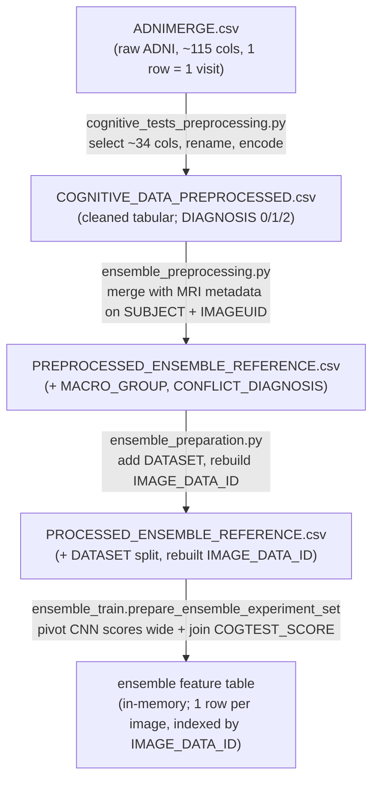

*Part of the [MMML-Alzheimer documentation](../README.md). The authoritative data dictionary: what every tabular column means, how diagnostic labels are encoded, and which feature set each model receives.*

# Data Semantics & Data Dictionary

This is the definitive column reference for the **tabular / ensemble side** of the pipeline: ADNIMERGE → cognitive table → ensemble reference → model inputs, plus the ID system that links MRI volumes to their metadata. Image-array semantics (slice orientations, `.npz` shapes) live in [data-structure.md](data-structure.md) and [data-preparation.md](data-preparation.md); this doc only covers the *columns*.

A few conventions to keep in mind:
- Column-name strings are quoted **verbatim** from the source code.
- Standard "ADNI/TADPOLE meaning" refers to the documented definition of a column in the original ADNI merged spreadsheet (`ADNIMERGE.csv`, the same table the TADPOLE challenge distributed). Those meanings are not defined in this repo's code — they are the well-known ADNI data-dictionary definitions.
- Anything not directly present in the source code is flagged **(inferred)**.
- The `data/` directory is gitignored and empty, so no real CSV was inspected. All schemas are reconstructed from the code that reads and writes them.

> Bugs and inconsistencies called out below (the `COGNITIVE_DATA_PROCESSED.csv` naming bug, the uncommitted `COGTEST_SCORE` rename, APOE4 being unused) are catalogued in full in [known-issues.md](../reference/known-issues.md).

## The three tables and how columns flow

Three CSVs sit on the path from raw ADNI to model inputs, plus one in-memory feature table assembled at ensemble training time.



**Three label columns appear in this flow and must not be confused:**

| Column | Side | Source field | Storage |
|---|---|---|---|
| `DIAGNOSIS` | cognitive / ADNIMERGE | `DX` | numeric 0/1/2 |
| `DIAGNOSIS_BASELINE` | cognitive / ADNIMERGE | `DX_bl` | **string** CN/MCI/AD (never encoded) |
| `MACRO_GROUP` | MRI metadata | MRI `GROUP` field | string on the MRI side; numeric 0/1/2 after the ensemble merge |

The full per-table schema, encodings, and label scheme follow.

## ADNIMERGE.csv — columns actually referenced

`ADNIMERGE.csv` is the raw ADNI master spreadsheet, one row per subject-visit (~115 columns). The repo only ever touches the ~34 columns listed in `select_cognitive_data` ([cognitive_tests_preprocessing.py#L69](../../src/data_preprocessing/cognitive_tests_preprocessing.py#L69)) plus `DX`/`DX_bl` in `normalize_classes` ([#L59](../../src/data_preprocessing/cognitive_tests_preprocessing.py#L59)). Everything else in ADNIMERGE is dropped.

### ID / visit columns (`id_cols`)

Defined at [cognitive_tests_preprocessing.py#L80](../../src/data_preprocessing/cognitive_tests_preprocessing.py#L80).

| Column | Standard ADNI meaning | How the repo uses it |
|---|---|---|
| `RID` | Roster ID — integer subject key, unique within ADNI. | Kept as `RID`; later an `ignore_features` in PyCaret ([cognitive_tests_train.py#L62](../../src/model_training/cognitive_tests_train.py#L62)). |
| `PTID` | Participant ID, string `XXX_S_XXXX` (site_S_roster). | Renamed → `SUBJECT` ([#L46](../../src/data_preprocessing/cognitive_tests_preprocessing.py#L46)); the join key to MRI metadata. |
| `VISCODE` | Visit code (`bl`, `m06`, `m12`, …) — which follow-up visit this row is. | Kept; dropped before modeling ([cognitive_tests_train.py#L54](../../src/model_training/cognitive_tests_train.py#L54)). |
| `SITE` | ADNI site number that enrolled the subject. | Kept; dropped before modeling. |
| `COLPROT` | Collection protocol — ADNI phase the *data point* was collected under (`ADNI1`/`ADNIGO`/`ADNI2`/`ADNI3`). | Kept; dropped before modeling. |
| `ORIGPROT` | Original protocol — ADNI phase the subject was *originally enrolled* under. | Kept; dropped before modeling. |
| `EXAMDATE` | Date of the visit/exam. | Kept; dropped before modeling. |
| `IMAGEUID` | Integer unique ID of the MRI acquired at this visit (blank if none). | Kept; NaN→`999999` sentinel, cast int ([#L97](../../src/data_preprocessing/cognitive_tests_preprocessing.py#L97)); join key to MRI. |
| `DX` | **Current** diagnosis at this visit: `CN` / `MCI` / `Dementia`. | `Dementia`→`AD` ([#L63](../../src/data_preprocessing/cognitive_tests_preprocessing.py#L63)), renamed → `DIAGNOSIS`, encoded 0/1/2. |
| `DX_bl` | **Baseline** diagnosis: `CN` / `SMC` / `EMCI` / `LMCI` / `AD`. | Collapsed ([#L64](../../src/data_preprocessing/cognitive_tests_preprocessing.py#L64)), renamed → `DIAGNOSIS_BASELINE`. |

### Demographics (`demographics_cols`)

Defined at [cognitive_tests_preprocessing.py#L78](../../src/data_preprocessing/cognitive_tests_preprocessing.py#L78).

| Column | Standard ADNI meaning | Repo handling |
|---|---|---|
| `AGE` | Age (years) at baseline. | Kept as numeric feature. |
| `PTGENDER` | Sex: `Male` / `Female`. | Renamed → `MALE`, encoded Male=1 / Female=0 ([#L104](../../src/data_preprocessing/cognitive_tests_preprocessing.py#L104)). |
| `PTEDUCAT` | Years of formal education. | Renamed → `YEARS_EDUCATION`. |
| `PTETHCAT` | Ethnicity: `Hisp/Latino` / `Not Hisp/Latino` / `Unknown`. | Renamed → `HISPANIC`, encoded to 0/1 ([#L93](../../src/data_preprocessing/cognitive_tests_preprocessing.py#L93)). |
| `PTRACCAT` | Race category. | Renamed → `RACE`, then 3 one-hots ([#L88](../../src/data_preprocessing/cognitive_tests_preprocessing.py#L88)). |
| `PTMARRY` | Marital status: `Married`/`Widowed`/`Divorced`/`Never married`/`Unknown`. | Renamed → `MARRIED`, then 4 one-hots ([#L107](../../src/data_preprocessing/cognitive_tests_preprocessing.py#L107)). |

### Neuropsychological tests (`neuropsychological_cols`)

Defined at [cognitive_tests_preprocessing.py#L71](../../src/data_preprocessing/cognitive_tests_preprocessing.py#L71). All are standard ADNI/TADPOLE cognitive-battery scores. The "Direction" column notes whether higher is clinically worse or better.

| Column | Standard ADNI meaning | Direction | Kept by default? |
|---|---|---|---|
| `CDRSB` | Clinical Dementia Rating – Sum of Boxes (0–18). | ↑ = worse | yes |
| `ADAS11` | ADAS-Cog 11-item total. | ↑ = worse | yes |
| `ADAS13` | ADAS-Cog 13-item total (adds delayed recall + digit cancellation). | ↑ = worse | yes |
| `ADASQ4` | ADAS-Cog Q4 — delayed word-recall subscore. | ↑ = worse | yes |
| `MMSE` | Mini-Mental State Exam (0–30). | ↑ = better | yes |
| `RAVLT_immediate` | Rey Auditory Verbal Learning Test — sum of trials 1–5 (immediate recall). | ↑ = better | yes |
| `RAVLT_learning` | RAVLT learning (trial 5 − trial 1). | ↑ = better | yes |
| `RAVLT_forgetting` | RAVLT forgetting (trial 5 − delayed recall). | ↑ = worse | yes |
| `RAVLT_perc_forgetting` | RAVLT percent forgetting. | ↑ = worse | yes |
| `LDELTOTAL` | Logical Memory delayed recall (WMS-R, story recall). | ↑ = better | **no** — dropped when `exclude_ecog_tests=True` (default) |
| `DIGITSCOR` | Digit Symbol Substitution score. | ↑ = better | **no** — dropped by default |
| `TRABSCOR` | Trail Making Test Part B — time in seconds. | ↑ = worse | yes |
| `FAQ` | Functional Activities Questionnaire (functional impairment, 0–30). | ↑ = worse | yes |
| `MOCA` | Montreal Cognitive Assessment (0–30). | ↑ = better | yes |
| `EcogPtMem`, `EcogPtLang`, `EcogPtVisspat`, `EcogPtPlan`, `EcogPtOrgan`, `EcogPtDivatt`, `EcogPtTotal` | Everyday Cognition — **Pt** = self-report (participant), by domain + total. | ↑ = worse | **no** — all dropped by default ([#L114](../../src/data_preprocessing/cognitive_tests_preprocessing.py#L114)) |
| `EcogSPMem`, `EcogSPLang`, `EcogSPVisspat`, `EcogSPPlan`, `EcogSPOrgan`, `EcogSPDivatt`, `EcogSPTotal` | Everyday Cognition — **SP** = study-partner/informant report, by domain + total. | ↑ = worse | **no** — all dropped by default |

> **`APOE4` is never used.** It is a standard ADNIMERGE column (count of APOE ε4 alleles, 0/1/2 — the major genetic AD risk factor), but `grep -rn "APOE" src/` returns nothing. The pipeline does not select or model APOE4 at all. Flagged in [known-issues.md](../reference/known-issues.md).

## COGNITIVE_DATA_PREPROCESSED.csv — full output schema

Produced by `execute_cognitive_data_preprocessing` ([cognitive_tests_preprocessing.py#L57](../../src/data_preprocessing/cognitive_tests_preprocessing.py#L57), default `exclude_ecog_tests=True`). One row per **visit** (not per subject); multiple rows per `SUBJECT`. Rows with null `DX` are dropped before rename ([#L35](../../src/data_preprocessing/cognitive_tests_preprocessing.py#L35)).

> **Naming bug:** the [README.md](../../README.md) and one notebook call this file `COGNITIVE_DATA_PROCESSED.csv`, but the code actually writes `COGNITIVE_DATA_PREPROCESSED.csv` ([#L57](../../src/data_preprocessing/cognitive_tests_preprocessing.py#L57)). Use the `PRE` spelling on disk.

### Rename map

Applied at [cognitive_tests_preprocessing.py#L37](../../src/data_preprocessing/cognitive_tests_preprocessing.py#L37).

| ADNIMERGE original | Renamed column |
|---|---|
| `PTRACCAT` | `RACE` |
| `PTMARRY` | `MARRIED` |
| `PTEDUCAT` | `YEARS_EDUCATION` |
| `PTGENDER` | `MALE` |
| `PTETHCAT` | `HISPANIC` |
| `DX` | `DIAGNOSIS` |
| `DX_bl` | `DIAGNOSIS_BASELINE` |
| `PTID` | `SUBJECT` |

### Encodings

Applied by `encode_variables` ([cognitive_tests_preprocessing.py#L84](../../src/data_preprocessing/cognitive_tests_preprocessing.py#L84)).

| Output column | Type | Encoding rule | Source |
|---|---|---|---|
| `RACE` | string | Rare categories `["More than one",'Unkown','Unknown','Hawaiian/Other PI','Am Indian/Alaskan']` → `'Other races'`. Kept as a string (not dropped here). | [#L88](../../src/data_preprocessing/cognitive_tests_preprocessing.py#L88) |
| `RACE_WHITE` | 0/1 | `(RACE == 'White')` | [#L89](../../src/data_preprocessing/cognitive_tests_preprocessing.py#L89) |
| `RACE_BLACK` | 0/1 | `(RACE == 'Black')` | [#L90](../../src/data_preprocessing/cognitive_tests_preprocessing.py#L90) |
| `RACE_ASIAN` | 0/1 | `(RACE == 'Asian')` | [#L91](../../src/data_preprocessing/cognitive_tests_preprocessing.py#L91) |
| `HISPANIC` | 0/1 | `'Not Hisp/Latino'`→0, `'Unknown'`→0, `'Hisp/Latino'`→1 | [#L93](../../src/data_preprocessing/cognitive_tests_preprocessing.py#L93) |
| `IMAGEUID` | int | NaN→`999999`, then `astype(int)` | [#L97](../../src/data_preprocessing/cognitive_tests_preprocessing.py#L97) |
| `DIAGNOSIS` | int | **`CN=0`, `AD=1`, `MCI=2`** | [#L100](../../src/data_preprocessing/cognitive_tests_preprocessing.py#L100) |
| `MALE` | 0/1 | `'Male'`→1, `'Female'`→0 | [#L104](../../src/data_preprocessing/cognitive_tests_preprocessing.py#L104) |
| `WIDOWED` | 0/1 | `(MARRIED == 'Widowed')` | [#L107](../../src/data_preprocessing/cognitive_tests_preprocessing.py#L107) |
| `DIVORCED` | 0/1 | `(MARRIED == 'Divorced')` | [#L108](../../src/data_preprocessing/cognitive_tests_preprocessing.py#L108) |
| `NEVER_MARRIED` | 0/1 | `(MARRIED == 'Never married')` | [#L109](../../src/data_preprocessing/cognitive_tests_preprocessing.py#L109) |
| `MARRIED` | 0/1 | **overwritten in place** to `(MARRIED == 'Married')` | [#L110](../../src/data_preprocessing/cognitive_tests_preprocessing.py#L110) |

A few subtleties worth flagging:
- **`'Other races'` is the implicit reference category** for race — there is no indicator column for it. A subject in any rare race is `RACE_WHITE=0, RACE_BLACK=0, RACE_ASIAN=0`.
- **`MARRIED` is overwritten in place.** It starts as the string column, the three other marital indicators are derived from it, then the same column is reassigned to the `Married` indicator ([#L110](../../src/data_preprocessing/cognitive_tests_preprocessing.py#L110)). The original strings are gone after encode. A married subject is `MARRIED=1, WIDOWED=0, DIVORCED=0, NEVER_MARRIED=0`.
- **`DIAGNOSIS_BASELINE` is renamed but never numerically encoded.** It stays a string with values `CN`/`MCI`/`AD` after the `normalize_classes` collapse (`LMCI`→`MCI`, `EMCI`→`MCI`, `SMC`→`CN`, [#L64](../../src/data_preprocessing/cognitive_tests_preprocessing.py#L64)). Do not treat it as a numeric target.

### The `IMAGEUID = 999999` "no MRI" sentinel

When a visit has no MRI, ADNIMERGE leaves `IMAGEUID` blank. The code fills it with `999999` and casts to int ([#L97](../../src/data_preprocessing/cognitive_tests_preprocessing.py#L97)) so the column stays integer-typed. `999999` therefore means **"this visit has no associated MRI"** and is filtered out wherever the tabular table is joined to images:
- [mri_selection.py#L18](../../src/data_preprocessing/mri_selection.py#L18) — `query("IMAGEUID != 999999 ...")`
- [ensemble_preprocessing.py#L22](../../src/data_preprocessing/ensemble_preprocessing.py#L22) — `query("IMAGEUID != 999999")`

### Final column list (default run, `exclude_ecog_tests=True`)

After selection + rename + encode + `exclude_ecog` (which drops the 14 Ecog columns **plus** `LDELTOTAL` and `DIGITSCOR`, [#L114](../../src/data_preprocessing/cognitive_tests_preprocessing.py#L114)), the surviving columns are **(inferred** from the union of selected / renamed / derived columns; no real CSV exists to read):

```
RID, SUBJECT, VISCODE, SITE, COLPROT, ORIGPROT, EXAMDATE, IMAGEUID,
DIAGNOSIS, DIAGNOSIS_BASELINE,
AGE, MALE, YEARS_EDUCATION, HISPANIC, RACE, MARRIED,
CDRSB, ADAS11, ADAS13, ADASQ4, MMSE,
RAVLT_immediate, RAVLT_learning, RAVLT_forgetting, RAVLT_perc_forgetting,
TRABSCOR, FAQ, MOCA,
RACE_WHITE, RACE_BLACK, RACE_ASIAN,
WIDOWED, DIVORCED, NEVER_MARRIED
```

That is **34 columns**. If `exclude_ecog_tests=False`, add `LDELTOTAL`, `DIGITSCOR`, and the 14 `Ecog*` columns → **50 columns**.

## The diagnostic-label scheme, end to end

There are two independent label sources — cognitive (`DX`) vs MRI metadata (`GROUP`) — that are reconciled at the ensemble merge. Both use the **same 3-class taxonomy and the same numeric encoding**.

### Raw vocab → 3-class macro taxonomy

Five raw ADNI strings collapse into three classes. The collapse runs on both sides independently: `normalize_classes` on the cognitive side and `load_reference_table` on the MRI side.

| Raw value | Source field | Collapses to | Where |
|---|---|---|---|
| `CN` | `DX`, `DX_bl`, `GROUP` | `CN` | — |
| `Dementia` | `DX` | `AD` | [cognitive_tests_preprocessing.py#L63](../../src/data_preprocessing/cognitive_tests_preprocessing.py#L63) |
| `AD` | `DX_bl`, `GROUP` | `AD` | (already AD) |
| `MCI` | `DX`, `GROUP` | `MCI` | — |
| `SMC` (significant memory concern) | `DX_bl`, `GROUP` | `CN` | [#L66](../../src/data_preprocessing/cognitive_tests_preprocessing.py#L66) (cog); [utils.py#L84](../../src/utils/utils.py#L84) (MRI) |
| `EMCI` (early MCI) | `DX_bl`, `GROUP` | `MCI` | [#L65](../../src/data_preprocessing/cognitive_tests_preprocessing.py#L65) (cog); [utils.py#L85](../../src/utils/utils.py#L85) (MRI) |
| `LMCI` (late MCI) | `DX_bl`, `GROUP` | `MCI` | [#L64](../../src/data_preprocessing/cognitive_tests_preprocessing.py#L64) (cog); [utils.py#L86](../../src/utils/utils.py#L86) (MRI) |

Both sides reduce to exactly **`CN`, `MCI`, `AD`**.

### GROUP → MACRO_GROUP (MRI side)

`load_reference_table` ([utils.py#L82](../../src/utils/utils.py#L82)) derives `MACRO_GROUP` from the MRI metadata `GROUP` field: copy `GROUP`, then `SMC`→`CN`, `EMCI`→`MCI`, `LMCI`→`MCI`. This is the MRI analogue of `normalize_classes` on the cognitive side.

### The numeric encoding (the canonical table)

| Class | Clinical meaning | `DIAGNOSIS` (cog) | `MACRO_GROUP` (MRI, post-merge) | MRI-CNN binary target |
|---|---|---|---|---|
| **CN** | Cognitively Normal | **0** | **0** | 0 |
| **AD** | Alzheimer's Disease (dementia) | **1** | **1** | 1 (in AD-vs-CN) |
| **MCI** | Mild Cognitive Impairment | **2** | **2** | 1 (in MCI-vs-CN) |

- Cognitive encoding: [cognitive_tests_preprocessing.py#L100](../../src/data_preprocessing/cognitive_tests_preprocessing.py#L100).
- MRI encoding (applied during the ensemble merge): [ensemble_preprocessing.py#L34](../../src/data_preprocessing/ensemble_preprocessing.py#L34) → `df_ensemble['MACRO_GROUP'].replace({'AD':1,'CN':0,'MCI':2})`.

### The two classification TASKS — binary, not three-class

**The 0/1/2 encoding is a storage convention, not how models train.** Every classifier in this repo is **binary**. There are two distinct tasks:

1. **AD-vs-CN** — the primary task. Default class selection is `[0,1]` ([mri_selection.py#L7](../../src/data_preprocessing/mri_selection.py#L7), [ensemble_preprocessing.py#L68](../../src/data_preprocessing/ensemble_preprocessing.py#L68), [cognitive_tests_train.py#L127](../../src/model_training/cognitive_tests_train.py#L127)), i.e. CN=0 vs AD=1. MCI (=2) is excluded.
2. **MCI-vs-CN** — a *separate* binary task on a different class pair. Here MCI is **re-encoded to the positive class 1** (not 2). The MRI trainer `return_sets` ([mri_train.py#L316](../../src/model_training/mri_train.py#L316)) makes this explicit:
   - `classes == {'AD','CN'}` → `CN→0, AD→1`
   - `classes == {'MCI','CN'}` → `CN→0, MCI→1`
   - `classes == {'MCI','AD'}` → `MCI→0, AD→1`

   then keeps only rows now in `{0,1}` ([mri_train.py#L326](../../src/model_training/mri_train.py#L326)). [ensemble_preparation.py#L50](../../src/data_preparation/ensemble_preparation.py#L50) prints `value_counts` for both `MACRO_GROUP in (0,1)` (AD-vs-CN) and `MACRO_GROUP in (0,2)` (MCI-vs-CN), confirming MCI runs as its own experiment against CN.

So MCI is **"a separate task"**: stored as 2, never mixed into the AD-vs-CN model, and remapped to 1 only when it is the positive class in its own MCI-vs-CN run. This re-encoding step is described further in [training.md](../modeling/training.md).

### CONFLICT_DIAGNOSIS — when the two label sources disagree

`remove_conflicting_diagnosis` ([ensemble_preprocessing.py#L54](../../src/data_preprocessing/ensemble_preprocessing.py#L54)) reconciles the cognitive label against the MRI label:
- `diff = query("DIAGNOSIS != MACRO_GROUP")['IMAGEUID']` — rows where the cognitive label and the MRI label disagree.
- Adds a boolean column **`CONFLICT_DIAGNOSIS`**: `True` where `DIAGNOSIS != MACRO_GROUP`, else `False` ([#L57](../../src/data_preprocessing/ensemble_preprocessing.py#L57)).
- Returns only `CONFLICT_DIAGNOSIS == False` rows. The saved ensemble reference is already conflict-filtered, but the column is retained so downstream code can re-filter.

Downstream uses of the flag:
- [ensemble_preparation.py#L36](../../src/data_preparation/ensemble_preparation.py#L36) — `query("CONFLICT_DIAGNOSIS == False")` before splitting.
- [cognitive_tests_train.py#L51](../../src/model_training/cognitive_tests_train.py#L51) — same filter when joining the `DATASET` split.
- MRI prep modules exclude conflicting images by `IMAGE_DATA_ID` ([mri_preparation.py#L65](../../src/data_preparation/mri_preparation.py#L65), [mri_batch_preparation.py#L55](../../src/data_preparation/mri_batch_preparation.py#L55), [mri_metadata_preparation.py#L60](../../src/data_preparation/mri_metadata_preparation.py#L60)).

`remove_missing_mris_in_validation` ([ensemble_preprocessing.py#L61](../../src/data_preprocessing/ensemble_preprocessing.py#L61)) then drops a hardcoded blacklist of 3 `IMAGEUID`s whose axial MRI was missing in validation: **`[293688, 274525, 280596]`** ([#L62](../../src/data_preprocessing/ensemble_preprocessing.py#L62)).

## The exact feature set fed to each model

### Tabular / cognitive model (PyCaret + EBM)

Configured in `run_tabular_data_experiment` ([cognitive_tests_train.py#L15](../../src/model_training/cognitive_tests_train.py#L15)).

**Columns dropped before training** ([#L54](../../src/model_training/cognitive_tests_train.py#L54), applied to train/val/test):
`VISCODE, SITE, COLPROT, EXAMDATE, ORIGPROT, RACE, DIAGNOSIS_BASELINE`. So the string `RACE` and the string `DIAGNOSIS_BASELINE` are dropped here — the race one-hots are kept instead. Note `RACE` survives as a string in the CSV (it is not dropped during encoding) and only disappears at this modeling step.

**Columns ignored by PyCaret** (`ignore_features`, [#L62](../../src/model_training/cognitive_tests_train.py#L62)):
`RID, SUBJECT, IMAGEUID, DATASET`.

**Target** ([#L63](../../src/model_training/cognitive_tests_train.py#L63)): `DIAGNOSIS` (default `label_column='DIAGNOSIS'`, `labels=[0,1]`).

**Categorical features** — 9 ([#L60](../../src/model_training/cognitive_tests_train.py#L60)):
`MALE, HISPANIC, RACE_WHITE, RACE_BLACK, RACE_ASIAN, MARRIED, WIDOWED, DIVORCED, NEVER_MARRIED`

**Numeric features** — 14 ([#L61](../../src/model_training/cognitive_tests_train.py#L61)):
`AGE, YEARS_EDUCATION, CDRSB, ADAS11, ADAS13, ADASQ4, MMSE, RAVLT_immediate, RAVLT_learning, RAVLT_forgetting, RAVLT_perc_forgetting, TRABSCOR, FAQ, MOCA`

The complete model input is therefore **9 categorical + 14 numeric = 23 features**, predicting `DIAGNOSIS`. This exactly matches the notebook `organized_cols` modeling set in [02_Classification_Tabular_Data_SubjectKFold.ipynb](../../notebooks/mri_preprocessing/02_Classification_Tabular_Data_SubjectKFold.ipynb).

Excluded from modeling even though present in the CSV: `LDELTOTAL`, `DIGITSCOR`, and all `Ecog*` (already absent by default via `exclude_ecog`), plus `RACE`, `DIAGNOSIS_BASELINE`, and all the visit/site/protocol ID columns.

### MRI CNN model

Input is the 100×100 slice array, not tabular columns. The only label column it reads is **`MACRO_GROUP`** ([mri_dataset.py#L16](../../src/model_training/mri_dataset.py#L16), `target_column='MACRO_GROUP'`). Reference columns it filters on: `DATASET`, `SLICE`, `MAIN_SLICE`, and optionally `ROTATION_ANGLE` ([mri_train.py#L328](../../src/model_training/mri_train.py#L328)), plus `IMAGE_PATH` to load the `.npz`. See [data-preparation.md](data-preparation.md) for the slice arrays themselves.

### Ensemble model (EBM / LogReg)

Its features are the per-slice CNN scores + `COGTEST_SCORE`, target `DIAGNOSIS`. Full schema in the [ensemble feature table](#the-ensemble-feature-table) section below.

## The ID system

A small family of IDs links MRI volumes, slices, visits, and subjects across the tables.

| ID | Form / example | Definition | Source |
|---|---|---|---|
| `IMAGEUID` | int, e.g. `261073` | ADNI integer MRI id (cognitive side). NaN→`999999`. | [cognitive_tests_preprocessing.py#L97](../../src/data_preprocessing/cognitive_tests_preprocessing.py#L97) |
| `IMAGE_DATA_ID` | `I` + IMAGEUID, e.g. `I261073` | ADNI string MRI id (MRI-metadata side). | parsed [utils.py#L145](../../src/utils/utils.py#L145); rebuilt [ensemble_preparation.py#L49](../../src/data_preparation/ensemble_preparation.py#L49) (`'I'+IMAGEUID.astype(str)`) |
| `SUBJECT` | `XXX_S_XXXX`, e.g. `002_S_4270` | ADNI subject id = site_S_roster. From `PTID`; for images, tokens [1..3] after `ADNI_`. | rename [cognitive_tests_preprocessing.py#L46](../../src/data_preprocessing/cognitive_tests_preprocessing.py#L46); parse [utils.py#L151](../../src/utils/utils.py#L151) |
| `SUBJECT_IMAGE_ID` | `SUBJECT#IMAGE_DATA_ID`, e.g. `002_S_4270#I261073` | unique subject+image key. | [utils.py#L88](../../src/utils/utils.py#L88) |
| `SLICE_ID` | `IMAGE_DATA_ID_<slice>`, e.g. `I261073_50` | unique image+slice key (dataset-gen variant). | [mri_dataset_generation.py#L72](../../src/model_training/mri_dataset_generation.py#L72) |
| `IMAGE_SLICE_ID` | `IMAGE_DATA_ID_<slice_num>` | same idea, metadata-prep variant (lowercase cols). | [mri_metadata_preparation.py#L81](../../src/data_preparation/mri_metadata_preparation.py#L81) |
| `RUN_ID` | `ORIENTATION_<SLICE>`, e.g. `coronal_50` | a single (orientation, slice) CNN "model" id. | [ensemble_train.py#L20](../../src/model_training/ensemble_train.py#L20) |

**The `_I<id>` filename token** is the single thread linking a `.nii`/`.nii.gz` file back to its metadata: `img_id = 'I'+path.split('_I')[-1].split('_')[0]`, with the `.`-suffix and `_MCI`/`_CN`/`_AD`/` (1)` tags stripped ([utils.py#L145](../../src/utils/utils.py#L145)).

**IMAGEUID ↔ IMAGE_DATA_ID bridge:** the MRI metadata `IMAGE_DATA_ID` is renamed to `IMAGEUID` and the leading `I` is stripped + cast `int64` so the keys are comparable ([mri_selection.py#L36](../../src/data_preprocessing/mri_selection.py#L36), [ensemble_preprocessing.py#L24](../../src/data_preprocessing/ensemble_preprocessing.py#L24)); the reverse (`'I'+str(IMAGEUID)`) happens in [ensemble_preparation.py#L49](../../src/data_preparation/ensemble_preparation.py#L49). See [data-structure.md](data-structure.md) for how these IDs appear in on-disk filenames.

### DATASET column values

Added by [ensemble_preparation.py#L44](../../src/data_preparation/ensemble_preparation.py#L44) via a subject-level stratified split (seed `151`, `test_size = validation_size = 0.25`, stratified on `DIAGNOSIS`).

| `DATASET` value | Meaning | Set by |
|---|---|---|
| `train` | ensemble training set | [ensemble_preparation.py#L45](../../src/data_preparation/ensemble_preparation.py#L45) |
| `validation` | fixed validation set (shared across MRI/cog/ensemble) | [#L46](../../src/data_preparation/ensemble_preparation.py#L46) |
| `test` | fixed held-out test set (shared across all 3) | [#L47](../../src/data_preparation/ensemble_preparation.py#L47) |
| `NaN` | row not assigned (e.g. conflict rows added back) | [#L44](../../src/data_preparation/ensemble_preparation.py#L44) |
| `train_cnn` | **derived later**, in ensemble assembly only: a `NaN`-DATASET MRI row (image used for CNN training but outside the ensemble train set) is relabeled `'train_cnn'` | [ensemble_train.py#L22](../../src/model_training/ensemble_train.py#L22) |

Design rule ([ensemble_preparation.py#L11](../../src/data_preparation/ensemble_preparation.py#L11)): validation and test sets are fixed across all three experiments; only the training set may differ per modality.

## The ensemble feature table

Assembled in-memory by `ensemble_train.prepare_ensemble_experiment_set` ([ensemble_train.py#L9](../../src/model_training/ensemble_train.py#L9)), from two prediction CSVs (MRI predictions + cognitive predictions). One row per image, indexed by `IMAGE_DATA_ID`.

### MRI side — pivot to wide

`prepare_mri_predictions` ([ensemble_train.py#L18](../../src/model_training/ensemble_train.py#L18)) reshapes the per-slice CNN predictions into one row per image. Input MRI predictions CSV columns used: `SUBJECT, IMAGE_DATA_ID, ORIENTATION, SLICE, CNN_SCORE, MACRO_GROUP, DATASET` ([#L21](../../src/model_training/ensemble_train.py#L21)).
- `RUN_ID = ORIENTATION + '_' + SLICE` ([#L20](../../src/model_training/ensemble_train.py#L20)), e.g. `coronal_50`.
- `DATASET` NaN → `'train_cnn'` ([#L22](../../src/model_training/ensemble_train.py#L22)).
- `pivot_table(index=['SUBJECT','IMAGE_DATA_ID','DATASET','MACRO_GROUP'], values=['CNN_SCORE'], columns=['RUN_ID'])` ([#L23](../../src/model_training/ensemble_train.py#L23)) → one row per image.
- Columns flattened to **`CNN_SCORE_<RUN_ID upper>`** ([#L24](../../src/model_training/ensemble_train.py#L24)), e.g. `CNN_SCORE_CORONAL_50`, `CNN_SCORE_AXIAL_23`, `CNN_SCORE_SAGITTAL_26`.

`CNN_SCORE` itself is the sigmoid probability output of a per-slice CNN ([mri_train.py#L503](../../src/model_training/mri_train.py#L503)).

### Cognitive side

From the cognitive predictions CSV (the best model's `predict_model(..., raw_score=True)` output), the columns read are `SUBJECT, IMAGE_DATA_ID, DATASET, COGTEST_SCORE, DIAGNOSIS` ([ensemble_train.py#L13](../../src/model_training/ensemble_train.py#L13)).

- `COGTEST_SCORE` = the tabular model's positive-class probability. In [cognitive_tests_train.py#L112](../../src/model_training/cognitive_tests_train.py#L112) the raw PyCaret column is `Score_1`; the rename to `COGTEST_SCORE` that `ensemble_train` reads is **(inferred** to happen in a not-committed notebook glue step — the rename point is not in any read `.py` file. Flagged in [known-issues.md](../reference/known-issues.md).

### Join + final schema

Inner-merge the wide MRI table × cognitive table on `['SUBJECT','IMAGE_DATA_ID','DATASET']` (the MRI-side `MACRO_GROUP` is dropped first to avoid duplication), then `set_index('IMAGE_DATA_ID').sort_index()` ([ensemble_train.py#L14](../../src/model_training/ensemble_train.py#L14)).

| Column(s) | Meaning |
|---|---|
| `SUBJECT` | subject id (dropped at modeling, [#L28](../../src/model_training/ensemble_train.py#L28)) |
| `DATASET` | train/validation/test/train_cnn (used to split, then dropped) |
| `CNN_SCORE_<ORIENT>_<SLICE>` | one column per (orientation, slice) CNN model; missing → `fillna(0)` at split ([#L29](../../src/model_training/ensemble_train.py#L29)) |
| `COGTEST_SCORE` | tabular model probability |
| `DIAGNOSIS` | the label (0/1) for the ensemble classifier |

`get_experiment_sets` ([ensemble_train.py#L28](../../src/model_training/ensemble_train.py#L28)) splits by `DATASET`, drops `['SUBJECT','DATASET']`, and `fillna(0)` for any image missing a given slice's score. Ensemble models trained on this table: `ExplainableBoostingClassifier`, `LogisticRegression`, plus `DummyModel` single-column-threshold baselines (`CNNCoronal`, `CNNAxial`, `CNNSagittal`, `CNN3Slices`, `CNN3SlicesCogScore`, `CNN3SlicesDemographics`, `CDRSB`, [#L41](../../src/model_training/ensemble_train.py#L41)). See [training.md](../modeling/training.md) for how these are fit.

## Quick cross-reference of every label/encoding constant

| Constant | Value | Where |
|---|---|---|
| Diagnosis encoding (cog) | CN=0, AD=1, MCI=2 | [cognitive_tests_preprocessing.py#L100](../../src/data_preprocessing/cognitive_tests_preprocessing.py#L100) |
| Diagnosis encoding (MRI) | AD=1, CN=0, MCI=2 | [ensemble_preprocessing.py#L34](../../src/data_preprocessing/ensemble_preprocessing.py#L34) |
| `Dementia`→`AD` | — | [cognitive_tests_preprocessing.py#L63](../../src/data_preprocessing/cognitive_tests_preprocessing.py#L63) |
| `LMCI`/`EMCI`→`MCI`, `SMC`→`CN` (cog) | — | [#L64](../../src/data_preprocessing/cognitive_tests_preprocessing.py#L64) |
| `SMC`→`CN`, `EMCI`/`LMCI`→`MCI` (MRI) | — | [utils.py#L84](../../src/utils/utils.py#L84) |
| No-MRI sentinel | `IMAGEUID = 999999` | [cognitive_tests_preprocessing.py#L97](../../src/data_preprocessing/cognitive_tests_preprocessing.py#L97) |
| Default class pair | `[0,1]` = CN vs AD | [mri_selection.py#L7](../../src/data_preprocessing/mri_selection.py#L7), [ensemble_preprocessing.py#L68](../../src/data_preprocessing/ensemble_preprocessing.py#L68) |
| MCI as positive class | MCI→1 in MCI-vs-CN | [mri_train.py#L321](../../src/model_training/mri_train.py#L321) |
| Missing-axial-MRI blacklist | `[293688, 274525, 280596]` | [ensemble_preprocessing.py#L62](../../src/data_preprocessing/ensemble_preprocessing.py#L62) |
| Split seed (ensemble) | `151` | [ensemble_preparation.py#L37](../../src/data_preparation/ensemble_preparation.py#L37) |
| Hispanic encoding | Hisp/Latino=1, else 0 | [cognitive_tests_preprocessing.py#L93](../../src/data_preprocessing/cognitive_tests_preprocessing.py#L93) |
| Male encoding | Male=1, Female=0 | [cognitive_tests_preprocessing.py#L104](../../src/data_preprocessing/cognitive_tests_preprocessing.py#L104) |

## Gotchas specific to data semantics

- **Three label columns, three meanings.** `DIAGNOSIS` (current dx, numeric), `DIAGNOSIS_BASELINE` (baseline dx, **string, never encoded**), `MACRO_GROUP` (MRI dx). Do not treat `DIAGNOSIS_BASELINE` as a numeric target.
- **The 0/1/2 codes are not three model classes.** Every model is binary; `2` (MCI) is excluded from AD-vs-CN and re-coded to `1` in MCI-vs-CN.
- **`RACE` survives as a string** in `COGNITIVE_DATA_PREPROCESSED.csv` even after the one-hots are derived (not dropped during encoding, [#L88](../../src/data_preprocessing/cognitive_tests_preprocessing.py#L88)); it is dropped only at the modeling step ([cognitive_tests_train.py#L54](../../src/model_training/cognitive_tests_train.py#L54)).
- **`MARRIED` is overwritten in place** — it starts as the string column and ends as the `Married` indicator ([#L110](../../src/data_preprocessing/cognitive_tests_preprocessing.py#L110)); the original strings are gone after encode.
- **`COGTEST_SCORE` rename is not in the committed `.py`** — `ensemble_train` expects it but `cognitive_tests_train` produces `Score_1`; the bridge is an uncommitted notebook step (inferred).
- **APOE4 absent** — despite being ADNI's headline genetic risk feature, it is never selected.

All of these are catalogued with reproduction details in [known-issues.md](../reference/known-issues.md).

## See also

- [data-structure.md](data-structure.md) — on-disk layout, file catalogue, and how the IDs above appear in filenames.
- [data-preparation.md](data-preparation.md) — 3D→2D slicing, CV folds, and how the slice arrays the CNN consumes are built.
- [data-overview.md](data-overview.md) — the data landscape hub and full ADNIMERGE → ensemble lineage.
- [training.md](../modeling/training.md) — how the cognitive, MRI, and ensemble models consume these features and labels.
- [known-issues.md](../reference/known-issues.md) — the naming bug, uncommitted `COGTEST_SCORE` rename, and unused APOE4.
- [glossary.md](../reference/glossary.md) — definitions of CN/MCI/AD, the neuropsych tests, and ADNI terms.
