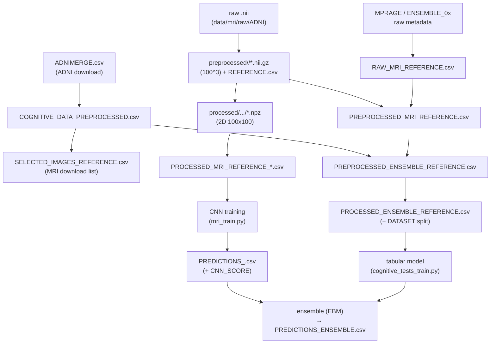

*Part of the [MMML-Alzheimer documentation](../README.md). On-disk layout of the gitignored `data/` and `models/` trees, the file catalogue, and MRI naming conventions at every pipeline stage.*

# Data Structure & On-disk Layout

The `data/` and `models/` directories are **gitignored and empty** in the repo — only `.gitkeep` placeholders are tracked. Everything in this document is reconstructed from how the code reads and writes files (`pd.read_csv`, `to_csv`, `np.savez_compressed`, `np.load`, `ants.image_read`, `torch.save`, `glob`/`rglob`, and hardcoded path strings), with `path:line` citations throughout. Items not read directly from code are marked **(inferred)**.

Read this alongside [data-semantics.md](data-semantics.md) for what the columns mean, and [known-issues.md](../reference/known-issues.md) for the layout bugs flagged here.

## Path roots and the missing config

The code was written to run in **Google Colab** mounted on Google Drive. There is **no central config** that defines paths: every path is hardcoded per module, mostly inside `if __name__ == '__main__':` blocks and notebook cells. The would-be config files are stubs — [experiment_config.json](../../src/experiment/experiment_config.json) is a 3-key empty shell (`{"mri":{}, "cognitive_tests":{}, "ensemble":{}}`), [run.py](../../src/experiment/run.py#L15) has an empty `Experiment.run()`, and all four [src/run/](../../src/run) orchestration files are 0 bytes.

As a result, several path roots coexist depending on each module's vintage:

| Base root | Where it appears | Notes |
|---|---|---|
| `/content/gdrive/MyDrive/Lucas_Thimoteo/data/` | Most `src/` `__main__` blocks, notebooks | The dominant root. `data/` sits directly under the personal Drive folder. |
| `/content/gdrive/MyDrive/Lucas_Thimoteo/mmml-alzheimer-diagnosis/data/` | [mri_preprocessing.py#L140](../../src/data_preprocessing/mri_preprocessing.py#L140), [extract_zip.sh](../../src/utils/extract_zip.sh) | A nested `data/` under the repo folder. **Inconsistent** with the root above: the MRI preprocessing entry point writes here, but everything downstream reads from the shorter path. (inferred: latent bug, or the author moved data between runs.) |
| `/content/gdrive/MyDrive/Lucas_Thimoteo/models/` | [mri_train_online.py#L41](../../src/model_training/mri_train_online.py#L41), saved `.pth` in a notebook | Trained CNN weights. |
| `/content/gdrive/MyDrive/Lucas_Thimoteo/mmml-alzheimer-diagnosis/models/` | [mri_train_online.py#L41](../../src/model_training/mri_train_online.py#L41) (default arg) | Same nested inconsistency as the data root. |
| `./../../data/` (relative) | [cognitive_tests_train.py#L122](../../src/model_training/cognitive_tests_train.py#L122) and commented blocks | Local-run variants, relative to `src/<pkg>/`. Used in the PyCaret experiment script. |
| `/home/lucasthim1/...` | [utils.py#L71](../../src/utils/utils.py#L71), [base_mri.py#L83](../../src/utils/base_mri.py#L83), docstrings | Earliest layout, on a Linux box (`/home/lucasthim1/mmml-alzheimer-diagnosis/data/...`). Superseded by the Drive paths but still present in defaults and docstrings. |

**The practical upshot for re-running after a hiatus:** there is no single variable to change. You must grep for these root strings and update them per module. The nested-vs-flat `data/` split (see [known-issues.md](../reference/known-issues.md)) means MRI preprocessing output may need to be moved before downstream steps can find it.

## `.gitignore` data entries

The "Custom" block at the bottom of [.gitignore](../../.gitignore) excludes the data and model trees plus a FreeSurfer tarball:

```
/src/freesurfer-Linux-centos6_x86_64-stable-pub-v6.0.0.tar.gz
/src/data/
/data/
.vscode/
/models/
/models/*

cloudflared*
```

So `data/`, `src/data/`, and `models/` are all untracked. The only tracked files in those trees are `models/.gitkeep`, `reports/.gitkeep`, and `docs/.gitkeep`. The committed PNGs under [notebooks/final_studies/images/](../../notebooks/final_studies) **are** tracked (dissertation figures).

## Reconstructed `data/` tree

Base = `/content/gdrive/MyDrive/Lucas_Thimoteo/data/`. Subfolders are inferred from path joins, `os.makedirs`, `rglob`, and `to_csv` targets.

```
data/
├── tabular/                         # cognitive-test tables & ensemble references
│   ├── ADNIMERGE.csv                # pipeline INPUT — now REBUILT from ADNIMERGE2 (see adnimerge2.md); read at cognitive_tests_preprocessing.py:23
│   ├── COGNITIVE_DATA_PREPROCESSED.csv      # cognitive_tests_preprocessing.py:57
│   ├── SELECTED_IMAGES_REFERENCE.csv        # mri_selection.py:31 (filename via .replace of COGNITIVE_DATA_PREPROCESSED)
│   ├── PREPROCESSED_ENSEMBLE_REFERENCE.csv  # ensemble_preprocessing.py (2026: from cognitive data alone)
│   ├── PREPROCESSED_ENSEMBLE_REFERENCE_ALL.csv   # notebook variant (final_studies)
│   ├── PROCESSED_ENSEMBLE_REFERENCE.csv     # ensemble_preparation.py (adds DATASET split)
│   └── PROCESSED_ENSEMBLE_REFERENCE_ALL.csv      # notebook variant
│
├── ADNIMERGE2/                      # ADNI R data package (~200 .rda tables) — rebuild source for ADNIMERGE.csv (see adnimerge2.md)
│
├── reference/                       # MRI metadata reference tables
│   ├── MPRAGE_REFERENCE.csv         # RAW ADNI metadata download (INPUT) — mri_metadata_preprocessing.py:21
│   ├── REFERENCE_MRI_ENSEMBLE_CN_AD.csv     # RAW per-batch metadata — :22
│   ├── REFERENCE_MRI_ENSEMBLE_01.csv        # :23
│   ├── REFERENCE_MRI_ENSEMBLE_02.csv        # :24
│   ├── REFERENCE_MRI_ENSEMBLE_03.csv        # :25
│   ├── RAW_MRI_REFERENCE.csv        # concat of the 5 above — mri_metadata_preprocessing.py:27,33
│   ├── PREPROCESSED_MRI_REFERENCE.csv       # concat of per-folder REFERENCE.csv — :39,45
│   ├── IMAGEUID_FROM_UCSF.csv       # RID,VISCODE,IMAGEUID map for the ADNIMERGE2 rebuild (see adnimerge2.md)
│   ├── PROCESSED_MRI_REFERENCE_<timestamp>.csv          # mri_batch_preparation.py:96,101
│   ├── PROCESSED_MRI_REFERENCE_ALL_ORIENTATIONS_*.csv   # master 2D-slice ref used in training
│   ├── PROCESSED_MRI_REFERENCE_<orient>_<slice>_samples_around_slice_<n>_num_rotations_<r>_<ts>.csv
│   └── mri_experiments/             # per-experiment refs (referenced in notebooks)
│
├── mri/
│   ├── atlas/
│   │   └── atlas_t1.nii             # registration FIXED image — antspy_registration.py:6 (ATLAS_PATH)
│   ├── raw/
│   │   ├── ADNI/                    # raw NIfTI from ADNI (.nii) — mri_preprocessing.py input
│   │   ├── ADNI_01/                 # additional raw batches (notebooks)
│   │   └── *.zip                    # downloaded ADNI zips — extract_zip.sh
│   ├── preprocessed/                # 3D .nii.gz (100^3) + per-folder REFERENCE.csv
│   │   ├── 20210523/                # one batch of preprocessed volumes
│   │   ├── 20210602/                # another batch
│   │   ├── 20211002/                # mri_preprocessing.py:142 default output
│   │   └── <YYYYMMDD>/              # one folder per preprocessing run
│   │       ├── ADNI_..._I######.nii.gz       # cropped 100^3 skull-stripped 3D volumes
│   │       └── REFERENCE.csv                  # per-folder ref — utils.py:136
│   ├── processed/                   # 2D slices (.npz)
│   │   ├── sample/                  # mri_preparation.py:144 default output
│   │   ├── coronal_50_all_4000_images/        # per-slice FLAT layouts (older mri_preparation)
│   │   ├── coronal_50_67K_images_20210523/REFERENCE.csv
│   │   ├── axial_25_all_4155_images/ , axial_75_all_4000_images/ , sagittal_25_all_4155_images/ ...
│   │   └── storage/                 # BATCH layout: storage/<IMAGE_DATA_ID>/<orient>_<NN>.npz
│   │       └── I######/
│   │           ├── coronal_50.npz
│   │           ├── axial_25.npz
│   │           └── sagittal_26.npz ...
│   └── experiments/                 # mri_train.py:74 output_path; per-run scratch refs
│
├── COGNITIVE_DATA_PREPROCESSED.csv  # (some notebooks/scripts use the flat data/ root too)
├── PREDICTIONS_*.csv                # CNN prediction tables (per architecture) — see catalogue
├── RESULTS_*.csv                    # per-experiment metric tables — see catalogue
├── TEST_MCI_*.csv                   # MCI stability/test experiment outputs
├── EXPERIMENTS_MCI_SELECTED_*.csv
├── RESNET*_DATA_AUG.csv
└── TEST_MCI_SELECTED.csv
```

Two things to keep in mind:

- There are **two competing 2D-slice layouts** (detailed below): a *flat per-orientation* folder (one `.npz` per image, written by [mri_preparation.py](../../src/data_preparation/mri_preparation.py)) and a *per-subject storage* folder `storage/<IMAGE_DATA_ID>/<orient>_<NN>.npz` (written by [mri_batch_preparation.py](../../src/data_preparation/mri_batch_preparation.py)).
- The **flat `data/` root** (no `tabular/` or `reference/` subfolder) is used by the local PyCaret script [cognitive_tests_train.py](../../src/model_training/cognitive_tests_train.py) (`./../../data/...`) and many notebooks, in parallel to the structured Drive layout.

### How the pieces flow



## MRI file formats & naming by stage

### Format helpers

The read/write helpers live in [base_mri.py](../../src/utils/base_mri.py) and [utils.py](../../src/utils/utils.py):

- `save_mri(image, name, output_path, file_format='.npz', ...)` — `.npz` is written via `np.savez_compressed(output_path/name.npz, image)` (default array key `'arr_0'`); `.nii.gz` via `ants.from_numpy(...).to_file(...)` ([base_mri.py#L55](../../src/utils/base_mri.py#L55)).
- `load_mri(path)` — `.npz` → `np.load(path)['arr_0']`; otherwise `ants.image_read(path)` ([base_mri.py#L69](../../src/utils/base_mri.py#L69)).
- `create_file_name_from_path(path)` strips **two** extensions to handle `.nii.gz`: `os.path.splitext(os.path.splitext(basename)[0])[0]` ([utils.py#L68](../../src/utils/utils.py#L68)).
- `list_available_images(input_dir, file_format='.nii')` uses `Path(input_dir).rglob("*"+file_format)` and excludes anything matching `*[Mm]ask*` ([utils.py#L34](../../src/utils/utils.py#L34)).

### Stage 1 — Raw (download)

NIfTI from ADNI, stored under `data/mri/raw/ADNI/` as `.nii` (the default `file_format='.nii'`). Filenames follow the ADNI convention, for example:

```
ADNI_002_S_4270_MR_MT1__N3m_Br_20111015081648646_S125083_I261073.nii
```

ID parsing happens in `create_image_references` ([utils.py#L140](../../src/utils/utils.py#L140)):

- `img_id = 'I' + path.split('_I')[-1].split('_')[0]` — the trailing `I######` token.
- `patient_id = parts[1]+'_'+parts[2]+'_'+parts[3]` (the 3 tokens after `ADNI_`, e.g. `002_S_4270`).
- `unique_patient_image_id = patient_id + "#" + img_id` (e.g. `002_S_4270#I261073`).

### Stage 2 — Preprocessing (3D → 3D)

[mri_preprocessing.py](../../src/data_preprocessing/mri_preprocessing.py) runs `execute_preprocessing` ([#L86](../../src/data_preprocessing/mri_preprocessing.py#L86)) in this order. Full details in [mri-preprocessing.md](mri-preprocessing.md).

1. **Standardize** — `clip_and_normalize_mri` clips to the 0.02/99.8 percentiles, then linearly scales to the atlas intensity range. Atlas thresholds are **hardcoded**: `get_atlas_thresholds()` returns `(0.05545412003993988, 92.05744171142578)` ([mri_standardize.py#L74](../../src/data_preprocessing/mri_standardize.py#L74)).
2. **Register to atlas** — `register_image_with_atlas` ([antspy_registration.py#L35](../../src/data_preprocessing/antspy_registration.py#L35)), `ATLAS_PATH = '/content/gdrive/MyDrive/Lucas_Thimoteo/data/mri/atlas/atlas_t1.nii'`, `type_of_transform='Affine'`, `grad_step=0.1`.
3. **Skull strip** — DeepBrain 3D U-Net `Extractor` at `probability=0.5` ([deepbrain_skull_strip.py#L49](../../src/data_preprocessing/deepbrain_skull_strip.py#L49)).
4. **Crop at center** — `crop_mri_at_center(box=100)` → **100×100×100** ([mri_preprocessing.py#L107](../../src/data_preprocessing/mri_preprocessing.py#L107)).
5. **Integrity check** — `check_mri_integrity` keeps the image only if `sum > 0` ([base_mri.py#L88](../../src/utils/base_mri.py#L88)).

Output of this stage:

- **Format:** `.nii.gz` (`save_mri(..., file_format='.nii.gz')`, [mri_preprocessing.py#L113](../../src/data_preprocessing/mri_preprocessing.py#L113)).
- **Name:** the original ADNI base name (`ADNI_..._I######` stem) preserved, now `.nii.gz`.
- **Dir:** one dated folder per run, e.g. `data/mri/preprocessed/20211002/`.
- A `REFERENCE.csv` is written into that folder by `generate_metadata_for_preprocessed_images` ([mri_preprocessing.py#L120](../../src/data_preprocessing/mri_preprocessing.py#L120) → `create_reference_table`, [utils.py#L92](../../src/utils/utils.py#L92)).

Note that `set_env_variables()` hardcodes ANTs/NiftyReg install paths from the old Linux box: `ANTSPATH=/home/lucasthim1/ants/ants_install/bin`, `NIFTYREG_INSTALL=/home/lucasthim1/niftyreg/niftyreg_install` ([base_mri.py#L83](../../src/utils/base_mri.py#L83)).

#### Per-folder `REFERENCE.csv` schema

Built by `create_reference_table` ([utils.py#L92](../../src/utils/utils.py#L92)):

| Column | Source | Meaning |
|---|---|---|
| `SUBJECT_IMAGE_ID` | `patient_id + "#" + img_id` | unique patient#image key |
| `SUBJECT_ID` | parsed patient id | e.g. `002_S_4270` |
| `IMAGE_DATA_ID` | `I######` | ADNI image UID |
| `IMAGE_PATH` | absolute path to the `.nii.gz` | for downstream loading |

If a `previous_reference_file_path` is supplied, it left-joins prior metadata on `IMAGE_DATA_ID` ([utils.py#L123](../../src/utils/utils.py#L123)). `load_reference_table` upper-cases and underscores column names, derives `MACRO_GROUP` from `GROUP` (SMC→CN, EMCI/LMCI→MCI), and rebuilds `SUBJECT_IMAGE_ID` ([utils.py#L71](../../src/utils/utils.py#L71)).

#### Metadata concat

[mri_metadata_preprocessing.py](../../src/data_preprocessing/mri_metadata_preprocessing.py):

- `..._prior_to_image_preprocessing` concatenates the 5 raw refs (`MPRAGE_REFERENCE.csv`, `REFERENCE_MRI_ENSEMBLE_CN_AD.csv`, `REFERENCE_MRI_ENSEMBLE_0{1,2,3}.csv`) → `RAW_MRI_REFERENCE.csv`, dropping `FORMAT,TYPE,UNIQUE_IMAGE_ID,MODALITY,DOWNLOADED` and dedup on `IMAGE_DATA_ID` ([#L21](../../src/data_preprocessing/mri_metadata_preprocessing.py#L21)).
- `..._after_image_preprocessing` concatenates the per-folder `REFERENCE.csv` files → `PREPROCESSED_MRI_REFERENCE.csv` ([#L37](../../src/data_preprocessing/mri_metadata_preprocessing.py#L37)).

### Stage 3 — Preparation (3D → 2D slices)

There are **two implementations** with different on-disk layouts. See [data-preparation.md](data-preparation.md) for slicing and augmentation details, and [known-issues.md](../reference/known-issues.md) for the layout split.

**(a) Flat output — [mri_preparation.py](../../src/data_preparation/mri_preparation.py)**

- Loads `PREPROCESSED_MRI_REFERENCE.csv` + `PREPROCESSED_ENSEMBLE_REFERENCE.csv`, filters out `CONFLICT_DIAGNOSIS == True` images ([#L74](../../src/data_preparation/mri_preparation.py#L74)). As of the 2026 rewrite this filter is a no-op (no row is ever flagged), but the code path is unchanged.
- For each 3D `.nii.gz`: `slice_image(image_3d, orientation, slice)` → optional augmentation → `.npz` ([#L93](../../src/data_preparation/mri_preparation.py#L93)).
- **Name:** `<original_stem>_<orientation>_<slice>.npz` (no augmentation, [#L99](../../src/data_preparation/mri_preparation.py#L99)) or `<original_stem>_<orientation>_<slice>[_rot_<angle>].npz` via `save_batch_mri`, with keys like `coronal_50`, `coronal_50_rot_-3` from `mri_augmentation.generate_augmented_slice` ([mri_augmentation.py#L96](../../src/data_preparation/mri_augmentation.py#L96)).
- Writes `<output>/REFERENCE.csv` ([#L137](../../src/data_preparation/mri_preparation.py#L137)).

**(b) Per-subject "storage" output — [mri_batch_preparation.py](../../src/data_preparation/mri_batch_preparation.py)**

- **Path rule (documented in code):** `<output_path>/<IMAGE_DATA_ID>/<orientation>_<2-digit slice>.npz`, e.g. `/data/storage/I124661/coronal_50.npz` ([#L199](../../src/data_preparation/mri_batch_preparation.py#L199)).
- Slice number is zero-padded to 2 digits when `< 10` ([#L208](../../src/data_preparation/mri_batch_preparation.py#L208)).
- Default orientation ranges carry a **dict-key collision bug**: two `axial` and two `sagittal` keys, so only the last of each survives, leaving `coronal:35-65, axial:65-85, sagittal:65-85` ([#L20](../../src/data_preparation/mri_batch_preparation.py#L20)). See [known-issues.md](../reference/known-issues.md).
- Axis→orientation mapping & rotations: axial `np.rot90(k=3,axes=(0,1))[:,:,i]`, coronal `np.rot90(k=3,axes=(0,2))[:,i,:]`, sagittal `np.rot90(k=3,axes=(1,2))` then `np.rot90(k=2,axes=(0,2))[i,:,:]` ([#L145](../../src/data_preparation/mri_batch_preparation.py#L145); matches `mri_augmentation.slice_image`).
- Output reference `PROCESSED_MRI_REFERENCE_<YYYYMMDD_HHMM>.csv` with columns: `SUBJECT, IMAGE_DATA_ID, ORIENTATION, SLICE, VALID_IMAGE, GROUP, MACRO_GROUP, SEX, AGE, IMAGE_PATH, ORIGINAL_IMAGE_PATH, DATASET` ([#L96](../../src/data_preparation/mri_batch_preparation.py#L96)).

#### 2D `.npz` slice format

- A single array under the default key `arr_0`, a **100×100** float slice.
- Loaded in training as `np.load(sample['IMAGE_PATH'])['arr_0']`, normalized `X = X/X.max()` ([mri_dataset.py#L46](../../src/model_training/mri_dataset.py#L46)), reshaped to `(-1,1,100,100)` (1 channel) in [mri_train.py#L451](../../src/model_training/mri_train.py#L451).
- The online variant [mri_dataset_online.py#L45](../../src/model_training/mri_dataset_online.py#L45) skips the `.npz` and reads the 3D `.nii.gz` directly (`ants.image_read(sample['IMAGE_PATH']).numpy()`), slicing on the fly.

## CSV / data-file catalogue

Producer → consumer for every CSV the pipeline touches. Column meanings are in [data-semantics.md](data-semantics.md).

| File (basename) | Produced by | Consumed by | Meaning |
|---|---|---|---|
| `ADNIMERGE.csv` | **External** (ADNI download) | [cognitive_tests_preprocessing.py#L23](../../src/data_preprocessing/cognitive_tests_preprocessing.py#L23) | Raw ADNI master table. |
| `COGNITIVE_DATA_PREPROCESSED.csv` | [cognitive_tests_preprocessing.py#L57](../../src/data_preprocessing/cognitive_tests_preprocessing.py#L57) | [mri_selection.py#L18](../../src/data_preprocessing/mri_selection.py#L18), [ensemble_preprocessing.py#L53](../../src/data_preprocessing/ensemble_preprocessing.py#L53), [cognitive_tests_train.py#L50](../../src/model_training/cognitive_tests_train.py#L50) | Cleaned cognitive + demographics. |
| `SELECTED_IMAGES_REFERENCE.csv` | [mri_selection.py#L31](../../src/data_preprocessing/mri_selection.py#L31) (name via `.replace('COGNITIVE_DATA_PREPROCESSED','SELECTED_IMAGES_REFERENCE')`) | — (download-list aid) | Single column `IMAGEUID` of MRIs to download. |
| `MPRAGE_REFERENCE.csv`, `REFERENCE_MRI_ENSEMBLE_CN_AD.csv`, `REFERENCE_MRI_ENSEMBLE_0{1,2,3}.csv` | **External** ADNI metadata exports | [mri_metadata_preprocessing.py#L21](../../src/data_preprocessing/mri_metadata_preprocessing.py#L21) | Per-batch raw MRI metadata. |
| `RAW_MRI_REFERENCE.csv` | [mri_metadata_preprocessing.py#L33](../../src/data_preprocessing/mri_metadata_preprocessing.py#L33) | (metadata pipeline) | Concatenated raw MRI metadata. |
| `PREPROCESSED_MRI_REFERENCE.csv` | [mri_metadata_preprocessing.py#L45](../../src/data_preprocessing/mri_metadata_preprocessing.py#L45) | [mri_preparation.py#L72](../../src/data_preparation/mri_preparation.py#L72), [mri_batch_preparation.py#L53](../../src/data_preparation/mri_batch_preparation.py#L53), [mri_metadata_preparation.py#L58](../../src/data_preparation/mri_metadata_preparation.py#L58) | 3D-image metadata (post skull-strip). `IMAGE_DATA_ID` is `I######`. **No longer consumed by `ensemble_preprocessing.py`** as of the 2026 rewrite (single diagnosis source). |
| `PREPROCESSED_ENSEMBLE_REFERENCE.csv` | [ensemble_preprocessing.py](../../src/data_preprocessing/ensemble_preprocessing.py) (2026: cognitive data only) | [ensemble_preparation.py#L33](../../src/data_preparation/ensemble_preparation.py#L33), [mri_preparation.py#L73](../../src/data_preparation/mri_preparation.py#L73), [mri_metadata_preparation.py#L59](../../src/data_preparation/mri_metadata_preparation.py#L59) | Ensemble reference. `MACRO_GROUP = DIAGNOSIS`, `CONFLICT_DIAGNOSIS` always `False`, optional `HAS_PREPROCESSED_MRI` flag. **(pre-2026:** cognitive × MRI-metadata merge with a real conflict flag.) |
| `PROCESSED_ENSEMBLE_REFERENCE.csv` | [ensemble_preparation.py#L52](../../src/data_preparation/ensemble_preparation.py#L52) | [cognitive_tests_train.py#L16](../../src/model_training/cognitive_tests_train.py#L16), ensemble notebooks | Adds `DATASET` (train/validation/test) + `IMAGE_DATA_ID`. |
| `PROCESSED_MRI_REFERENCE_<ts>.csv` | [mri_batch_preparation.py#L101](../../src/data_preparation/mri_batch_preparation.py#L101) | [mri_dataset_generation.py#L59](../../src/model_training/mri_dataset_generation.py#L59), [mri_train.py#L215](../../src/model_training/mri_train.py#L215) | Per-slice (2D) reference for CNN training. |
| `PROCESSED_MRI_REFERENCE_ALL_ORIENTATIONS_*.csv` | batch prep, renamed in notebooks | [mri_train.py#L73](../../src/model_training/mri_train.py#L73) (default `mri_reference`) | Master 2D-slice reference across all orientations. |
| `PROCESSED_MRI_REFERENCE_<orient>_<slice>_samples_around_slice_<n>_num_rotations_<r>_<ts>.csv` | [mri_dataset_generation.py#L82](../../src/model_training/mri_dataset_generation.py#L82), [mri_metadata_preparation.py#L95](../../src/data_preparation/mri_metadata_preparation.py#L95) | training | Per-experiment augmented slice reference. |
| `REFERENCE.csv` | [utils.py#L136](../../src/utils/utils.py#L136), [mri_preparation.py#L137](../../src/data_preparation/mri_preparation.py#L137) | metadata concat ([mri_metadata_preprocessing.py#L37](../../src/data_preprocessing/mri_metadata_preprocessing.py#L37)) | Per-folder image reference (see schema above). |
| `PREDICTIONS_<ARCH>*.csv` (e.g. `PREDICTIONS_VGG19_BN_DATA_AUG_LR_0001.csv`, `PREDICTIONS_VGG13_BN_MCI*.csv`, `PREDICTIONS_RESNET34.csv`, `PREDICTIONS_RESNET101_DATA_AUG.csv`) | [mri_train.py#L62](../../src/model_training/mri_train.py#L62) (`evaluate_trained_model`, `compute_predictions_for_ensemble`) | [ensemble_train.py#L19](../../src/model_training/ensemble_train.py#L19), ensemble notebooks | Per-slice CNN scores. Adds `CNN_SCORE` (and `model`, `model_path`). |
| `PREDICTIONS_COGNITIVE_TESTS.csv` | [cognitive_tests_train.py#L103](../../src/model_training/cognitive_tests_train.py#L103) | ensemble notebooks (`ensemble_train.prepare_ensemble_experiment_set`) | Tabular model scores; adds `TABULAR_MODEL`, `Score_1`/`COGTEST_SCORE`. |
| `PREDICTIONS_ENSEMBLE.csv` | [cognitive_tests_train.py#L153](../../src/model_training/cognitive_tests_train.py#L153) (`run_ensemble_experiment`) | reports/notebooks | Final ensemble scores. |
| `RESULTS_<ORIENT>_<ARCH>.csv`, `RESULTS_MCI_*.csv`, `RESULTS_VGG*_BN*.csv` | [mri_train.py#L112](../../src/model_training/mri_train.py#L112) (`run_mris_experiments`) | analysis notebooks | Per-run train/validation metric rows. |
| `TEST_MCI_*`, `EXPERIMENTS_MCI_SELECTED_*`, `RESNET*_DATA_AUG.csv` | training notebooks (`save_path` args) | analysis notebooks | MCI stability / ablation outputs. |
| `PREDICTED_MRI_REFERENCE.csv` | commented out ([mri_train_online.py#L95](../../src/model_training/mri_train_online.py#L95), [mri_train.py#L257](../../src/model_training/mri_train.py#L257)) | — | **Dead** — never actually written. See [known-issues.md](../reference/known-issues.md). |

## Where models and results land

### CNN weights (`models/`)

| Artifact | Saved by | Loaded by | Naming |
|---|---|---|---|
| CNN weights `*.pth` | `torch.save(best_model_params, model_path + model_name + '.pth')` ([mri_train.py#L408](../../src/model_training/mri_train.py#L408), [mri_train_online.py#L255](../../src/model_training/mri_train_online.py#L255)) | `load_trained_model` → `torch.load(model_path, map_location=device)` ([neural_network.py#L108](../../src/models/neural_network.py#L108)) | `model_name = <base> + datetime("%m%d%Y_%H%M") + '.pth'` ([mri_train.py#L222](../../src/model_training/mri_train.py#L222)). Real committed example: `cnn_test11102021_022111102021_0223.pth`. |
| Default model dir | [mri_train_online.py#L41](../../src/model_training/mri_train_online.py#L41) | | `/content/gdrive/MyDrive/Lucas_Thimoteo/(mmml-alzheimer-diagnosis/)?models/` |

Only **state_dicts** are saved (loaded `strict=True`). The architecture is rebuilt by `load_model(model_type)` ([neural_network.py#L116](../../src/models/neural_network.py#L116)): `shallow_cnn` (custom `NeuralNetwork`, input 1×100×100, AdaptiveAvgPool 8×8, FC 64*8*8→512→512→1), `super_shallow_cnn` (`SuperShallowCNN`), adapted torchvision `vgg11/11_bn/13/13_bn/19/19_bn` (first conv → 1 channel, last FC → 1), and `resnet34/50/101`. See [models.md](../modeling/models.md) and [training.md](../modeling/training.md).

The **PyCaret / EBM tabular models are NOT persisted** — [cognitive_tests_train.py#L98](../../src/model_training/cognitive_tests_train.py#L98) has only a `# TODO: save model`. This is a re-run blocker, flagged in [known-issues.md](../reference/known-issues.md).

### Prediction & result CSVs

The `PREDICTIONS_*` and `RESULTS_*` tables (catalogued above) are the analysis outputs. They land at whichever `save_path`/`output_path` the caller passes — in `__main__` blocks and notebooks this is usually the **flat `data/` root**, not a `tabular/` or `reference/` subfolder. See [experiment-management.md](../experiments/experiment-management.md) for how runs are tracked.

### Inputs needed for the explanation stage

The explainers reference model location through reference-table columns `MODEL` and `MODEL_PATH` (upper-cased), one per orientation ([mri_explanation.py#L66](../../src/model_explanation/mri_explanation.py#L66)). A prediction reference CSV used for explanations must therefore carry `MODEL, MODEL_PATH, IMAGE_PATH, ORIENTATION, SLICE, MACRO_GROUP, CNN_SCORE, CNN_PREDICTION, IMAGE_DATA_ID`. See [explainability.md](../modeling/explainability.md).

## See also

- [data-semantics.md](data-semantics.md) — column meanings, the diagnostic label scheme, and the ensemble reference schemas.
- [data-acquisition.md](data-acquisition.md) — how to (re)download ADNI data and the atlas into `data/mri/raw/` and `data/mri/atlas/`.
- [mri-preprocessing.md](mri-preprocessing.md) — the 3D `.nii` → `.nii.gz` 100³ pipeline that fills `data/mri/preprocessed/`.
- [data-preparation.md](data-preparation.md) — 3D → 2D slicing and the two `.npz` layouts.
- [known-issues.md](../reference/known-issues.md) — the path-root inconsistency, dict-key collision, dead files, and unpersisted EBM.
- [repository-map.md](../architecture/repository-map.md) — directory-by-directory map of the `src/` tree these paths live in.
