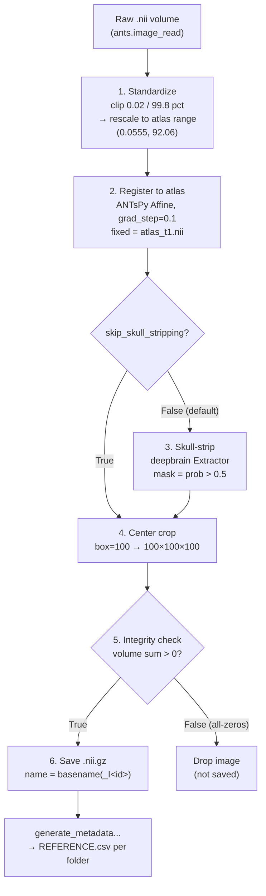
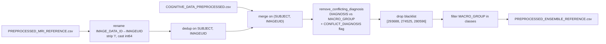

*Part of the [MMML-Alzheimer documentation](../README.md). The 3D MRI preprocessing pipeline (intensity standardize → atlas register → skull-strip → crop) and the tabular/metadata preprocessing that ships in the same package.*

# MRI Preprocessing (3D)

This page documents [src/data_preprocessing/](../../src/data_preprocessing), the subsystem that turns raw ADNI downloads into the cleaned reference tables and preprocessed 3D MRI volumes consumed by the next stage, [data-preparation.md](data-preparation.md). The heart of it is a fixed 6-step 3D image pipeline; alongside it live the tabular and metadata preprocessing modules that produce the cognitive table and the patient/diagnosis reference joined to the images.

Two parallel tracks feed a final join:

- **Tabular track** — `ADNIMERGE.csv` → [cognitive_tests_preprocessing.py](../../src/data_preprocessing/cognitive_tests_preprocessing.py) → `COGNITIVE_DATA_PREPROCESSED.csv`.
- **Image track** — ADNI MRI metadata CSVs + downloaded `.nii` volumes → metadata merge + image selection + the 3D MRI pipeline → preprocessed `.nii.gz` volumes + `PREPROCESSED_MRI_REFERENCE.csv`.

[ensemble_preprocessing.py](../../src/data_preprocessing/ensemble_preprocessing.py) joins the two into `PREPROCESSED_ENSEMBLE_REFERENCE.csv`.

> Everything under `data/` and `models/` is gitignored and empty. Filenames, directory layout and CSV column semantics below are reconstructed from how the code reads/writes them; inferences are labeled **(inferred)**. Column-level detail for the tables is in [data-semantics.md](data-semantics.md); on-disk layout and naming are in [data-structure.md](data-structure.md). Known bugs are catalogued in [known-issues.md](../reference/known-issues.md).

## Where this fits in the overall order

The repo `README.md` defines preprocessing as steps 2–5 of the workflow:

| Step | Action | Module |
|---|---|---|
| 2 | Preprocess `ADNIMERGE.csv` | [cognitive_tests_preprocessing.py](../../src/data_preprocessing/cognitive_tests_preprocessing.py) |
| 3a | Merge MRI metadata; select which MRIs to download | [mri_metadata_preprocessing.py](../../src/data_preprocessing/mri_metadata_preprocessing.py), [mri_selection.py](../../src/data_preprocessing/mri_selection.py) |
| 3b | Download MRIs from ADNI (manual, web) | — see [data-acquisition.md](data-acquisition.md) |
| 4 | Preprocess MRIs (the 3D pipeline) | [mri_preprocessing.py](../../src/data_preprocessing/mri_preprocessing.py) |
| 5 | (downstream) 3D→2D slicing + augmentation | [data-preparation.md](data-preparation.md) |
| — | Join tabular + MRI into the ensemble reference | [ensemble_preprocessing.py](../../src/data_preprocessing/ensemble_preprocessing.py) |

> Naming inconsistency: the `README.md` calls the cognitive output `COGNITIVE_DATA_PROCESSED.csv`, but the code writes `COGNITIVE_DATA_PREPROCESSED.csv` ([cognitive_tests_preprocessing.py#L57](../../src/data_preprocessing/cognitive_tests_preprocessing.py#L57)). The README name is wrong. See [known-issues.md](../reference/known-issues.md).

### Hardcoded path roots

Most default paths are a Google-Colab Drive mount: `/content/gdrive/MyDrive/Lucas_Thimoteo/...`. Some helpers ([base_mri.py#L83](../../src/utils/base_mri.py#L83)-L86) instead hardcode a Linux box: `/home/lucasthim1/ants/...` and `/home/lucasthim1/niftyreg/...`. The two roots are inconsistent across most of the codebase — a sign the code was migrated from a local Ubuntu machine to Colab and never fully reconciled. When re-running other stages, expect to override these paths.

> **Updated (2026):** the 3D MRI step itself no longer needs path surgery. [mri_preprocessing.py](../../src/data_preprocessing/mri_preprocessing.py) now runs as a normal CLI with repo-relative defaults (`data/mri/raw/ADNI` → `data/mri/preprocessed/<today>`) and a `__file__`-relative `sys.path`, and the registration atlas resolves automatically (Step 2): `$ATLAS_PATH` → repo-local `data/mri/atlas/atlas_t1.nii` → ANTsPy's bundled MNI152 T1 fallback.

### Reconstructed `data/` layout (inferred from path strings)

```
data/
├── tabular/
│   ├── ADNIMERGE.csv                          (INPUT, downloaded from ADNI)
│   ├── COGNITIVE_DATA_PREPROCESSED.csv        (output of cognitive_tests_preprocessing.py)
│   ├── SELECTED_IMAGES_REFERENCE.csv          (output of mri_selection.py)
│   └── PREPROCESSED_ENSEMBLE_REFERENCE.csv    (output of ensemble_preprocessing.py)
├── reference/
│   ├── MPRAGE_REFERENCE.csv                   (INPUT, ADNI MRI metadata download)
│   ├── REFERENCE_MRI_ENSEMBLE_CN_AD.csv       (INPUT, ADNI MRI metadata download)
│   ├── REFERENCE_MRI_ENSEMBLE_01.csv          (INPUT)
│   ├── REFERENCE_MRI_ENSEMBLE_02.csv          (INPUT)
│   ├── REFERENCE_MRI_ENSEMBLE_03.csv          (INPUT)
│   ├── RAW_MRI_REFERENCE.csv                  (output, raw-side metadata merge)
│   └── PREPROCESSED_MRI_REFERENCE.csv         (output, preprocessed-side metadata merge)
└── mri/
    ├── atlas/atlas_t1.nii                     (INPUT, registration template)
    ├── raw/ADNI/...                           (INPUT, downloaded .nii volumes, nested dirs)
    └── preprocessed/<YYYYMMDD>/               (output, .nii.gz volumes + REFERENCE.csv)
        ├── ADNI_..._I<id>.nii.gz
        └── REFERENCE.csv
```

---

## The 3D MRI pipeline at a glance

[mri_preprocessing.py](../../src/data_preprocessing/mri_preprocessing.py) loops over every raw `.nii` volume and applies, **in this exact order**: standardize → register → skull-strip → crop → integrity-check → save, then rebuilds a metadata reference table.



> The docstring/print at [mri_preprocessing.py#L67](../../src/data_preprocessing/mri_preprocessing.py#L67) claims the order is "Labeling + Standardizing + Registration + Skull Stripping + Cropping", but the actual code order ([L93](../../src/data_preprocessing/mri_preprocessing.py#L93)-L113) is **Standardize → Register → Skull-strip → Crop**, with **no** labeling step. Labeling is the commented-out `label_image_files` (imports disabled at [L24](../../src/data_preprocessing/mri_preprocessing.py#L24) / [L135](../../src/data_preprocessing/mri_preprocessing.py#L135)). See [`mri_label.py`](#mri_labelpy--entirely-dead).

### Orchestrator — `execute_preprocessing`

| | |
|---|---|
| **Input** | Raw `.nii` volumes under `input_path` (default in `__main__`: `data/mri/raw/ADNI/`). Discovered recursively by `list_available_images` (glob `*.nii`, masks excluded). |
| **Output** | One `.nii.gz` per usable image in `output_path` (CLI default: `data/mri/preprocessed/<today>`), plus `REFERENCE.csv` in the same folder. |
| **Signature** | `execute_preprocessing(input_path, output_path, images_to_process=None, box=100, skip=0, limit=0, mri_reference_path=None, skip_skull_stripping=False)` ([L29](../../src/data_preprocessing/mri_preprocessing.py#L29)). |
| **CLI** | Runs as a normal script — `python src/data_preprocessing/mri_preprocessing.py [-i IN] [-o OUT] [-l N] [--skip-skull-stripping] [-r MRI_REF]` ([L142](../../src/data_preprocessing/mri_preprocessing.py#L142)). Defaults to every `.nii` under `data/mri/raw/ADNI`; the `sys.path` is `__file__`-relative so it works from any CWD. |

The per-image loop ([L86](../../src/data_preprocessing/mri_preprocessing.py#L86)-L118):

```python
input_image        = load_mri(path=image_path)                      # base_mri.load_mri -> ants.image_read
standardized_image = clip_and_normalize_mri(input_image)            # mri_standardize
registered_image   = register_image_with_atlas(standardized_image)  # antspy_registration (Affine)
stripped_image     = deep_brain_skull_stripping(image=registered_image, probability=0.5,
                                                output_as_array=False)   # deepbrain_skull_strip
cropped_image      = crop_mri_at_center(image=stripped_image, cropping_box=box)  # mri_crop (100)
integrity_check    = check_mri_integrity(cropped_image)             # base_mri: sum > 0
if integrity_check:
    save_mri(image=cropped_image, output_path=output_path,
             name=create_file_name_from_path(image_path), file_format='.nii.gz')
```

- `skip` / `limit` slice `images_to_process` so a failed batch can resume ([L70](../../src/data_preprocessing/mri_preprocessing.py#L70)-L80).
- `skip_skull_stripping=True` bypasses DeepBrain and feeds the registered image straight to the cropper ([L99](../../src/data_preprocessing/mri_preprocessing.py#L99)-L104).
- **Integrity check** ([base_mri.py#L88](../../src/utils/base_mri.py#L88)-L92): `image.numpy().sum().sum().sum() > 0`. If the volume is all-zeros (skull-strip wiped everything), the image is dropped and **not** saved ([L114](../../src/data_preprocessing/mri_preprocessing.py#L114)-L115). This check exists specifically to catch DeepBrain failures.

---

## Step 1 — Standardize (`mri_standardize.py`)

Intensity clipping + atlas-anchored normalization. `clip_and_normalize_mri(image, lower_bound=0.02, upper_bound=99.8)` ([mri_standardize.py#L13](../../src/data_preprocessing/mri_standardize.py#L13)).

| | |
|---|---|
| **Input** | An `ants.ANTsImage` (the raw loaded volume). |
| **Output** | An `ants.ANTsImage` with intensities rescaled. |

Steps ([L35](../../src/data_preprocessing/mri_standardize.py#L35)-L45):

1. **NaN handling** — `image_has_nan` ([L47](../../src/data_preprocessing/mri_standardize.py#L47)); if any NaN, `replace_nan` ([L52](../../src/data_preprocessing/mri_standardize.py#L52)) sets NaNs to `np.nanmin` of the volume.
2. **Clip outliers** — compute the **0.02** and **99.8** percentiles of the image (`get_percentiles`, [L57](../../src/data_preprocessing/mri_standardize.py#L57)) and clip to those thresholds (`clip_image_intensity`, [L67](../../src/data_preprocessing/mri_standardize.py#L67)).
3. **Rescale onto atlas range** — read the atlas reference thresholds (`get_atlas_thresholds`, [L72](../../src/data_preprocessing/mri_standardize.py#L72)) and linearly rescale the clipped image into that range (`scale_image_linearly`, [L63](../../src/data_preprocessing/mri_standardize.py#L63)): `(img - lower) / (upper - lower)`.
4. **Rebuild** an ANTsImage preserving the original `direction` ([L44](../../src/data_preprocessing/mri_standardize.py#L44)).

**Hardcoded atlas thresholds** ([L74](../../src/data_preprocessing/mri_standardize.py#L74)): when `atlas_path is None` (the default in the pipeline), `get_atlas_thresholds` returns the magic tuple `(0.05545412003993988, 92.05744171142578)`, commented as "for 0.02 and 99.8". These are the precomputed 0.02/99.8 percentiles of `atlas_t1.nii`, baked in so the atlas is not re-read for every image. Normalization is therefore **atlas-anchored**: every subject's intensities are mapped onto the template's intensity scale. These constants are a **fixed normalization target** and are independent of which registration template Step 2 uses — standardization runs first and never reads the registration atlas, so the MNI152 fallback does **not** affect them (see [known-issues.md](../reference/known-issues.md) §7).

> Standardization runs **before** registration ([mri_preprocessing.py#L93](../../src/data_preprocessing/mri_preprocessing.py#L93)-L97), so the atlas intensity range is applied to the un-registered image. "Standardize based on atlas" refers only to the intensity range, not spatial alignment — the spatial alignment happens in Step 2.

---

## Step 2 — Register to atlas (`antspy_registration.py`)

ANTsPy affine registration to a T1 template. `register_image_with_atlas(moving, type_of_transform='Affine')` ([antspy_registration.py#L35](../../src/data_preprocessing/antspy_registration.py#L35)).

| | |
|---|---|
| **Template (fixed)** | Resolved at call time by `resolve_atlas_path()` ([L17](../../src/data_preprocessing/antspy_registration.py#L17)), in priority order: `$ATLAS_PATH` → repo-local `data/mri/atlas/atlas_t1.nii` → **ANTsPy's bundled MNI152 T1** (`ants.get_ants_data('mni')`, the turnkey fallback). The original Colab `ATLAS_PATH` constant ([L15](../../src/data_preprocessing/antspy_registration.py#L15)) is kept only for reference. The MNI152 fallback is a standard substitute but **not** the original `atlas_t1.nii`, so registrations differ slightly from the 2021 runs — drop the original atlas at `data/mri/atlas/atlas_t1.nii` (or set `$ATLAS_PATH`) to reproduce exactly. See [data-acquisition.md](data-acquisition.md). |
| **Input (moving)** | The standardized `ants.ANTsImage`. |
| **Output** | Warped/registered `ants.ANTsImage` resampled onto the template grid. |

Steps ([L54](../../src/data_preprocessing/antspy_registration.py#L54)-L57):

```python
fixed       = ants.image_read(resolve_atlas_path())   # $ATLAS_PATH -> data/mri/atlas/atlas_t1.nii -> MNI152 fallback
mytx        = ants.registration(fixed=fixed, moving=moving, type_of_transform='Affine', grad_step=0.1)
warpedimage = ants.apply_transforms(fixed=fixed, moving=moving, transformlist=mytx['fwdtransforms'])
```

- **`type_of_transform='Affine'`** is the default; the docstring notes `'Similarity'` and `'Rigid'` were also tested ([L45](../../src/data_preprocessing/antspy_registration.py#L45)).
- **`grad_step=0.1`** is the only non-default registration hyperparameter.
- After registration the image sits on the template grid, which is what makes the fixed-position center crop in Step 4 meaningful across subjects.

---

## Step 3 — Skull-strip (`deepbrain_skull_strip.py`)

DeepBrain 3D U-Net brain extraction. `deep_brain_skull_stripping(image, probability=0.5, output_as_array=True, get_mask=False)` ([deepbrain_skull_strip.py#L11](../../src/data_preprocessing/deepbrain_skull_strip.py#L11)).

| | |
|---|---|
| **Tool** | `deepbrain.Extractor` — a 3D U-Net brain-extraction model ([L9](../../src/data_preprocessing/deepbrain_skull_strip.py#L9), [L46](../../src/data_preprocessing/deepbrain_skull_strip.py#L46)). |
| **Input** | An `ants.ANTsImage` (the registered image) or a numpy array. |
| **Output** | Skull-stripped image; numpy array if `output_as_array=True`, else `ants.ANTsImage` (preserving `direction`). The pipeline calls it with `output_as_array=False` so it returns an ANTsImage ([mri_preprocessing.py#L101](../../src/data_preprocessing/mri_preprocessing.py#L101)). |

Steps ([L40](../../src/data_preprocessing/deepbrain_skull_strip.py#L40)-L66):

1. If input is an ANTsImage, capture `direction` and convert to numpy ([L40](../../src/data_preprocessing/deepbrain_skull_strip.py#L40)-L42).
2. `ext = Extractor(); prob = ext.run(image)` — a per-voxel brain-probability map ([L46](../../src/data_preprocessing/deepbrain_skull_strip.py#L46)-L48).
3. `mask = prob > probability` with **`probability = 0.5`** ([L49](../../src/data_preprocessing/deepbrain_skull_strip.py#L49)).
4. If `get_mask=True`, binarize and return the mask ([L52](../../src/data_preprocessing/deepbrain_skull_strip.py#L52)-L55) — not used by the pipeline.
5. Otherwise apply the mask: `final_img[~mask] = 0` zeros out non-brain voxels ([L58](../../src/data_preprocessing/deepbrain_skull_strip.py#L58)-L59).
6. Return as numpy or as ANTsImage with restored `direction` ([L61](../../src/data_preprocessing/deepbrain_skull_strip.py#L61)-L66).

> `deepbrain` and `tensorflow` are imported at the top of the orchestrator ([mri_preprocessing.py#L11](../../src/data_preprocessing/mri_preprocessing.py#L11)-L12) but are **not** in `requirements.txt`. See [Environment & dependencies](#environment--dependencies) and [known-issues.md](../reference/known-issues.md).

---

## Step 4 — Center crop (`mri_crop.py`)

Center crop to a fixed cubic box. `crop_mri_at_center(image, cropping_box=100, center_dim=None)` ([mri_crop.py#L13](../../src/data_preprocessing/mri_crop.py#L13)).

| | |
|---|---|
| **Input** | ANTsImage or numpy array (the stripped image). |
| **Output** | Same type, cropped to `cropping_box³`. |

Steps:

- `get_lower_and_upper_dimensions` ([L45](../../src/data_preprocessing/mri_crop.py#L45)-L67): if `center_dim` is None, `center = [ceil(dim/2) for dim in image.shape]`; `lower = center - box/2`, `upper = center + box/2`.
- numpy path → array slice (`crop_as_numpy`, [L69](../../src/data_preprocessing/mri_crop.py#L69)); ANTs path → `ants.crop_indices(image, lowerind, upperind)` ([L42](../../src/data_preprocessing/mri_crop.py#L42)).
- **Default box = 100** → output volume is **100×100×100** (the pipeline passes `box=100`).

This crop is only valid because each image was first affine-registered onto the same template grid, so anatomical structures sit at consistent coordinates.

> Dead branch: `if image is None: image = ants.image_read(input_path)` ([L34](../../src/data_preprocessing/mri_crop.py#L34)-L35) references an undefined `input_path`. Never hit because the caller always passes an image. See [known-issues.md](../reference/known-issues.md).

---

## Steps 5–6 — Integrity check, save, and metadata

### Output naming convention

`save_mri` ([base_mri.py#L37](../../src/utils/base_mri.py#L37)-L67) writes `<output_path>/<name><file_format>`. `name = create_file_name_from_path(image_path)` ([utils.py#L68](../../src/utils/utils.py#L68)-L69) strips the directory and double extension. For example:

```
input :  ADNI_002_S_4270_MR_MT1__N3m_Br_20111015081648646_S125083_I261073.nii
name  :  ADNI_002_S_4270_..._S125083_I261073
output:  ADNI_002_S_4270_..._S125083_I261073.nii.gz
```

The trailing `_I<id>` token (the ADNI Image Data ID) is preserved in every preprocessed filename — that single token is how images are later re-linked to metadata. Full naming rules are in [data-structure.md](data-structure.md).

### `generate_metadata_for_preprocessed_images`

After the loop, `generate_metadata_for_preprocessed_images(output_path, mri_reference_path)` ([mri_preprocessing.py#L132](../../src/data_preprocessing/mri_preprocessing.py#L132)-L135) re-lists the saved `.nii.gz` files and calls `create_reference_table(...)` → writes `REFERENCE.csv` into `output_path`. The `label_image_files` call is commented out ([L135](../../src/data_preprocessing/mri_preprocessing.py#L135)).

`create_reference_table` ([utils.py#L92](../../src/utils/utils.py#L92)-L138) builds a dataframe with columns `SUBJECT_IMAGE_ID`, `SUBJECT_ID`, `IMAGE_DATA_ID`, `IMAGE_PATH` ([L117](../../src/utils/utils.py#L117)-L121). If a `previous_reference_file_path` is given, it left-merges the old metadata on `IMAGE_DATA_ID` (dropping the old `SUBJECT_IMAGE_ID`/`IMAGE_PATH` first), so the per-folder `REFERENCE.csv` carries the original metadata columns (`GROUP`, `MACRO_GROUP`, etc.) plus the new path columns. Saved as `<output_path>/REFERENCE.csv` ([L136](../../src/utils/utils.py#L136)).

`create_image_references` ([utils.py#L140](../../src/utils/utils.py#L140)-L161) parses IDs from each filename:

- `IMAGE_DATA_ID = 'I' + path.split('_I')[-1].split('_')[0]`, then strips any `.` and the suffixes `_MCI`, `_CN`, `_AD`, `' (1)'` ([L145](../../src/utils/utils.py#L145)-L148). It expects the ADNI `_I<digits>` token and tolerates label-tagged / duplicate filenames.
- patient id from the filename split on `_`: if the file starts with `ADNI`, tokens `[1]_[2]_[3]` (e.g. `002_S_4270`); else tokens `[0]_[1]_[2]` ([L151](../../src/utils/utils.py#L151)-L156).
- `SUBJECT_IMAGE_ID = patient_id + "#" + img_id` ([L158](../../src/utils/utils.py#L158)).

---

## Environment & dependencies

- `set_env_variables` ([base_mri.py#L80](../../src/utils/base_mri.py#L80)-L86) exports `ANTSPATH=/home/lucasthim1/ants/ants_install/bin` and `NIFTYREG_INSTALL=/home/lucasthim1/niftyreg/niftyreg_install` and appends both to `PATH`. These Linux paths will not exist on Colab/Mac — but ANTs is used via the `antspyx` Python library, so the env vars are likely vestigial (NiftyReg is never actually called in this subsystem).
- TensorFlow logging is silenced at import ([mri_preprocessing.py#L17](../../src/data_preprocessing/mri_preprocessing.py#L17)-L18). **Import order matters:** `tensorflow`/`deepbrain` are imported *before* `ants` (ITK) to avoid an OpenMP deadlock during skull stripping on macOS — preserve that order in notebooks.
- **`requirements.txt` is now complete** (rebuilt 2026-06-24): build the env with `uv venv --python 3.11 && uv pip install -r requirements.txt`. It now lists the full set including `deepbrain` (a TF2/`compat.v1` fork), `tensorflow`, `nibabel`, `captum`, `pycaret==3.3.2`, and `interpret`. Cross-referenced in [data-acquisition.md](data-acquisition.md) and [known-issues.md](../reference/known-issues.md) §5.2.
- **antspyx compatibility:** modern antspyx moved `ANTsImage` out of the top-level namespace; the pipeline modules ([base_mri.py](../../src/utils/base_mri.py), [antspy_registration.py](../../src/data_preprocessing/antspy_registration.py), [mri_crop.py](../../src/data_preprocessing/mri_crop.py), [mri_standardize.py](../../src/data_preprocessing/mri_standardize.py)) restore `ants.ANTsImage` with an idempotent shim so the `ants.ANTsImage` type hints still resolve.

---

## Tabular & metadata preprocessing (same package)

The image pipeline shares [src/data_preprocessing/](../../src/data_preprocessing) with the modules that build the cognitive table and the metadata references. Pipeline-level summary here; per-column detail is in [data-semantics.md](data-semantics.md).

### `cognitive_tests_preprocessing.py` — tabular pipeline

Builds the cleaned cognitive/demographic table from ADNI's merged spreadsheet.

| | |
|---|---|
| **Input** | `<input_path>ADNIMERGE.csv` (default `input_path='/content/gdrive/MyDrive/Lucas_Thimoteo/data/tabular/'`), read with `pd.read_csv(..., low_memory=False)` ([L23](../../src/data_preprocessing/cognitive_tests_preprocessing.py#L23)). `input_path` is concatenated, so it must end in `/`. |
| **Output** | `<output_path>COGNITIVE_DATA_PREPROCESSED.csv`, `index=False` ([L57](../../src/data_preprocessing/cognitive_tests_preprocessing.py#L57)). |
| **Entry point** | `execute_cognitive_data_preprocessing(input_path, output_path, exclude_ecog_tests=True)` ([L5](../../src/data_preprocessing/cognitive_tests_preprocessing.py#L5)). |
| **CLI** | `-i/--input`, `-o/--output`, `-e/--exclude` (default `True`). CLI is sound. |

The orchestrator chains five steps: `normalize_classes` ([L59](../../src/data_preprocessing/cognitive_tests_preprocessing.py#L59)) collapses diagnosis variants into the 3-class taxonomy `CN`/`MCI`/`AD`; `select_cognitive_data` ([L69](../../src/data_preprocessing/cognitive_tests_preprocessing.py#L69)) keeps the id / demographic / neuropsychological column groups and drops everything else; columns are renamed (e.g. `PTID`→`SUBJECT`, `DX`→`DIAGNOSIS`); `encode_variables` ([L84](../../src/data_preprocessing/cognitive_tests_preprocessing.py#L84)) one-hot/integer-encodes race, ethnicity, gender, marital status and diagnosis (`CN=0, AD=1, MCI=2`) and fills missing `IMAGEUID` with the `999999` "no MRI" sentinel; `exclude_ecog` ([L113](../../src/data_preprocessing/cognitive_tests_preprocessing.py#L113), default ON) drops the 14 Everyday-Cognition columns plus `LDELTOTAL` and `DIGITSCOR`. One ADNIMERGE row is one **visit**, not one subject. Full column lists, encodings and the label scheme are in [data-semantics.md](data-semantics.md).

### `mri_metadata_preprocessing.py` — MRI metadata merge

Merges several ADNI MRI-metadata CSVs into one patient/diagnosis reference. Runs in two modes — **before** image preprocessing (raw side) and **after** (preprocessed side). It does not decide which files to download; that is `mri_selection.py`.

| | |
|---|---|
| **Entry points** | `execute_mri_metadata_preprocessing_prior_to_image_preprocessing()` ([L20](../../src/data_preprocessing/mri_metadata_preprocessing.py#L20)), `execute_mri_metadata_preprocessing_after_image_preprocessing()` ([L36](../../src/data_preprocessing/mri_metadata_preprocessing.py#L36)), and the shared `execute_mri_metadata_preprocessing(input, output, drop_cols=...)` ([L48](../../src/data_preprocessing/mri_metadata_preprocessing.py#L48)). |
| **Helper** | `utils.load_reference_table` ([utils.py#L71](../../src/utils/utils.py#L71)). |

| Mode | Inputs | Output | `drop_cols` |
|---|---|---|---|
| **Prior** ([L20](../../src/data_preprocessing/mri_metadata_preprocessing.py#L20)-L34) | `MPRAGE_REFERENCE.csv`, `REFERENCE_MRI_ENSEMBLE_CN_AD.csv`, `REFERENCE_MRI_ENSEMBLE_01.csv`, `_02`, `_03` (under `data/reference/`) — per-batch CSVs exported from the ADNI "Image Collections" UI | `data/reference/RAW_MRI_REFERENCE.csv` | `['FORMAT','TYPE','UNIQUE_IMAGE_ID','MODALITY','DOWNLOADED']` ([L29](../../src/data_preprocessing/mri_metadata_preprocessing.py#L29)) |
| **After** ([L36](../../src/data_preprocessing/mri_metadata_preprocessing.py#L36)-L46) | per-batch `REFERENCE.csv` emitted by the image pipeline, e.g. `data/mri/preprocessed/20210523/REFERENCE.csv` | `data/reference/PREPROCESSED_MRI_REFERENCE.csv` | the same five plus `'SUBJECT_ID'` ([L41](../../src/data_preprocessing/mri_metadata_preprocessing.py#L41)) |

The shared `execute_mri_metadata_preprocessing` ([L48](../../src/data_preprocessing/mri_metadata_preprocessing.py#L48)-L109) globs (`rglob('*.csv')`) or takes the list as-is, reads each through `load_reference_table`, concatenates, drops `drop_cols`, keeps only non-null `IMAGE_PATH` rows via the NaN-self-comparison idiom `df.query("IMAGE_PATH == IMAGE_PATH")` ([L92](../../src/data_preprocessing/mri_metadata_preprocessing.py#L92)-L93), and dedups on `IMAGE_DATA_ID` keeping first ([L105](../../src/data_preprocessing/mri_metadata_preprocessing.py#L105)-L106). The wrapper functions write `df.to_csv(output, index=False)`.

`load_reference_table` ([utils.py#L71](../../src/utils/utils.py#L71)-L90) defines the metadata column semantics: it uppercases names and turns spaces into underscores (so ADNI's `Image Data ID`, `Subject`, `Group`, `Acq Date`, `Visit` become `IMAGE_DATA_ID`, `SUBJECT`, `GROUP`, `ACQ_DATE`, `VISIT`), derives `MACRO_GROUP` from `GROUP` (`SMC`→`CN`, `EMCI`→`MCI`, `LMCI`→`MCI` — the same 3-class taxonomy as the tabular side), and derives `SUBJECT_IMAGE_ID = SUBJECT + "#" + IMAGE_DATA_ID`.

> Broken CLI: the `__main__` block ([L111](../../src/data_preprocessing/mri_metadata_preprocessing.py#L111)-L130) registers `-t/--type` with `metavar='mri_type'` (so the attribute is `args.type`), never calls `parse_args()` at module level, and then references `args.mri_type` — running the file directly raises `NameError`. Import and call the functions instead. See [known-issues.md](../reference/known-issues.md).

### `mri_selection.py` — choose which MRIs to download

Decides the concrete set of image IDs to fetch from the ADNI portal by intersecting the cognitive table with the desired diagnosis classes.

| | |
|---|---|
| **Input** | `COGNITIVE_DATA_PREPROCESSED.csv` (`cognitive_data_path`, [L6](../../src/data_preprocessing/mri_selection.py#L6)). Optionally an `existing_reference_path` MRI metadata CSV to subtract already-downloaded images. |
| **Output** | `SELECTED_IMAGES_REFERENCE.csv` via `cognitive_data_path.replace('COGNITIVE_DATA_PREPROCESSED','SELECTED_IMAGES_REFERENCE')` ([L31](../../src/data_preprocessing/mri_selection.py#L31)) — same `data/tabular/` folder. A single `IMAGEUID` column. |
| **Entry point** | `select_mris_to_download(cognitive_data_path, classes=[0,1], chunks=1000, existing_reference_path=None)` ([L5](../../src/data_preprocessing/mri_selection.py#L5)). |

Logic: `pd.read_csv(cognitive).dropna().query("IMAGEUID != 999999 and DIAGNOSIS in @classes")` ([L18](../../src/data_preprocessing/mri_selection.py#L18)) drops NaN rows, the no-image sentinel, and any class outside the request (default `[0,1]` = `CN` and `AD`; MCI=2 excluded). It then prints the unique `IMAGEUID`s in `chunks` of 1000 to the console so they can be pasted into the ADNI "Advanced Image Search" download form batch by batch ([L24](../../src/data_preprocessing/mri_selection.py#L24)-L30), and writes the list to `SELECTED_IMAGES_REFERENCE.csv`. See [data-acquisition.md](data-acquisition.md) for the download workflow.

> **Fixed (2026):** both former bugs are resolved. `filter_images(df_cog, existing_reference_path)` ([L35](../../src/data_preprocessing/mri_selection.py#L35)) now takes the frame and returns the filtered result, so the "subtract already-downloaded images" branch works. The `__main__`/argparse block ([L76](../../src/data_preprocessing/mri_selection.py#L76)) runs as a normal CLI — it reads the correct `args.cognitive` dest and `--classes` is `type=int, nargs='+'` (e.g. `-cl 0 1`). Run `python src/data_preprocessing/mri_selection.py` from the repo root. See [known-issues.md](../reference/known-issues.md).

### `ensemble_preprocessing.py` — join tabular + MRI

Produces the master table pairing each MRI with its cognitive/demographic record and a single agreed diagnosis label.

| | |
|---|---|
| **Inputs** | `COGNITIVE_DATA_PREPROCESSED.csv` (`preprocessed_cognitive_data_path`) and `PREPROCESSED_MRI_REFERENCE.csv` (`preprocessed_mri_raw_data_path`). Defaults set in `__main__` ([L66](../../src/data_preprocessing/ensemble_preprocessing.py#L66)-L67). |
| **Output** | `PREPROCESSED_ENSEMBLE_REFERENCE.csv` (`ensemble_data_output_path`, default `data/tabular/...`, [L69](../../src/data_preprocessing/ensemble_preprocessing.py#L69)). |
| **Entry point** | `execute_ensemble_preprocessing(preprocessed_cognitive_data_path, preprocessed_mri_raw_data_path, ensemble_data_output_path, classes=[1,0])` ([L5](../../src/data_preprocessing/ensemble_preprocessing.py#L5)). CLI is sound. |



Logic ([L21](../../src/data_preprocessing/ensemble_preprocessing.py#L21)-L43): load cognitive with `.dropna().query("IMAGEUID != 999999")`; load the MRI reference, rename `IMAGE_DATA_ID`→`IMAGEUID`, strip the leading `I` and cast to int64 so the two keys are comparable ([L23](../../src/data_preprocessing/ensemble_preprocessing.py#L23)-L25); dedup MRI rows on `['SUBJECT','IMAGEUID']`; merge cognitive × MRI on `['SUBJECT','IMAGEUID']`, pulling MRI columns `SUBJECT, IMAGEUID, GROUP, MACRO_GROUP, VISIT, ACQ_DATE` ([L32](../../src/data_preprocessing/ensemble_preprocessing.py#L32)); map any remaining string `MACRO_GROUP` via `{'AD':1,'CN':0,'MCI':2}` ([L33](../../src/data_preprocessing/ensemble_preprocessing.py#L33)-L34). Then:

- **`remove_conflicting_diagnosis`** ([L54](../../src/data_preprocessing/ensemble_preprocessing.py#L54)-L59): compares the cognitive `DIAGNOSIS` to the MRI `MACRO_GROUP`, adds a boolean `CONFLICT_DIAGNOSIS` column, and drops rows where they disagree. (Downstream `mri_metadata_preparation.py` reads this column to exclude invalid images.)
- **`remove_missing_mris_in_validation`** ([L61](../../src/data_preprocessing/ensemble_preprocessing.py#L61)-L63): hardcoded blacklist of 3 IMAGEUIDs whose axial MRI was missing in validation — **`[293688, 274525, 280596]`** — dropped.
- Filter to `MACRO_GROUP in @classes` (default `[1,0]` = AD & CN; `__main__` overrides to `[0,1]`), save `index=False`, return `(df_ensemble, df_cog, df_mri)`.

The ensemble reference carries all surviving cognitive columns + MRI-side `GROUP, MACRO_GROUP, VISIT, ACQ_DATE` + `CONFLICT_DIAGNOSIS`, keyed on `(SUBJECT, IMAGEUID)`. Downstream `mri_metadata_preparation.py` ([data-preparation.md](data-preparation.md)) also expects a `DATASET` (train/val/test) column and reconstructs `IMAGE_DATA_ID = 'I'+str(IMAGEUID)`; `DATASET` is **not** produced here — it must be added by a later split step **(inferred)**.

### `mri_label.py` — entirely dead

The whole file is commented out ([L1](../../src/data_preprocessing/mri_label.py#L1)-L95). It would have renamed preprocessed files to embed the diagnosis label (`..._label-<MACRO_GROUP>-.nii.gz`) via `label_image_files` / `rename_images_with_label`. Its import and call are also commented out in `mri_preprocessing.py` ([L24](../../src/data_preprocessing/mri_preprocessing.py#L24), [L135](../../src/data_preprocessing/mri_preprocessing.py#L135)). **No labeling happens in the actual pipeline** — labels live only in the reference CSVs, not in filenames. See [known-issues.md](../reference/known-issues.md).

### `__init__.py`

Empty (0 bytes). [src/data_preprocessing/](../../src/data_preprocessing) is a package marker only; modules use `sys.path.append("./../utils")` for cross-imports rather than package-relative imports.

---

## Cross-cutting gotchas

- **Two diagnosis encodings, consistent.** Both tabular (`DIAGNOSIS`) and MRI (`MACRO_GROUP`) use `CN=0, AD=1, MCI=2`. Default class selection is AD vs CN (`[0,1]`/`[1,0]`) — the binary task; MCI (=2) is normally excluded.
- **The `999999` sentinel** for "no MRI this visit" appears in three modules ([cognitive_tests_preprocessing.py#L97](../../src/data_preprocessing/cognitive_tests_preprocessing.py#L97), [mri_selection.py#L18](../../src/data_preprocessing/mri_selection.py#L18), [ensemble_preprocessing.py#L22](../../src/data_preprocessing/ensemble_preprocessing.py#L22)).
- **`IMAGEUID` vs `IMAGE_DATA_ID`.** Cognitive side uses integer `IMAGEUID`; MRI metadata uses string `IMAGE_DATA_ID` like `I261073`. Bridged by `str.replace('I','').astype(np.int64)` ([mri_selection.py#L37](../../src/data_preprocessing/mri_selection.py#L37), [ensemble_preprocessing.py#L25](../../src/data_preprocessing/ensemble_preprocessing.py#L25)).
- **The `_I<id>` filename token** is the single thread linking a `.nii`/`.nii.gz` file back to its metadata row, parsed in `create_image_references`.
- **Dead `data_extraction` package.** Notebook [05_Align_Ensemble_Data.ipynb](../../notebooks/mri_preprocessing/05_Align_Ensemble_Data%20.ipynb) imports `src.data_extraction.mri_reference_concat`, which does not exist; that functionality now lives in `mri_metadata_preprocessing.py`.

All of the above bugs/stubs are catalogued in [known-issues.md](../reference/known-issues.md).

---

## See also

- [data-preparation.md](data-preparation.md) — the next stage: 3D→2D slicing, augmentation, CV folds, ensemble prep.
- [data-semantics.md](data-semantics.md) — full column dictionary, encodings and the diagnostic label scheme.
- [data-structure.md](data-structure.md) — on-disk layout, file catalogue and naming conventions.
- [data-acquisition.md](data-acquisition.md) — how to (re)download ADNI volumes, metadata CSVs and the atlas.
- [known-issues.md](../reference/known-issues.md) — the broken CLIs, dead branches, missing deps and naming mismatches flagged above.
- [data-overview.md](data-overview.md) — the data landscape hub tying these tracks together.
