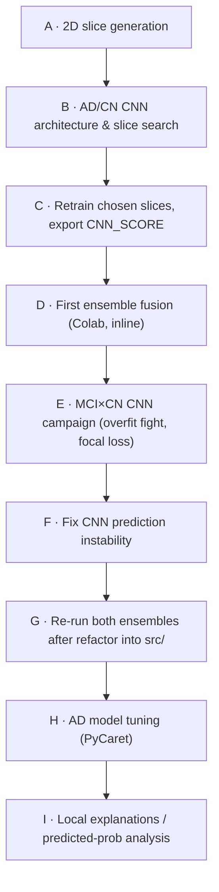

*Part of the [MMML-Alzheimer documentation](../README.md). How experiments were tracked in this repo — there is no experiment-tracking tool; the conventions ARE the tracking.*

# Experiment Management

**The single most important thing to know:** this repo has **no MLflow, no Weights & Biases, no sacred, no experiment-config system**. Experiment tracking is two naming conventions plus the notebooks themselves:

1. **Dated-notebook names** — every run lives in a notebook named `YYYYMMDD_<Action>_<Model/Task>_<Detail>.ipynb`. The date is the de-facto experiment id and primary sort key.
2. **Output-file names** — each run writes CSVs (`RESULTS_*.csv`, `PREDICTIONS_<ARCH>*.csv`) and `.pth` weights whose names re-encode the model/task/detail and a `%m%d%Y_%H%M` timestamp. The filename **is** the config record.

There is no other registry. **To understand what was run, read the notebook name and open its output CSV.** That pairing — notebook date + output filename — is the only provenance chain that pins an artifact to the run that produced it.

The intended unified orchestration layer (an `Experiment` class driven by a JSON config) was **planned but never built** (see [The unbuilt orchestration layer](#the-unbuilt-orchestration-layer)). What actually ran is a chronological series of dated notebooks.

> This page tells the *tracking* story. For a notebook-by-notebook tour see [notebooks-guide.md](notebooks-guide.md); to run a new experiment end-to-end see [running-experiments.md](running-experiments.md); for the training internals the notebooks invoke see [../modeling/training.md](../modeling/training.md).

---

## The naming convention = the tracking mechanism

Every run notebook under [notebooks/](../../notebooks/) follows:

```
YYYYMMDD_<Action>_<Model/Task>_<Detail>.ipynb
```

| Part | Meaning | Examples (verbatim) |
|---|---|---|
| `YYYYMMDD` | run date — the **primary sort key / "experiment id"** | `20211012`, `20211110`, `20220102` |
| `<Action>` | what the notebook *does* | `Generate_2D_MRI`, `Run_CNN_Experiments`, `Run_MCI_CNN_Experiments`, `Run_Analyse_CNN_Experiments`, `Run_CNN_VGG19_for_ensemble`, `Fix_CNN_changing_predictions`, `Ensemble_Results` |
| `<Model/Task>` | architecture or task scope | `VGG11_VGG13`, `VGG13_VGG19`, `Super_Shallow_CNN`, `MCI`, `AD`, `FocalLoss` |
| `<Detail>` | the specific slice/orientation/sub-experiment | `less_slices`, `All_Slices`, `First_Slices_Axial`, `Second_Half_Slices_Coronal`, `Stability`, `for_ensemble`, `model_tunning`, `prediction_proba_evaluation` |

The convention doubles as **provenance for output files**. Inside each notebook, runs write CSVs whose names re-encode the model/task/detail, for example:

- `RESULTS_MCI_VGG13_CORONAL1.csv`
- `SLICES_SEARCH_AD_CORONAL_VGG11.csv`
- `PREDICTIONS_VGG19_BN_DATA_AUG_LR_0001.csv`
- `TEST_MCI_SELECTED_STABILITY_VGG19_BATCH128_LR00005_ROTATION.csv`

Trained weights get a `datetime("%m%d%Y_%H%M")` suffix appended in [src/model_training/mri_train.py#L222](../../src/model_training/mri_train.py#L222) — a real committed example is `cnn_test11102021_022111102021_0223.pth`. So a notebook date plus an output filename together pin down which run produced an artifact.

### The de-facto provenance chain

```mermaid
flowchart LR
  NB["Dated notebook<br/>YYYYMMDD_Action_Task_Detail.ipynb"] -->|writes| RES["RESULTS_*.csv<br/>(metric rows)"]
  NB -->|writes| PRED["PREDICTIONS_&lt;ARCH&gt;*.csv<br/>(per-image CNN_SCORE)"]
  NB -->|writes (often skipped)| PTH[".pth weights<br/>+ %m%d%Y_%H%M suffix"]
  RES -->|read by| ANL["Analysis notebooks<br/>+ final_studies/"]
  PRED -->|read by| ENS["Ensemble notebooks<br/>(EBM/LR fusion)"]
  ENS -->|writes| ALL["PREDICTIONS_*_ALL_SCORES_ENSEMBLE.csv"]
  ALL -->|read by| FIG["final_studies/ → thesis figures"]
```

The chain is: **notebook → metric/prediction CSV → ensemble CSV → thesis figure**. Nothing in between records hyperparameters except the filenames and the notebook code cells. The CSV catalogue (producer → consumer) lives in [data-structure.md](../data/data-structure.md).

### Two path regimes mark a notebook's vintage

Where a notebook reads/writes from tells you which era it belongs to:

- **Colab / Google Drive** — `/content/gdrive/MyDrive/Lucas_Thimoteo/...` — used by **every `2021*` run notebook**. They `drive.mount('/content/gdrive')` and **paste training code inline** into the notebook.
- **Local Linux box** — `/home/lucas/projects/mmml-alzheimer-diagnosis/...` — used by the late ensemble notebooks (`20211227` onward) and **all** `final_studies/` notebooks. These `os.chdir()` into `src/<pkg>/` and **import from `src/`** — by then the code had been refactored out of the notebooks into modules.

The hardcoded-path situation (no central config, two incompatible roots) is detailed in [data-structure.md](../data/data-structure.md) and catalogued as a gotcha in [../reference/known-issues.md](../reference/known-issues.md).

### Inline-vs-imported drift (read old notebooks carefully)

The `2021*` training notebooks **redefine the training stack inline** (`run_mris_experiments`, `run_cnn_experiment`, `setup_experiment`, `return_sets`, `train`, `MRIDataset`) rather than importing it. So the loss / optimizer / early-stop logic **drifts notebook-to-notebook**: plain `BCEWithLogitsLoss` early on → class-weighted BCE → `WeightedFocalLoss`. The consolidated, "current" trainer is [src/model_training/mri_train.py](../../src/model_training/mri_train.py) — it is the inline code *after* the prediction-stability fix landed (phase F below). Treat each old notebook's inline code as the source of truth **for that run**, not the `src/` version.

---

## Where artifacts live

The `data/` and `models/` directories are **gitignored and ship empty** (only `models/.gitkeep`), so the layout below is reconstructed from the code's read/write calls. The one tracked output is `notebooks/final_studies/images/**` (the committed dissertation PNGs).

| Artifact kind | On-disk location | Naming |
|---|---|---|
| Per-run metric tables | `data/` (flat root) | `RESULTS_<ORIENT>_<ARCH>.csv`, `RESULTS_MCI_*.csv`, `TEST_MCI_*.csv`, `EXPERIMENTS_MCI_SELECTED_*.csv` |
| Per-image CNN scores | `data/` | `PREDICTIONS_<ARCH>*.csv` (adds a `CNN_SCORE` column) |
| Consolidated ensemble scores | `data/tabular/` | `PREDICTIONS_<TASK>_ALL_SCORES_ENSEMBLE.csv` |
| CNN weights | `models/` (Drive: `/content/gdrive/MyDrive/Lucas_Thimoteo/(mmml-alzheimer-diagnosis/)?models/`) | `<base> + datetime("%m%d%Y_%H%M") + ".pth"` |
| Thesis figures | `notebooks/final_studies/images/` (tracked) | per-chapter, see [notebooks-guide.md](notebooks-guide.md) |

Note: `.pth` saving is **intermittent**. Many phase-B/C notebooks have `torch.save` commented out; it was re-enabled (guarded by `model_path != ''`) only in the phase-F fix, and most sweeps pass `model_path=''`. **Most experiment artifacts are metric tables, not weights** — you generally cannot reload the exact model behind an old `RESULTS_*` row. EBM / PyCaret tabular models are **never persisted** ([src/model_training/cognitive_tests_train.py](../../src/model_training/cognitive_tests_train.py) has a `# TODO: save model` only). See [../modeling/training.md](../modeling/training.md) for the save/load mechanics and [../reference/known-issues.md](../reference/known-issues.md) for the saving gaps.

---

## The unbuilt orchestration layer

The author intended a single-command pipeline driver but never finished it. Knowing this saves you from hunting for an entry point that does not exist.

- **`src/run/` — four 0-byte files.** [src/run/data_preprocessing.py](../../src/run/data_preprocessing.py), [src/run/data_preparation.py](../../src/run/data_preparation.py), [src/run/experiment.py](../../src/run/experiment.py), [src/run/experiment_explanation.py](../../src/run/experiment_explanation.py) are all **empty**. There is no `src/run/__init__.py`. The names mirror the real implemented module directories — this was the planned orchestration package, created as placeholders and never filled in.
- **`src/experiment/run.py` — the only stub with code.** The `Experiment` class ([src/experiment/run.py#L1](../../src/experiment/run.py#L1)) has a ctor that stores `experiment_params`, `results`, `best_validation_results`, `best_train_results`, `test_results`, and a `run()` method that is just `pass`. The config-loading is only a `#TODO` comment.

  ```python
  #TODO:  File created to read a config and run an experiment

  class Experiment():
      def __init__(self, experiment_params=None):
          # if experiment_params is None: read json and load params
          self.experiment_params = experiment_params
          self.results = None
          self.best_validation_results = None
          self.best_train_results = None
          self.test_results = None

      def run(self):
          pass
  ```

- **`src/experiment/experiment_config.json` — empty skeleton, never read.** A 3-key dict mirroring the three pipelines, with all sub-dicts empty:

  ```json
  {
      "mri": {},
      "cognitive_tests": {},
      "ensemble": {}
  }
  ```

  `grep experiment_config` finds **no code anywhere that reads it**. It is dead config awaiting the `Experiment` class.

**The actual working entry points** live inside the feature directories as scripts with their own `argparse`/`__main__` blocks — [src/data_preprocessing/](../../src/data_preprocessing/), [src/data_preparation/](../../src/data_preparation/), [src/model_training/](../../src/model_training/) — driven manually from the notebooks. There is no central config constant; every script hardcodes its own paths (see [../reference/known-issues.md](../reference/known-issues.md)).

---

## The experiment timeline (phases)

The work proceeded in nine phases (A–I) over roughly three months. This is the chronological log; each row is one dated notebook.



| # | Date | Notebook | Phase | Task | Trains? |
|---|---|---|---|---|---|
| 1 | 2021-10-11 | `Generate_2D_MRI` | A. 2D generation | — | data gen |
| 2 | 2021-10-12 | `Run_CNN_Experiments` | B. AD/CN CNN | AD×CN | trains |
| 3 | 2021-10-14 | `Run_CNN_Experiments_Super_Shallow_CNN` | B | AD×CN | trains |
| 4 | 2021-10-16 | `Analyse_2D_Slices_experiments` | B (analyse) | AD×CN | analyse |
| 5 | 2021-10-17 | `Run_CNN_Experiments_VGG11_VGG13_less_slices` | B | AD×CN | trains |
| 6 | 2021-10-19 | `Run_Analyse_CNN_Experiments_VGG13_VGG19` | B | AD×CN | trains+analyse |
| 7 | 2021-10-27 | `Run_CNN_VGG19_for_ensemble` | C. AD scoring-for-ensemble | AD×CN | trains+scores |
| 8 | 2021-10-28 | `Ensemble_Results` | D. ensemble (AD, Colab) | AD×CN fusion | fits EBM/LR |
| 9 | 2021-10-30 | `Generate_More_2D_MRI` | A | — | data gen |
| 10 | 2021-10-30 | `Run_MCI_CNN_Experiments_All_Slices` | E. MCI CNN | MCI×CN | trains |
| 11 | 2021-10-31 | `Run_MCI_CNN_Experiments_First_Slices_Axial` | E | MCI×CN | trains+analyse |
| 12 | 2021-11-01 | `Run_MCI_CNN_Experiments_Second_Half_Slices_Coronal` | E | MCI×CN | trains+analyse |
| 13 | 2021-11-04 | `Run_CNN_VGG13_for_ensemble` | C | AD×CN | trains+scores |
| 14 | 2021-11-04 | `Run_MCI_CNN_Experiments_Stability` | E (overfit/curation) | MCI×CN | trains+curate |
| 15 | 2021-11-04 | `Ensemble_Results_MCI` | D. ensemble (MCI, Colab) | MCI×CN fusion | fits EBM/LR |
| 16 | 2021-11-07 | `Fix_CNN_changing_predictions` | F. bug-fix + MCI tuning | MCI×CN | trains (fix) |
| 17 | 2021-11-10 | `Run_MCI_CNN_FocalLoss` | E (focal loss) | MCI×CN | trains |
| 18 | 2021-12-27 | `Ensemble_Results_AD` | G. ensemble (AD, local refactor) | AD×CN fusion | fits EBM/LR |
| 19 | 2021-12-29 | `Ensemble_Results_MCI` | G. ensemble (MCI, local refactor) | MCI×CN fusion | fits EBM/LR |
| 20 | 2022-01-02 | `Ensemble_Results_AD_model_tunning` | H. AD model tuning | AD×CN fusion | fits EBM/LR + PyCaret |
| 21 | 2022-01-20 | `explanations_local_ensemble_prediction_proba_evaluation` | I. explanations | AD×CN | trains EBM + explains |

**The phase arc, in one paragraph:** generate 2D slices (**A**) → search CNN architectures and slices for AD/CN (**B**) → retrain the chosen slices and export `CNN_SCORE` for fusion (**C**) → first ensemble fusion in Colab with inline helpers (**D**) → the much harder MCI×CN CNN campaign with slice search, overfit fighting, and focal loss (**E**) → fix the CNN prediction-instability bug (**F**) → re-run both ensembles after refactoring code into `src/` (**G**) → AD model tuning with PyCaret (**H**) → local explanation and predicted-probability analysis (**I**). The `final_studies/` notebooks are the polished re-execution of phases B–I that generate the thesis figures.

A few facts worth carrying forward (full per-notebook detail is in [notebooks-guide.md](notebooks-guide.md)):

- **Common phase B/C training defaults** (verbatim): `lr=0.0001`, `batch_size=16`, `optimizer='adam'`, `max_epochs=100`, `early_stop=10`, `prediction_threshold=0.5`, loss `BCEWithLogitsLoss`, input reshaped to `(-1,1,100,100)`; rotation augmentation `np.arange(-15,16,2)`, `sampling_range=3`.
- **The phase-F fix** (notebook `20211107_Fix_CNN_changing_predictions`) is why old and new code diverge: it replaced a live `state_dict()` reference with `deepcopy(model.state_dict())`, forced `model.to(device); model.eval()` before prediction, and made the trainer reload the best weights via `load_state_dict(..., strict=True)` before scoring. This hardened into [src/model_training/mri_train.py](../../src/model_training/mri_train.py). Details in [../modeling/training.md](../modeling/training.md).
- **Final chosen slices** (declared in `final_studies/01`): AD×CN — coronal **43**, axial **23**, sagittal **26**; MCI×CN — coronal **70**, axial **8**, sagittal **50**. These are exactly the `CNN_SCORE_*` column suffixes used downstream.

### Naming traps when reading the log

These are real foot-traps; trust the **code columns**, not the markdown headers:

- **Slice-naming evolution.** Early MCI score columns were `CNN_SCORE_{AXIAL14,CORONAL95,SAGITTAL22}` (the 11-04 ensemble); the **final** MCI columns are `CNN_SCORE_{AXIAL_8,CORONAL_70,SAGITTAL_50}` (12-29); AD columns are `CNN_SCORE_{AXIAL_23,CORONAL_43,SAGITTAL_26}`. Several late notebooks have **stale markdown titles** (e.g. a header saying "Coronal70/Axial8/Sagittal50" over code that uses 43/26/23).
- **Duplicate sessions.** `20211027` ≈ `20211104` (`for_ensemble`, write the same six `PREDICTIONS_*` files); `20211031` ≈ `20211101` (MCI sweep, write the same `RESULTS_MCI_*` files). Two dated notebooks can be one logical sweep.
- **No `SLICES_SEARCH_*` writer in the dated notebooks.** `final_studies/01` reads `SLICES_SEARCH_*` CSV/XLSX, but the dated notebooks write `RESULTS_MCI_*` / `TEST_MCI_*` / `EXPERIMENTS_MCI_SELECTED_*`. The `SLICES_SEARCH_*` files were produced/renamed in a manual consolidation step outside the extracted notebook set (inferred).

These and the other crashes-on-modern-stack issues (e.g. DeLong's `check_auc_difference` uses `np.float`, removed in NumPy ≥1.24) are catalogued in [../reference/known-issues.md](../reference/known-issues.md).

---

## Practical guidance: how to read the log after 4 years

1. **Start from the notebook name.** The date orders the experiments; the `<Action>_<Model/Task>_<Detail>` tail tells you what it did. Sort [notebooks/](../../notebooks/) by filename and you have the timeline.
2. **Open the matching output CSV.** A `RESULTS_*` file holds the metric rows for that run; a `PREDICTIONS_<ARCH>*` file holds the per-image `CNN_SCORE`. The filename re-encodes architecture / orientation / slice / augmentation, so the file alone tells you most of the config.
3. **Read the notebook's inline code cells for the exact hyperparameters** — for `2021*` notebooks the loss/optimizer/early-stop live in the pasted cells, not in `src/`.
4. **Do not expect to reload most models.** `.pth` saving was mostly off; metric tables are the durable record.
5. **When code and markdown disagree, trust the code** (slice numbers, score-column names).
6. **For the polished, reproducible version of any result, go to `final_studies/`** — it imports from `src/` and produces the committed figures.

To actually re-run a phase end-to-end on a fresh machine, follow [running-experiments.md](running-experiments.md) (it covers the path-fixing and environment caveats first).

---

## See also

- [notebooks-guide.md](notebooks-guide.md) — the full notebook-by-notebook catalogue, groups, and order
- [running-experiments.md](running-experiments.md) — runbook to run a NEW experiment end-to-end
- [../modeling/training.md](../modeling/training.md) — the training loops and model-saving the notebooks invoke
- [../data/data-structure.md](../data/data-structure.md) — on-disk layout, CSV catalogue, and naming conventions
- [../reference/known-issues.md](../reference/known-issues.md) — stubs, bugs, stale headers, and environment gaps
- [../README.md](../README.md) — documentation hub
