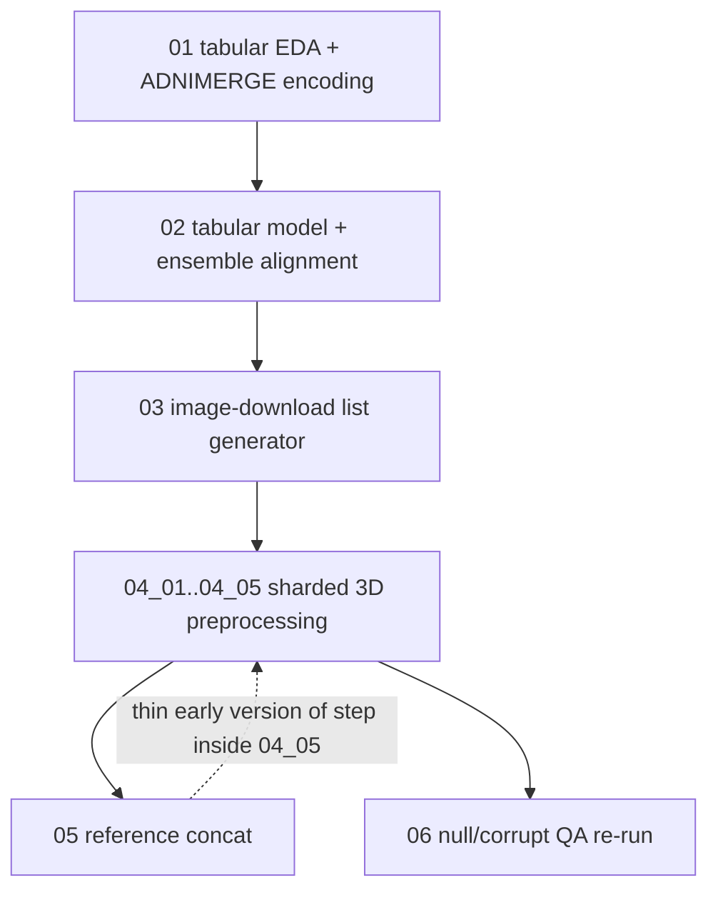

*Part of the [MMML-Alzheimer documentation](../README.md). The reading-order catalogue of all ~50 notebooks — the project's history, from MRI EDA through the thesis result chapters.*

# Notebooks Guide

This repository has **no MLflow / W&B / sacred / config registry**. The notebooks *are* the experiment log. Reading them in order is the fastest way to reconstruct how the project went from raw ADNI downloads to the fused, explainable ensemble in the dissertation. This guide catalogues every notebook, gives a 1-2 line purpose plus inputs/outputs, and states the intended execution order.

There are five groups, in roughly chronological order:

| Group | Folder | What it is | Order |
|---|---|---|---|
| A | [early_mri_exploration/](../../notebooks/early_mri_exploration) | MRI EDA + 3D-preprocessing R&D | `00`→`11` |
| B | [mri_preprocessing/](../../notebooks/mri_preprocessing) | Productionized tabular + MRI preprocessing pipeline | `01`→`06` |
| C | [notebooks/](../../notebooks) (dated) | The dated CNN/ensemble experiment runs | by date `2021-10-11`→`2022-01-20` |
| D | [final_studies/](../../notebooks/final_studies) | Polished re-execution → thesis figures | `00`→`05` |
| E | [notebooks/](../../notebooks) (`*.py`) | Loose scratch scripts | — (not a pipeline) |

> **None of the hardcoded paths in these notebooks exist in this checkout.** `data/` and `models/` are gitignored and empty. Every on-disk layout below is reconstructed from the read/write calls in the code. To actually re-run anything you must first re-download ADNI — see [data-acquisition.md](../data/data-acquisition.md) — and the reusable logic now lives in [../../src](../../src), so prefer the `src/`-based path over re-running the old notebooks. For how this naming-as-tracking scheme works, see [experiment-management.md](experiment-management.md); to run something new, see [running-experiments.md](running-experiments.md).

## Two path universes (how to date a notebook at a glance)

Recognizing which path prefix a notebook uses tells you immediately where and when it ran:

| Universe | Root prefix | Where it ran | Notebooks |
|---|---|---|---|
| Colab + Google Drive | `/content/gdrive/MyDrive/Lucas_Thimoteo/...` | Google Colab | all of group B; all `2021*` dated run notebooks |
| Local Linux box | `/home/lucasthim1/...`, `/home/lucas/...` | workstation | all of group A; the late ensemble notebooks (`20211227+`); all of group D; the loose `.py` scripts |

Colab notebooks open with the same boilerplate, then `os.chdir` into a `src/<package>/` dir and `from <module> import *`:

```python
from google.colab import drive
drive.mount('/content/gdrive', force_remount=True)
os.chdir('/content/gdrive/MyDrive/Lucas_Thimoteo/mmml-alzheimer-diagnosis')
```

They also commonly `!pip install antspyx deepbrain pycaret interpret` and a few use `%tensorflow_version 1.x` (deepbrain needs TF1). The **split that matters most**: every `2021*` dated training notebook *pastes the training stack inline* (so the loss/optimizer logic drifts notebook-to-notebook), whereas `20211227+` and all of group D `import from src/`. The consolidated current trainer is [mri_train.py](../../src/model_training/mri_train.py) — see [training.md](../modeling/training.md).

---

## A. early_mri_exploration/ — MRI R&D (00–11)

The chronological development of the **3D MRI preprocessing pipeline**: EDA → registration → skull-stripping → cropping → intensity standardization → full-pipeline test → validation → augmentation → reference table. The numeric prefix is the intended reading order, but these are *experiments*, not a chained pipeline — each re-defines the same helpers (`show_slices`, `show_brain_center_slice`, `plot_intensity`, `set_env_variables`). The reusable logic was later extracted into [../../src/data_preprocessing/mri_preprocessing.py](../../src/data_preprocessing/mri_preprocessing.py), [../../src/data_preparation/mri_preparation.py](../../src/data_preparation/mri_preparation.py), [../../src/utils/base_mri.py](../../src/utils/base_mri.py) and siblings; see [mri-preprocessing.md](../data/mri-preprocessing.md) for the productionized version.

Common imports: `nibabel`, `ants` (ANTsPy), `from deepbrain import Extractor`, plus local `src/utils` modules on `sys.path` (`base_mri`, `antspy_registration`, `crop_mri`, `standardize_mri`, `deepbrain_skull_strip`, `skull_stripping_ants.s3`).


### 00 — TADPOLE EDA
[00_initial_EDA_with_TADPOLE_Data.ipynb](../../notebooks/early_mri_exploration/00_initial_EDA_with_TADPOLE_Data.ipynb) (34 cells). Earliest EDA: loads the **TADPOLE Challenge** tables to understand ADNI columns, count diagnosis classes, and decide which participants have MRI vs PET (i.e. who to download).
- **Reads:** `tadpole_challenge/TADPOLE_D1_D2.csv` (sorted by `RID`); `tadpole_challenge/TADPOLE_D1_D2_Dict.csv` (keeps `["FLDNAME","TBLNAME","CRFNAME","TEXT","NOTES"]`). **Writes:** nothing — prints participant-ID lists for manual paste into the LONI/ADNI image downloader (lists sliced `[:1500]`/`[1500:]`).
- Establishes the `participant_info_cols` set (`['RID','PTID','VISCODE','SITE','D1','D2','COLPROT','ORIGPROT','EXAMDATE','DX_bl','DXCHANGE','AGE','PTGENDER','PTEDUCAT','PTETHCAT','PTRACCAT','PTMARRY']`), the MRI image-UID columns (`IMAGEUID_UCSFFSL_02_01_16_UCSFFSL51ALL_08_01_16`, `IMAGEUID_UCSFFSX_11_02_15_UCSFFSX51_08_01_16`) and PET columns (`LONIUID_BAIPETNMRC_09_12_16`, `EXAMDATE_UCBERKELEYAV45_10_17_16`).
- **Diagnosis grouping reused everywhere downstream:** `CN ← {CN, SMC}`, `MCI ← {LMCI, EMCI}`, `AD ← {AD}` (from `DX_bl`). See [data-semantics.md](../data/data-semantics.md).
- **Gotcha:** TADPOLE missing values are the **space string `' '`**, so null masks are `(df != ' ')`, not `isna()`.

### 01 — MRI baseline visits
[01_MRI_Baseline_visits.ipynb](../../notebooks/early_mri_exploration/01_MRI_Baseline_visits.ipynb) (30 cells). Analyze the MRI-description CSV exported from ADNI for baseline/screening visits; reduce to one image per patient.
- **Reads:** `data/MRI_Baseline_and_Screenin_2_17_2021.csv` (drops `Downloaded`, `Modality`) plus an MPRAGE description CSV. **Writes:** none. Patient count via `df['Subject'].unique()`.

### 02 — MP-RAGE metadata
[02_analysis_mri_metadata_ADNI.ipynb](../../notebooks/early_mri_exploration/02_analysis_mri_metadata_ADNI.ipynb) (28 cells). Inspect the MP-RAGE metadata table; filter to baseline/screening visits and separate 1.5T vs 3T scanners.
- **Reads:** `./data/MPRAGEMETA.csv`. **Writes:** none. Filters `Visit` against `adnis = ['ADNI Screening','ADNIGO Screening MRI','ADNI2 Screening-New Pt','ADNI Baseline']`.

### 03 — first skull-strip + registration (S3 / NiftyReg / ANTs)
[03_MRI_preprocessing.ipynb](../../notebooks/early_mri_exploration/03_MRI_preprocessing.ipynb) (40 cells). First attempt at a shell-based skull-stripping + registration pipeline; visually compares simple vs rigid-refined vs affine-refined strips on patients `002_S_4225`, `002_S_4171`, `941_S_5193`.
- **Reads:** raw ADNI `.nii`; `from utils.s3.s3 import *`. **Writes:** stripped/registered images to per-patient dirs (no aggregate CSV).
- Defines `set_env_variables()` (hardcodes `ANTSPATH=/home/lucasthim1/ants/ants_install/bin`, `NIFTYREG_INSTALL=/home/lucasthim1/niftyreg/niftyreg_install`), plus `apply_full_s3_skull_stripping` and `apply_skull_stripping(type ∈ {'rigid_refined','affine_refined','simple'})`. Conclusion: affine registration removes eye/nervous tissue better.

### 04 — registration types
[04_MRI_testing_registrarions.ipynb](../../notebooks/early_mri_exploration/04_MRI_testing_registrarions.ipynb) (37 cells) *(sic — "registrarions")*. Near-duplicate of 03, focused on comparing **rigid vs affine** registration and testing a registration atlas. Same helpers, same three patients. No CSV outputs.

### 05 — pivot to ANTsPy + DeepBrain
[05_MRI_testing_ANTsPy_registrations_and_skull_stripping.ipynb](../../notebooks/early_mri_exploration/05_MRI_testing_ANTsPy_registrations_and_skull_stripping.ipynb) (57 cells). Pivots from shell ANTs+NiftyReg to **ANTsPy** (Python ANTs). Benchmarks ANTsPy registration (SyN/Affine/Similarity) and ANTsPy+DeepBrain skull-stripping against the older `.sh`-based S3 method.
- **Reads:** patient `002_S_4270` raw `.nii`, a DeepBrain-masked `.nii.gz`, atlas `/home/lucasthim1/alzheimer_data/Atlas/atlas_t1.nii`. Imports `from skull_stripping_ants.s3 import *`, `import ants`, `from deepbrain import Extractor`.
- **Defines the orchestrators that became the src pipeline:** `execute_skull_stripping_process(input_path, output_path, skull_stripping_type ∈ {'ANTs','DeepBrain'})`, `list_available_images`, `apply_ants_skull_stripping_to_mri`, `apply_deep_brain_skull_stripping_to_mri`, `delete_useless_images`.

### 06 — cropping to 100³
[06_MRI_cropping.ipynb](../../notebooks/early_mri_exploration/06_MRI_cropping.ipynb) (15 cells). Test cropping an MRI to a centered **100×100×100** box (comparing to "Nigri's work") using ANTsPy vs NumPy after affine registration to the atlas.
- **Reads:** `002_S_4270` raw `.nii`, `atlas_t1.nii`. Technique: `ants.registration(type_of_transform='Affine', grad_step=0.1)` → `ants.apply_transforms`.

### 07 — intensity standardization
[07_MRI_Standardization.ipynb](../../notebooks/early_mri_exploration/07_MRI_Standardization.ipynb) (37 cells). Develop voxel-intensity standardization against the atlas: get atlas percentiles (0.02 / 99.8) → clip → scale (MinMax or mean-std).
- **Reads:** raw `.nii` (`153_S_4165`, `013_S_4595`), `atlas_t1.nii`. Defines `plot_intensity`, `get_percentiles(lower=0.02, upper=99.8)`, `get_mean_and_std`, `scale_image_linearly` — the seed of [standardize_mri.py](../../src/data_preprocessing/mri_standardize.py).

### 08 — full-pipeline test (chooses the `.npz` format)
[08_MRI_testing_pipeline.ipynb](../../notebooks/early_mri_exploration/08_MRI_testing_pipeline.ipynb) (38 cells). End-to-end test chaining normalization → registration → skull stripping → cropping → save on a single image, deciding the on-disk format.
- **Reads:** `002_S_4270` raw `.nii` + a saved `002_S_4270.npz` intermediate, atlas. **Writes:** `np.save('sample.npy', ...)` and `np.savez_compressed('sample.npz', ...)` — this establishes **`.npz` (compressed) as the chosen 3D-volume format**. Loads back via `np.load(path)['arr_0']` then `ants.from_numpy(...)`, confirming arrays live under the default key `'arr_0'`.

### 09 — skull-strip validation (Dice)
[09_MRI_testing_deepbrain_validation.ipynb](../../notebooks/early_mri_exploration/09_MRI_testing_deepbrain_validation.ipynb) (35 cells). Validate strip quality: compare DeepBrain and S3/FSL strips against **NFBS** ground-truth brain masks using the **Dice coefficient**.
- **Reads:** NFBS dataset (`sub-A00028185_ses-NFB3_T1w.nii.gz` + `_brainmask` + `_brain`), atlas. **Imports the now-modularized pipeline:** `base_mri` (`list_available_images, delete_useless_images, set_env_variables, load_mri, save_mri, create_file_name_from_path`), `deepbrain_skull_strip.deep_brain_skull_stripping`, `antspy_registration.register_image_with_atlas`, `crop_mri.crop_mri_at_center`, `standardize_mri.clip_and_normalize_mri`.
- Defines `calculate_dice_metric(segmented, ground_truth) = 2*sum(segmented[ground_truth==1]) / (sum(segmented)+sum(ground_truth))`.

### 10 — 2D augmentation + rotation-bug fix
[10_MRI_Data_Augmentation_tests.ipynb](../../notebooks/early_mri_exploration/10_MRI_Data_Augmentation_tests.ipynb) (48 cells). Develop 2D-slice augmentation and debug a rotation bug.
- **Reads:** preprocessed `.npz` volumes from `data/preprocessed/20210320/` via `load_mri(path, as_ants=...)`. **Writes:** via `save_mri(...)`; also imports `save_batch_mri`.
- **Augmentation ops (exactly 5):** `rot_90`, `rot_180`, `rot_270`, horizontal flip, vertical flip.
- **Axis ⇄ orientation convention (used everywhere downstream):** axis `0` = **sagittal**, axis `1` = **coronal**, axis `2` = **axial**.
- **Bug documented here:** "Converting from ANTsImage to Numpy leads to involuntary image rotation" — images came out upside-down; fixed and re-tested in the last section, plus a "Removing NaNs from Images" pass. See [known-issues.md](../reference/known-issues.md).

### 11 — build the image reference table
[11_MRI_creating_reference_for_images.ipynb](../../notebooks/early_mri_exploration/11_MRI_creating_reference_for_images.ipynb) (13 cells). Build the reference table mapping every (augmented) 2D image file to its label/metadata — the index for CNN training.
- **Reads:** `df_mprage = load_reference_table()`; lists `.nii.gz` under `data/mri/preprocessed/20210402`. **Writes:** `df_reference.to_csv(output_path + 'REFERENCE.csv', index=False)` into `data/mri/train`.
- **Defines the two CNN label columns:** `X = paths`, `y = GROUP` (3-class) or `MACRO_GROUP` (binary). Mostly-commented helpers rename files to embed labels (`_MCI`, `_AD`, `_CN`).

> The raw ADNI filename pattern this group works with: `ADNI_002_S_4225_MR_MT1__N3m_Br_20110928092836722_S122881_I258686.nii` → `ADNI_<PTID>_MR_<sequence>_Br_<timestamp>_<seriesID>_<imageID>.nii`, where `I258686` is the ADNI **Image Data ID** and `S122881` the **Series ID**. Sequences seen: `MT1__N3m`, `MT1__GradWarp__N3m`, `MPR__GradWarp__N3__Scaled`. See [data-structure.md](../data/data-structure.md).

---

## B. mri_preprocessing/ — the production pipeline (01–06)

The runnable **Colab pipeline** that produced the tabular + MRI datasets feeding model training. Unlike group A, these import the finished `src/` modules and call high-level orchestrators. Intended order = numeric prefix; step **04 is sharded into 5 near-identical notebooks** to beat Colab timeouts.



### 01 — tabular EDA + canonical ADNIMERGE encoding ★
[01_Data_Analysis_and_Preliminar_Classification.ipynb](../../notebooks/mri_preprocessing/01_Data_Analysis_and_Preliminar_Classification.ipynb) (78 cells). Tabular analysis and the **canonical ADNIMERGE preprocessing** (column selection, renaming, categorical encoding, diagnosis→int mapping). Also runs preliminary PyCaret/EBM experiments (CN-vs-MCI, AD-vs-MCI, CN-vs-AD, 3-class, plus a TADPOLE experiment).
- **Reads:** `./data/tabular/ADNIMERGE.csv` (+ `ADNIMERGE_DICT.csv`), `./data/tabular/COGNITIVE_DATA_PROCESSED.csv`. **Writes:** `./data/tabular/DERMO_NEURO_PSYCHOLOG_PROCESSED.csv` (index=False).
- **Initial cleanup:** drops baseline `*_bl` columns (`[x for x in cols if '_bl' in x and 'DX' not in x] + ['update_stamp']`); maps `DX 'Dementia'→'AD'`; collapses `DX_bl`: `LMCI→MCI`, `EMCI→MCI`, `SMC→CN`.
- **Column groups (the project's ADNI feature taxonomy):** `neuropsychological_cols = ['CDRSB','ADAS11','ADAS13','ADASQ4','MMSE','RAVLT_immediate','RAVLT_learning','RAVLT_forgetting','RAVLT_perc_forgetting','LDELTOTAL','DIGITSCOR','TRABSCOR','FAQ','MOCA','EcogPtMem',...,'EcogSPTotal']`; `demographics_cols = ['AGE','PTGENDER','PTEDUCAT','PTETHCAT','PTRACCAT','PTMARRY']`; `id_cols = ['RID','PTID','VISCODE','SITE','COLPROT','ORIGPROT','EXAMDATE','IMAGEUID','DX','DX_bl']`.
- **Column renames (raw ADNI → project names):**

  | ADNI raw | renamed to |
  |---|---|
  | `PTRACCAT` | `RACE` |
  | `PTMARRY` | `MARRIED` |
  | `PTEDUCAT` | `YEARS_EDUCATION` |
  | `PTGENDER` | `MALE` |
  | `PTETHCAT` | `HISPANIC` |
  | `DX` | `DIAGNOSIS` |
  | `DX_bl` | `DIAGNOSIS_BASELINE` |
  | `PTID` | `SUBJECT` |

- **Categorical encodings (critical for reading every downstream CSV):**
  - `RACE`: rare categories (`"More than one"`, `'Unkown'`, `'Unknown'`, `'Hawaiian/Other PI'`, `'Am Indian/Alaskan'`) → `'Other races'`; then one-hot `RACE_WHITE`, `RACE_BLACK`, `RACE_ASIAN` (`(RACE=='White').astype(int)` etc.; "Other races" is the implicit baseline, no flag).
  - `HISPANIC`: `'Not Hisp/Latino'→0`, `'Unknown'→0`, `'Hisp/Latino'→1`. `MALE`: `'Male'→1`, `'Female'→0`.
  - `MARRIED` one-hot family: `WIDOWED`, `DIVORCED`, `NEVER_MARRIED` derived first (`==.astype(int)`), then `MARRIED` overwritten to `(MARRIED=='Married').astype(int)`.
  - `DIAGNOSIS` integer mapping: **`AD→1`, `CN→0`, `MCI→2`** (so binary AD-vs-CN uses {0,1}; AD-vs-MCI/CN tasks remap `2→1` elsewhere).
  - `IMAGEUID`: `fillna(999999).astype(int)` — **`999999` is the sentinel for "no MRI image"**.
- Defines an inline `train_test_split_by_subject(df, test_size, labels, label_column)` that splits **at patient level** (`SUBJECT`) to avoid leakage, stratified by class. Libraries: pandas, seaborn, scipy.stats, `pycaret.classification`, `interpret.glassbox.ExplainableBoostingClassifier`. See [data-semantics.md](../data/data-semantics.md) for the full dictionary.

### 02 — tabular model + MRI↔tabular ensemble alignment ★
[02_Classification_Tabular_Data_SubjectKFold.ipynb](../../notebooks/mri_preprocessing/02_Classification_Tabular_Data_SubjectKFold.ipynb) (59 cells). Classify cognitive + demographic data with **subject-grouped stratified K-fold CV** via PyCaret, then perform the **MRI ↔ tabular alignment** that builds the ensemble dataset.
- **Reads:** `data/tabular/COGNITIVE_DATA_PROCESSED.csv`, `data/tabular/MRI_REFERENCE_PREDICTIONS_coronal_test_250.csv` (CNN predictions). **Writes:** none uncommented (the `REFERENCE.csv` write in "MRI Reference Alignment" is fully commented out).
- **`organized_cols` (the 25-col tabular feature set):** `['SUBJECT','DIAGNOSIS','DIAGNOSIS_BASELINE','AGE','MALE','YEARS_EDUCATION','HISPANIC','RACE_WHITE','RACE_BLACK','RACE_ASIAN','MARRIED','WIDOWED','DIVORCED','NEVER_MARRIED','CDRSB','ADAS11','ADAS13','ADASQ4','MMSE','RAVLT_immediate','RAVLT_learning','RAVLT_forgetting','RAVLT_perc_forgetting','TRABSCOR','FAQ','MOCA']`.
- **`run_tabular_data_experiment(...)`** PyCaret `setup()`: `categorical_features = ['MALE','HISPANIC','RACE_WHITE','RACE_BLACK','RACE_ASIAN','MARRIED','WIDOWED','DIVORCED','NEVER_MARRIED']`; `numeric_features = ['AGE','YEARS_EDUCATION','CDRSB','ADAS11','ADAS13','ADASQ4','MMSE','RAVLT_immediate','RAVLT_learning','RAVLT_forgetting','RAVLT_perc_forgetting','TRABSCOR','FAQ','MOCA']`; `transformation=True`, `remove_multicollinearity=False`, `session_id=1`; `selected_models = ['lr','svm','lightgbm','et', ExplainableBoostingClassifier()]`, sorted by `'AUC'`. Uses `train_test_split_by_subject(...test_size=0.2)` and `StratifiedSubjectKFold(...)` (from [stratified_fold_split.py](../../src/data_preparation/stratified_fold_split.py) and [train_test_split.py](../../src/data_preparation/train_test_split.py)).
- **MRI Reference Alignment (all commented out):** documents building `data/mri/processed/REFERENCE.csv` by concatenating `coronal_67K_REFERENCE.csv` + `coronal_25K_REFERENCE.csv`, dropping `['MODALITY','FORMAT','DOWNLOADED','SUBJECT_ID']`, and **marking bad images with a `SKIP_IMAGE` boolean** — a hardcoded `imgs_to_skip` list of ~15 corrupt augmented `.npz` files (e.g. `ADNI_041_S_5244_..._coronal_53_rot_180.npz`) plus a hardcoded `df_reference.loc[19250:22000,'SKIP_IMAGE']=True` range.
- **Ensemble Data Alignment (active):** filters MRI predictions to the **canonical slice** — `IMAGE_PATH` containing `'_coronal_50'` while **excluding** `flip` and `_rot_` (non-augmented coronal slice 50 only) — de-dups, renames `IMAGE_DATA_ID → IMAGEUID`, strips the `I` prefix to int64. Keeps CNN cols `['SUBJECT','IMAGE_DATA_ID','IMAGE_PATH','DL_PREDICT_PROBA_coronal','DL_PREDICTION_coronal','DATASET_TYPE']`. Merges `df_ensemble = pd.merge(df_adni_merge, df_mri_prediction_reference, on=['SUBJECT','IMAGEUID'], how='left')`. `DATASET_TYPE ∈ {'train','validation','test'}`; rows with no MRI (NaN, found via `query("DATASET_TYPE != DATASET_TYPE")`) are distributed by `.iloc[:4000] / [4000:5000] / [5000:]`. Trains an EBM → writes `COG_TEST_PREDICT_PROB`, then builds the 2-feature ensemble `['DIAGNOSIS','DL_PREDICT_PROBA_coronal','COG_TEST_PREDICT_PROB']` and trains a second EBM (`ebm2`) + a naive `MEAN_PROB = DL_proba * COG_proba` fusion (threshold `0.5`).
- **"Early Report" (Portuguese markdown)** lists the project's biggest obstacles: *"Divergência de informações"*, *"Imagens baixadas não foram 100% sincronizadas com os dados tabulares"*, *"Volume muito alto de dados"*, *"Dropout variável na modelagem"* — i.e. the raw MRI downloads were never perfectly matched to the tabular records. See [known-issues.md](../reference/known-issues.md).

### 03 — image-download list generator
[03_Tabular_and_MRI_Reference.ipynb](../../notebooks/mri_preprocessing/03_Tabular_and_MRI_Reference.ipynb) (4 cells). Tiny notebook that **chunks the IMAGEUIDs to download** from ADNI, filtered to subjects with valid imaging + diagnosis.
- **Reads:** `/content/gdrive/MyDrive/Lucas_Thimoteo/data/tabular/COGNITIVE_DATA_PREPROCESSED.csv` (note the **shorter Drive path**, missing the `mmml-alzheimer-diagnosis` segment — one of the "data not 100% synchronized" inconsistencies). **Writes:** none — prints `IMAGEUID` lists in `chunks=1000` for the ADNI downloader.
- **Filter:** `.dropna().query("IMAGEUID != 999999 and DIAGNOSIS in @classes")` with `classes=[1,0]` (AD vs CN).

### 04 — sharded 3D MRI preprocessing (01–05)
[04_MRI_Preprocessing_01.ipynb](../../notebooks/mri_preprocessing/04_MRI_Preprocessing_01.ipynb) · [_02](../../notebooks/mri_preprocessing/04_MRI_Preprocessing_02.ipynb) · [_03](../../notebooks/mri_preprocessing/04_MRI_Preprocessing_03.ipynb) · [_04](../../notebooks/mri_preprocessing/04_MRI_Preprocessing_04.ipynb) · [_05](../../notebooks/mri_preprocessing/04_MRI_Preprocessing_05.ipynb). Run the heavy 3D preprocessing (`execute_preprocessing`) over the raw ADNI `.nii`, sharded across 5 notebooks to run in parallel and survive Colab session limits. All five share the same boilerplate and call [mri_preprocessing.py](../../src/data_preprocessing/mri_preprocessing.py):

```python
os.chdir('.../src/data_preprocessing/'); from mri_preprocessing import *
execute_preprocessing(input_path=None,
                      output_path=output_path,             # data/mri/preprocessed/20210602/
                      images_to_process=images_to_reprocess,
                      skip_skull_stripping=True,            # ← stripping disabled in this run
                      mri_reference_path='.../reference/RAW_MRI_REFERENCE.csv',
                      box=100)                              # 100³ center crop
```

- **Reads:** raw `.nii` under `data/mri/raw/ADNI_01/` or `ADNI_02_02/` (shard-dependent), `RAW_MRI_REFERENCE.csv`. **Writes:** `.nii.gz` preprocessed 3D volumes into `data/mri/preprocessed/20210602/`.
- **Resume/idempotency** (shards 02/04/06): `images_to_reprocess = set(raw_names) - set(already_processed_names)`, so re-runs only process what's missing.
- **Per-shard differences (the only meaningful variation):**

  | Notebook | `input_path` | `images_to_process` slice |
  |---|---|---|
  | `04_..._01` | `data/mri/raw/ADNI_02_02/` | `images_to_reprocess` (full) |
  | `04_..._02` | `data/mri/raw/ADNI_01/` | `images_to_reprocess[30:]` |
  | `04_..._03` | `data/mri/raw/ADNI_02_02/` | `images_to_reprocess` |
  | `04_..._04` | `data/mri/raw/ADNI_01/` | `images_to_reprocess` |
  | `04_..._05` | `data/mri/raw/ADNI_01/` | `images_to_reprocess` |

- **`04_..._05` is the "lead" notebook** — it additionally runs the downstream steps the other shards omit:
  1. **Metadata concat:** `execute_mri_metadata_preprocessing(input, output, drop_cols=['IMAGE_PATH','FORMAT','TYPE','UNIQUE_IMAGE_ID','MODALITY','DOWNLOADED'])` where `input` = the 5 reference CSVs (`MPRAGE_REFERENCE.csv`, `REFERENCE_MRI_ENSEMBLE_CN_AD.csv`, `REFERENCE_MRI_ENSEMBLE_01/02/03.csv`) → `reference/RAW_MRI_REFERENCE.csv`.
  2. **Final 2D prep** (`from mri_preparation import *`):
     ```python
     execute_mri_data_preparation(mri_reference_path, ensemble_reference_path, output_path,
                                  orientation='coronal', orientation_slice=50,
                                  num_augmented_images=5, sampling_range=3,
                                  file_format='.nii.gz')
     ```
     → 2D `.npz` slices into `data/mri/processed/coronal_50_all_4000_images/`. **The magic numbers:** coronal axis, slice **50**, **5** augmented copies/image, sampling range **±3**.
  3. `generate_metadata_for_processed_images(output_path, mri_reference_path)` → the `REFERENCE.csv` index for that folder.
  4. Spot-checks final images; loads [mri_train.py](../../src/model_training/mri_train.py) for CNN eval.
- **Paths used by 05:** `ensemble_reference_path = '.../data/tabular/PREPROCESSED_ENSEMBLE_REFERENCE.csv'`; `mri_reference_path = '.../data/reference/PREPROCESSED_MRI_REFERENCE.csv'`; `output_path = '.../data/mri/processed/coronal_50_all_4000_images/'`.
- **Setup quirk:** `%tensorflow_version 1.x` + `!pip install deepbrain` in shards 01–04; **commented out in 05** (it runs `skip_skull_stripping=True`, so DeepBrain/TF1 aren't needed). See [data-preparation.md](../data/data-preparation.md).

### 05 — reference concat
[05_Align_Ensemble_Data .ipynb](../../notebooks/mri_preprocessing/05_Align_Ensemble_Data%20.ipynb) (12 cells) *(note the stray space in the filename)*. Concatenate the raw MRI reference CSVs into one `RAW_MRI_REFERENCE.csv` — a thin/early version of the metadata step that ended up inside `04_..._05`.
- **Imports:** `from src.data_extraction.mri_reference_concat import *`. **Reads/Writes:** `concatenate_reference_files(input=[MPRAGE_REFERENCE.csv, REFERENCE_MRI_ENSEMBLE_01.csv, REFERENCE_MRI_ENSEMBLE_02.csv], output=reference/RAW_MRI_REFERENCE.csv)`.
- **Status: mostly stub** — the last markdown header `# ensemble_preprocessing.py` is followed by an **empty code cell** (planned, not implemented). Mount boilerplate is commented out, so it was meant to run as an installed package (`pip install -e .`). See [known-issues.md](../reference/known-issues.md).

### 06 — null/corrupt-image QA
[06_MRI_null_checks.ipynb](../../notebooks/mri_preprocessing/06_MRI_null_checks.ipynb) (30 cells). QA pass to find raw images that **failed to preprocess** (so they can be re-run) and to hunt **all-null/zero 3D and 2D images** behind nb 02's `SKIP_IMAGE` logic.
- **Reads:** raw `ADNI_01/`, preprocessed `20210523/` and `20210602/`, `coronal_50_67K_images_20210523/REFERENCE.csv`. **Writes:** none new. Re-invokes `execute_preprocessing(... box=100)`, `execute_mri_metadata_preprocessing(...)`, and `execute_mri_data_preparation(orientation='coronal', orientation_slice=50, num_augmented_images=5, sampling_range=3)` — **identical args to `04_..._05`, i.e. a QA re-run/superset of step 04.**
- Re-run detection:
  ```python
  raw_image_names = [x.split('/')[-1] for x in images_to_process]
  processed_image_names = [x.split('/20210602/')[-1].split('.gz')[0] for x in processed_images]
  images_to_reprocess = [x for x in images_to_process if x.split('/')[-1] in set(raw)-set(processed)]
  ```
- Portuguese TODO comments lay out the plan: scan for fully-null volumes, mark `skip` in the references, apply skip in final prep. The author recalls a null image *"entre 19000 e 20000"* (matches `loc[19250:22000,'SKIP_IMAGE']` in nb 02).

### preprocess_utils.py — STUB / abandoned (16 lines)
[preprocess_utils.py](../../notebooks/mri_preprocessing/preprocess_utils.py). **Not a utility module** despite the name. Contains only imports and two hardcoded path variables — no functions, no classes — and a Jupyter magic (`%matplotlib inline`) that would raise `SyntaxError` if imported as a normal module. `output_path = ".../data/mri/preprocessed/20210523/"`, `input_path = ".../data/mri/raw/ADNI/"`. Dead scratch; the real functions live in [../../src/data_preprocessing](../../src/data_preprocessing) and [../../src/data_preparation](../../src/data_preparation). See [known-issues.md](../reference/known-issues.md).

---

## C. Dated experiment-run notebooks

The chronological CNN/ensemble experiment log. Every notebook is named `YYYYMMDD_<Action>_<Model/Task>_<Detail>.ipynb`, where the date is the **primary sort key / experiment id**, and output CSVs re-encode the model/task/detail (e.g. `RESULTS_MCI_VGG13_CORONAL1.csv`). Trained weights get a `datetime("%m%d%Y_%H%M")` suffix ([mri_train.py:222](../../src/model_training/mri_train.py#L222)). A notebook date + an output filename together pin down which run produced an artifact — there is no other registry. The naming-as-tracking scheme is detailed in [experiment-management.md](experiment-management.md).

Common phase-B/C training defaults (verbatim): `lr=0.0001`, `batch_size=16`, `optimizer='adam'`, `max_epochs=100`, `early_stop=10`, `prediction_threshold=0.5`, loss `BCEWithLogitsLoss`, input reshaped to `(-1,1,100,100)`; rotation angles `np.arange(-15,16,2)`, `sampling_range=3`. The CNN architectures (`NeuralNetwork`, `SuperShallowCNN`, the adapted VGG/ResNet builders) and `WeightedFocalLoss` are documented in [models.md](../modeling/models.md); the training loop in [training.md](../modeling/training.md); metrics & DeLong in [evaluation.md](../modeling/evaluation.md).

### Timeline + phase arc


| Date | Notebook | Purpose | Architecture / Task | Key outputs |
|---|---|---|---|---|
| 2021-10-11 | [Generate_2D_MRI](../../notebooks/20211011_Generate_2D_MRI.ipynb) | Slice 3D `.nii` → per-subject 2D `.npz` across all orientations; write per-orientation references then merge | data gen (—) | `mri/processed/storage/<ID>/<orient>_<NN>.npz`; `PROCESSED_MRI_REFERENCE_ALL_ORIENTATIONS_<now>.csv` |
| 2021-10-12 | [Run_CNN_Experiments](../../notebooks/20211012_Run_CNN_Experiments.ipynb) | First AD×CN runs on **coronal slice 50**; no-aug vs slice-sampling vs rotation | `shallow` (`NeuralNetwork`), `vgg11` / AD×CN | `.pth` weights (predictions CSV write commented) |
| 2021-10-14 | [Run_CNN_Experiments_Super_Shallow_CNN](../../notebooks/20211014_Run_CNN_Experiments_Super_Shallow_CNN.ipynb) | Systematic AD×CN slice search over 3 architectures ×3 | `shallow_cnn`, `super_shallow_cnn`, `vgg11` / AD×CN | `RESULTS_{CORONAL,AXIAL,SAGITTAL}_{SHALLOW_CNN,VGG11,SUPER_SHALLOW_CNN}.csv` + best `.pth` |
| 2021-10-16 | [Analyse_2D_Slices_experiments](../../notebooks/20211016_Analyse_2D_Slices_experiments.ipynb) | Analyse RESULTS_* (mean val/train AUC & F1, top-10, **Wilcoxon** between architectures) | analyse / AD×CN | none (sizes: train 1713 / val 357 / test 349) |
| 2021-10-17 | [Run_CNN_Experiments_VGG11_VGG13_less_slices](../../notebooks/20211017_Run_CNN_Experiments_VGG11_VGG13_less_slices.ipynb) | Train **full** VGGs over a reduced top-slice set, ×3 | `vgg11`, `vgg11_bn`, `vgg13_bn` / AD×CN | `RESULTS_VGG11.csv`, `RESULTS_VGG11_BN.csv`, `RESULTS_VGG13_BN.csv` (no `.pth`) |
| 2021-10-19 | [Run_Analyse_CNN_Experiments_VGG13_VGG19](../../notebooks/20211019_Run_Analyse_CNN_Experiments_VGG13_VGG19.ipynb) | Deeper VGGs + ResNets, **data-augmented** runs + Wilcoxon | `vgg13_bn`, `vgg19_bn`, `resnet50/101` / AD×CN | `RESULTS_VGG13_BN.csv`, `RESULTS_VGG19_BN_DATA_AUG.csv`, `RESNET50/101_DATA_AUG.csv` |
| 2021-10-27 | [Run_CNN_VGG19_for_ensemble](../../notebooks/20211027_Run_CNN_VGG19_for_ensemble.ipynb) | Train chosen slice/orientation; **export per-image `CNN_SCORE`** for fusion | `vgg13/19_bn`, `resnet34/101` / AD×CN | `PREDICTIONS_VGG13_BN.csv`, `PREDICTIONS_VGG19_BN[_DATA_AUG][_LR_0001].csv`, `PREDICTIONS_RESNET34/101*.csv` |
| 2021-10-28 | [Ensemble_Results](../../notebooks/20211028_Ensemble_Results.ipynb) | First **EBM+LR fusion** of CNN scores + cog + demographics (Colab, inline) | EBM/LR / AD×CN fusion | none (display only) |
| 2021-10-30 | [Generate_More_2D_MRI](../../notebooks/20211030_Generate_More_2D_MRI.ipynb) | Fill in slice ranges not done on 10-11; rebuild MCI ensemble refs (3 classes) | data gen (—) | `PREPROCESSED_ENSEMBLE_REFERENCE_ALL.csv`, `PROCESSED_ENSEMBLE_REFERENCE_ALL.csv` |
| 2021-10-30 | [Run_MCI_CNN_Experiments_All_Slices](../../notebooks/20211030_Run_MCI_CNN_Experiments_All_Slices.ipynb) | MCI×CN slice search across all orientations | `vgg13_bn`, `shallow_cnn` / MCI×CN | `RESULTS_MCI_VGG13_{SAGITTAL1/2,CORONAL1/12,CORONAL1_LR01}.csv`, `TEST_MCI_VGG13_*_MOMENTUM*.csv` |
| 2021-10-31 | [Run_MCI_CNN_Experiments_First_Slices_Axial](../../notebooks/20211031_Run_MCI_CNN_Experiments_First_Slices_Axial.ipynb) | Continue MCI×CN slice search + Wilcoxon | `vgg13_bn`, `shallow_cnn`, `resnet34` / MCI×CN | `RESULTS_MCI_VGG13_{...}.csv`, `RESULTS_MCI_SHALLOW_{...}.csv`, `RESULTS_MCI_RESNET34.csv` |
| 2021-11-01 | [Run_MCI_CNN_Experiments_Second_Half_Slices_Coronal](../../notebooks/20211101_Run_MCI_CNN_Experiments_Second_Half_Slices_Coronal.ipynb) | Near-duplicate of 10-31 (paired session of one sweep) | same as 10-31 / MCI×CN | same `RESULTS_MCI_*` files |
| 2021-11-04 | [Run_CNN_VGG13_for_ensemble](../../notebooks/20211104_Run_CNN_VGG13_for_ensemble.ipynb) | Near-identical **re-run** of 10-27 (refresh after instability) | same 6 runs / AD×CN | overwrites the same 6 `PREDICTIONS_*` |
| 2021-11-04 | [Run_MCI_CNN_Experiments_Stability](../../notebooks/20211104_Run_MCI_CNN_Experiments_Stability.ipynb) | Fight MCI overfit: prune to a curated "SELECTED" reference; many per-config trials | `shallow_cnn`, `vgg13/13_bn/19/19_bn`, `resnet50` / MCI×CN | `..._SELECTED_MRIS.csv` ref; `TEST_MCI_SELECTED.csv`; `EXPERIMENTS_MCI_SELECTED_*`; `TEST_MCI_SELECTED_STABILITY_<ARCH>_BATCH<N>_LR<...>*.csv` |
| 2021-11-04 | [Ensemble_Results_MCI](../../notebooks/20211104_Ensemble_Results_MCI.ipynb) | 5 feature-subset ensemble experiments for **MCI×CN** (Colab, inline) | EBM/LR / MCI×CN fusion | none (display only) |
| 2021-11-07 | [Fix_CNN_changing_predictions](../../notebooks/20211107_Fix_CNN_changing_predictions.ipynb) | Diagnose & fix CNN producing **different predictions across runs**; heavy MCI tuning | `vgg13/19_bn`, `shallow_cnn`, `resnet34/50` / MCI×CN | `TEST_MCI_SELECTED.csv`, `EXPERIMENTS_MCI_SELECTED_*`; `.pth` when `model_path != ''` |
| 2021-11-10 | [Run_MCI_CNN_FocalLoss](../../notebooks/20211110_Run_MCI_CNN_FocalLoss.ipynb) | Best MCI recipe on **coronal slice 95**; introduces **`WeightedFocalLoss`** + aug | `vgg19_bn`, `shallow_cnn`, `resnet34/50`, `vgg13/19` / MCI×CN | `TEST_MCI_SELECTED.csv`, `EXPERIMENTS_MCI_SELECTED_*` (`model_path=''` → no `.pth`) |
| 2021-12-27 | [Ensemble_Results_AD](../../notebooks/20211227_Ensemble_Results_AD.ipynb) | Full **local** AD×CN ensemble (imports `src/`): cog → COGTEST_SCORE → EBM+LR over richer feature sets → fairness checks | EBM/LR / AD×CN fusion | `PREPROCESSED/PROCESSED_ENSEMBLE_REFERENCE.csv`, `PREDICTIONS_AD_COG_TESTS.csv`, `PREDICTIONS_AD_ALL_SCORES_ENSEMBLE.csv` |
| 2021-12-29 | [Ensemble_Results_MCI](../../notebooks/20211229_Ensemble_Results_MCI.ipynb) | Refactored local MCI×CN ensemble (mirror of 12-27); **final MCI slices** | EBM/LR / MCI×CN fusion | `PREDICTIONS_MCI_COG_TESTS.csv`, `PREDICTIONS_MCI_ALL_SCORES_ENSEMBLE.csv` |
| 2022-01-02 | [Ensemble_Results_AD_model_tunning](../../notebooks/20220102_Ensemble_Results_AD_model_tunning.ipynb) | AD tuning: **PyCaret `compare_models`** on the 3-slice set; re-write all-scores | EBM/LR + PyCaret / AD×CN fusion | `PREDICTIONS_AD_ALL_SCORES_ENSEMBLE.csv` (overwritten) |
| 2022-01-20 | [explanations_local_ensemble_prediction_proba_evaluation](../../notebooks/20220120_explanations_local_ensemble_prediction_proba_evaluation.ipynb) | Train one EBM; pick optimal cutoff; **Mann-Whitney U** on TP vs FP proba; per-patient local EBM explanations | EBM / AD×CN | none (prints + figures) |

### Phase A — 2D slice generation

- **20211011_Generate_2D_MRI** — slices generated (verbatim): coronal `range(0,35)+range(66,100)`; axial `range(65,86)` and `range(15,36)`; sagittal `range(65,86)` and `range(15,36)`. Reads `reference/PREPROCESSED_MRI_REFERENCE.csv` + `tabular/PROCESSED_ENSEMBLE_REFERENCE.csv` (drops `CONFLICT_DIAGNOSIS==True`, joins `DATASET`). `src/`: `mri_batch_preparation`, `mri_augmentation`, `base_mri`, `utils`.
- **20211030_Generate_More_2D_MRI** — fills the *complementary* ranges: coronal `range(0,35)+range(66,100)`; axial `range(0,15)+range(36,65)+range(86,100)`; sagittal same as axial. MCI prep: `execute_ensemble_preprocessing(classes=[0,1,2])` then `execute_ensemble_preparation(test_size=0.25, validation_size=0.25, random_seed=42)`. Produces the `PROCESSED_MRI_REFERENCE_ALL_ORIENTATIONS_20211030_2026.csv` consumed by the MCI notebooks (inferred). `src/`: `mri_preparation`, `ensemble_preparation`, `ensemble_preprocessing`.

### Phase B — AD/CN CNN architecture & slice search

- **20211012** — `shallow` (`NeuralNetwork`: 4 conv blocks 8→16→32→64, `AdaptiveAvgPool2d(8,8)`, FC 512-512-1) and `vgg11` (`create_adapted_vgg11`, FC `7*7*512→2048→2048→1`). Aug variants `(num_samples,num_rotations)`: (3,0),(0,0),(0,3) for shallow; (3,0),(0,3) for vgg11. Input `PROCESSED_MRI_REFERENCE_ALL_ORIENTATIONS_20211012_0206.csv`.
- **20211014** — adds `super_shallow_cnn` (`SuperShallowCNN`: 5 conv blocks 8→16→32→64→128, `AdaptiveAvgPool2d(4,4)`, FC 128-64-1). Slices: coronal `range(45,56)`; axial `range(20,31)+range(70,81)`; sagittal same; `num_repeats=3`, no aug. Input `..._20211012_2041.csv`.
- **20211016** — analysis only. Model labels `vgg11_2048`, `4convs_1024fc` (shallow), `3convs_128fc` (super-shallow). Lower half re-pastes phase-B training cells (duplicate, likely not re-run). `scipy.stats.wilcoxon`.
- **20211017** — `adapt_vgg` changed to swap only conv0 (1ch) and `classifier[-1]→Linear(4096,1)` (keeps 4096-4096 FC). Reduced slices: sagittal `[23,24,25,26,27,28,29,30,72,73,74,75,76]`; axial `[20,21,22,23,28,29]`; coronal `[43,44,45,55,56,57]`. `torch.save` commented out (no `.pth`).
- **20211019** — `adapt_resnet`: `conv1→Conv2d(1,64,7,...)`, `fc→Linear(2048,1000)→ReLU→Dropout(0.5)→Linear(1000,1)`. VGG19_bn `num_rotations=3`; ResNet50/101 sagittal `[24,26,27,28]`, `num_rotations=3` (ResNet101 also `num_samples=3`), **`lr=0.00005`**. Finding: VGG13 slightly better (~94% CI) but the 21-sample comparison is underpowered → **no clear winner**.

### Phase C — retrain chosen slices, export `CNN_SCORE`

- **20211027** — trains on the **single chosen slice per orientation** (`coronal 43`, `sagittal 26`, `axial 23`) and exports per-image `CNN_SCORE` via `run_experiments_for_ensemble(..., compute_predictions=True)`. Runs (verbatim): `vgg13_bn` no-aug; `vgg19_bn` no-aug; `vgg19_bn num_rotations=3`; `resnet34 lr=0.001`; `resnet101 lr=0.01, early_stop=15, num_rotations=3`; `vgg19_bn lr=0.0001, early_stop=15, num_rotations=3`. Loss `BCEWithLogitsLoss` (unweighted). The header links two PyTorch forum threads about "loaded model returns different predictions" — the not-yet-fixed instability (fixed 11-07).
- **20211104_Run_CNN_VGG13_for_ensemble** — near-identical re-run of 10-27; overwrites the same 6 `PREDICTIONS_*` files. (inferred: a refresh prompted by the prediction-instability issue.)

### Phase D — first ensemble fusion (Colab, inline helpers)

All helpers (`compute_metrics_binary`, `show_feature_weights`, ROC/CI utils, `calculate_and_plot_roc`) are inline — no `src/` import.

- **20211028_Ensemble_Results (AD×CN)** — fits EBM+LR for: (1) 3 CNN slices + CogTestScore; (2) 3 CNN only; (3) 3 CNN + demographics. Reads `PREDICTIONS_VGG19_BN_DATA_AUG_LR_0001.csv`, `PREDICTIONS_COGNITIVE_TESTS.csv`, `COGNITIVE_DATA_PREPROCESSED.csv`. Findings: Demographics+CogTest AUC≈1.0; MRI AUC>0.9; MRI+demographics AUC>0.97; flags marital/race/hispanic encodings as possibly misleading; EBM gives better explanations.
- **20211104_Ensemble_Results_MCI (MCI×CN)** — same 5 experiments for MCI×CN; cog block uses `labels=[0,2]`, MCI(2)→1. **Early MCI slice columns** here: `CNN_SCORE_AXIAL14`, `CNN_SCORE_CORONAL95`, `CNN_SCORE_SAGITTAL22`. Experiments add (4) +Demographics+CDRSB(+MMSE) and (5) CDRSB alone. Findings: Demographics+CogTest AUC=0.95; MRI AUC>0.7; MRI+demographics no gain; MRI+demo+CDRSB AUC>0.9; **CDRSB alone AUC≈0.89**.

### Phase E — MCI×CN CNN campaign (the hard task)

MCI×CN overfits; the notebooks try deeper VGGs, ResNets, weighted BCE, augmentation, dataset curation, and finally focal loss. All use `classes=['MCI','CN']` (MCI→1, CN→0), `num_repeats=1`.

- **20211030_All_Slices** — `vgg13_bn` (`adapt_vgg` FC `7*7*512→4096→4096→1`) + `shallow_cnn`. Slices: vgg13_bn sagittal `range(0,50)`/`range(50,100)`, coronal `range(0,50)`/`range(0,30)@lr0.01`; shallow over coronal/axial/sagittal `range(0,100,2)`; some SGD runs `momentum=0.99, early_stop=35`. Loss `BCEWithLogitsLoss`.
- **20211031_First_Slices_Axial** — vgg13_bn, shallow_cnn, resnet34 + Wilcoxon. resnet34 all three `range(0,100)` at `lr=0.001`; SGD branch here has **no momentum**. Compares against the AD `RESULTS_*` CSVs.
- **20211101_Second_Half_Slices_Coronal** — near-duplicate of 10-31, same outputs (paired sessions of one sweep, inferred).
- **20211104_Stability** — "Tests to reduce Overfit". **"Stability" ≠ repeated identical runs** (`num_repeats=1`): it's per-config trials whose metrics are compared to find the least-overfitting recipe. **First use of class-weighted loss** `BCEWithLogitsLoss(pos_weight=neg_class/pos_class)`; adds configurable `early_stop_metric`. Grid (sample): `[('coronal',[95]),('sagittal',[22]),('axial',[14])]`; full sweeps `range(0,100,2)`; lr `0.001 … 0.0000005`; batch `16/32/64/128`; SGD `momentum 0.99`, some `weight_decay 0.1/0.01`, `nesterov`; `num_rotations 0/2/4`, `num_samples 0/2/3`. Curated output `reference/PROCESSED_MRI_REFERENCE_ALL_ORIENTATIONS_20211105_SELECTED_MRIS.csv`.
- **20211110_FocalLoss** — concentrates on **coronal slice 95** with `WeightedFocalLoss` (`FL = αₜ·(1−pₜ)^γ·BCE`, `α=pos/neg`, γ default 2; `loss_gamma` 2 and 5). Re-enables `torch.save` (deepcopy snapshot from the 11-07 fix) but `model_path=''` everywhere → no `.pth` written (inferred). **Best recorded**: shallow_cnn coronal 95, `num_rotations=4, lr=0.00001, batch=128, sgd, momentum=0.99` → val AUC 0.8198 / Acc 0.8212 / F1 0.6768 (epoch 135). Primary input `..._20211106_SELECTED_MRIS_RESHUFFLE.csv`. Focal loss is documented in [models.md](../modeling/models.md).

### Phase F — fixing CNN prediction instability

- **20211107_Fix_CNN_changing_predictions** — diagnoses & fixes a CNN producing **different predictions across runs on the same weights**, and does heavy MCI tuning. **The fix** (from "Modificações principais"):
  1. `best_model_params = model.state_dict()` kept a **live reference** that mutated as training continued → `from copy import deepcopy`, `best_model_params = deepcopy(model.state_dict())` (frozen snapshot).
  2. Eval not consistently in eval-mode/on-device → BatchNorm running-stats differed → `model.to(device); model.eval()` at the top of `compute_predictions_for_dataset`.
  3. `train()` now `return`s `best_model_params`, and `run_cnn_experiment` **reloads** them via `load_state_dict(best_model_params, strict=True)` before testing instead of scoring the live post-early-stop model; `torch.save(.pth)` re-enabled when `model_path != ''`. Validation cells confirm in-memory and reloaded-`.pth` predictions match.
  - This hardened into [mri_train.py](../../src/model_training/mri_train.py) (the deepcopy + reload-best + `strict=True` behaviour). See [training.md](../modeling/training.md) and [known-issues.md](../reference/known-issues.md).

### Phase G — ensemble re-run after refactor into `src/` (local)

From here the code is **imported from `src/`** and runs locally. The fusion stack is [ensemble_train.py](../../src/model_training/ensemble_train.py) + [ensemble_evaluation.py](../../src/model_evaluation/ensemble_evaluation.py) + [ensemble_explanation.py](../../src/model_explanation/ensemble_explanation.py).

- **20211227_Ensemble_Results_AD (AD×CN)** — slice columns `CNN_SCORE_CORONAL_43`, `CNN_SCORE_SAGITTAL_26`, `CNN_SCORE_AXIAL_23` (markdown titles saying "Coronal70/Axial8/Sagittal50" are **stale copy-paste** — trust the code). Experiments: cog-test EBM+LR; Exp0 each CNN alone (`CNNCoronal/Sagittal/Axial`); Exp1 3 CNN + CogScore (`CNN_3Slices_COG_SCORE`); Exp2 3 CNN only; Exp3 +Demographics (incl. fairness subgroups); Exp4 +Demographics+CDRSB; Exp5 CDRSB alone (`DummyModel(slice='CDRSB')`). Models `ExplainableBoostingClassifier()`, `LogisticRegression(max_iter 1000/5000)`. Writes `PREDICTIONS_AD_COG_TESTS.csv` (cols `COGTEST_SCORE_EBM/_LR/COGTEST_SCORE`) and `PREDICTIONS_AD_ALL_SCORES_ENSEMBLE.csv` (the `df_compare` table).
- **20211229_Ensemble_Results_MCI (MCI×CN)** — mirror of 12-27. **Final MCI slice columns: `CNN_SCORE_CORONAL_70`, `CNN_SCORE_SAGITTAL_50`, `CNN_SCORE_AXIAL_8`**. `classes=[0,2]`, MCI→1. Exp3 uses **WIDOWED**, not MARRIED. Writes `PREDICTIONS_MCI_COG_TESTS.csv`, `PREDICTIONS_MCI_ALL_SCORES_ENSEMBLE.csv`.

### Phase H — AD model tuning

- **20220102_Ensemble_Results_AD_model_tunning** — tuning follow-up to 12-27 adding a PyCaret `compare_models` shop-around: `setup(... transformation=True, transformation_method='quantile', session_id=1, experiment_name='3slices_cnn', silent=True)`; `top5 = compare_models(sort='AUC', n_select=5, turbo=True, cross_validation=False)`. A commented LR grid (`C`, `penalty`, `solver`, `class_weight`) is defined but not run; the **Exp2 EBM/LR `.fit` is commented out** → that experiment is partly inert/WIP. Overwrites `PREDICTIONS_AD_ALL_SCORES_ENSEMBLE.csv`.

### Phase I — local explanation / predicted-probability evaluation

- **20220120_explanations_local_ensemble_prediction_proba_evaluation** — AD×CN. Slice columns renamed to `AXIAL_23`, `CORONAL_43`, `SAGITTAL_26`. Trains a single `ExplainableBoostingClassifier()` via `train_ensemble_models(df_train, label, [ebm])` on 3 CNN slices + demographics `['AGE','MALE','YEARS_EDUCATION','HISPANIC','RACE_WHITE','RACE_BLACK','RACE_ASIAN','WIDOWED']`. "prediction_proba_evaluation": `from scipy.stats import mannwhitneyu` splits TP/FP/TN/FN by `DIAGNOSIS` vs `FINAL_PREDICTION` and runs `mannwhitneyu(true_positives['FINAL_PREDICTED_SCORE'], false_positives[...])`, reporting whether the proba distributions differ (p<0.05). Cutoff = test-set `Optimal_Thresh`; metrics at both 0.5 and optimal. Local explanation rendered for a single sample (e.g. `'I275486'`) annotated with demographics + slice scores. See [explainability.md](../modeling/explainability.md).

---

## D. final_studies/ — the thesis results chapters

These notebooks are the polished, local (`/home/lucas/...`) re-execution that produces **every committed dissertation figure**. They `os.chdir` into `src/` and import `ensemble_train.prepare_mri_predictions`, `ensemble_evaluation.{calculate_rocs_on_datasets, calculate_metrics_on_datasets}`, `base_evaluation.*`, `ensemble_explanation.*`. Both tasks (AD×CN and MCI×CN) are covered side-by-side in each. The headline result is always the **Test** slice of `calculate_metrics_on_datasets`, with the operating threshold chosen on Validation (`set_threshold_for_test`). Read these in numeric order; they are the cleanest entry point to the project's final results.

| Notebook | Thesis chapter role | What it computes | Reads | Writes |
|---|---|---|---|---|
| [00_3d_brain_mri_scans](../../notebooks/final_studies/00_3d_brain_mri_scans.ipynb) | Methods — MRI illustration | ANTs/itkwidgets views of one 3D volume (`load_mri`, `ants.plot` sagittal/coronal/axial mosaics) | one `.nii.gz` volume | figures only |
| [00_results_preprocessed_data_assessment](../../notebooks/final_studies/00_results_preprocessed_data_assessment.ipynb) | Results — dataset/cohort tables | class distribution (Train/Val/Test) for MRI, cog-tests, ensemble sets; cognitive `describe()`; demographic (MALE/WIDOWED/RACE/HISPANIC) distributions; fairness subgroup counts | `PREDICTIONS_{AD,MCI}_VGG19_BN.csv`, `PREDICTIONS_{AD,MCI}_COG_TESTS.csv`, `PREDICTIONS_{AD,MCI}_ALL_SCORES_ENSEMBLE.csv` | tables only |
| [01_results_mri_slice_choice](../../notebooks/final_studies/01_results_mri_slice_choice.ipynb) | Results — slice selection | pre/post-preprocessing slice views; slice-search val-AUC vs slice-index curves (`pointplot`); declares chosen slices | `SLICES_SEARCH_AD_{CORONAL,AXIAL,SAGITTAL}_VGG11.csv`, `SLICES_SEARCH_AD_VGG11_MORE_*`, `SLICES_SEARCH_AD_VGG13_BN_MORE_*`, `SLICES_SEARCH_MCI_FOCAL_LOSS_VGG11_BN_{CORONAL,AXIAL,SAGITTAL}.xlsx` | figures only |
| [02_results_separate_learning_results](../../notebooks/final_studies/02_results_separate_learning_results.ipynb) | Results — single-modality | per-modality ROC/metrics/confusion for the 3 CNN slices and the 2 cog-test models, AD & MCI; `check_auc_difference` (DeLong) | `PREDICTIONS_{AD,MCI}_VGG19_BN.csv`, `PREDICTIONS_{AD,MCI}_COG_TESTS.csv` | figures/tables only |
| [03_results_ensemble_learning_results](../../notebooks/final_studies/03_results_ensemble_learning_results.ipynb) | Results — fusion | ROC/metrics/DeLong for every ensemble variant + best-of comparison bar charts (AUC, F1) | `PREDICTIONS_{AD,MCI}_ALL_SCORES_ENSEMBLE.csv` | figures/tables only |
| [04_explanations_global](../../notebooks/final_studies/04_explanations_global.ipynb) | Explainability — global | LR coefficients vs EBM `feature_importances_` bar charts (`plot_global_explanations`) for cog-test models and all 4 ensemble variants, AD & MCI | `COGNITIVE_DATA_PREPROCESSED.csv`, `PROCESSED_ENSEMBLE_REFERENCE.csv`, `PREDICTIONS_{AD,MCI}_VGG19_BN.csv`, `PREDICTIONS_{AD,MCI}_COG_TESTS.csv` | figures only |
| [05_explanations_local_ensemble](../../notebooks/final_studies/05_explanations_local_ensemble.ipynb) | Explainability — local | per-patient EBM `explain_local` bar charts for TP/FP/TN/FN + "patient diagnosis" figures; Mann-Whitney U on TP-vs-FP scores; the race-bias discussion | `PREDICTIONS_{AD,MCI}_VGG19_BN.csv`, `PREDICTIONS_{AD,MCI}_COG_TESTS.csv`, `COGNITIVE_DATA_PREPROCESSED.csv` | figures only |

**Chosen slices (final, from `01`):** AD×CN — coronal **43**, axial **23**, sagittal **26**; MCI×CN — coronal **70**, axial **8**, sagittal **50**. These are exactly the `CNN_SCORE_*` column suffixes used in `02`/`03` and the `AXIAL_*/CORONAL_*/SAGITTAL_*` labels in `04`/`05`.

**Ensemble variants compared in `02`/`03` (verbatim score-column names):** single slices `CNN_SCORE_{AXIAL,CORONAL,SAGITTAL}_<n>`; cog models `COGTEST_SCORE_{EBM,LR}` / merged `COGTEST_SCORE`; fusion `CNN_3SLICES`, `CNN_3SLICES_COG_SCORE`, `CNN_3SLICES_DEMOGRAPHICS`, `CNN_3SLICES_DEMOGRAPHICS_CDRSB`, `CDRSB` — each with `_EBM` and `_LR` variants. See [evaluation.md](../modeling/evaluation.md) and [explainability.md](../modeling/explainability.md).

> **Two re-run hazards:** `01` reads `SLICES_SEARCH_*` CSV/XLSX, but the dated notebooks write `RESULTS_MCI_*` / `TEST_MCI_*` / `EXPERIMENTS_MCI_SELECTED_*` — the `SLICES_SEARCH_*` files were produced/renamed in a manual consolidation step outside the extracted set (inferred). And every `check_auc_difference` (DeLong) call in `02`/`03` **crashes on modern NumPy** (`np.float` removed ≥1.24). Both are catalogued in [known-issues.md](../reference/known-issues.md).

### final_studies/images/ inventory

All PNGs are committed (`data/`/`models/` are gitignored, but [images/](../../notebooks/final_studies/images) is tracked). Five subfolders mirror the chapter structure.

| Subfolder | Files | Produced by | Contents |
|---|---|---|---|
| [results/](../../notebooks/final_studies/images/results) | 24 | `01`/`02`/`03` | Slice search (`results_slice_search_ad_cn_{first,second}.png`, `results_slice_search_mci_cn.png`, `results_2d_mri_example.png`); single-modality test ROC (`results_{cnns_mri,cog_tests}_{ad,mci}_ROC_test.png`); per-ensemble test ROC (`results_ensemble_3slicescnns[_cogscore|_demographics|_demographics_cdrsb]_{ad,mci}_ROC_test.png`); best-of comparison (`results_all_experiments_{ad,mci}_{AUC,F1,ROC}_test.png`) |
| [appendix/](../../notebooks/final_studies/images/appendix) | 8 | `02` | Train/Validation ROC deferred to appendix: `appendix_{cnns_mri,cog_tests}_{ad,mci}_ROC_{train,validation}.png` |
| [explanations/](../../notebooks/final_studies/images/explanations) | 11 | `04` (+ 1 local summary) | Global cog-test (`explanations_global_cog_tests_{ad,mci}.png`); global ensembles (`explanations_global_ensemble_3slicescnns[_cogscore|_demographics|_demographics_cdrsb]_{ad,mci}.png`); `explanations_local_several_deeplift_ad.png` (CNN DeepLift montage) |
| [explanations-mri/](../../notebooks/final_studies/images/explanations-mri) | 31 | `MRIExplainer`/`MRIDiagnosisExplainer` ([mri_explanation.py](../../src/model_explanation/mri_explanation.py)) | Config panels (`explanations_{deeplift,guidedgradcam}_configurations.png`); per-orientation attributions `explanations_local_{sagittal,coronal,axial}_<case>_<task>.png` (`<case>`∈{ad1,ad2,cn1,cn2,mci1,mci2}, `<task>`∈{ad,mci}); combined-orientation `patient_diagnosis_deeplift_{ad1,cn1,mci1}.png`. **No `final_studies/06` extract exists** for these — the MRI-XAI notebook is not in the manifest (inferred: a separate/interactive notebook) |
| [explanations-ensemble/](../../notebooks/final_studies/images/explanations-ensemble) | 20 | `EnsembleExplainer.explain` ([ensemble_explanation.py](../../src/model_explanation/ensemble_explanation.py)), via `05` | TP/FP local EBM (`explanations_local_ensemble_{true,false}_{ad1,ad2,cn1,cn2,mci1,mci2}[_mci].png`); "patient diagnosis" (`patient_diagnosis_ensemble_{ad1,cn1,mci1}[_mci].png`, `show_true_diagnosis=False`) |

See [explainability.md](../modeling/explainability.md) for what `MRIExplainer` and `EnsembleExplainer` actually compute (Captum DeepLift / Guided Grad-CAM, EBM `explain_local`).

---

## E. Loose scratch scripts (notebooks/*.py)

VS Code "interactive `# %%`" cell scripts on the local workstation. Scratch/playground code, **not part of any pipeline** — but useful for understanding intent.

### playground.py (66 lines)
[playground.py](../../notebooks/playground.py). Scratch evaluation of MCI CNN predictions: find the optimal ROC threshold and compute metrics on train/val/test.
- **Imports:** `ensemble_train.DummyModel`, `base_evaluation.find_optimal_cutoff`, `ensemble_evaluation.{calculate_metrics_on_datasets, calculate_rocs_on_datasets}`. **Reads:** `./data/PREDICTIONS_MCI_VGG19_BN_1125.csv`. Key cols: `ORIENTATION` (`'coronal'`), `DATASET` (`train/validation/test`), label `MACRO_GROUP`, score `CNN_SCORE`. Defines `find_optimal_threshold(predict_proba, label)` using `roc_curve(..., drop_intermediate=False)` + `find_optimal_cutoff` (point closest to top-left corner).

### playground_ensemble_results_ad.py (326 lines) — fullest ensemble scratch
[playground_ensemble_results_ad.py](../../notebooks/playground_ensemble_results_ad.py). The working draft behind `20211227`/`20220102`/`final_studies/03` — reproduces the AD ensemble experiments end-to-end (cognitive EBM → MRI CNN scores → fused ensemble → comparison of 8 model variants).
- **Imports from `src`:** `ensemble_train.*` (`prepare_mri_predictions`, `prepare_ensemble_experiment_set`, `get_experiment_sets`, `train_ensemble_models`, `DummyModel`, `CNNCoronal/Sagittal/Axial`); `ensemble_explanation.show_feature_weights`; `ensemble_evaluation.*`.
- **Reads:** `data/COGNITIVE_DATA_PREPROCESSED.csv`, `data/PROCESSED_ENSEMBLE_REFERENCE.csv` (for `IMAGE_DATA_ID`, `DATASET`), `data/PREDICTIONS_AD_VGG19_BN_202111252.csv` (MRI scores), `data/PREDICTIONS_AD_COG_TESTS_1125.csv`. **Writes:** `data/PREDICTIONS_ALL_SCORES_ENSEMBLE_AD_20211128.csv` (commented MCI variant `..._MCI_20211127.csv`).
- **Join semantics established here:** cognitive `IMAGEUID` is renamed to `IMAGE_DATA_ID` and prefixed (`'I' + IMAGEUID.astype(str)`) to match the MRI image-id convention; for AD-vs-MCI, **`DIAGNOSIS` value `2` (MCI) is remapped to `1`** when `max(labels)==2`. MRI feature cols `CNN_SCORE_{CORONAL_43,SAGITTAL_26,AXIAL_23}` (+ fused `COGTEST_SCORE`). Demographic cols `['AGE','MALE','YEARS_EDUCATION','HISPANIC','RACE_WHITE','RACE_BLACK','RACE_ASIAN','WIDOWED']` (+ `'CDRSB'` in exp 4/5). **8 experiments**: each CNN slice alone (Coronal/Axial/Sagittal), CNN-3-slices, +CogScore, +Demographics, +Demographics+CDRSB, CDRSB-alone (EBM + LR each).
- **Status: working but messy** — the last cell references `f1_scores`/`thresholds` that are local to the function above it → `NameError` if run standalone. See [known-issues.md](../reference/known-issues.md).

### ebm_feature_importance.py (13 lines) — STUB / non-runnable
[ebm_feature_importance.py](../../notebooks/ebm_feature_importance.py). Snippets of the EBM (`ExplainableBoostingClassifier`) introspection API with `ebm = None` at the top, so every line below would `AttributeError`. Documents the attributes the author cared about: `additive_terms_`, `bagged_models_`, `feature_importances_`, `feature_names`, `feature_groups_`, `intercept_`, `predict_and_contrib(...)`, `explain_local(X, y)`. Pure reference scratch, never executed. See [known-issues.md](../reference/known-issues.md).

---

## Stubbed / dead / broken inventory

A quick map of what *not* to trust as runnable, all catalogued in detail in [known-issues.md](../reference/known-issues.md):

| File | Status |
|---|---|
| [preprocess_utils.py](../../notebooks/mri_preprocessing/preprocess_utils.py) | Stub — imports + 2 paths only; has `%matplotlib inline`, not importable |
| [ebm_feature_importance.py](../../notebooks/ebm_feature_importance.py) | Stub — `ebm = None`, every line errors; API reference only |
| [05_Align_Ensemble_Data .ipynb](../../notebooks/mri_preprocessing/05_Align_Ensemble_Data%20.ipynb) | Mostly stub — empty final cell under `# ensemble_preprocessing.py`; filename has a stray space |
| [playground_ensemble_results_ad.py](../../notebooks/playground_ensemble_results_ad.py) | Working but has a `NameError` in the last cell |
| `02_..._SubjectKFold.ipynb` "MRI Reference Alignment" section | Entirely commented out |
| `04_..._01/02/03/04` | Redundant parallel shards of `04_..._05` (only `_05` has the full downstream steps) |
| [06_MRI_null_checks.ipynb](../../notebooks/mri_preprocessing/06_MRI_null_checks.ipynb) | Overlaps heavily with `04_..._05`; mainly a QA re-run |
| `check_auc_difference` (DeLong) in `final_studies/02`,`03` | Crashes on NumPy ≥1.24 (`np.float` removed) |

---

## See also

- [experiment-management.md](experiment-management.md) — how the dated-notebook naming convention *is* the experiment-tracking system.
- [running-experiments.md](running-experiments.md) — runbook to run a new experiment end-to-end with the `src/` modules.
- [mri-preprocessing.md](../data/mri-preprocessing.md) — the productionized 3D pipeline that group A prototyped.
- [data-preparation.md](../data/data-preparation.md) — 3D→2D slicing, augmentation, CV folds, ensemble prep (group B step 04).
- [training.md](../modeling/training.md) — the consolidated trainer ([mri_train.py](../../src/model_training/mri_train.py)) that absorbed the inline drift.
- [explainability.md](../modeling/explainability.md) — what the global/local XAI in `final_studies/04`,`05` computes.
- [known-issues.md](../reference/known-issues.md) — every stub, bug and gotcha flagged above, in detail.
