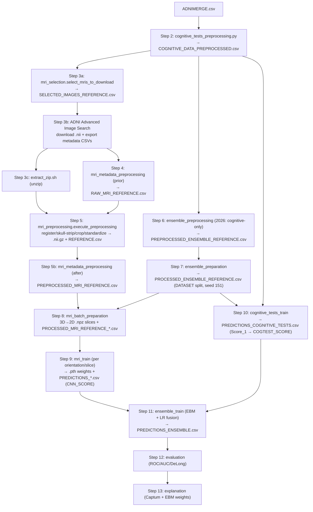

*Part of the [MMML-Alzheimer documentation](../README.md). The actionable, ordered runbook to reproduce or run a new experiment end-to-end, from ADNI re-download through evaluation and explanation.*

# Running Experiments (End-to-End Runbook)

This is the start-to-finish runbook for re-running the pipeline after a long break, or for launching a new experiment. It assumes you are (re)acquiring ADNI data per [data-acquisition.md](../data/data-acquisition.md) — do that first; this doc picks up from "I have an approved LONI/ADNI account and an empty `data/` tree" and walks every processing, training, and evaluation step in order.

Two things to internalize before you touch anything:

1. **There is no one-command runner.** [experiment_config.json](../../src/experiment/experiment_config.json) is an empty 3-key skeleton, [run.py](../../src/experiment/run.py)'s `Experiment.run()` is `pass`, and all four files under [src/run/](../../src/run/) are 0 bytes. You drive each step by importing a function or editing a module's `__main__` block. See [experiment-management.md](experiment-management.md) for how the project tracks runs (it doesn't — it's filename conventions + CSV dumps).
2. **Nothing under `data/` or `models/` is committed** — both are gitignored ([.gitignore:133-137](../../.gitignore)). Every input must be re-obtained from ADNI/LONI, and every intermediate must be regenerated by running the steps below.

Read the [must-fix gotchas](#must-fix-before-you-run-anything) section before your first run — several steps crash on a fresh modern environment unless patched. All gotchas are catalogued in detail in [known-issues.md](../reference/known-issues.md).

## Run order at a glance



The dotted truth: steps 4, 5b, 7, 11 are driven by importing functions or editing notebook cells; steps 2, 3a, 5, and 6 have working CLIs (3a `mri_selection` and 5 `mri_preprocessing` were fixed in 2026). See [the gotchas table](#must-fix-before-you-run-anything) for which ones still crash if invoked as `__main__`.

---

## Generate the training data (Steps 1–8)

**If all you want is training-ready data, this section is the whole job.** Steps 1–8 turn raw
ADNI into the tables and slice files the models consume; Steps 9–13 (further below) are model
training, evaluation, and explanation — a separate phase you only reach *after* this.

The work runs on **two parallel tracks** that rejoin at Step 6:

- **Tabular track:** Step 2 (cognitive preprocessing).
- **Imaging track:** Steps 3a → 3b → 3c → 5 → 5b (select, download, unzip, 3D-preprocess, concat metadata).
- **They rejoin** at Step 6–7 (build + split the ensemble reference) and Step 8 (2D slices).

**The milestone to aim for is Step 7** — the `DATASET` (train/validation/test) split it writes is
what "the training data is now defined" actually means; every downstream model shares it.

### Ordered commands (run from the repo root)

Each line links to its full step below (inputs, outputs, gotchas). Paths use the repo-relative
`data/` layout.

```bash
# 1. Rebuild ADNIMERGE.csv from the ADNIMERGE2 R package  (both tracks)
python3 scripts/rebuild_adnimerge_from_adnimerge2.py \
    --pkg data/ADNIMERGE2 --out data/tabular/ADNIMERGE.csv \
    --imageuid-map data/reference/IMAGEUID_FROM_UCSF.csv --selfcheck

# 2. Cognitive / tabular preprocessing  (tabular track)
python src/data_preprocessing/cognitive_tests_preprocessing.py \
    -i data/tabular/ -o data/tabular/

# 3a. MRI selection — build the download list  (imaging track)
python src/data_preprocessing/mri_selection.py -cl 0 1

# 3b–3c. MANUAL: download NIfTI + export metadata CSVs from ADNI, then unzip.
#         (ADNI Advanced Image Search; see Step 3b / data-acquisition.md)
bash src/utils/extract_zip.sh          # fix its hardcoded path first

# 4. MRI metadata (raw side) — import & call (CLI is broken)
python -c "import sys; sys.path.insert(0,'src/data_preprocessing'); \
    from mri_metadata_preprocessing import execute_mri_metadata_preprocessing_prior_to_image_preprocessing as f; f()"

# 5. MRI 3D preprocessing — register / skull-strip / crop / standardize
# Add -w N to run N parallel workers (each internally thread-capped so total
# threads stay near the core count). On a 10-core machine, -w 3 ~= 3x throughput.
uv run python src/data_preprocessing/mri_preprocessing.py \
    --reference-csv data/reference/DOWNLOAD_RAW_MRI.csv \
    --adnimerge data/tabular/ADNIMERGE.csv \
    --output data/mri/preprocessed/$(date +%Y%m%d) \
    -w 3

# 5b. MRI metadata (preprocessed side) — edit the hardcoded REFERENCE.csv list, then import & call
python -c "import sys; sys.path.insert(0,'src/data_preprocessing'); \
    from mri_metadata_preprocessing import execute_mri_metadata_preprocessing_after_image_preprocessing as f; f()"

# 6. Ensemble preprocessing — build the ensemble reference  (tracks rejoin)
#    2026: reads ONLY the cognitive table; no MRI reference needed.
python src/data_preprocessing/ensemble_preprocessing.py \
    --cognitive data/tabular/COGNITIVE_DATA_PREPROCESSED.csv \
    --output data/tabular/PREPROCESSED_ENSEMBLE_REFERENCE.csv \
    --downloaded-mri-reference data/reference/DOWNLOAD_RAW_MRI.csv \
    --classes 0 1

# 7. Ensemble preparation — assign train / validation / test  ← DATASET split (the milestone)
python -c "import sys; sys.path.insert(0,'src/data_preparation'); \
    from ensemble_preparation import execute_ensemble_preparation as f; \
    f('data/tabular/PREPROCESSED_ENSEMBLE_REFERENCE.csv', 'data/tabular/PROCESSED_ENSEMBLE_REFERENCE.csv', classes=[0,1])"

# 8. MRI 3D→2D preparation — slice + augment  (fix the two known bugs first)
#    Driven from a notebook; execute_mri_batch_preparation(...). See Step 8.
```

> **2026 note — Step 6 no longer depends on Step 5b.** After the `ensemble_preprocessing.py`
> rewrite, the ensemble reference is built from the cognitive table alone (single diagnosis
> source), so Step 6 does **not** consume `PREPROCESSED_MRI_REFERENCE.csv`. You still need
> Step 5b's output for **Step 8** (`mri_batch_preparation`), which reads the preprocessed-MRI
> metadata. The "at a glance" diagram above still draws the old 5b→6 edge — treat it as 5b→8.

The per-step detail (exact I/O, argument meanings, and the bugs to patch) follows. Steps 9–13
(training/eval/XAI) begin at [Step 9](#step-9--cnn-training-per-orientation--slice).

---

## Step 0 — Access, environment, atlas

- Get the ADNI/LONI account + accepted Data Use Agreement (approval takes days to weeks). Full instructions: [data-acquisition.md](../data/data-acquisition.md).
- Build the environment. [requirements.txt](../../requirements.txt) was **rebuilt (2026-06-24)** and now lists the full, working set — build a single uv venv on Python 3.11:

  ```
  uv venv --python 3.11 && uv pip install -r requirements.txt
  ```

  Key pins: `deepbrain` installs from a fork patched to run on **TF2 via `tf.compat.v1`** (so one env covers skull-strip *and* training — no separate TF1 env), and `pycaret==3.3.2` pins `scikit-learn<1.5`. Full dependency breakdown is in [known-issues.md](../reference/known-issues.md) §5.2 and [data-acquisition.md](../data/data-acquisition.md).
- **Registration atlas (now optional).** `resolve_atlas_path()` ([antspy_registration.py:17](../../src/data_preprocessing/antspy_registration.py#L17)) resolves it as `$ATLAS_PATH` → repo-local `data/mri/atlas/atlas_t1.nii` → **ANTsPy's bundled MNI152 T1** fallback, so the step runs out of the box. For exact reproduction of the 2021 runs, drop the original `atlas_t1.nii` at `data/mri/atlas/` (or set `$ATLAS_PATH`). Note: the baked-in standardization percentiles `(0.05545412003993988, 92.05744171142578)` at [mri_standardize.py:74](../../src/data_preprocessing/mri_standardize.py#L74) are a **fixed normalization target** independent of the registration template — the MNI152 fallback does **not** make them wrong (see [known-issues.md](../reference/known-issues.md) §7).
- **Use the repo-relative `data/` layout.** Older modules still default to Colab roots (`/content/gdrive/MyDrive/Lucas_Thimoteo/data/...`), and `extract_zip.sh` writes to a nested `.../mmml-alzheimer-diagnosis/data/...` root ([extract_zip.sh:1](../../src/utils/extract_zip.sh#L1)) — fix those before running. The 3D preprocessing CLI no longer needs this: it defaults to repo-relative `data/mri/raw/ADNI` → `data/mri/preprocessed/<today>`.

## Step 1 — Get `ADNIMERGE.csv` (now: rebuild from ADNIMERGE2)

**Source (2026):** ADNI no longer distributes the flat `ADNIMERGE.csv`. Download the **ADNIMERGE2 R package** from the IDA portal → Study Data, unpack to `data/ADNIMERGE2/`, then rebuild:

```bash
pip install --user rdata pandas
python3 scripts/rebuild_adnimerge_from_adnimerge2.py \
    --pkg data/ADNIMERGE2 --out data/tabular/ADNIMERGE.csv \
    --imageuid-map data/reference/IMAGEUID_FROM_UCSF.csv --selfcheck
```

- **Output:** `data/tabular/ADNIMERGE.csv` (15,836 × 44, drop-in for Step 2).
- This merged table drives the entire tabular track *and* the MRI-selection logic. **TADPOLE is not needed** — no code reads it. Full rebuild workflow (column map, ADASQ4, IMAGEUID, phase coverage incl. ADNI4) in [adnimerge2.md](../data/adnimerge2.md); column meanings in [data-semantics.md](../data/data-semantics.md). (README step 1.)

## Step 2 — Cognitive / tabular preprocessing

- **Script / fn:** [cognitive_tests_preprocessing.py](../../src/data_preprocessing/cognitive_tests_preprocessing.py) → `execute_cognitive_data_preprocessing(input_path, output_path, exclude_ecog_tests=True)` ([:5](../../src/data_preprocessing/cognitive_tests_preprocessing.py#L5)). **The CLI works here** (`-i/-o/-e`).
- **In:** `data/tabular/ADNIMERGE.csv` ([:23](../../src/data_preprocessing/cognitive_tests_preprocessing.py#L23)).
- **Out:** `data/tabular/COGNITIVE_DATA_PREPROCESSED.csv` ([:57](../../src/data_preprocessing/cognitive_tests_preprocessing.py#L57)).
- Encodes `DIAGNOSIS` as **CN=0, AD=1, MCI=2** ([:100-102](../../src/data_preprocessing/cognitive_tests_preprocessing.py#L100)), one-hots demographics, fills missing `IMAGEUID` with the sentinel `999999` and casts to int ([:97-98](../../src/data_preprocessing/cognitive_tests_preprocessing.py#L97)), and drops Ecog tests by default.
- **README discrepancy:** the README calls the output `COGNITIVE_DATA_PROCESSED.csv` — the code writes `COGNITIVE_DATA_PREPROCESSED.csv` (PRE-processed). See [the discrepancy table](#readme-vs-code-the-stale-steps).
- More in [mri-preprocessing.md](../data/mri-preprocessing.md)'s sibling tabular notes and [data-semantics.md](../data/data-semantics.md). (README step 2.)

## Step 3a — MRI selection (produce the download list)

- **Script / fn:** [mri_selection.py](../../src/data_preprocessing/mri_selection.py) → `select_mris_to_download(cognitive_data_path, classes=[0,1], chunks=1000, existing_reference_path=None)` ([:5](../../src/data_preprocessing/mri_selection.py#L5)). **The CLI works** (fixed 2026): `python src/data_preprocessing/mri_selection.py [-co COG] [-cl 0 1] [-ch 1000] [-e EXISTING]` from the repo root ([:76](../../src/data_preprocessing/mri_selection.py#L76)).
- **In:** `data/tabular/COGNITIVE_DATA_PREPROCESSED.csv` ([:18](../../src/data_preprocessing/mri_selection.py#L18)).
- **Out:** `data/tabular/SELECTED_IMAGES_REFERENCE.csv` (single `IMAGEUID` column, [:31](../../src/data_preprocessing/mri_selection.py#L31)) plus a chunked console list (1000 IDs per chunk) for pasting into the ADNI search.
- The download list is derived **from the cognitive table, not from image metadata**: it does `.dropna().query("IMAGEUID != 999999 and DIAGNOSIS in @classes")` with default `classes=[0,1]` = **CN and AD** (MCI=2 excluded by default).
- The optional `existing_reference_path` (`-e`) now works — it subtracts already-downloaded images via `filter_images(df_cog, ...)` ([:35](../../src/data_preprocessing/mri_selection.py#L35)). Omit it to select all.
- (Part of README step 3.)

## Step 3b — Download MRIs + their metadata exports

- **Action (manual, web):** paste each `IMAGEUID` chunk from Step 3a into ADNI → Image Collections → Advanced Image Search → Image ID; filter to **MRI → MP-RAGE / MPRAGE T1**; add to a collection; download as NIfTI. Then **also export each collection's metadata CSV** — the [mri_selection.py:15](../../src/data_preprocessing/mri_selection.py#L15) docstring says so explicitly.
- **Out:** raw `.nii`/`.zip` under `data/mri/raw/`; the five metadata CSVs under `data/reference/`: `MPRAGE_REFERENCE.csv`, `REFERENCE_MRI_ENSEMBLE_CN_AD.csv`, `REFERENCE_MRI_ENSEMBLE_0{1,2,3}.csv`.
- Step-by-step IDA instructions, including which processing variant to request and `IMAGEUID`-chunk pasting, are in [data-acquisition.md](../data/data-acquisition.md). (README step 4.)

## Step 3c — Unzip raw archives

- **Script:** [extract_zip.sh](../../src/utils/extract_zip.sh) — one-liner `unzip .../data/mri/raw/*.zip -d .../data/mri/raw/` ([:1](../../src/utils/extract_zip.sh#L1)). **Fix the hardcoded Colab path first** (it uses the nested `.../mmml-alzheimer-diagnosis/data/...` root).

## Step 4 — MRI metadata preprocessing (raw side / concat)

- **Script / fn:** [mri_metadata_preprocessing.py](../../src/data_preprocessing/mri_metadata_preprocessing.py) → `execute_mri_metadata_preprocessing_prior_to_image_preprocessing()` ([:20](../../src/data_preprocessing/mri_metadata_preprocessing.py#L20)). **Call directly** — the CLI crashes as `__main__` (`args` never parsed; `args.mri_type` undefined, [:122-124](../../src/data_preprocessing/mri_metadata_preprocessing.py#L122)).
- **In:** the five `*REFERENCE*.csv` exports from Step 3b ([:21-26](../../src/data_preprocessing/mri_metadata_preprocessing.py#L21)).
- **Out:** `data/reference/RAW_MRI_REFERENCE.csv` ([:27,33](../../src/data_preprocessing/mri_metadata_preprocessing.py#L27)). Concatenates the five exports, drops `FORMAT,TYPE,UNIQUE_IMAGE_ID,MODALITY,DOWNLOADED`, dedupes on `IMAGE_DATA_ID`.
- This runs in parallel with 3a — it is the patient/diagnosis reference that later joins to the images; it does **not** decide what to download. (Part of README step 3.)

## Step 5 — MRI 3D preprocessing (register / skull-strip / crop / standardize)

- **Script / fn:** [mri_preprocessing.py](../../src/data_preprocessing/mri_preprocessing.py) → `execute_preprocessing(input_path, output_path, box=100, skip=0, limit=0, mri_reference_path=None, skip_skull_stripping=False)` ([:29](../../src/data_preprocessing/mri_preprocessing.py#L29)). **The CLI works** (fixed 2026): `python src/data_preprocessing/mri_preprocessing.py [-i IN] [-o OUT] [-l N] [-r MRI_REF]` ([:142](../../src/data_preprocessing/mri_preprocessing.py#L142)); the `sys.path` is `__file__`-relative.
- **In:** raw `.nii` under `data/mri/raw/ADNI/` (CLI default `--input`). The registration atlas resolves automatically (MNI152 fallback, Step 0); needs the `deepbrain`+TensorFlow env.
- **Per-image pipeline order** ([:86-118](../../src/data_preprocessing/mri_preprocessing.py#L86)): standardize (clip 0.02/99.8 → atlas-anchored rescale) → **affine register to atlas** (`type_of_transform='Affine'`, `grad_step=0.1`) → **DeepBrain skull-strip** (`probability=0.5`) → **center-crop to 100×100×100** (`box=100`) → integrity check (drop all-zero, [base_mri.py:88-87](../../src/utils/base_mri.py#L88)) → save `.nii.gz`. Full detail in [mri-preprocessing.md](../data/mri-preprocessing.md).
- **Out:** one `.nii.gz` per usable scan in `data/mri/preprocessed/<YYYYMMDD>/` (CLI default `--output data/mri/preprocessed/<today>`) + a per-folder `REFERENCE.csv`.
- The documented "Labeling" step does **not** run ([mri_label.py](../../src/data_preprocessing/mri_label.py) is fully commented out). Resume failed batches with `skip`/`limit`.
- **README discrepancy:** README says run `mri_preprocess.py`; the actual file is `mri_preprocessing.py`. (README step 5.)

## Step 5b — MRI metadata preprocessing (preprocessed side)

- **Script / fn:** [mri_metadata_preprocessing.py](../../src/data_preprocessing/mri_metadata_preprocessing.py) → `execute_mri_metadata_preprocessing_after_image_preprocessing()` ([:36](../../src/data_preprocessing/mri_metadata_preprocessing.py#L36)). **Edit the hardcoded list of per-folder `REFERENCE.csv` paths** ([:37-38](../../src/data_preprocessing/mri_metadata_preprocessing.py#L37)) to match your dated `preprocessed/<YYYYMMDD>/` folders.
- **In:** the per-folder `data/mri/preprocessed/<YYYYMMDD>/REFERENCE.csv` files from Step 5.
- **Out:** `data/reference/PREPROCESSED_MRI_REFERENCE.csv` ([:39,45](../../src/data_preprocessing/mri_metadata_preprocessing.py#L39)).
- **README discrepancy:** this step is **not mentioned in the README at all**.

## Step 6 — Ensemble preprocessing (build the ensemble reference from cognitive data)

- **Script / fn:** [ensemble_preprocessing.py](../../src/data_preprocessing/ensemble_preprocessing.py) → `execute_ensemble_preprocessing(cognitive_path, output_path, classes=[0,1], downloaded_mri_reference_path=None)`. CLI: `python src/data_preprocessing/ensemble_preprocessing.py --cognitive ... --output ... --classes 0 1 [--downloaded-mri-reference DOWNLOAD_RAW_MRI.csv]`.
- **In:** `COGNITIVE_DATA_PREPROCESSED.csv` (Step 2). **2026:** the MRI reference is no longer an input — the diagnosis now has a single source in ADNIMERGE. Optionally pass `DOWNLOAD_RAW_MRI.csv` to tag on-disk availability.
- **Out:** `data/tabular/PREPROCESSED_ENSEMBLE_REFERENCE.csv`. Sets `MACRO_GROUP = DIAGNOSIS` and `CONFLICT_DIAGNOSIS = False` (both kept for the downstream contract). Drops `IMAGEUID==999999` and the hardcoded missing-axial-validation list `[293688, 274525, 280596]`; filters to `--classes`. Adds `HAS_PREPROCESSED_MRI` when the downloaded-MRI reference is passed.
- **2026 change:** the old cognitive × MRI merge + `remove_conflicting_diagnosis` was removed. See [mri-preprocessing.md](../data/mri-preprocessing.md#ensemble_preprocessingpy--build-the-ensemble-reference-from-cognitive-data-2026-rewrite).
- **README discrepancy:** **not mentioned in the README.**

## Step 7 — Ensemble preparation (assign train / validation / test)

- **Script / fn:** [ensemble_preparation.py](../../src/data_preparation/ensemble_preparation.py) → `execute_ensemble_preparation(ensemble_data_path, output_data_path, classes=[0,1,2], test_size=0.25, validation_size=0.25)` ([:6](../../src/data_preparation/ensemble_preparation.py#L6)).
- **In:** `PREPROCESSED_ENSEMBLE_REFERENCE.csv` (Step 6).
- **Out:** `data/tabular/PROCESSED_ENSEMBLE_REFERENCE.csv` — adds the **`DATASET`** column via a subject-level stratified split (`random_seed=151`, stratified on `DIAGNOSIS`, leakage-safe — converters who appear in multiple classes are kept on one side) and rebuilds `IMAGE_DATA_ID = 'I' + IMAGEUID` ([:49](../../src/data_preparation/ensemble_preparation.py#L49)).
- **This `DATASET` split is the spine of the whole experiment** — validation and test sets are fixed across the MRI, cognitive, and ensemble models; only the CNN training set may differ (it can use more images). Split mechanics are in [data-preparation.md](../data/data-preparation.md).
- **Bug:** `to_csv` here writes without `index=False` → an extra index column ([:52](../../src/data_preparation/ensemble_preparation.py#L52)). Read downstream with `index_col=0` or fix it.
- **README discrepancy:** **not mentioned in the README.**

## Step 8 — MRI 3D→2D preparation (slice + augment)

- **Production script / fn:** [mri_batch_preparation.py](../../src/data_preparation/mri_batch_preparation.py) → `execute_mri_batch_preparation(...)` — slices each preprocessed `.nii.gz` into 2D `.npz` per orientation/slice, into per-image folders `<output>/<IMAGE_DATA_ID>/<orient>_<NN>.npz` ([:199-200](../../src/data_preparation/mri_batch_preparation.py#L199)).
- **In:** `PREPROCESSED_MRI_REFERENCE.csv` (Step 5b) + `PREPROCESSED_ENSEMBLE_REFERENCE.csv` (Step 6, for the `CONFLICT_DIAGNOSIS` filter, [:53-57](../../src/data_preparation/mri_batch_preparation.py#L53)).
- **Out:** `.npz` slices (key `arr_0`, ~100×100 float) + `PROCESSED_MRI_REFERENCE_<YYYYMMDD_HHMM>.csv` ([:96-101](../../src/data_preparation/mri_batch_preparation.py#L96)). **Rename / concat into the master `PROCESSED_MRI_REFERENCE_ALL_ORIENTATIONS_*.csv`** that training consumes — this concat happens in a notebook.
- **Two bugs to fix before running** (both detailed in [known-issues.md](../reference/known-issues.md)):
  - (a) **Duplicate dict keys** in the default `orientations` silently drop the `range(15,36)` axial/sagittal ranges, leaving effective `{coronal:35-65, axial:65-85, sagittal:65-85}` ([:20-26](../../src/data_preparation/mri_batch_preparation.py#L20)).
  - (b) **Inverted zero-pad** gives filenames like `coronal_050.npz` instead of `coronal_50.npz` ([:208](../../src/data_preparation/mri_batch_preparation.py#L208)).
- **README discrepancy:** README names the legacy single-config module [mri_preparation.py](../../src/data_preparation/mri_preparation.py) ("mri_preparation"); the production path that training actually consumes is `mri_batch_preparation.py`. The reference-only [mri_metadata_preparation.py](../../src/data_preparation/mri_metadata_preparation.py) is a third, superseded variant. (README step 6.)

## Step 9 — CNN training (per orientation / slice)

- **Script / fn:** [mri_train.py](../../src/model_training/mri_train.py) → `run_experiments_for_ensemble(...)` (trains + scores) or `run_mris_experiments(...)` (trains only); per-run `run_cnn_experiment(...)`. Driven from notebooks under [notebooks/](../../notebooks/).
- **In:** the master 2D-slice reference `PROCESSED_MRI_REFERENCE_ALL_ORIENTATIONS_*.csv` (default arg `mri_reference`, [:73,130](../../src/model_training/mri_train.py#L73)); `MRIDataset` loads each `.npz` via `np.load(...)['arr_0']` ([mri_dataset.py:46](../../src/model_training/mri_dataset.py#L46)) and normalizes `X/X.max()`.
- **Out:** CNN weights `<model_path><model_name><MMDDYYYY_HHMM>.pth` (state_dict, [:407-417](../../src/model_training/mri_train.py#L407)) under `models/`; a per-image scores CSV with a **`CNN_SCORE`** column → `PREDICTIONS_*.csv` (`evaluate_trained_model`, [:532-590](../../src/model_training/mri_train.py#L532)). `CNN_SCORE` is the key column the ensemble consumes.
- **Models** (`load_model`, [neural_network.py:116-167](../../src/models/neural_network.py#L116)): `shallow_cnn`, `super_shallow_cnn`, adapted `vgg11/13/19(_bn)`, `resnet34/50/101` — all 1-channel input, single-logit output, fixed 100×100. Architectures and the focal loss are documented in [models.md](../modeling/models.md); the training loop, splits, and saving in [training.md](../modeling/training.md).
- **Fix before running** ([known-issues.md](../reference/known-issues.md)):
  - The built-in default `additional_experiment_params` omits the `'loss'` key → `KeyError` ([:206-213](../../src/model_training/mri_train.py#L206) vs [:305](../../src/model_training/mri_train.py#L305)). **Always pass an explicit dict including `'loss'`** (e.g. `'FocalLoss'`).
  - `WeightedFocalLoss` hardcodes `.cuda()` in `__init__` → crashes on CPU/MPS ([loss.py:10](../../src/models/loss.py#L10)). Use the module `device` instead.
  - The end-of-training save check `if (best_epoch) == max_epochs` ([:413](../../src/model_training/mri_train.py#L413)) can skip saving when early stopping never triggers — save `best_model_params` unconditionally.
- **README discrepancy:** README says `mri_train.py` — matches (note a legacy [mri_train_online.py](../../src/model_training/mri_train_online.py) also exists, superseded). (README step 7.)

## Step 10 — Cognitive / tabular model training

- **Script / fn:** [cognitive_tests_train.py](../../src/model_training/cognitive_tests_train.py) → `run_tabular_data_experiment(...)` ([:15](../../src/model_training/cognitive_tests_train.py#L15)). Uses **PyCaret** `compare_models` plus a direct **EBM** (`ExplainableBoostingClassifier`).
- **In:** `COGNITIVE_DATA_PREPROCESSED.csv` (Step 2) + `PROCESSED_ENSEMBLE_REFERENCE.csv` (Step 7, for the `DATASET` split, joined on `['SUBJECT','IMAGEUID']`, [:50-56](../../src/model_training/cognitive_tests_train.py#L50)).
- **Out:** `PREDICTIONS_COGNITIVE_TESTS.csv` with PyCaret columns `Label, Score_0, Score_1, TABULAR_MODEL` ([:98-103](../../src/model_training/cognitive_tests_train.py#L98)). **No model artifact is saved** — saving is a `# TODO ... pass` ([:100](../../src/model_training/cognitive_tests_train.py#L100)).
- **Manual glue (notebook-only):** the ensemble expects a `COGTEST_SCORE` column; the rename `Score_1 → COGTEST_SCORE` happens **only in a notebook**, not in the script. Reproduce that cell. Also ignore the cells at the bottom of this file that call the undefined `run_ensemble_experiment` → `NameError`.
- **README discrepancy:** README calls this `cognitive_train.py`; the actual file is `cognitive_tests_train.py` (no `cognitive_train.py` exists). (README step 8.)

## Step 11 — Ensemble (fusion) training

- **Script / fn:** [ensemble_train.py](../../src/model_training/ensemble_train.py) — `prepare_ensemble_experiment_set(...)`, `get_experiment_sets(...)`, `train_ensemble_models(...)` ([:9-39](../../src/model_training/ensemble_train.py#L9)). Driven from the ensemble notebooks; the actual `.fit()` lives there.
- **In:** the CNN `PREDICTIONS_*.csv` (`CNN_SCORE`, Step 9) + the cognitive predictions (`COGTEST_SCORE`, Step 10). `prepare_mri_predictions` pivots CNN scores **wide** into `CNN_SCORE_<ORIENT>_<SLICE>` columns (e.g. `CNN_SCORE_CORONAL_43`, `CNN_SCORE_AXIAL_23`, `CNN_SCORE_SAGITTAL_26`) and joins on `['SUBJECT','IMAGE_DATA_ID','DATASET']`. Wide-feature assembly is in [data-preparation.md](../data/data-preparation.md).
- **Out:** in-memory fitted **EBM + LogisticRegression** ensembles (**not persisted** — they live only in the notebook session); `PREDICTIONS_ENSEMBLE.csv` written by the notebook. The label column throughout is `DIAGNOSIS`.
- The `DummyModel` baselines (`CNNCoronal`, `CNNAxial`, `CNNSagittal`, `CNN3Slices`, `CNN3SlicesCogScore`, `CNN3SlicesDemographics`, `CDRSB`) just threshold one score column for the ROC plots. Ensemble feature configurations are catalogued in [training.md](../modeling/training.md).
- **README discrepancy:** README numbers **two steps "8"** (cognitive *and* ensemble) and then jumps to "10" — the list is mis-numbered. The filename `ensemble_train.py` itself matches. (README step "8/10".)

## Step 12 — Evaluation

- **Modules:** [base_evaluation.py](../../src/model_evaluation/base_evaluation.py) + [ensemble_evaluation.py](../../src/model_evaluation/ensemble_evaluation.py) + [de_long_evaluation.py](../../src/model_evaluation/de_long_evaluation.py) (libraries, called from notebooks under [notebooks/final_studies/](../../notebooks/final_studies/) `02_*`/`03_*`). Each score column is treated as a "model"; computes ROC/AUC, optimal cutoff (set on **validation**, applied to test — `set_threshold_for_test`), CIs, and **DeLong** AUC-comparison p-values.
- [mri_evaluation.py](../../src/model_evaluation/mri_evaluation.py) is **empty (0 bytes)** — there is no MRI-specific evaluation module.
- **Fix before running:** `de_long_evaluation.py` uses `np.float` (removed in NumPy ≥1.24) at lines 17, 25, 61-63 → `AttributeError`. Replace with `np.float64`/`float`. **This is the top "won't run after 4 years" hazard for eval** — see [known-issues.md](../reference/known-issues.md).
- Metric definitions and the DeLong test are in [evaluation.md](../modeling/evaluation.md). (README step "10 — Results Report".)

## Step 13 — Explanation (XAI)

- **Modules:** [mri_explanation.py](../../src/model_explanation/mri_explanation.py) (Captum DeepLift + Guided Grad-CAM on the CNNs) and [ensemble_explanation.py](../../src/model_explanation/ensemble_explanation.py) (EBM/LR feature weights, local + global). Called from notebooks under [notebooks/final_studies/](../../notebooks/final_studies/) `04_*`/`05_*`.
- **In (image):** a richer prediction reference carrying `MODEL`, `MODEL_PATH`, `IMAGE_PATH`, `ORIENTATION`, `SLICE`, `MACRO_GROUP`, `CNN_SCORE`, `CNN_PREDICTION`, `IMAGE_DATA_ID` ([mri_explanation.py:65-80](../../src/model_explanation/mri_explanation.py#L65)). **In (tabular):** the fitted EBM + the ensemble feature frame indexed by `IMAGE_DATA_ID` with a `DIAGNOSIS` target and slice-score columns (defaults `AXIAL_23`, `CORONAL_43`, `SAGITTAL_26`) + a `patients_data` demographics table from `prepare_patient_data_for_explanations` ([ensemble_explanation.py:175-216](../../src/model_explanation/ensemble_explanation.py#L175)).
- **Out:** matplotlib figures only (`plt.show()` / returned `fig`) — nothing is written to disk by these modules.
- Full XAI walkthrough in [explainability.md](../modeling/explainability.md). (README step 13.)

## Must-fix before you run anything

These crash or silently corrupt a fresh modern run. Patch them first. Every entry is catalogued in detail in [known-issues.md](../reference/known-issues.md).

| # | Gotcha | Where | Fix |
|---|---|---|---|
| 1 | **Hardcoded Colab/Drive paths** in most modules (`/content/gdrive/MyDrive/Lucas_Thimoteo/...`) and `extract_zip.sh`'s nested root | [extract_zip.sh:1](../../src/utils/extract_zip.sh#L1), [mri_train.py:73,130](../../src/model_training/mri_train.py#L73), and throughout (**not** `mri_preprocessing.py` — its CLI now defaults to repo-relative `data/`) | Use the repo-relative `data/` layout; edit the remaining modules' `__main__` + `extract_zip.sh` to match |
| 2 | **No central config / no runner** — [experiment_config.json](../../src/experiment/experiment_config.json) is an empty stub, [run.py](../../src/experiment/run.py) `run()` is `pass`, [src/run/](../../src/run/) files are 0 bytes | `src/experiment/`, `src/run/` | Don't expect one-command runs; import and call functions directly |
| 3 | **Broken CLI** — `mri_metadata_preprocessing.py` crashes as `__main__` (`mri_selection.py` and `mri_preprocessing.py` are **fixed**) | [mri_metadata_preprocessing.py:122-124](../../src/data_preprocessing/mri_metadata_preprocessing.py#L122) | Import and call `execute_mri_metadata_preprocessing_*` directly |
| 4 | **`mri_batch_preparation` dict-key collision** — duplicate `axial`/`sagittal` keys drop the `range(15,36)` ranges | [mri_batch_preparation.py:20-26](../../src/data_preparation/mri_batch_preparation.py#L20) | Use a list of `(orient, range)` tuples so both ranges survive |
| 5 | **Inverted zero-pad** — slice filenames get a spurious leading zero (`coronal_050.npz`) | [mri_batch_preparation.py:208](../../src/data_preparation/mri_batch_preparation.py#L208) | Flip the condition (`< 10` should be the padded branch) |
| 6 | **CNN default params omit `'loss'`** → `KeyError` if defaults used | [mri_train.py:206-213](../../src/model_training/mri_train.py#L206) | Always pass an explicit `additional_experiment_params` dict including `'loss'` |
| 7 | **`WeightedFocalLoss` hardcodes `.cuda()`** → crashes on CPU/MPS | [loss.py:10](../../src/models/loss.py#L10) | Use the module `device` instead of `.cuda()` |
| 8 | **`np.float` removed (NumPy ≥1.24)** → breaks DeLong + `check_auc_difference` | [de_long_evaluation.py:17,25,61-63](../../src/model_evaluation/de_long_evaluation.py#L17) | Replace `np.float` → `np.float64`/`float` |
| 9 | ~~**`requirements.txt` incomplete**~~ — **fixed (2026-06-24)**, now lists the full set | [requirements.txt](../../requirements.txt) | `uv venv --python 3.11 && uv pip install -r requirements.txt` ([Step 0](#step-0--access-environment-atlas)) |
| 10 | **`ensemble_preparation` writes an index column** (`to_csv` without `index=False`) | [ensemble_preparation.py:52](../../src/data_preparation/ensemble_preparation.py#L52) | Read with `index_col=0` downstream, or add `index=False` |
| 11 | **No model persistence** for tabular/ensemble (PyCaret/EBM/LR); CNN save can be skipped | [cognitive_tests_train.py:100](../../src/model_training/cognitive_tests_train.py#L100) (`# TODO`), [ensemble_train.py](../../src/model_training/ensemble_train.py), [mri_train.py:413](../../src/model_training/mri_train.py#L413) | Add explicit `pickle`/`joblib` saves; save the CNN unconditionally |
| 12 | **Manual notebook glue** — `Score_1 → COGTEST_SCORE` rename and demographic merges live only in notebooks | Steps 10–11 | Reproduce those notebook cells; they are not in the scripts |
| 13 | **Atlas constants baked in** — a fixed standardization target from the original `atlas_t1.nii` | [mri_standardize.py:74](../../src/data_preprocessing/mri_standardize.py#L74) | Independent of the registration template (the MNI152 fallback is fine); recompute only if you change the **standardization** source |
| 14 | **Non-deterministic augmentation** — `random.seed(a=None)` reseeds from OS entropy each call | [mri_augmentation.py:92,135](../../src/data_preparation/mri_augmentation.py#L92) | Set a fixed seed if you need reproducible slice/rotation augmentation |

## README vs code: the stale steps

The repo `README.md` "Steps to Run Experiments" list is stale. The discrepancies, verified against the actual filenames:

| README says | Reality | Problem |
|---|---|---|
| Step 2 output `COGNITIVE_DATA_PROCESSED.csv` | code writes `COGNITIVE_DATA_PREPROCESSED.csv` | wrong filename (PRE-processed) |
| Step 3 "run `metadata_preprocessing.py`" | actual file is `mri_metadata_preprocessing.py` | wrong filename; also conflates selection (`mri_selection.py`) with metadata concat |
| Step 3 produces the download list | the list comes from `mri_selection.py` → `SELECTED_IMAGES_REFERENCE.csv` | attributed to the wrong script |
| Step 5 "`mri_preprocess.py`" | actual file is `mri_preprocessing.py` | wrong filename |
| Step 6 "mri_preparation" | production path is `mri_batch_preparation.py`; `mri_preparation.py` is legacy | names the legacy module |
| Step 8 "`cognitive_train.py`" | actual file is `cognitive_tests_train.py` | wrong filename |
| Two steps numbered "8", then jumps to "10" | cognitive *and* ensemble both labeled 8 | mis-numbered list |
| README order ends at MRI prepare | omits Step 5b (post-preproc metadata), Step 6 (`ensemble_preprocessing`), Step 7 (`ensemble_preparation` / DATASET split) | three real steps missing from the README |
| No env / atlas / access notes | code needs the LONI DUA; the atlas is now optional (MNI152 fallback) and `requirements.txt` is complete | README understates setup |

## Condensed checklist

1. ADNI/LONI access + DUA. Build env (`uv venv --python 3.11 && uv pip install -r requirements.txt`). Atlas optional (MNI152 fallback). ([Step 0](#step-0--access-environment-atlas))
2. Rebuild `ADNIMERGE.csv` from ADNIMERGE2 → `data/tabular/`. ([Step 1](#step-1--get-adnimergecsv-now-rebuild-from-adnimerge2))
3. `cognitive_tests_preprocessing.py` → `COGNITIVE_DATA_PREPROCESSED.csv`. ([Step 2](#step-2--cognitive--tabular-preprocessing))
4. `mri_selection.select_mris_to_download(...)` → `SELECTED_IMAGES_REFERENCE.csv`. ([Step 3a](#step-3a--mri-selection-produce-the-download-list))
5. ADNI Advanced Image Search → download NIfTI + export metadata CSVs; unzip. ([Steps 3b–3c](#step-3b--download-mris--their-metadata-exports))
6. `mri_metadata_preprocessing` (prior) → `RAW_MRI_REFERENCE.csv`. ([Step 4](#step-4--mri-metadata-preprocessing-raw-side--concat))
7. `mri_preprocessing.execute_preprocessing(...)` → `preprocessed/<date>/*.nii.gz` + `REFERENCE.csv`; then `mri_metadata_preprocessing` (after) → `PREPROCESSED_MRI_REFERENCE.csv`. ([Steps 5–5b](#step-5--mri-3d-preprocessing-register--skull-strip--crop--standardize))
8. `ensemble_preprocessing` → `PREPROCESSED_ENSEMBLE_REFERENCE.csv`; `ensemble_preparation` → `PROCESSED_ENSEMBLE_REFERENCE.csv` (DATASET split). ([Steps 6–7](#step-6--ensemble-preprocessing-join-tabular--mri))
9. `mri_batch_preparation` (fix both bugs) → `.npz` slices + `PROCESSED_MRI_REFERENCE_*.csv`; concat to ALL_ORIENTATIONS. ([Step 8](#step-8--mri-3d2d-preparation-slice--augment))
10. `mri_train` (per orientation/slice) → `.pth` + `PREDICTIONS_*.csv` (`CNN_SCORE`). ([Step 9](#step-9--cnn-training-per-orientation--slice))
11. `cognitive_tests_train` → `PREDICTIONS_COGNITIVE_TESTS.csv` (rename to `COGTEST_SCORE` in notebook). ([Step 10](#step-10--cognitive--tabular-model-training))
12. `ensemble_train` → fused EBM/LR + `PREDICTIONS_ENSEMBLE.csv`. ([Step 11](#step-11--ensemble-fusion-training))
13. Evaluate (fix `np.float`) + explain (Captum / EBM weights). ([Steps 12–13](#step-12--evaluation))

## See also

- [data-acquisition.md](../data/data-acquisition.md) — how to (re)download the ADNI data and atlas this runbook starts from
- [training.md](../modeling/training.md) — the training loops, dataset splits, and model-saving details behind Steps 9–11
- [experiment-management.md](experiment-management.md) — how runs are (loosely) tracked: filename conventions, dated notebooks, CSV dumps
- [known-issues.md](../reference/known-issues.md) — the full bug / stub / gotcha catalogue
- [data-preparation.md](../data/data-preparation.md) — 3D→2D slicing, augmentation, and the DATASET split (Steps 7–8)
- [notebooks-guide.md](notebooks-guide.md) — which of the 50 notebooks drives each step
