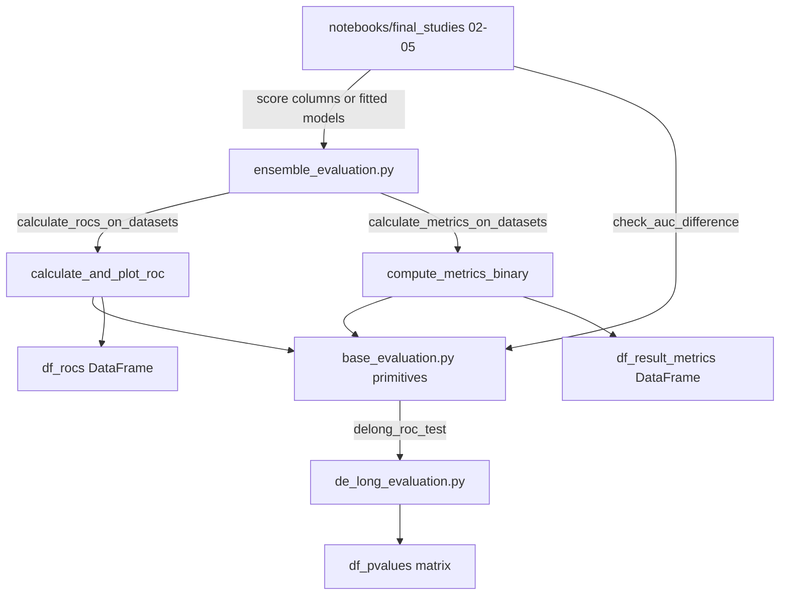
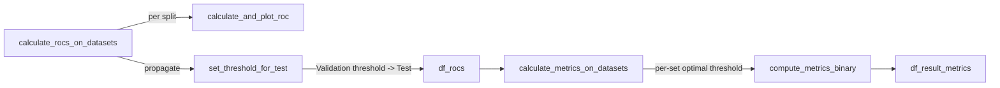

*Part of the [MMML-Alzheimer documentation](../README.md). How model performance is measured, compared, and reported across CNN slices, the cognitive-test models, and the fused EBM/LR ensembles.*

# Evaluation

The evaluation subsystem lives in [src/model_evaluation/](../../src/model_evaluation/) and answers two questions for every model in the pipeline:

1. **How good is it?** — AUC, accuracy, F1, sensitivity (recall), specificity, precision, plus ROC curves and confidence intervals. See [base_evaluation.py](../../src/model_evaluation/base_evaluation.py).
2. **Is the difference between two models real?** — the **DeLong test** for the statistical significance of an AUC gap between two correlated models scored on the same patients. See [de_long_evaluation.py](../../src/model_evaluation/de_long_evaluation.py).

These three modules are **libraries, not scripts**. There is no CLI entrypoint: [src/run/experiment.py](../../src/run/experiment.py) is empty (0 bytes). Every call originates from the result notebooks under [notebooks/final_studies/](../../notebooks/final_studies/) (notebooks 02–05), which `os.chdir()` into [src/model_evaluation/](../../src/model_evaluation/) and import by bare module name (e.g. `from base_evaluation import *`). That is why intra-package imports are written without a package prefix — `from de_long_evaluation import delong_roc_test` ([base_evaluation.py#L12](../../src/model_evaluation/base_evaluation.py#L12)) and `from base_evaluation import *` ([ensemble_evaluation.py#L6](../../src/model_evaluation/ensemble_evaluation.py#L6)). See [notebooks-guide.md](../experiments/notebooks-guide.md) and [experiment-management.md](../experiments/experiment-management.md) for how these notebooks are organised.

## Module map

| File | Bytes | Role |
|------|-------|------|
| [base_evaluation.py](../../src/model_evaluation/base_evaluation.py) | 10510 | Metric + ROC primitives, CIs, DeLong driver |
| [ensemble_evaluation.py](../../src/model_evaluation/ensemble_evaluation.py) | 5692 | Train/Val/Test driver layer that produces the headline results tables |
| [de_long_evaluation.py](../../src/model_evaluation/de_long_evaluation.py) | 4284 | Vendored fast-DeLong AUC-comparison statistics |
| [mri_evaluation.py](../../src/model_evaluation/mri_evaluation.py) | **0** | **Empty file — see below** |



## What gets evaluated

Evaluation is uniform across modalities because every model is reduced to a **score column** (a string naming a column of predicted probabilities) or a **fitted sklearn-style object** with `.predict_proba`. The same generic functions then handle CNN slices, cognitive-test models, and ensembles alike.

| Group | Score columns (AD experiment) | Score columns (MCI experiment) |
|-------|-------------------------------|--------------------------------|
| Single CNN slices | `CNN_SCORE_AXIAL_23`, `CNN_SCORE_CORONAL_43`, `CNN_SCORE_SAGITTAL_26` | `CNN_SCORE_AXIAL_8`, `CNN_SCORE_CORONAL_70`, `CNN_SCORE_SAGITTAL_50` |
| Cognitive-test models | `COGTEST_SCORE_EBM`, `COGTEST_SCORE_LR` (merged: `COGTEST_SCORE`) | same |
| Ensembles (each with `_EBM` and `_LR` variant) | `CNN_3SLICES`, `CNN_3SLICES_DEMOGRAPHICS`, `CNN_3SLICES_DEMOGRAPHICS_CDRSB`, `CNN_3SLICES_COG_SCORE`, and `CDRSB` alone | same |

The true-label column differs by table: `MACRO_GROUP` for raw MRI predictions (the 0/1/2 ADNI macro group) and `DIAGNOSIS` for cognitive/ensemble tables (binary, with MCI=2 remapped to 1). See [data-semantics.md](../data/data-semantics.md) for the full label scheme and [training.md](training.md) for how these score columns are produced.

---

## `base_evaluation.py` — metric and ROC primitives

### Per-model metrics: `compute_metrics_binary`

`compute_metrics_binary(y_true, y_pred_proba, threshold=0.5, verbose=0)` ([base_evaluation.py#L14](../../src/model_evaluation/base_evaluation.py#L14)) is the core per-model metric calculator. The second argument is **scores/probabilities, not labels**: it derives `y_pred_label` by copying the proba array and setting `>= threshold → 1`, `< threshold → 0` ([#L38-L40](../../src/model_evaluation/base_evaluation.py#L38)).

| Returned dict key | sklearn call | Definition |
|-------------------|--------------|------------|
| `'auc'` | `roc_auc_score(y_true, y_pred_proba)` | computed on **continuous scores** (threshold-independent) |
| `'accuracy'` | `accuracy_score(y_true, y_pred_label)` | on thresholded labels |
| `'f1score'` | `f1_score(...)` | on thresholded labels |
| `'recall'` | `recall_score(...)` | = **sensitivity / TPR** |
| `'precision'` | `precision_score(...)` | PPV |
| `'conf_mat'` | `confusion_matrix(...)` | 2×2 matrix |

**Specificity is not produced here.** It is only computed inside the ROC routine via `find_optimal_cutoff`. `verbose>0` prints the batch size, all metrics, and the confusion matrix.

### ROC curve + statistics: `calculate_and_plot_roc`

`calculate_and_plot_roc(df, models, levels=[0.75,0.9], label='DIAGNOSIS', set='Train', title_prefix='')` ([base_evaluation.py#L71](../../src/model_evaluation/base_evaluation.py#L71)) builds a per-model ROC statistics table **and draws one combined ROC figure**.

`models` entries are resolved at [#L103-L108](../../src/model_evaluation/base_evaluation.py#L103): a **string** is treated as a score column (`y_proba = df[model]`, `model_name = model`); an **object** is called as `y_proba = model.predict_proba(df.drop(label,axis=1))[:,-1]` with `model_name = type(model).__name__`. For each model it computes `fpr, tpr, thresholds = roc_curve(true_labels, y_proba, drop_intermediate=False)` and fills one row of `roc_df` ([#L92-L96](../../src/model_evaluation/base_evaluation.py#L92)):

```
SensLevel_at_{levels[0]}, SensLevel_at_{levels[1]},
AUC, AUC_CI_low, AUC_CI_high, Std_Error,
Optimal_Sen, Sen_CI_low, Sen_CI_high,
Optimal_Spe, Spe_CI_low, Spe_CI_high
```

plus `Model` and `Optimal_Thresh`, added dynamically at [#L109](../../src/model_evaluation/base_evaluation.py#L109) / [#L128](../../src/model_evaluation/base_evaluation.py#L128).

Two notes on the AUC value here:

- The `AUC` column uses `auc(fpr, tpr)` (trapezoidal integration of the ROC curve, [#L114](../../src/model_evaluation/base_evaluation.py#L114)) — **not** `roc_auc_score`. This differs from the `'auc'` key returned by `compute_metrics_binary`, though the two agree closely.
- The plot labels each curve `"<name> (AUC = %.3f)"` plus the `r--` chance diagonal; axes are `1-Specificity(False Positive Rate)` (x) and `Sensitivity(True Positive Rate)` (y); title is `title_prefix + f'{set} - Receiver Operating Characteristic'`.

**Figures are never written to disk by this code.** The function calls `plt.show()` ([#L146](../../src/model_evaluation/base_evaluation.py#L146)) and the `plt.savefig(...)` line is commented out ([#L147](../../src/model_evaluation/base_evaluation.py#L147)). It returns `(roc_df, fig)`; the static images committed under `reports/` and `docs/` are exported manually from the notebooks.

### Operating-point and CI helpers

| Function | Lines | What it does |
|----------|-------|--------------|
| `calculate_sensibility_at_level(tpr, fpr, level)` | [#L150-L153](../../src/model_evaluation/base_evaluation.py#L150) | "Sensitivity at a fixed specificity level": sets `level_fpr = 1 - level`, then **interpolates** TPR at that FPR via `interp1d(fpr, tpr)`. With `levels=[0.75,0.9]` it reports sensitivity at specificity 0.75 and 0.90. (Name is misspelled "sensibility" throughout — see [known-issues.md](../reference/known-issues.md).) |
| `find_optimal_cutoff(fpr, tpr, thresholds)` | [#L155-L175](../../src/model_evaluation/base_evaluation.py#L155) | Optimal point = the ROC point **closest to the top-left corner (0,1)** by Euclidean distance: `optimal_idx = np.argmin(np.sqrt((1 - tpr)**2 + fpr**2))` ([#L171](../../src/model_evaluation/base_evaluation.py#L171)). The commented alternative ([#L170](../../src/model_evaluation/base_evaluation.py#L170)) is Youden's J (`argmax(tpr - fpr)`) — not used. Returns `(optimal_sensitivity, optimal_specificity = 1 - fpr[idx], optimal_threshold)`. |
| `calculate_std_error_auc(auc, cls)` | [#L177-L191](../../src/model_evaluation/base_evaluation.py#L177) | Hanley–McNeil standard error of AUC. `cls` = true-label vector (1 = unhealthy/positive, 0 = healthy/negative). Uses `q1 = auc/(2-auc)`, `q2 = 2*auc^2/(1+auc)`, counts `lu = sum(cls==1)`, `lh = sum(cls==0)`, variance `V = (auc*(1-auc) + (lu-1)*(q1-auc^2) + (lh-1)*(q2-auc^2))/(lu*lh)`; returns `sqrt(V)`. |
| `calculate_confidence_interval_auc(auc, std, alpha=0.05)` | [#L193-L203](../../src/model_evaluation/base_evaluation.py#L193) | Normal-approx CI on AUC: `ci = auc ± sqrt(2)*erfcinv(alpha)*std`. **Likely statistical bug:** at α=0.05 this multiplier is ≈1.39, giving ~90% coverage, not the 95% the docstring implies (inferred — not confirmed by the author). See [known-issues.md](../reference/known-issues.md). |
| `calculate_confidence_interval_sensitivity(...)` / `calculate_confidence_interval_specificity(...)` | [#L205-L229](../../src/model_evaluation/base_evaluation.py#L205) | "Simple Asymptotic" (Wald) CIs for a proportion at the optimal cutoff. Sensitivity uses `n = sum(cls==1)`, specificity uses `n = sum(cls==0)`; both hardcode the correct `1.96` z-value: `sa = 1.96*sqrt(p*(1-p)/n)`, return `[p - sa, p + sa]`. |
| `get_numpy_array(arr)` | [#L231-L236](../../src/model_evaluation/base_evaluation.py#L231) | Coercion helper: torch.Tensor → `.cpu().detach().numpy()`; list → `np.array`; else passthrough. |
| `get_optimal_threshold_for_model(model, df, label)` | [#L264-L270](../../src/model_evaluation/base_evaluation.py#L264) | Convenience wrapper: `predict_proba[:,-1]` → `roc_curve` → returns only the `optimal_threshold` from `find_optimal_cutoff`. Used in notebook 05 to set the EBM cutoff from the **validation** set ([05_explanations_local_ensemble.ipynb](../../notebooks/final_studies/05_explanations_local_ensemble.ipynb)). |

### DeLong driver: `check_auc_difference`

`check_auc_difference(models, datasets, label='MACRO_GROUP', alpha=0.05, verbose=1)` ([base_evaluation.py#L238](../../src/model_evaluation/base_evaluation.py#L238)) is the driver that wraps the DeLong test. It builds a square p-value DataFrame indexed and columned by model names. For every unordered pair `(model1, model2)` from `combinations(models, 2)`, and for the **Validation and Test sets only** (`zip(['Validation','Test'], datasets[1:])` — the Train set is skipped, [#L244](../../src/model_evaluation/base_evaluation.py#L244)):

- `log10_pvalue = delong_roc_test(df[label], df[model1], df[model2])`, then `pvalue = 10**log10_pvalue` ([#L247](../../src/model_evaluation/base_evaluation.py#L247)).
- The rounded p-value (4 decimals) is stored symmetrically into `df_pvalues.loc[m1,m2]` and `.loc[m2,m1]`.
- With `verbose>0`, per set, it prints whether the null is rejected at the `(1-alpha)*100`% confidence level. The output string has a typo: **"Refect null hypothesis"** ([#L255](../../src/model_evaluation/base_evaluation.py#L255)).

Returns the symmetric p-value matrix `df_pvalues`.

---

## `de_long_evaluation.py` — the DeLong AUC-comparison test

This is the statistical core for deciding whether two models are genuinely different. The header comment ([#L5-L6](../../src/model_evaluation/de_long_evaluation.py#L5)) notes it is "adapted from https://github.com/Netflix/vmaf/" — the standard vendored fast-DeLong implementation.

**What the test does:** it tests the null hypothesis that **two ROC AUCs computed on the same set of samples are equal** (two classifiers scored against identical ground truth). Because the two AUCs are *correlated* (same patients), an ordinary two-sample test would be invalid; DeLong estimates the **covariance** of the AUCs from mid-rank placement statistics and forms a z-statistic on their difference. In this project it answers: "Is model A's AUC statistically distinguishable from model B's on the validation/test cohort?" — used to compare CNN slices against each other, the cognitive-test models (EBM vs LR), and the fused ensembles against the single-modality baselines.

| Function | Lines | Role |
|----------|-------|------|
| `compute_midrank(x)` | [#L7-L29](../../src/model_evaluation/de_long_evaluation.py#L7) | Mid-ranks of a 1-D array, averaging ties via `0.5*(i+j-1)`. |
| `fastDeLong(predictions_sorted_transposed, label_1_count)` | [#L32-L74](../../src/model_evaluation/de_long_evaluation.py#L32) | Sun & Xu (2014) O(N log N) algorithm. Input is `[n_classifiers, n_examples]` with positives sorted first. Returns `(aucs, delongcov)` — AUC per classifier plus the DeLong covariance matrix. Implements the V01/V10 placement values and `sx/m + sy/n`. |
| `calc_pvalue(aucs, sigma)` | [#L77-L87](../../src/model_evaluation/de_long_evaluation.py#L77) | Two-sided z-test on the AUC difference using contrast `l=[[1,-1]]`; returns **log10(p-value)** via `np.log10(2) + norm.logsf(z)/log(10)`. |
| `compute_ground_truth_statistics(ground_truth)` | [#L90-L94](../../src/model_evaluation/de_long_evaluation.py#L90) | Asserts labels are exactly `{0,1}` ([#L91](../../src/model_evaluation/de_long_evaluation.py#L91)), sorts so positives come first, returns `(order, label_1_count)`. |
| `delong_roc_variance(ground_truth, predictions)` | [#L97-L108](../../src/model_evaluation/de_long_evaluation.py#L97) | AUC + its variance for a **single** model. Available but not used by `check_auc_difference`. |
| `delong_roc_test(ground_truth, predictions_one, predictions_two)` | [#L111-L124](../../src/model_evaluation/de_long_evaluation.py#L111) | **Public entry used by `check_auc_difference`.** Stacks the two prediction vectors, sorts by `order`, calls `fastDeLong`, returns `calc_pvalue(...)` = **log10(p)**. The caller exponentiates with `10**`. |

> **NumPy compatibility bug — highest-priority rerun hazard.** `np.float` is used as a dtype at lines [#L17](../../src/model_evaluation/de_long_evaluation.py#L17), [#L25](../../src/model_evaluation/de_long_evaluation.py#L25), [#L61](../../src/model_evaluation/de_long_evaluation.py#L61), [#L62](../../src/model_evaluation/de_long_evaluation.py#L62), [#L63](../../src/model_evaluation/de_long_evaluation.py#L63). `np.float` was **removed in NumPy ≥ 1.24** (deprecated since 1.20). On a modern NumPy this module raises `AttributeError: module 'numpy' has no attribute 'float'`, breaking `delong_roc_test` and therefore `check_auc_difference`. This is the single biggest "won't run as-is after 4 years" issue in the evaluation subsystem. Fix: replace `np.float` with `np.float64` (or plain `float`). Catalogued in [known-issues.md](../reference/known-issues.md).

---

## `ensemble_evaluation.py` — Train/Val/Test driver layer

This module sits on top of `base_evaluation` (via `from base_evaluation import *`, [#L6](../../src/model_evaluation/ensemble_evaluation.py#L6)) and produces the actual results tables reported in the thesis. It runs the same primitives across the three dataset splits and keeps the no-leakage threshold discipline.



### Primary entrypoints

`calculate_rocs_on_datasets(models, datasets, dataset_names=['Train','Validation','Test'], label='MACRO_GROUP', roc_title_prefix='')` ([#L86-L112](../../src/model_evaluation/ensemble_evaluation.py#L86)) is the **primary ROC entrypoint** used in notebooks 02–05. It loops over the three datasets calling `calculate_and_plot_roc(...)` per set with fixed `levels=[0.75,0.9]`, tags each result with a `set` column, concatenates into `df_rocs`, then propagates the threshold via `set_threshold_for_test(df_rocs, models, reference='Validation')`.

`set_threshold_for_test(df_rocs, models, reference='Validation')` ([#L114-L124](../../src/model_evaluation/ensemble_evaluation.py#L114)) is the methodological detail that prevents test leakage: it overwrites the **Test** row's `Optimal_Thresh` with the **Validation** set's optimal threshold for the same model, so the test-set classification cutoff is chosen on validation rather than fitted on test. It resolves `model_name` from a string or `type(model).__name__`.

`calculate_metrics_on_datasets(models, datasets, df_rocs, label, verbose=1)` ([#L126-L159](../../src/model_evaluation/ensemble_evaluation.py#L126)) produces the final tidy results table:

- For each `(set, df)` and each model, resolves `y_pred_proba` (string column or `model.predict_proba[:,-1]`), pulls the per-set `Optimal_Thresh` out of `df_rocs` ([#L137](../../src/model_evaluation/ensemble_evaluation.py#L137)), and calls `compute_metrics_binary(y_true, y_pred_proba, threshold=optimal_threshold)`.
- Each row is `{'set','model','prediction_threshold', + metrics dict}`.
- It then title-cases all column names ([#L155](../../src/model_evaluation/ensemble_evaluation.py#L155)) and keeps exactly these columns in order ([#L156](../../src/model_evaluation/ensemble_evaluation.py#L156)):

  ```
  ['Set','Model','Auc','F1Score','Accuracy','Precision','Recall','Prediction_Threshold','Conf_Mat']
  ```

- The six numeric columns are rounded to 4 decimals via `np.round(10000*x)/10000` ([#L157-L158](../../src/model_evaluation/ensemble_evaluation.py#L157)). Returns `df_all_results`.

> **Bug note:** `calculate_metrics_on_datasets` hardcodes `['Train','Validation','Test']` at [#L128](../../src/model_evaluation/ensemble_evaluation.py#L128) instead of reusing a `dataset_names` argument (unlike `calculate_rocs_on_datasets`), so it always assumes exactly three sets in that order. See [known-issues.md](../reference/known-issues.md).

**The headline thesis results** come from the Test slice of this table. The notebook pattern (02 & 03) is:

```python
df_test = df_result_metrics.query("Set == 'Test'").drop(["Conf_Mat",'Set'], axis=1)
```

### Secondary / unused functions

| Function | Lines | Status |
|----------|-------|--------|
| `compare_ensembles_rocs_on_dataset(df, label, model_names)` | [#L24-L65](../../src/model_evaluation/ensemble_evaluation.py#L24) | Lighter ROC comparator on a **single** dataframe (no CIs): per model computes `roc_curve` + `auc`, fills `df_results` with `['AUC','Optimal_Threshold']`, overlays all curves, `plt.show()`. Imported in notebooks 04 & 05 but the heavier `calculate_rocs_on_datasets` is what is actually used. |
| `calculate_experiment_performance_on_datasets(models, datasets, label)` | [#L67-L84](../../src/model_evaluation/ensemble_evaluation.py#L67) | Top-level convenience: calls `calculate_rocs_on_datasets` then `calculate_metrics_on_datasets`, returns `df_rocs`. Imported in notebooks 04/05, but the two sub-functions are usually called directly so thresholds can be inspected. |
| `compare_ensembles_performance_on_dataset(dataset, df_rocs, label, model_names)` | [#L9-L22](../../src/model_evaluation/ensemble_evaluation.py#L9) | **Stub — body is `pass`** ([#L22](../../src/model_evaluation/ensemble_evaluation.py#L22)). The docstring promises bar plots for AUC/Accuracy/F1/Recall/Precision; never implemented. See [known-issues.md](../reference/known-issues.md). |

---

## `mri_evaluation.py` — empty

[mri_evaluation.py](../../src/model_evaluation/mri_evaluation.py) is **0 bytes**. There is no MRI-specific evaluation module. CNN evaluation in practice happens in two places:

1. **Inside the training loop** — [mri_train.py](../../src/model_training/mri_train.py) computes batch and epoch metrics during training and runs `generate_model_predictions`, which writes the `CNN_SCORE` columns into the `PREDICTIONS_*.csv` tables. See [training.md](training.md).
2. **Inside the result notebooks** — the per-slice CNN score columns (`CNN_SCORE_AXIAL_23`, etc.) are then passed as **string "models"** into the generic `calculate_rocs_on_datasets` / `calculate_metrics_on_datasets` / `check_auc_difference` functions, exactly like any other model. See [02_results_separate_learning_results.ipynb](../../notebooks/final_studies/02_results_separate_learning_results.ipynb) and the [notebooks guide](../experiments/notebooks-guide.md).

So "MRI evaluation" is not a missing capability — it is just routed through the same generic evaluation layer rather than a dedicated module.

---

## Where outputs go

**No evaluation function writes a file.** Every plotting function ends in `plt.show()` or returns a `fig`; the only `savefig` in the subsystem is commented out ([base_evaluation.py#L147](../../src/model_evaluation/base_evaluation.py#L147)). Result tables (`df_rocs`, `df_result_metrics`, `df_pvalues`) are returned as DataFrames and displayed inline in the notebooks. Any persistence — CSV exports, the static figures committed under `reports/` and `docs/` — happens manually inside the notebooks. See [experiment-management.md](../experiments/experiment-management.md) for the tracking convention.

## See also

- [training.md](training.md) — how the score columns and `PREDICTIONS_*.csv` tables that feed evaluation are produced
- [models.md](models.md) — the CNN architectures and focal loss whose fitted models these metrics and the DeLong test compare
- [explainability.md](explainability.md) — the XAI layer that explains the same models after they are evaluated
- [notebooks-guide.md](../experiments/notebooks-guide.md) — where notebooks 02–05 call these functions, and in what order
- [running-experiments.md](../experiments/running-experiments.md) — end-to-end runbook including the evaluation step
- [data-semantics.md](../data/data-semantics.md) — `MACRO_GROUP` vs `DIAGNOSIS` labels and the score-column naming convention
- [known-issues.md](../reference/known-issues.md) — the `np.float` DeLong breakage, the stub function, the AUC-CI z-multiplier, and other gotchas catalogued in detail
