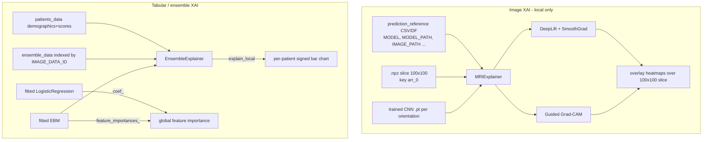
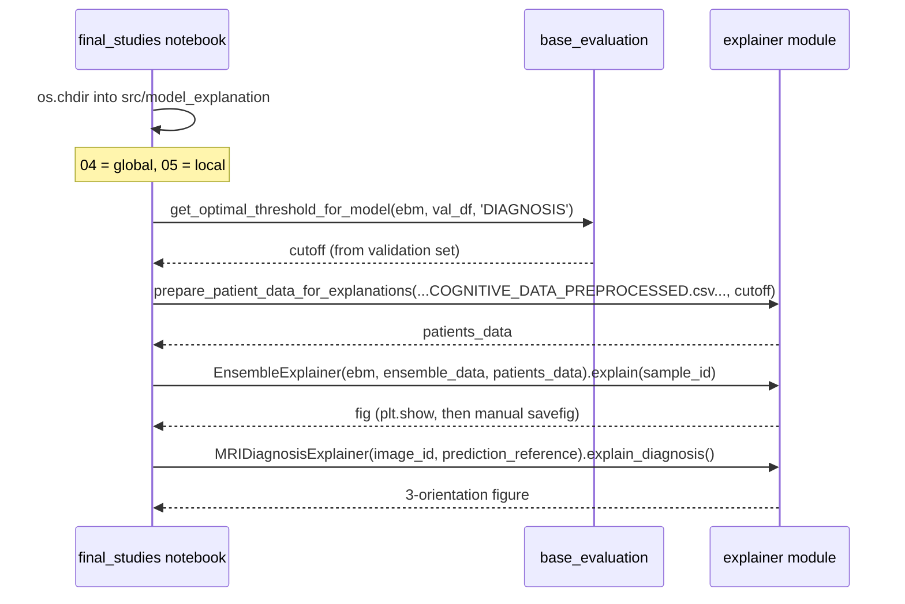

*Part of the [MMML-Alzheimer documentation](../README.md). How the trained CNNs and the EBM ensemble are explained — local (patient-level) image attributions and global (population-level) feature importances.*

# Explainability (XAI)

Two completely separate XAI tracks live under [src/model_explanation/](../../src/model_explanation):

1. **Image side** — gradient attributions over the MRI CNNs, via [Captum](https://captum.ai/) (DeepLift + Guided Grad-CAM). Source: [mri_explanation.py](../../src/model_explanation/mri_explanation.py).
2. **Tabular / ensemble side** — the glassbox Explainable Boosting Machine (EBM) and Logistic Regression feature weights, via the [interpret](https://interpret.ml/) library. Source: [ensemble_explanation.py](../../src/model_explanation/ensemble_explanation.py).

There is **no SHAP, no LIME, no occlusion** anywhere in this subsystem — only gradient attributions (image) and glassbox coefficients/importances (tabular).

Both files are **libraries, not scripts**. There is no CLI entrypoint: [src/run/experiment_explanation.py](../../src/run/experiment_explanation.py) is a **0-byte empty file**. Every caller is a notebook under [notebooks/final_studies/](../../notebooks/final_studies) — see the [notebooks guide](../experiments/notebooks-guide.md) for `04_explanations_global.ipynb` (global) and `05_explanations_local_ensemble.ipynb` (local). The notebooks `os.chdir()` into the module directory and import by bare module name, which is why imports are written without a package prefix.

## Local vs global at a glance

| Axis | Image (CNN) | Tabular (EBM / LR) |
|------|-------------|--------------------|
| **Local / patient-level** | `MRIExplainer`, `MRIDiagnosisExplainer` — explains one `image_id`'s CNN decision per orientation | `EnsembleExplainer.explain`, `EnsembleExplainer.compare_patients_explanations` — explains one `sample_id`'s fused decision via EBM `explain_local` |
| **Global / population-level** | **none** — there is no population/global image XAI | `plot_global_explanations`, `show_feature_weights`, `create_normalized_by_feature_weight`, `prepare_feature_importance` — whole-model EBM `feature_importances_` / LR `coef_` |

The image track is exclusively local. Global explanations only exist on the tabular/ensemble side.



---

## Image XAI — `mri_explanation.py`

Captum-based gradient attribution over the per-orientation CNNs. It reuses the CNN loader from [src/models/neural_network.py](../../src/models/neural_network.py) via `from neural_network import load_model, load_trained_model, device` ([mri_explanation.py#L18-L19](../../src/model_explanation/mri_explanation.py#L18)) — the same `shallow_cnn`/`vgg*`/`resnet*` factory and `device = "cuda" if torch.cuda.is_available() else "cpu"` used in [training](training.md).

> **Stale-path warning:** the import is preceded by `sys.path.append("./../models")` ([mri_explanation.py#L18](../../src/model_explanation/mri_explanation.py#L18)), which is relative to the current working directory. It resolves **only** when the importing notebook has already `os.chdir()`'d into [src/model_explanation/](../../src/model_explanation). The `final_studies/05_*` notebook follows exactly this chdir-per-module pattern. See [known issues](../reference/known-issues.md).

### Techniques used

1. **Guided Grad-CAM** — `_make_gradcam_explanation` ([mri_explanation.py#L111-L116](../../src/model_explanation/mri_explanation.py#L111)).
   `GuidedGradCam(net, layer=net.features[-1])` targets the **last conv block** of the CNN's `.features` Sequential (every loaded network exposes `.features`). Attribution via `gc.attribute(image, interpolate_mode='area')`. A local saliency/heatmap; plotted positive-sign only.
2. **DeepLift + SmoothGrad** — `_make_deeplift_explanation` ([mri_explanation.py#L118-L129](../../src/model_explanation/mri_explanation.py#L118)).
   `DeepLift(net)` wrapped in `NoiseTunnel`. The **baseline is a Gaussian-blurred copy of the input** — `GaussianBlur((5,5), sigma=1)` ([#L122-L123](../../src/model_explanation/mri_explanation.py#L122)). Attribution via `nt.attribute(image, baselines=ref_image, nt_type='smoothgrad', nt_samples=smoothing_samples, stdevs=0.1)`. Default `smoothing_samples=100`. A local attribution map carrying both positive and negative contributions.

Both attributions are post-processed identically before display: `np.transpose(..., self.transpose_array)` with `transpose_array=(2,1,0)` ([#L47](../../src/model_explanation/mri_explanation.py#L47)), then `np.rot90` to orient the slice for viewing.

### Inputs and the reference-table data contract

`MRIExplainer.__init__(self, image_id, prediction_reference, device=device)` ([#L38-L48](../../src/model_explanation/mri_explanation.py#L38)):

- `image_id` — `IMAGE_DATA_ID` (the `'I' + IMAGEUID` style id).
- `prediction_reference` — either a **path to a CSV** or an in-memory DataFrame holding, per `(image, orientation)` row, the columns below. The `image_reference` property ([#L86-L93](../../src/model_explanation/mri_explanation.py#L86)) reads the CSV if it is a string, filters `df_ref['IMAGE_DATA_ID'] == self.image_id`, and upper-cases all column names.

Columns the class reads from that reference table — the data contract for the prediction CSV:

| Column read | Where | Meaning |
|-------------|-------|---------|
| `IMAGE_DATA_ID` | [#L91](../../src/model_explanation/mri_explanation.py#L91) | row filter key |
| `ORIENTATION` | [#L65](../../src/model_explanation/mri_explanation.py#L65), [#L232](../../src/model_explanation/mri_explanation.py#L232) | `'sagittal'` / `'coronal'` / `'axial'` |
| `SLICE` | [#L75](../../src/model_explanation/mri_explanation.py#L75) | slice index (used in the display label) |
| `MODEL` | [#L66](../../src/model_explanation/mri_explanation.py#L66), [#L233](../../src/model_explanation/mri_explanation.py#L233) | CNN architecture name string (e.g. `vgg19_bn`), passed to `load_trained_model` |
| `MODEL_PATH` | [#L66](../../src/model_explanation/mri_explanation.py#L66), [#L233](../../src/model_explanation/mri_explanation.py#L233) | filesystem path to the trained `.pt` / state-dict weights |
| `IMAGE_PATH` | [#L67](../../src/model_explanation/mri_explanation.py#L67), [#L234](../../src/model_explanation/mri_explanation.py#L234) | path to the saved `.npz` slice |
| `MACRO_GROUP` | [#L78](../../src/model_explanation/mri_explanation.py#L78) | true label (0/1/2) |
| `CNN_SCORE` | [#L79](../../src/model_explanation/mri_explanation.py#L79) | model's predicted score, for display |
| `CNN_PREDICTION` | [#L80](../../src/model_explanation/mri_explanation.py#L80) | model's predicted label, for display |

> **(inferred)** The `MODEL`, `MODEL_PATH`, `IMAGE_PATH`, and `CNN_PREDICTION` columns are inferred to exist in the upstream prediction reference. [mri_train.py](../../src/model_training/mri_train.py) adds `CNN_SCORE` to a reference table, but the explainer additionally needs the model-locating columns, so the reference fed to `MRIExplainer` must be a **richer table than the bare `PREDICTIONS_*.csv`**. No single writer confirms this enrichment. See [known issues](../reference/known-issues.md).

**Image loading** — `_get_image(orientation, image_path)` ([#L95-L103](../../src/model_explanation/mri_explanation.py#L95)): `X = np.load(image_path)['arr_0']`. MRI slices are stored as **`.npz` archives under the default key `'arr_0'`**. The tensor is normalized by its max (`X / X.max()`), reshaped to `view(-1, 1, 100, 100)` (**single-channel 100×100**), set `requires_grad=True`, and moved to device. This confirms the 2-D slice size of 100×100, channel = 1, matching `Conv2d(in_channels=1, ...)` in the CNN factory. See [data preparation](../data/data-preparation.md) for how these slices are produced.

**Model loading** — `_get_model(...)` ([#L105-L109](../../src/model_explanation/mri_explanation.py#L105)): `load_trained_model(model=model_name, model_path=model_path, device=...)` followed by `.zero_grad()`. Loaded once per orientation and cached.

### Outputs — heatmaps over the slice

Everything is rendered with Captum's `viz.visualize_image_attr`. **Nothing is saved to disk by this class — every method ends in `plt.show()`** ([#L197](../../src/model_explanation/mri_explanation.py#L197), [#L260](../../src/model_explanation/mri_explanation.py#L260)). The static PNGs committed under [notebooks/final_studies/images/explanations-mri/](../../notebooks/final_studies/images/explanations-mri) were exported manually from notebook outputs.

`MRIExplainer` public methods:

| Method | Lines | What it draws |
|--------|-------|---------------|
| `explain_all_orientations(figsize=(15,6), original_image_overlay=0.7, outlier_scale=10, separate_negative_contributions=False)` | [#L50-L55](../../src/model_explanation/mri_explanation.py#L50) | Runs `explain_one_orientation` for sagittal, coronal, axial in turn |
| `explain_one_orientation(orientation='coronal', ...)` | [#L58-L84](../../src/model_explanation/mri_explanation.py#L58) | Produces **both** DeepLift and Guided Grad-CAM attributions for one slice, then calls `_show_explanations` |
| `_show_explanations(...)` | [#L131-L197](../../src/model_explanation/mri_explanation.py#L131) | Renders the panels (see below) |
| `_get_score_and_prediction(net, image, threshold)` | [#L199-L205](../../src/model_explanation/mri_explanation.py#L199) | `torch.sigmoid(net(image))` → proba, threshold → label |

`_get_score_and_prediction` applies `torch.sigmoid` to the CNN's single logit, confirming the binary head (`Linear(..., out_features=1)`) described in [models](models.md).

**Panel layout** (`_show_explanations`):

- Default (`separate_negative_contributions=False`) → **3 panels**: Original | Overlayed Guided GradCam | Overlayed DeepLift (`sign='all'`).
- `separate_negative_contributions=True` → **4 panels**, splitting DeepLift into positive (`sign='positive'`) and negative (`sign='negative'`) overlays.
- Grad-CAM is drawn `method="blended_heat_map", sign='positive'`; if its attribution max is 0 it falls back to the plain image ([#L157-L159](../../src/model_explanation/mri_explanation.py#L157)).
- Figure title encodes True label, Predicted label, and Predicted score.

### `MRIDiagnosisExplainer` — one combined figure across all three orientations

Subclass at [#L207-L260](../../src/model_explanation/mri_explanation.py#L207). The "MRI diagnosis" view: a single 3-panel figure showing one slice per orientation side by side.

`explain_diagnosis(algorithm='DeepLift', figsize=(15,6), original_image_overlay=0.7, outlier_scale=10)` ([#L225-L260](../../src/model_explanation/mri_explanation.py#L225)): for `['sagittal', 'axial', 'coronal']` it loads the model + image and computes **one** attribution chosen by `algorithm` —

- `'DeepLift'` → `_make_deeplift_explanation(..., smoothing_samples=20)` with `sign='all'`. Note `smoothing_samples=20` here (cheaper) versus the base-class default of 100.
- otherwise → Guided Grad-CAM with `sign='positive'` (falling back to the plain image if its max is 0).

One subplot per orientation, titled `"{ORIENTATION} Slice"`. Output is `plt.show()`. This is the source of the `patient_diagnosis_deeplift_*.png` figures.

Both classes are **local / patient-level** — they explain a single `image_id`'s CNN decision. The technique-tuning figures `explanations_deeplift_configurations.png` and `explanations_guidedgradcam_configurations.png` (sweeping the overlay/outlier/smoothing parameters) also come from this module.

---

## Tabular XAI — `ensemble_explanation.py`

Explains the fused CNN + demographics + cognitive EBM. The module imports only `pandas`, `numpy`, `matplotlib.pyplot`, and `matplotlib.patches.Patch` — **no interpret/SHAP import**. It consumes a fitted EBM passed in and reads its `interpret`-library internals directly.

### Techniques used

- **EBM local explanations** via `model.explain_local(...)`. The EBM is `interpret.glassbox.ExplainableBoostingClassifier`, fit in the notebooks and in [ensemble_train.py](../../src/model_training/ensemble_train.py). The explainer reaches into `._internal_obj['specific'][0]` to get the per-feature `names` and `scores` ([#L45-L48](../../src/model_explanation/ensemble_explanation.py#L45), [#L127-L130](../../src/model_explanation/ensemble_explanation.py#L127)).
- **EBM global feature importances** via `ebm.feature_importances_` and **LR coefficients** via `lr.coef_.ravel()`.
- Visualizations are **horizontal bar charts of signed feature weights**: **red = positive contribution, green = negative contribution** (legend via `Patch`). No SHAP values.

### Local — `EnsembleExplainer`

Constructor ([#L23-L30](../../src/model_explanation/ensemble_explanation.py#L23)): `EnsembleExplainer(model, ensemble_data, patients_data, axial_label='AXIAL_23', coronal_label='CORONAL_43', sagittal_label='SAGITTAL_26')`.

- `model` — a fitted EBM.
- `ensemble_data` — features + target DataFrame, **indexed / queried by `IMAGE_DATA_ID`**.
- `patients_data` — demographics + prediction-display DataFrame (built by `prepare_patient_data_for_explanations`, below).
- The three slice-score column labels default to the **AD-experiment** slices `AXIAL_23` / `CORONAL_43` / `SAGITTAL_26`. The **MCI** experiments pass `AXIAL_8` / `CORONAL_70` / `SAGITTAL_50` (per notebook 05). The naming convention `CNN_SCORE_<ORIENTATION>_<SLICE>` comes from `ensemble_train.prepare_mri_predictions`; see [data semantics](../data/data-semantics.md).

`explain(self, sample_id, top_features=10, figsize=(3.5,5), show_true_diagnosis=True)` — [#L33-L108](../../src/model_explanation/ensemble_explanation.py#L33):

- Filters `df_ensemble = ensemble_data.query("IMAGE_DATA_ID == @sample_id")` and the matching `df_patient`.
- `local_explanation = model.explain_local(df_ensemble.drop('DIAGNOSIS', axis=1), df_ensemble['DIAGNOSIS'])._internal_obj['specific'][0]` ([#L45](../../src/model_explanation/ensemble_explanation.py#L45)). **The target/label column is `'DIAGNOSIS'`.**
- Builds `df_weights_ebm` from `local_explanation['names']` and `['scores']`, adds `abs_Weights`, sorts ascending by absolute weight, keeps the top-N (`iloc[-top_features:]`).
- Renders a single horizontal bar chart (positive = red, negative = green).
- Annotates the figure with **patient context** pulled from `df_patient` ([#L76-L80](../../src/model_explanation/ensemble_explanation.py#L76)): `AGE`, `GENDER` (renamed from `MALE`), `YEARS_EDUCATION`, `HISPANIC`, `RACE`, `WIDOWED`, the true `DIAGNOSIS`, `FINAL_PREDICTED_SCORE`, `FINAL_PREDICTION`, and the three per-orientation CNN scores. Layout branches for landscape vs portrait `figsize` at [#L82](../../src/model_explanation/ensemble_explanation.py#L82). Returns `fig` (the notebooks assign it to `explanation_fig`); not saved to disk.

`compare_patients_explanations(self, sample_ids, top_features=10, figsize=(9,5))` — [#L110-L170](../../src/model_explanation/ensemble_explanation.py#L110): the same local-EBM logic but **side-by-side for two patients** (1×2 grid), each annotated with its own demographics/scores/diagnosis. Used to contrast e.g. a true-positive against a false-negative.

Both methods are **local / patient-level**. These produce the figures under [notebooks/final_studies/images/explanations-ensemble/](../../notebooks/final_studies/images/explanations-ensemble) — the `explanations_local_ensemble_true_*` / `_false_*` and `patient_diagnosis_ensemble_*` PNGs.

### `prepare_patient_data_for_explanations` — building `patients_data`

[#L175-L216](../../src/model_explanation/ensemble_explanation.py#L175). Builds the `patients_data` DataFrame that `EnsembleExplainer` annotates with:

```python
prepare_patient_data_for_explanations(patient_data_path, df_ensemble, ebm, cutoff,
    positive_case='AD', axial_label='AXIAL_23', coronal_label='CORONAL_43',
    sagittal_label='SAGITTAL_26', label='DIAGNOSIS')
```

- Scores every ensemble row: `predicted_probas = ebm.predict_proba(df_ensemble.drop(label, axis=1))[:, -1]` ([#L180](../../src/model_explanation/ensemble_explanation.py#L180)).
- Keeps `[axial_label, coronal_label, sagittal_label, label]`, adds `FINAL_PREDICTED_SCORE` (rounded to 7 decimals) and `FINAL_PREDICTION = 1 if proba >= cutoff else 0` ([#L182-L184](../../src/model_explanation/ensemble_explanation.py#L182)). The `cutoff` comes from the **validation** set via `base_evaluation.get_optimal_threshold_for_model` in notebook 05 — see [evaluation](evaluation.md).
- Reads demographics from `patient_data_path` (in notebook 05 this is `data/COGNITIVE_DATA_PREPROCESSED.csv`). Constructs the join key `IMAGE_DATA_ID = 'I' + str(IMAGEUID)` ([#L188-L190](../../src/model_explanation/ensemble_explanation.py#L188)).
- Selects demographic columns `['AGE', 'MALE', 'YEARS_EDUCATION', 'HISPANIC', 'RACE', 'WIDOWED']`, renames `MALE → GENDER`, upper-cases `RACE`.
- Decodes binary flags to strings ([#L196-L203](../../src/model_explanation/ensemble_explanation.py#L196)): `HISPANIC` 1/0 → `'YES'`/`'NO'`; `WIDOWED` 1/0 → `'YES'`/`'NO'`; `GENDER` 1/0 → `'MALE'`/`'FEMALE'`.
- Merges demographics with the essential ensemble columns on the index, then decodes the label: `DIAGNOSIS` 1 → `positive_case` (`'AD'` or `'MCI'`), 0 → `'CN'`; same for `FINAL_PREDICTION` ([#L207-L211](../../src/model_explanation/ensemble_explanation.py#L207)).
- Rounds the three slice scores to 7 decimals ([#L213-L215](../../src/model_explanation/ensemble_explanation.py#L213)). Returns the prepared `df_patient_data`.

> **Demographics column contract (inferred)** from this function plus notebook 04: `COGNITIVE_DATA_PREPROCESSED.csv` carries `IMAGEUID`, `AGE`, `MALE`, `YEARS_EDUCATION`, `HISPANIC`, `RACE`, `WIDOWED`, the one-hot `RACE_WHITE`/`RACE_BLACK`/`RACE_ASIAN`, plus `CDRSB` and `DIAGNOSIS`. `MALE`/`HISPANIC`/`WIDOWED` are 0/1 encoded; `RACE` is a free-text/categorical string. See [data semantics](../data/data-semantics.md).

### Global — population-level feature importance

`plot_global_explanations(...)` — [#L219-L257](../../src/model_explanation/ensemble_explanation.py#L219). **The global explanation.** Side-by-side 1×2 bar charts comparing **LR** and **EBM** feature importances for a whole experiment/model:

```python
plot_global_explanations(features_lr, coefficients_lr, features_ebm, coefficients_ebm, title,
    normalized=True, figsize=(9,4), top_features=10, vertical_space=0.85, horizontal_space=0.85)
```

- Builds `df_weights_lr` / `df_weights_ebm` via `prepare_feature_importance`; chooses the `'normalized'` column (when `normalized=True`) else `'Weights'`; keeps top-N.
- LR panel is sign-colored (red positive / green negative) with a `Patch` legend; the **EBM panel is single-color** because `feature_importances_` are non-negative magnitudes. Title = `'Global Explanations - ' + title`. Ends in `plt.show()`; returns `fig`.

**Notebook 04 caller** (`04_explanations_global.ipynb`) passes `features_lr = df_test.columns[:-1]`, `coefficients_lr = lr.coef_.ravel()`, `features_ebm = ebm.feature_names`, `coefficients_ebm = ebm.feature_importances_`, with `title` strings like `'Ensemble 3 CNNs Slices + Demographics + CDRSB - ADxCN'`. Global explanations are produced for every ensemble variant (3-slice CNN only; +Demographics; +Demographics+CDRSB; +CogTest) for both AD×CN and MCI×CN — the `explanations_global_*` PNGs under [notebooks/final_studies/images/explanations/](../../notebooks/final_studies/images/explanations).

`show_feature_weights(features, coefficients, model_title, color=None, absolute_values=False, normalized=False, figsize=(8,8), top=None)` — [#L267-L327](../../src/model_explanation/ensemble_explanation.py#L267): a **single-model** global feature-importance bar chart. Picks the plotting column from `Weights` / `abs_Weights` / `normalized` / `abs_normalized` based on the `absolute_values` / `normalized` flags; optional sign-coloring; footnote text when normalized ("*All values add up to one") or absolute. In notebook 04 it is wrapped by a `show_global_interpretation(ebm, lr, ...)` helper that calls it twice — once with `ebm.feature_importances_` (title `'EBM'`) and once with `lr.coef_.ravel()` (title `'Logistic Regression'`), both `normalized=True`.

### Shared importance-table builders

`prepare_feature_importance(features, coefficients)` — [#L259-L263](../../src/model_explanation/ensemble_explanation.py#L259): wraps `create_normalized_by_feature_weight`, then re-sorts ascending by `abs_Weights` so the largest weights land at the bottom of the horizontal bar.

`create_normalized_by_feature_weight(features, coefficients)` — [#L329-L350](../../src/model_explanation/ensemble_explanation.py#L329): the canonical weights DataFrame (index = feature names) behind both global functions:

| Column | Definition |
|--------|-----------|
| `Weights` | raw coefficient / importance |
| `abs_Weights` | `abs(Weights)` |
| `normalized` | `Weights / sum(abs_Weights)` — signed, magnitudes sum to 1 |
| `abs_normalized` | `abs_Weights / sum(abs_Weights)` |

Sorted descending by `abs_normalized`.

---

## Runbook — reproducing the explanation figures



1. **Global** ([04_explanations_global.ipynb](../../notebooks/final_studies/04_explanations_global.ipynb)): fit/load the EBM and LR per experiment variant, then call `show_global_interpretation` / `plot_global_explanations` with `ebm.feature_importances_` and `lr.coef_.ravel()`. No patient data needed.
2. **Local** ([05_explanations_local_ensemble.ipynb](../../notebooks/final_studies/05_explanations_local_ensemble.ipynb)): set the `cutoff` from validation via `get_optimal_threshold_for_model`, build `patients_data` with `prepare_patient_data_for_explanations`, then drive `EnsembleExplainer.explain` / `compare_patients_explanations` per `sample_id`, and `MRIExplainer` / `MRIDiagnosisExplainer` for the image side. Remember to `os.chdir` so `sys.path.append("./../models")` resolves.

See the [notebooks guide](../experiments/notebooks-guide.md) for where these sit in the run order and the [experiment management](../experiments/experiment-management.md) doc for naming/output conventions.

---

## Known gotchas (XAI subsystem)

These are flagged inline above and catalogued in [known issues](../reference/known-issues.md):

- **No CLI entrypoint** — [src/run/experiment_explanation.py](../../src/run/experiment_explanation.py) is 0 bytes; all orchestration lives in notebooks.
- **No global image XAI** — the image track is local-only by design.
- **Relative `sys.path.append("./../models")`** ([mri_explanation.py#L18](../../src/model_explanation/mri_explanation.py#L18)) resolves only when CWD is `src/model_explanation/`.
- **`MRIExplainer` needs an enriched reference table** — `MODEL`, `MODEL_PATH`, `IMAGE_PATH`, `CNN_PREDICTION` are not obviously written by the bare `mri_train.py` predictions writer (inferred).
- **Nothing is auto-saved** — every plotting method ends in `plt.show()` or returns a `fig`; the committed PNGs were exported by hand.

## See also

- [Training](training.md) — how the CNNs and the EBM/LR ensemble that get explained here are fit and saved.
- [Evaluation](evaluation.md) — ROC/metrics and the `get_optimal_threshold_for_model` validation cutoff used to set `FINAL_PREDICTION`.
- [Models](models.md) — the CNN architectures (`.features` Sequential, single-logit head) the image attributions hook into.
- [Data semantics](../data/data-semantics.md) — `IMAGE_DATA_ID`, `MACRO_GROUP`/`DIAGNOSIS` label scheme, slice-score column naming, demographics columns.
- [Notebooks guide](../experiments/notebooks-guide.md) — `final_studies` 04 (global) and 05 (local) and the exported figure folders.
- [Known issues](../reference/known-issues.md) — full catalogue of stubs, bugs, and 4-year-rot hazards.
