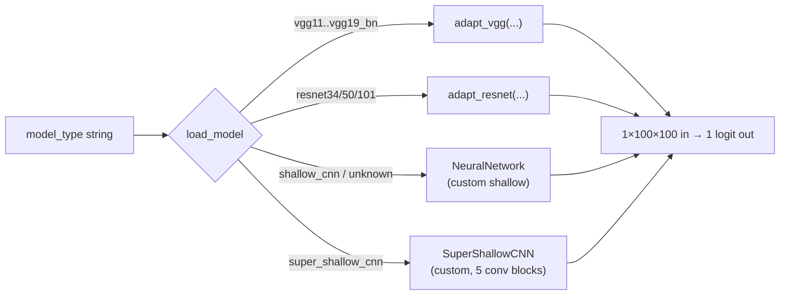

*Part of the [MMML-Alzheimer documentation](../README.md). Catalogue of every CNN architecture available to the MRI branch plus the focal loss used to train them.*

# Models & Loss Functions

This doc covers the model definitions that live in [src/models/](../../src/models/) — the CNN architectures fed to the MRI training loops and the custom focal loss. It is the "what gets instantiated" reference; the "how it gets trained" reference is [training.md](training.md), and the metrics that score these models are in [evaluation.md](evaluation.md).

Two files matter here:

- [src/models/neural_network.py](../../src/models/neural_network.py) — all architectures plus the `load_model` factory and `load_trained_model` weight loader.
- [src/models/loss.py](../../src/models/loss.py) — `WeightedFocalLoss`.

Everything in this branch is a **single-channel-input, single-logit-output binary classifier**: input is a `1×100×100` grayscale MRI slice, output is one logit converted to a probability with `sigmoid`. There is no 2-class softmax head anywhere. The cognitive/tabular and ensemble (EBM) models are documented in [training.md](training.md), not here.

---

## The model factory: `load_model`

Every architecture is reached through one string-dispatch factory ([neural_network.py#L116](../../src/models/neural_network.py#L116)):

```python
load_model(model_type='shallow_cnn', verbose=0) -> torch.nn.Module
```

It builds an **untrained** model (random init), moves it to the module-global `device` (`"cuda" if torch.cuda.is_available() else "cpu"`, [neural_network.py#L5](../../src/models/neural_network.py#L5)), and optionally prints the architecture and parameter count when `verbose > 0`.

Recognized `model_type` strings (verbatim), and what each builds:

| `model_type` string | Builds | Source |
|---|---|---|
| `'shallow_cnn'` | `NeuralNetwork()` (custom) | [#L154](../../src/models/neural_network.py#L154) |
| `'super_shallow_cnn'` | `SuperShallowCNN()` (custom) | [#L157](../../src/models/neural_network.py#L157) |
| `'vgg11'` | `adapt_vgg(models.vgg11())` | [#L118](../../src/models/neural_network.py#L118) |
| `'vgg11_bn'` | `adapt_vgg(models.vgg11_bn())` | [#L122](../../src/models/neural_network.py#L122) |
| `'vgg13'` | `adapt_vgg(models.vgg13())` | [#L130](../../src/models/neural_network.py#L130) |
| `'vgg13_bn'` | `adapt_vgg(models.vgg13_bn())` | [#L126](../../src/models/neural_network.py#L126) |
| `'vgg19'` | `adapt_vgg(models.vgg19())` | [#L138](../../src/models/neural_network.py#L138) |
| `'vgg19_bn'` | `adapt_vgg(models.vgg19_bn())` | [#L134](../../src/models/neural_network.py#L134) |
| `'resnet34'` | `adapt_resnet(models.resnet34(), linear_features=512)` | [#L142](../../src/models/neural_network.py#L142) |
| `'resnet50'` | `adapt_resnet(models.resnet50(), linear_features=2048)` | [#L146](../../src/models/neural_network.py#L146) |
| `'resnet101'` | `adapt_resnet(models.resnet101(), linear_features=2048)` | [#L150](../../src/models/neural_network.py#L150) |
| anything else | falls through to `NeuralNetwork()` | [#L160](../../src/models/neural_network.py#L160) (`else`) |

Two things to know about this factory:

- **Unknown strings silently become `shallow_cnn`.** The `else` branch returns a `NeuralNetwork()`. This is how the online trainer's `__main__` ends up training a custom CNN when it passes the string `'shallow'` (note: not `'shallow_cnn'`) — harmless here but an easy way to train the wrong thing without noticing. See [training.md](training.md) and [../reference/known-issues.md](../reference/known-issues.md).
- **The VGG/ResNet backbones are constructed WITHOUT pretrained weights.** `models.vgg19_bn()` etc. are called with no `pretrained=`/`weights=` argument, so they start from random init. (Inferred: these were trained from scratch on the MRI slices, not used for transfer learning.)

There is a second, separate `load_model` inside the online trainer ([src/model_training/mri_train_online.py](../../src/model_training/mri_train_online.py)) that only knows `'vgg11'` and otherwise returns the custom `NeuralNetwork`. The rich factory above is the one used by the current offline path. See the offline/online split in [training.md](training.md).



---

## Custom architectures

### `NeuralNetwork` — the `shallow_cnn`

Defined at [neural_network.py#L7](../../src/models/neural_network.py#L7). Despite the name, this is the default model the factory returns for unknown strings. Single-channel input, four conv layers, a fixed-size adaptive pool, and a three-layer fully-connected head ending in one logit. All conv layers use `kernel_size=3, stride=1`.

| Stage | Layer | Notes |
|---|---|---|
| `features` | `Conv2d(1→8, k3, pad1)` → `BatchNorm2d(8)` → `ReLU` → `MaxPool2d(2,2)` | only conv with `padding=1` |
| | `Conv2d(8→16, k3, pad0)` → `BatchNorm2d(16)` → `ReLU` → `MaxPool2d(2,2)` | |
| | `Conv2d(16→32, k3, pad0)` → `BatchNorm2d(32)` → `ReLU` → `MaxPool2d(2,2)` | |
| | `Conv2d(32→64, k3, pad0)` → `ReLU` | no BatchNorm on the last conv |
| `avgpool` | `AdaptiveAvgPool2d(output_size=(8,8))` | fixes spatial size to 8×8 |
| `classifier` | `Linear(64*8*8=4096 → 512)` → `ReLU` | `Dropout(0.5)` is **commented out** ([#L34](../../src/models/neural_network.py#L34)) |
| | `Linear(512 → 512)` → `ReLU` | |
| | `Linear(512 → 1)` | single logit |

`forward` flattens with `x.view(-1, 64*8*8)` ([#L49](../../src/models/neural_network.py#L49)) — this `4096` is tied to the `AdaptiveAvgPool2d((8,8))` output and the `64` channels; change one and you must change the other (the source even carries a comment reminding you to).

### `SuperShallowCNN`

Defined at [neural_network.py#L53](../../src/models/neural_network.py#L53). Deeper than the name implies — five `Conv→BN→ReLU→MaxPool` blocks with channels `1→8→16→32→64→128`, then `AdaptiveAvgPool2d((4,4))`, then a classifier `Linear(128*4*4=2048 → 128) → Linear(128 → 64) → Linear(64 → 1)`. `forward` flattens with `x.view(-1, 128*4*4)`. As in the shallow CNN, several `Dropout` lines and a couple of `print(x.size())` debug calls are commented out.

---

## Pretrained-backbone adaptations

The torchvision VGG and ResNet models expect 3-channel input and produce 1000-class output. Two helpers rewire them for single-channel MRI slices and single-logit binary output.

### `adapt_vgg(vgg)` — [neural_network.py#L179](../../src/models/neural_network.py#L179)

- First conv → 1 channel: `vgg.features[0] = Conv2d(1, 64, 3, stride=1, padding=1)`.
- Final classifier layer → binary: `vgg.classifier[-1] = Linear(in_features=4096, out_features=1, bias=True)`.

Applies to `vgg11`, `vgg11_bn`, `vgg13`, `vgg13_bn`, `vgg19`, `vgg19_bn`.

### `adapt_resnet(resnet, linear_features=512)` — [neural_network.py#L169](../../src/models/neural_network.py#L169)

- First conv → 1 channel: `resnet.conv1 = Conv2d(1, 64, 7, stride=2, padding=3)`.
- Replaces the head: `resnet.fc = Linear(linear_features→1000) → ReLU → Dropout(0.5) → Linear(1000→1)`.
- `linear_features` is `512` for `resnet34` and `2048` for `resnet50`/`resnet101` (set by `load_model`).

### `create_adapted_vgg11()` — [neural_network.py#L200](../../src/models/neural_network.py#L200)

A separate vgg11 variant used **only by the online trainer**. 1-channel first conv, then the whole classifier reworked to `7*7*512 → 2048 → 2048 → 1`. Not reachable through the standard `load_model` factory.

### `count_trainable_parameters(model)` — [neural_network.py#L191](../../src/models/neural_network.py#L191)

Prints the parameter count. Note the name is slightly misleading: it sums **all** parameters, not only those with `requires_grad=True`.

---

## Loading trained weights: `load_trained_model`

Defined at [neural_network.py#L108](../../src/models/neural_network.py#L108):

```python
load_trained_model(model='shallow_cnn', model_path='', device=device, verbose=0) -> torch.nn.Module
```

It (1) rebuilds the architecture by calling `load_model(model, ...)`, (2) loads the saved weights with
`load_state_dict(torch.load(model_path, map_location=device), strict=True)`, then (3) `.to(device)` and `.eval()`.

Two consequences for re-running experiments after a gap:

- **`strict=True`** means the `model_type` string you pass MUST produce the exact architecture saved in the `.pth`. Loading `vgg19_bn` weights into a `vgg13_bn` (or into the fallback `shallow_cnn`) raises a key-mismatch error. Match the architecture to the checkpoint name.
- **`map_location=device`** lets a GPU-trained checkpoint load on a CPU box. Useful, but note the focal loss below does NOT respect `device` (see the `.cuda()` gotcha).

Saved checkpoints are PyTorch `state_dict` files with a `.pth` extension, written by the training loop as `<model_path><model_name><MMDDYYYY_HHMM>.pth`. The naming convention and save mechanics are detailed in [training.md](training.md).

---

## The input-shape contract: `1×100×100`

Every training and scoring loop reshapes each batch to `X.view(-1, 1, 100, 100)` (e.g. [mri_train.py#L451](../../src/model_training/mri_train.py#L451), [#L493](../../src/model_training/mri_train.py#L493), [#L610](../../src/model_training/mri_train.py#L610)). So **all MRI slices are 100×100 grayscale**. This `100` is a magic number repeated in every loop — it is never parameterized. (Inferred: the MRI preprocessing stage emits 100×100 slices / 100³ volumes — see [../data/mri-preprocessing.md](../data/mri-preprocessing.md) and [../data/data-preparation.md](../data/data-preparation.md).) If you regenerate data at a different resolution, every model here breaks at the first `view`.

---

## Focal loss: `WeightedFocalLoss`

Defined at [loss.py#L6](../../src/models/loss.py#L6). This is the loss used for the harder MCI experiments (the AD-vs-CN runs mostly use weighted BCE — see [training.md](training.md)).

```python
class WeightedFocalLoss(Module):
    def __init__(self, alpha=.25, gamma=2):
        self.alpha = torch.tensor([alpha, 1-alpha]).cuda()   # <-- .cuda() hardcoded
        self.gamma = gamma
    def forward(self, inputs, targets):
        BCE_loss = binary_cross_entropy_with_logits(inputs, targets, reduction='none')
        targets = targets.type(torch.long)
        at = self.alpha.gather(0, targets.data.view(-1))
        pt = torch.exp(-BCE_loss)
        F_loss = at * (1-pt)**self.gamma * BCE_loss
        return F_loss.mean()
```

**Formula**: `FL = αₜ · (1 − pₜ)^γ · BCE`, where:

- `BCE` is binary cross-entropy computed from logits (`binary_cross_entropy_with_logits`, `reduction='none'`).
- `pₜ = exp(−BCE)` is the model's predicted probability of the true class.
- `(1 − pₜ)^γ` is the focusing term: down-weights easy, well-classified examples so training concentrates on hard ones.
- `αₜ` is a per-class weight pulled from the 2-vector `self.alpha = [alpha, 1-alpha]`, indexed by the integer label (`gather`).
- Final reduction is `mean`.

**Parameters**: defaults `alpha=0.25`, `gamma=2` — the original RetinaNet values. At runtime ([mri_train.py#L305](../../src/model_training/mri_train.py#L305)), when `additional_experiment_params['loss'] == 'FocalLoss'`, the trainer sets `alpha = pos_class / neg_class` (the ratio of positive to negative training rows) and `gamma = additional_experiment_params['loss_gamma']`. The notebooks pass `loss_gamma: 2`.

**`.cuda()` gotcha (bug).** [loss.py#L10](../../src/models/loss.py#L10) hardcodes `.cuda()` on the alpha tensor in `__init__`, so this loss **crashes on a CPU-only machine** even though the rest of the codebase computes a `device` variable and `criterion.to(device)` is called afterward. If you are re-running on a laptop or CPU box, either get a GPU or patch this line. Catalogued in [../reference/known-issues.md](../reference/known-issues.md).

---

## Which architectures were actually used

Not all eleven factory options were exercised. From the experiment notebooks (full table of runs and hyperparameters in [../experiments/experiment-management.md](../experiments/experiment-management.md) and [training.md](training.md)), the architectures with recorded runs are:

| Architecture | Where used | Notable settings |
|---|---|---|
| `vgg13_bn` | ensemble run | adam, batch 16 |
| `vgg19_bn` | primary MRI/ensemble runs (incl. data-aug, lr=1e-4) | the most-used backbone |
| `resnet34` | ensemble run | lr=1e-3, adam |
| `resnet101` | ensemble run (data-aug) | lr=1e-2, adam |
| `vgg19_bn` (MCI) | MCI experiments | sgd, FocalLoss, gamma=2, lr=5e-6 |
| `shallow_cnn` (MCI) | MCI experiments | adam/sgd, FocalLoss, gamma=2, lr=1e-5/1e-6 |

`super_shallow_cnn`, the non-BN VGGs (`vgg11`, `vgg13`, `vgg19`), `vgg11_bn`, and `resnet50` are defined but have no recorded experiment runs (inferred from the notebook inventory). The focal-loss path was reserved for the MCI tasks where class imbalance and separability are worst.

---

## See also

- [training.md](training.md) — the training loops that instantiate these models, optimizer/loss selection, early stopping, and `.pth` saving.
- [evaluation.md](evaluation.md) — `compute_metrics_binary`, ROC/AUC confidence intervals, and the DeLong test used to compare these models.
- [../data/data-preparation.md](../data/data-preparation.md) — how the 100×100 single-channel slices these models consume are produced.
- [../experiments/experiment-management.md](../experiments/experiment-management.md) — the dated-notebook tracking substrate and the full per-run hyperparameter record.
- [../reference/known-issues.md](../reference/known-issues.md) — the `.cuda()` focal-loss crash, the silent `shallow_cnn` fallback, and other gotchas referenced above.
- [explainability.md](explainability.md) — how trained CNNs and the EBM ensemble are explained locally and globally.
