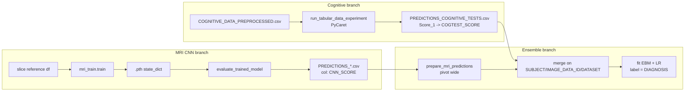
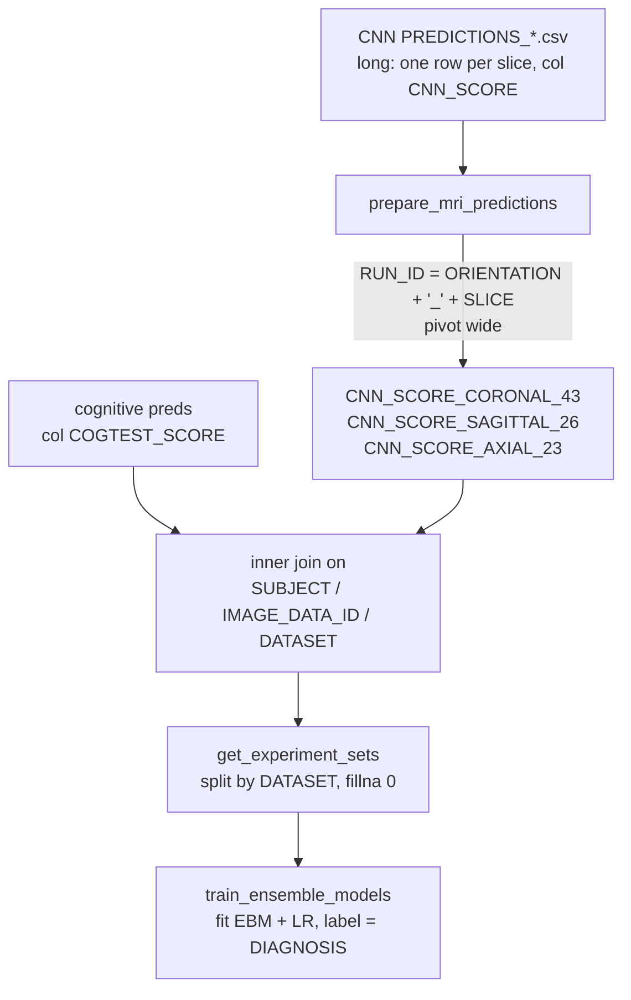

*Part of the [MMML-Alzheimer documentation](../README.md). How the three model families — MRI CNNs, the cognitive/tabular classifier, and the fusion ensemble — are trained, scored, and persisted.*

# Model Training

This pipeline trains **three independent model families** and fuses them late:

1. **MRI CNN branch** — 2D CNNs scoring single MRI slices.
2. **Cognitive/tabular branch** — a PyCaret/EBM classifier over cognitive-test + demographic columns.
3. **Ensemble (fusion) branch** — an EBM/Logistic-Regression meta-model that stacks the CNN slice scores, the cognitive score, and demographics.

Each branch is trained separately, writes its predictions to a CSV, and the next stage reads that CSV. There is no shared training entry point — everything is driven from dated notebooks under [notebooks/](../../notebooks/) that import these modules.

> **No formal experiment tracker.** There is no MLflow/W&B/sacred. The "tracking substrate" is filename conventions + CSV dumps + `.pth` weight files written to hardcoded Google-Drive/local paths. [src/experiment/run.py](../../src/experiment/run.py) is a stub (`Experiment.run()` is `pass`) and `src/experiment/experiment_config.json` is an empty skeleton `{"mri":{},"cognitive_tests":{},"ensemble":{}}`. How the dated-notebook convention actually works is documented in [experiment-management.md](../experiments/experiment-management.md).

For the architectures these loops train, see [models.md](models.md). For how the input slice references and CV folds are built, see [data-preparation.md](../data/data-preparation.md). For the metric functions and DeLong test, see [evaluation.md](evaluation.md).



---

## 1. MRI CNN training

The MRI branch has **two trainers** that do the same job differently. The choice is which `Dataset` class feeds the loop:

| Trainer | Path | Dataset | Reads | Status |
|---|---|---|---|---|
| **Offline** (primary) | [mri_train.py](../../src/model_training/mri_train.py) | `MRIDataset` | pre-extracted 2D `.npz` slices | current; used by recent ensemble notebooks |
| **Online** (legacy) | [mri_train_online.py](../../src/model_training/mri_train_online.py) | `MRIDatasetOnline` | 3D NIfTI volumes, sliced on the fly | earlier version, superseded |

Both save the same `.pth` state-dict format. Differences are catalogued in [§1.7](#17-offline-vs-online--side-by-side).

### 1.1 Offline path — call graph

[mri_train.py](../../src/model_training/mri_train.py) is the 27 KB main trainer. "Offline" means it consumes pre-extracted 2D `.npz` slice files through `MRIDataset` (`np.load(...)['arr_0']`), not raw 3D volumes. It imports `from mri_dataset import MRIDataset` and `from base_evaluation import compute_metrics_binary`.

```
run_mris_experiments(...)              # grid over orientations x slices x repeats; TRAIN only
   |- generate_mri_dataset_reference() # builds in-memory reference df (no file IO)
   |- run_cnn_experiment()             # one (model, orientation, slice) run
        |- load_model(model)
        |- setup_experiment()          # optimizer, loss, dataloaders, class balance
        |- train()                     # the loop; returns best metrics + saved .pth path
run_experiments_for_ensemble(...)      # TRAIN then SCORE; saves per-set CNN_SCORE predictions
   |- run_cnn_experiment()  -> saved_model_path
   |- evaluate_trained_model()         # reloads .pth, scores train/val/test, adds CNN_SCORE
compute_predictions_for_ensemble(...)  # SCORE ONLY across 3 orientations using existing weights
   |- evaluate_trained_model()
```

The slice reference df these functions operate on is produced by `generate_mri_dataset_reference` — its schema and augmentation logic are covered in [data-preparation.md](../data/data-preparation.md).

### 1.2 Defaults and the broken default dict

`run_cnn_experiment` ([mri_train.py#L174](../../src/model_training/mri_train.py#L174)) uses this `additional_experiment_params` default **when the caller passes `None`** ([#L206](../../src/model_training/mri_train.py#L206)):

```python
{'lr': 0.0001, 'batch_size': 16, 'optimizer': 'adam',
 'max_epochs': 100, 'early_stop': 10,
 'early_stop_metric': 'auc', 'prediction_threshold': 0.5}
```

> **Latent bug** — this default dict has no `'loss'` key, but `setup_experiment` ([#L305](../../src/model_training/mri_train.py#L305)) reads `additional_experiment_params['loss']`. Running with the built-in defaults raises `KeyError: 'loss'`. Every notebook in practice passes an explicit dict with `'loss': 'FocalLoss'`, so this never bit at runtime, but the documented default is broken. See [known-issues.md](../reference/known-issues.md).

The model name gets a timestamp suffix ([#L222](../../src/model_training/mri_train.py#L222)):

```python
model_name = model_name + datetime.now().strftime("%m%d%Y_%H%M")
```

So `cnn_coronal_43` becomes `cnn_coronal_4310272021_1530`.

### 1.3 `setup_experiment` — optimizer, loss, dataloaders

[mri_train.py#L262](../../src/model_training/mri_train.py#L262) wires the run.

**Optimizer** (string switch on `params['optimizer']`):

| `optimizer` | Constructed |
|---|---|
| `'adam'` | `Adam(model.parameters(), lr=params['lr'])` |
| `'rmsprop'` | `RMSprop(..., lr=params['lr'])` |
| anything else | `SGD(..., lr=params['lr'], momentum=params['momentum'])` |

The SGD branch reads only `momentum`. The notebooks also pass `nesterov`, `damping`, and `weight_decay` — these keys are **ignored** (dead params).

**DataLoaders:**

| Split | batch_size | shuffle | num_workers | pin_memory |
|---|---|---|---|---|
| train | `params['batch_size']` | `True` | 4 | `False` |
| validation ([#L287](../../src/model_training/mri_train.py#L287)) | 1024 | `False` | — | — |
| test ([#L290](../../src/model_training/mri_train.py#L290)) | 1024 | `False` | — | — |

Dataset class is `MRIDataset` (offline, reads `.npz`).

**Class balance / loss selection** ([#L300](../../src/model_training/mri_train.py#L300)–311):

- `neg_class` = #train rows with `MACRO_GROUP == 0`; `pos_class` = `== 1`.
- If `params['loss'] == 'FocalLoss'` → `WeightedFocalLoss(alpha=pos_class/neg_class, gamma=params['loss_gamma'])`.
- Else → `BCEWithLogitsLoss(pos_weight=ones([1]) * (neg_class/pos_class), reduction='mean')`.
- `criterion.to(device)`.

The focal-loss formula, defaults (`alpha=0.25`, `gamma=2`), and its hardcoded `.cuda()` portability bug are documented in [models.md](models.md#focal-loss).

### 1.4 `return_sets` — split semantics and the validation/test filter

[mri_train.py#L315](../../src/model_training/mri_train.py#L315) defines how the `MACRO_GROUP` label is recoded and how train/val/test are filtered from the reference df. This is the single source of truth for the reference-CSV schema the loop expects.

**Label recoding** from string diagnosis to {0,1} based on the `classes` set:

| `classes` | 0 | 1 |
|---|---|---|
| `{'AD','CN'}` | CN | AD |
| `{'MCI','CN'}` | CN | MCI |
| `{'MCI','AD'}` | MCI | AD |

Only rows with `MACRO_GROUP in {0,1}` are kept.

**Validation / test filter** ([#L328](../../src/model_training/mri_train.py#L328)) — the important detail for reproducing numbers:

```python
"DATASET == 'set' and SLICE == MAIN_SLICE"   # 'set' replaced by 'validation'/'test'
```

If the column `ROTATION_ANGLE` exists, it also appends `" and (ROTATION_ANGLE == 0 or ROTATION_ANGLE == '0')"`.

So **validation and test use only the central, un-rotated slice — no augmentation**. Train is everything else: `DATASET not in ('validation','test')`, which sweeps in all augmented sampled slices and rotations (and any unlabeled `DATASET` — NaN, `'train'`, `'train_cnn'` — all become training rows).

This proves the reference CSV carries: **`MACRO_GROUP`**, **`DATASET`** (values `'validation'`, `'test'`, else train), **`SLICE`**, **`MAIN_SLICE`**, and optionally **`ROTATION_ANGLE`**. The full column dictionary is in [data-semantics.md](../data/data-semantics.md).

### 1.5 `train` — the loop

[mri_train.py#L341](../../src/model_training/mri_train.py#L341)–434.

- `model.to(device)`, `model.train()`.
- Per epoch: `train_one_epoch` (backprop) then `evaluate_one_epoch` on **train** and on **validation** (no-grad; metrics + loss).
- History lists tracked: `train_losses`, `validation_losses`, `train_aucs`, `validation_aucs`, `train_f1s`, `validation_f1s`.

**Early stopping** ([#L389](../../src/model_training/mri_train.py#L389)–411), keyed on `early_stopping_metric` (default `'auc'`):

- If the current validation metric does **not exceed** `best_validation_metric`, increment `early_stopping_marker`.
- Else record a new best — `best_epoch`, `best_model_params = deepcopy(state_dict)`, best train/val metrics and losses — and reset the marker to 0.
- Stop when `early_stopping_marker == early_stopping_epochs`.

> **Subtle save bug** ([#L413](../../src/model_training/mri_train.py#L413)) — the "max epochs reached, save anyway" check is `if (best_epoch) == max_epochs`. If the best epoch is not literally the last epoch and early stopping never triggers, **the model is never saved**. Saving only reliably happens on the early-stop branch. Catalogued in [known-issues.md](../reference/known-issues.md).

**The deepcopy + eval() prediction-stability fix.** Best weights are captured with `deepcopy(state_dict)` rather than a reference, so later epochs cannot mutate the saved-best in place. At scoring time the model is reloaded and set to `.eval()` before prediction (see `load_trained_model` in [models.md](models.md)), which freezes BatchNorm running stats and disables dropout — without it, BN-bearing backbones (every VGG/ResNet here) would give batch-dependent, non-deterministic logits.

**Metrics plotting.** `plot_metric` draws Loss / AUC / F1 (train vs val) with matplotlib `plt.show()` ([#L419](../../src/model_training/mri_train.py#L419)–425). **Plots are shown, not saved** — only meaningful inside a notebook.

`train` returns `(best_train_metrics, best_validation_metrics, final_model_path)`.

#### `train_one_epoch` / `evaluate_one_epoch` ([#L443](../../src/model_training/mri_train.py#L443)–510)

- Both reshape `X = X.view(-1, 1, 100, 100)`, `y = y.view(-1, 1)`, cast `y = y.type_as(y_pred)`. The hardcoded **100×100 single-channel** input shape is the same magic number repeated across every loop (see [models.md](models.md#input-shape-contract)).
- `train_one_epoch`: standard `zero_grad -> forward -> loss -> backward -> step`; accumulates `running_loss`, returns `running_loss / len(dataset)` (divides by **sample count**, not #batches, so reported loss is per-sample and tiny).
- `evaluate_one_epoch`: no-grad, `predicted_probas = torch.sigmoid(logits)`, then `compute_metrics_binary(y_true, y_pred_proba=probas, threshold=0.5)`. Returns `(metrics, running_loss, predicted_probas)`.

### 1.6 Model saving and prediction export

#### Save format and path ([#L407](../../src/model_training/mri_train.py#L407)–417)

```python
final_model_path = model_path + model_name + '.pth'
torch.save(best_model_params, final_model_path)   # best_model_params = state_dict
```

- **Format:** PyTorch `state_dict` (weights only), `.pth` extension.
- **Path** is string concatenation `model_path + model_name + '.pth'` — `model_path` must end in `/`. If `model_path == ''`, **nothing is saved** (`final_model_path` stays `''`).
- **Filename pattern:** `<model_name><MMDDYYYY_HHMM>.pth`. From `run_experiments_for_ensemble` the base name is `'cnn_' + orientation + '_' + str(slice)` (e.g. `cnn_coronal_43...pth`), and the `model_path` argument is itself suffixed `model_path + '_' + orientation + '_' + slice` before being passed ([#L159](../../src/model_training/mri_train.py#L159)) — so orientation/slice land in **both** the dir-prefix and the filename.

Because `strict=True` on reload (see [models.md](models.md)), the architecture string passed at scoring time must match the checkpoint exactly.

#### Prediction export — `evaluate_trained_model` ([#L532](../../src/model_training/mri_train.py#L532)–590)

- Loads a trained model via `load_trained_model` if `model` is a string; builds the reference df (passed in or via `generate_mri_dataset_reference`); splits via `return_sets`.
- For each of Training / Validation / Test, calls `evaluate_model_on_dataset(...)`, which scores with `predicted_probas = torch.sigmoid(logits)` and writes them into a **new column `CNN_SCORE`** (`df['CNN_SCORE'] = predictions.astype(float)`, [#L582](../../src/model_training/mri_train.py#L582)).
- Concatenates all three splits and, if `save_predictions_path != ''`, calls `to_csv(save_predictions_path, index=False)`.

So the CNN's per-image probability is persisted under the column **`CNN_SCORE`** — the key column the ensemble later consumes.

`evaluate_model_on_dataset` ([#L592](../../src/model_training/mri_train.py#L592)–624) uses a DataLoader with `batch_size=512, num_workers=4, shuffle=False` and returns `(metrics, probas)`.

#### Where prediction CSVs land

`run_experiments_for_ensemble(..., save_path=...)` writes one concatenated predictions CSV. Hardcoded `save_path` values observed in [20211027_Run_CNN_VGG19_for_ensemble.ipynb](../../notebooks/20211027_Run_CNN_VGG19_for_ensemble.ipynb), all under `/content/gdrive/MyDrive/Lucas_Thimoteo/data/`:

| File | Model |
|---|---|
| `PREDICTIONS_VGG13_BN.csv` | vgg13_bn |
| `PREDICTIONS_VGG19_BN.csv` | vgg19_bn |
| `PREDICTIONS_VGG19_BN_DATA_AUG.csv` | vgg19_bn + rotation aug |
| `PREDICTIONS_VGG19_BN_DATA_AUG_LR_0001.csv` | vgg19_bn, lr=1e-4 |
| `PREDICTIONS_RESNET34.csv` | resnet34, lr=1e-3 |
| `PREDICTIONS_RESNET101_DATA_AUG.csv` | resnet101, lr=1e-2 |

Other notebooks reference `PREDICTIONS_AD_VGG19_BN.csv`, `PREDICTIONS_MCI_VGG19_BN_1125.csv`, etc. The per-run metrics grid from `run_mris_experiments(save_path=...)` is dumped to files like `TEST_MCI_SELECTED.csv` — one row per orientation/slice/run with `train_*` and `validation_*` metric columns (built in `run_cnn_experiment` [#L237](../../src/model_training/mri_train.py#L237)–244) plus `orientation`, `slice`, `run`, `RUN_ID` (added in `run_mris_experiments` [#L105](../../src/model_training/mri_train.py#L105)–108). See [experiment-management.md](../experiments/experiment-management.md) for the naming conventions.

#### Hyperparameters actually used (from notebooks)

| Notebook / model | lr | batch | optim | loss | gamma | max_ep | early_stop | aug (rot/samples) |
|---|---|---|---|---|---|---|---|---|
| VGG13_BN ensemble | (defaults -> KeyError unless loss set) | 16 | adam | — | — | 100 | 10 | 0/0 |
| ResNet34 ensemble | 0.001 | 16 | adam | — | — | 100 | 10 | 0/0 |
| ResNet101 DA | 0.01 | 16 | adam | — | — | 100 | 15 | 3/0 |
| VGG19_BN DA lr1e-4 | 0.0001 | 16 | adam | — | — | 100 | 15 | 3/0 |
| MCI VGG19_BN FocalLoss | 0.000005 | 64/128 | sgd | FocalLoss | 2 | 200 | 50 | 2/0 |
| MCI shallow_cnn FocalLoss | 1e-5 / 1e-6 | 128 | adam/sgd | FocalLoss | 2 | 200 | 50 | 2/0 |

`early_stop_metric` is always `'auc'`; `prediction_threshold` always `0.5`. The SGD runs pass `momentum: 0.99` plus the ignored `nesterov`/`damping`/`weight_decay` keys.

### 1.7 Offline vs online — side by side

[mri_train_online.py](../../src/model_training/mri_train_online.py) (18.9 KB) is the earlier trainer. It slices 2D images on the fly from 3D NIfTI volumes via `MRIDatasetOnline` (`ants.image_read(...).numpy()` then slice), instead of reading pre-saved `.npz` 2D arrays. It is largely superseded; the recent ensemble notebooks use the offline path.

| Aspect | Offline ([mri_train.py](../../src/model_training/mri_train.py)) | Online ([mri_train_online.py](../../src/model_training/mri_train_online.py)) |
|---|---|---|
| Dataset class | `MRIDataset` (`.npz`, `['arr_0']`) | `MRIDatasetOnline` (ANTs read + slice live) |
| Loss | FocalLoss or weighted BCE | plain `BCEWithLogitsLoss()` (no pos_weight; weighting line commented out, #L134) |
| Model factory | rich `load_model` (vgg/resnet/shallow) | local `load_model`: only `'vgg11'` -> `create_adapted_vgg11()`, else `NeuralNetwork()` |
| Early-stop metric | configurable (`auc` default) | hardcoded on `validation_metrics['auc']` |
| `return_sets` filter | `SLICE == MAIN_SLICE` + rotation==0 | simple `DATASET=='validation'/'test'` (no slice filter) |
| Has `__main__` | no | yes (a "Coronal 50 experiment", #L441–459) |
| Prediction columns | `CNN_SCORE` | `CNN_PREDICTION` (bool) + `CNN_PREDICT_PROBA` (float) |
| `compute_metrics_binary` | imported from `base_evaluation` | redefined locally (#L371–408) |

Save concept is identical: `torch.save(best_model_params, model_path + model_name + '.pth')` ([#L255, #L260](../../src/model_training/mri_train_online.py#L255)). The legacy default `model_path` is a hardcoded Drive path `/content/gdrive/MyDrive/Lucas_Thimoteo/mmml-alzheimer-diagnosis/models/`. `run_cnn_experiment` here reloads the saved `.pth`, runs `test(...)`, then `compute_predictions_for_dataset` adds `CNN_PREDICTION`/`CNN_PREDICT_PROBA` to each split and concatenates — but the final `to_csv` is **commented out** ([#L95](../../src/model_training/mri_train_online.py#L95)), so online predictions are returned in memory only.

> The online `__main__` block ([#L441](../../src/model_training/mri_train_online.py#L441)–459) is **partially broken/dead**: it passes kwargs (`ensemble_reference_path`, `mri_orientation`, `mri_slice`, `prediction_dataset_path`) that do not exist in this `run_cnn_experiment` signature -> `TypeError`. The local `compute_metrics_binary` also shadows the imported one, and an imported `train_test_split` is never used. See [known-issues.md](../reference/known-issues.md).

The two `Dataset` classes (`MRIDataset` and `MRIDatasetOnline`, plus the dead `MRIDatasetOnline2`) and their reference-schema differences (uppercase `ORIENTATION`/`SLICE`/`ROTATION_ANGLE` offline vs lowercase `orientation`/`slice_num`/`rotation_angle` online) are documented in [data-preparation.md](../data/data-preparation.md).

---

## 2. Cognitive / tabular training

[cognitive_tests_train.py](../../src/model_training/cognitive_tests_train.py) (8.2 KB) trains classifiers on cognitive-test + demographic tabular data, primarily via **PyCaret** (`from pycaret.classification import *`) plus a direct `ExplainableBoostingClassifier` (interpret-ml).

### 2.1 `run_tabular_data_experiment` ([#L15](../../src/model_training/cognitive_tests_train.py#L15)–105)

Signature defaults (the `/content/gdrive/...` paths are hardcoded):

```python
run_tabular_data_experiment(
  cognitive_tests_data_path='.../data/tabular/COGNITIVE_DATA_PREPROCESSED.csv',
  ensemble_data_path='.../data/tabular/PROCESSED_ENSEMBLE_REFERENCE.csv',
  experiment_name='ADNI_CN_AD', labels=[0, 1], label_column='DIAGNOSIS',
  n_splits=5, selected_models=['lr', 'svm', 'lightgbm', 'et'],
  model_path='', output_path='')
```

**Data loading and join** ([#L50](../../src/model_training/cognitive_tests_train.py#L50)–56):

- `df_adni_merge = pd.read_csv(cognitive_tests_data_path).dropna()`.
- `df_ensemble = pd.read_csv(ensemble_data_path).query("CONFLICT_DIAGNOSIS == False")` — the ensemble reference carries `CONFLICT_DIAGNOSIS` (bool).
- Merge cognitive ⨝ ensemble on `['SUBJECT','IMAGEUID']`, bringing in `['SUBJECT','IMAGEUID','DATASET']`. The **`DATASET` split assignment lives in the ensemble reference** and is joined into the cognitive table.
- Split by `DATASET`: train = `not in ('validation','test')`, then filter `DIAGNOSIS in @labels`. Each split **drops** `['VISCODE','SITE','COLPROT','EXAMDATE','ORIGPROT','RACE','DIAGNOSIS_BASELINE']`.

**Feature schema** (PyCaret `setup` params, [#L59](../../src/model_training/cognitive_tests_train.py#L59)–69) — the authoritative column list for this branch:

| Role | Columns |
|---|---|
| `categorical_features` | `MALE`, `HISPANIC`, `RACE_WHITE`, `RACE_BLACK`, `RACE_ASIAN`, `MARRIED`, `WIDOWED`, `DIVORCED`, `NEVER_MARRIED` |
| `numeric_features` | `AGE`, `YEARS_EDUCATION`, `CDRSB`, `ADAS11`, `ADAS13`, `ADASQ4`, `MMSE`, `RAVLT_immediate`, `RAVLT_learning`, `RAVLT_forgetting`, `RAVLT_perc_forgetting`, `TRABSCOR`, `FAQ`, `MOCA` |
| `ignore_features` | `RID`, `SUBJECT`, `IMAGEUID`, `DATASET` |

Other `setup` args: `target = label_column` (`'DIAGNOSIS'`), `transformation=True`, `remove_multicollinearity=False`, `session_id=1`, `silent=True`, `verbose=1`. `data = df_train`, `test_data = df_validation` (PyCaret's "test_data" is the held-out validation here), `fold_strategy='stratifiedkfold'`, `fold=5`. These column meanings are dictionaried in [data-semantics.md](../data/data-semantics.md).

**Training and selection** ([#L80](../../src/model_training/cognitive_tests_train.py#L80)–96):

- `compare_models(include=selected_models, sort='AUC', n_select=5, turbo=True, cross_validation=True)` ranks candidates by CV AUC and keeps the top 5.
- `pull()` grabs the comparison grid into `df_validation_results` (immediately overwritten by `compute_results`).
- `compute_results(df, trained_models)` ([#L107](../../src/model_training/cognitive_tests_train.py#L107)–117) scores each model with `predict_model(model, raw_score=True)`, pulls `Score_1` (prob of class 1) or falls back to `Label`, computes `compute_metrics_binary(...)`, and returns a sorted-by-AUC DataFrame with `model = type(model).__name__`.
- Picks `model = trained_models[0]` (best). Scores train/val/test with `predict_model(..., raw_score=True)`, concatenates into `df_predictions`, and adds column `TABULAR_MODEL = type(model).__name__`.

> **No model persistence.** Model saving is a TODO — `if model_path...: pass  # TODO: save model with pycaret or similar` ([#L100](../../src/model_training/cognitive_tests_train.py#L100)). **No tabular model artifact is ever written.** On a 4-year cold start this means the cognitive model must be retrained from scratch; only the predictions survive. See [known-issues.md](../reference/known-issues.md).

**Predictions.** If `output_path` is set, `df_predictions.to_csv(output_path, index=False)`. PyCaret's `predict_model(raw_score=True)` adds columns **`Label`, `Score_0`, `Score_1`** (probabilities) — these get persisted, plus the original cols and `TABULAR_MODEL`. The canonical output file is `PREDICTIONS_COGNITIVE_TESTS.csv`.

### 2.2 Models and the script body

Model ids used: `'lr'` (LogisticRegression), `'svm'` (SVM), `'lightgbm'` (LGBM), `'et'` (ExtraTrees), plus `ExplainableBoostingClassifier` (interpret-ml EBM). There is **no `tune_model` / explicit hyperparameter grid** — tuning is just PyCaret's default `compare_models` cross-validation with default estimator params. The `n_splits` arg is accepted but the code hardcodes `fold=5`.

The script body / `# %%`-cell section ([#L120](../../src/model_training/cognitive_tests_train.py#L120)–164) runs with **local relative paths** that override the Drive defaults:

```
cognitive_tests_data_path = './../../data/COGNITIVE_DATA_PREPROCESSED.csv'
ensemble_data_path        = './../../data/PROCESSED_ENSEMBLE_REFERENCE.csv'
output_path               = './../../data/PREDICTIONS_COGNITIVE_TESTS.csv'
selected_models = ['lightgbm', 'lr', ExplainableBoostingClassifier()]
```

(Note `selected_models` mixes PyCaret string ids and a concrete estimator instance.)

> **Dead code** — lines [#L149](../../src/model_training/cognitive_tests_train.py#L149)–157 call `run_ensemble_experiment(...)`, which is **never defined anywhere in the repo** (grep finds 0 defs) -> `NameError`. The real ensemble experiments live in `ensemble_train.py` + notebooks. That dead block also reads `./../../data/PREDICTIONS_VGG19_BN_DATA_AUG_LR_0001.csv` and would write `./../../data/PREDICTIONS_ENSEMBLE.csv`. See [known-issues.md](../reference/known-issues.md).

---

## 3. Ensemble (fusion) training

[ensemble_train.py](../../src/model_training/ensemble_train.py) (2.7 KB) is the late-fusion meta-model layer. It does **not** retrain CNNs or the cognitive model — it consumes their saved prediction CSVs and fits sklearn/EBM classifiers on the stacked scores. The file is mostly data-assembly helpers; the actual `.fit()` driving happens in the ensemble notebooks (e.g. [20211227_Ensemble_Results_AD.ipynb](../../notebooks/20211227_Ensemble_Results_AD.ipynb)).

### 3.1 Feature assembly



**`prepare_mri_predictions(mri_data_path)`** ([#L18](../../src/model_training/ensemble_train.py#L18)–26):

- Reads the CNN predictions CSV (the `CNN_SCORE` files from [§1.6](#where-prediction-csvs-land)).
- Builds `RUN_ID = ORIENTATION + '_' + SLICE` (e.g. `coronal_43`).
- Keeps `['SUBJECT','IMAGE_DATA_ID','ORIENTATION','SLICE','CNN_SCORE','MACRO_GROUP','DATASET','RUN_ID']`; fills missing `DATASET` with `'train_cnn'`.
- **Pivots** so each `RUN_ID` becomes its own `CNN_SCORE` column: `pivot_table(index=['SUBJECT','IMAGE_DATA_ID','DATASET','MACRO_GROUP'], values=['CNN_SCORE'], columns=['RUN_ID'])`, then flattens names to `CNN_SCORE_<RUN_ID upper>`, e.g. **`CNN_SCORE_CORONAL_43`**, `CNN_SCORE_SAGITTAL_26`, `CNN_SCORE_AXIAL_23`. -> **one feature per orientation/slice CNN.**

**`prepare_ensemble_experiment_set(cognitive_predictions_path, mri_predictions_path)`** ([#L9](../../src/model_training/ensemble_train.py#L9)–16):

- MRI side from above. Cognitive side reads `cognitive_predictions_path` and keeps `['SUBJECT','IMAGE_DATA_ID','DATASET','COGTEST_SCORE','DIAGNOSIS']`, filtered to `DATASET in ('train','test','validation')`.
- **Inner-joins MRI ⨝ cog on `['SUBJECT','IMAGE_DATA_ID','DATASET']`**, drops `MACRO_GROUP`, indexes by `IMAGE_DATA_ID`, sorts.
- Final ensemble feature frame columns: the per-slice `CNN_SCORE_*`, **`COGTEST_SCORE`** (single cognitive probability), and `DIAGNOSIS` (label). Demographic columns (`AGE`, `MALE`, `YEARS_EDUCATION`, `HISPANIC`, `CDRSB`, `RACE_*`, `WIDOWED`, ...) are merged in **inside the notebooks** ([20211227_Ensemble_Results_AD.ipynb](../../notebooks/20211227_Ensemble_Results_AD.ipynb) cells 36/37/46/52).

> **Column-name caveat** — the cognitive trainer outputs `Score_1`/`Label`/`TABULAR_MODEL`, **not** `COGTEST_SCORE`. The `COGTEST_SCORE` column is created by **renaming inside the ensemble-results notebooks** before `to_csv(...)` (e.g. `PREDICTIONS_AD_COG_TESTS.csv`). So a manual rename step lives only in notebooks between the cognitive stage and this one. When re-running cold, this rename must be redone or the inner join silently drops the cognitive score.

**`get_experiment_sets(df_ensemble, cols_to_drop=['SUBJECT','DATASET'])`** ([#L28](../../src/model_training/ensemble_train.py#L28)–32): splits by `DATASET == 'train'/'validation'/'test'`, drops the id columns, and `.fillna(0)` — so NaN CNN scores for missing slices become 0.

### 3.2 The fusion models

**`train_ensemble_models(df_train, label, models)`** ([#L34](../../src/model_training/ensemble_train.py#L34)–39): a plain loop calling `model.fit(df_train.drop(label, axis=1), df_train[label])` for each model and returning the fitted list. **No persistence** — the fitted ensemble lives only in the notebook session.

Models used (from [20211227_Ensemble_Results_AD.ipynb](../../notebooks/20211227_Ensemble_Results_AD.ipynb)):

```python
ebm, lr = ExplainableBoostingClassifier(), LogisticRegression()
models = [ebm, lr]   # sometimes LogisticRegression(max_iter=1000)
```

So the fusion classifiers are **EBM and Logistic Regression**. The EBM is the model whose glassbox structure feeds the global/local explanations — see [explainability.md](explainability.md). Evaluation and threshold selection are delegated to `model_evaluation/ensemble_evaluation.py` + `base_evaluation.calculate_and_plot_roc` — see [evaluation.md](evaluation.md).

`DummyModel` + subclasses ([#L41](../../src/model_training/ensemble_train.py#L41)–65) are pass-through "models" whose `predict_proba(X)` returns one chosen slice column as the probability (`np.array([1-x, x]).T`). The subclasses are **empty marker classes** that exist only so `type(model).__name__` produces nice ROC-plot labels: `CNNCoronal`, `CNNAxial`, `CNNSagittal`, `CNN3Slices`, `CNN3SlicesCogScore`, `CNN3SlicesDemographics`, `CDRSB`. (`DummyModel.predict` has a bug — it mutates `x` but returns `None`; only `predict_proba` is used.)

### 3.3 Experiment configurations (from notebook)

Each "experiment" is a different feature subset fed to `[ebm, lr]`:

| Experiment | Features (besides the 3 `CNN_SCORE_*` slices) | cols dropped |
|---|---|---|
| CNN + cog score | `COGTEST_SCORE` | SUBJECT, DATASET |
| CNN 3 slices only | — | SUBJECT, DATASET, COGTEST_SCORE |
| CNN + demographics | `AGE`, `MALE`, `YEARS_EDUCATION`, `WIDOWED` (+race) | + COGTEST_SCORE |
| CNN + demo + CDRSB | adds `CDRSB` | + COGTEST_SCORE |
| CDRSB alone | only `CDRSB` | DATASET, COGTEST_SCORE |

Label column throughout: **`DIAGNOSIS`**. Ensemble predictions are written by the notebooks to files like `PREDICTIONS_ENSEMBLE.csv` / `PREDICTIONS_AD_*.csv`.

---

## 4. Artifact persistence summary

This is where everything lands — the entire "tracking substrate." See [experiment-management.md](../experiments/experiment-management.md) for how the dated-notebook convention organizes these.

| Artifact | Producer | Format / naming |
|---|---|---|
| CNN weights | `mri_train.train` / `mri_train_online.train` | `<model_path><model_name><MMDDYYYY_HHMM>.pth`, torch `state_dict` |
| CNN per-image scores | `evaluate_trained_model` | CSV, adds col `CNN_SCORE`; files `PREDICTIONS_*<MODEL>*.csv` |
| CNN per-run metrics grid | `run_mris_experiments` | CSV, `train_*`/`validation_*` + `orientation,slice,run,RUN_ID` |
| Tabular preds | `run_tabular_data_experiment` | CSV `PREDICTIONS_COGNITIVE_TESTS.csv`, cols `Label,Score_0,Score_1,TABULAR_MODEL` |
| Tabular model weights | (none) | **TODO / not saved** |
| Cog "final" preds (renamed) | notebooks | `PREDICTIONS_*_COG_TESTS.csv`, col `COGTEST_SCORE` |
| Ensemble preds / ROC tables | notebooks | `PREDICTIONS_ENSEMBLE.csv` / in-memory `df_rocs_*` |
| Ensemble model weights | (none) | **not saved** |

Two path conventions appear across history: **Colab/Drive** (`/content/gdrive/MyDrive/Lucas_Thimoteo/...`) in older notebooks, and **local** (`/home/lucas/projects/mmml-alzheimer-diagnosis/data/...` or `./../../data/...`) in newer ones. The on-disk layout is described in [data-structure.md](../data/data-structure.md).

> **Cold-start consequence (returning after 4 years).** Only **CNN weights** and the **prediction CSVs** are persisted. The cognitive model and the ensemble model are **never saved** — to reproduce results you must rerun [cognitive_tests_train.py](../../src/model_training/cognitive_tests_train.py) and the ensemble notebook fit cells, then redo the manual `Score_1 -> COGTEST_SCORE` rename. The metrics for CNNs are saved as a grid CSV; tabular/ensemble metrics are computed in-notebook and printed/returned, not auto-saved. Full runbook: [running-experiments.md](../experiments/running-experiments.md).

---

## See also

- [models.md](models.md) — the CNN architectures, the model factory, and `WeightedFocalLoss` these loops train.
- [data-preparation.md](../data/data-preparation.md) — how the slice reference df, augmentation, and CV folds that feed these loops are built.
- [evaluation.md](evaluation.md) — `compute_metrics_binary`, ROC/AUC CIs, and the DeLong test applied to these predictions.
- [explainability.md](explainability.md) — local and global XAI on the trained EBM ensemble.
- [experiment-management.md](../experiments/experiment-management.md) — the dated-notebook + CSV tracking substrate these artifacts land in.
- [running-experiments.md](../experiments/running-experiments.md) — end-to-end runbook for a fresh experiment.
- [known-issues.md](../reference/known-issues.md) — full catalogue of the stubs, bugs, and gotchas flagged above.
