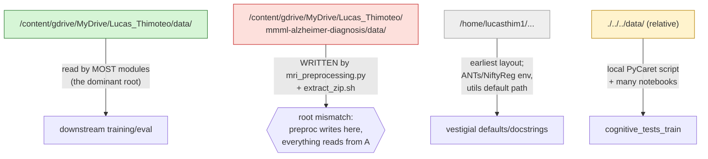

*Part of the [MMML-Alzheimer documentation](../README.md). The consolidated catalogue of bugs, stubs, dead code, hardcoded values, and "won't-run-after-4-years" hazards — every other doc links here.*

# Known Issues, Stubs & Gotchas

This is the single catalogue every other doc points to when it flags something inline. If you are returning to this repo after a long break, read [§0 Read this first](#0-read-this-first) before re-running anything, then use the grouped tables to find the specific fix for whatever you are about to touch.

The honest framing: there is **no committed data, no committed model weights, no central config, and no working orchestrator**. The repo is a collection of scripts and notebooks driven by hand, with hardcoded Google-Colab paths and several latent bugs that surface only when you run them. Most issues below are cheap one-line fixes once you know they exist.

---

## 0. Read this first

The six hazards most likely to stop a fresh run cold, in priority order:

| # | Hazard | One-line fix | Detail |
|---|---|---|---|
| 1 | `ADNIMERGE.csv` no longer exists — ADNI ships the **ADNIMERGE2 R package** and discontinued the flat `adnimerge` table | Rebuild it with [scripts/rebuild_adnimerge_from_adnimerge2.py](../../scripts/rebuild_adnimerge_from_adnimerge2.py) | [adnimerge2.md](../data/adnimerge2.md) |
| 2 | `np.float` removed in NumPy ≥ 1.24 → DeLong test crashes | Replace `np.float` with `np.float64`/`float` | [§5](#5-python--library-rot-wont-run-on-modern-stacks) |
| 3 | Build the Python env — `requirements.txt` was rebuilt (2026-06-24) and now lists the full set (it previously installed almost nothing) | `uv venv --python 3.11 && uv pip install -r requirements.txt` | [§5](#5-python--library-rot-wont-run-on-modern-stacks) |
| 4 | Two incompatible hardcoded path roots; no central config | Pick one root, edit each module's `__main__` | [§4](#4-paths-config--environment) |
| 5 | `WeightedFocalLoss` hardcodes `.cuda()` → crashes on CPU/MPS | Use the module `device` | [§3](#3-model-training-bugs) |
| 6 | CNN default params omit `'loss'` → `KeyError` | Always pass an explicit param dict with `'loss'` | [§3](#3-model-training-bugs) |

For the full re-run procedure that works around all of these, see [running-experiments.md](../experiments/running-experiments.md) and the acquisition runbook in [data-acquisition.md](../data/data-acquisition.md).

---

## 1. Empty stubs & dead orchestration

The intended top-level pipeline driver was never built. Every "run the whole thing" entry point is a 0-byte file. The real entry points live inside each feature directory as scripts with their own `__main__`/`argparse` blocks (most commented out), and are actually driven from the notebooks.

| Issue | Location | Impact | Suggested fix |
|---|---|---|---|
| `src/run/` orchestration layer is 4 × 0-byte files | [src/run/data_preprocessing.py](../../src/run/data_preprocessing.py), [data_preparation.py](../../src/run/data_preparation.py), [experiment.py](../../src/run/experiment.py), [experiment_explanation.py](../../src/run/experiment_explanation.py) | There is **no single-command runner**. Looking here for "how do I run it" finds nothing. No `src/run/__init__.py` either. | Don't expect a CLI runner. Drive each stage from a notebook or by calling the module functions directly (see [running-experiments.md](../experiments/running-experiments.md)). |
| `Experiment.run()` is a `pass` stub; the config loader is only a comment | [src/experiment/run.py#L15](../../src/experiment/run.py#L15) | The `Experiment` class (intended to read a config JSON and store `results`/`best_validation_results`/`best_train_results`/`test_results`) does nothing. | Treat as aspirational. Use the per-feature scripts. |
| `experiment_config.json` is an empty 3-key skeleton, never read by any code | [src/experiment/experiment_config.json](../../src/experiment/experiment_config.json) | `{"mri":{}, "cognitive_tests":{}, "ensemble":{}}` — all three sub-dicts empty. `grep experiment_config` finds **zero** readers in `src/`. | Dead config. Ignore unless you decide to finish the `Experiment` class. |
| `src/model_evaluation/mri_evaluation.py` is **0 bytes** | [src/model_evaluation/mri_evaluation.py](../../src/model_evaluation/mri_evaluation.py) | There is no MRI-specific evaluation module. MRI/CNN scoring is done by treating per-slice `CNN_SCORE_*` columns as "models" (strings) fed into the generic [base_evaluation.py](../../src/model_evaluation/base_evaluation.py) functions — see [evaluation.md](../modeling/evaluation.md). | None needed; this is just an empty placeholder. Don't go looking here for eval logic. |
| `src/model_training/__init__.py` is empty (0 bytes) | [src/model_training/__init__.py](../../src/model_training/__init__.py) | Package marker only; combined with the `sys.path.append` import style ([§4](#4-paths-config--environment)) the package is never imported as `mmml_training.*`. | None — expected. |
| `mri_label.py` is entirely commented out | [src/data_preprocessing/mri_label.py](../../src/data_preprocessing/mri_label.py) | The image-renaming-by-label step was abandoned. Referenced as a comment in [mri_preprocessing.py#L24](../../src/data_preprocessing/mri_preprocessing.py#L24) and `:135`. The "Labeling" step in the README does **not** run. | Skip it. It is not part of the working pipeline. |
| `compare_ensembles_performance_on_dataset` is a `pass` stub | [src/model_evaluation/ensemble_evaluation.py#L9](../../src/model_evaluation/ensemble_evaluation.py#L9) (body ends `pass` at `:22`) | Docstring promises AUC/Accuracy/F1/Recall/Precision bar plots; never implemented. | Use `compare_ensembles_rocs_on_dataset` / `calculate_rocs_on_datasets` instead. |
| `MRIDatasetOnline2` references undefined `self.T`/`transforms`/`rgb_mean`/`rgb_std` | [src/model_training/mri_dataset_online.py#L107](../../src/model_training/mri_dataset_online.py#L107) | Would crash on `__init__`. Dead/broken duplicate, never used. | Ignore. Use `MRIDataset` (offline) per [training.md](../modeling/training.md). |
| `cognitive_tests_train.py` bottom cells call undefined `run_ensemble_experiment` | [src/model_training/cognitive_tests_train.py#L149](../../src/model_training/cognitive_tests_train.py#L149) | The "Experimenting ensemble" cells raise `NameError` (grep confirms 0 definitions). Real ensemble logic is in [ensemble_train.py](../../src/model_training/ensemble_train.py) + notebooks. | Don't run those cells. |
| `mri_train_online.py::__main__` passes kwargs that don't exist in the signature | [src/model_training/mri_train_online.py](../../src/model_training/mri_train_online.py) (lines 441–459) | Passes `ensemble_reference_path`, `mri_orientation`, `mri_slice`, `prediction_dataset_path` → `TypeError`. The whole online trainer is legacy, superseded by `mri_train.py`. | Use the offline `mri_train.py` path. |
| `DummyModel.predict` mutates `x` and returns `None` | [src/model_training/ensemble_train.py#L41](../../src/model_training/ensemble_train.py#L41) | Only `predict_proba` is actually used (the dummy baselines threshold a single score column), so this is harmless in practice. | Leave it; just never call `.predict` on a `DummyModel`. |
| Broken CLI: `mri_metadata_preprocessing.py` crashes when run as `__main__` | [mri_metadata_preprocessing.py#L122](../../src/data_preprocessing/mri_metadata_preprocessing.py#L122) | `args` is never parsed at module level and the `__main__` block reads `args.mri_type` → `NameError`. | Import and call the `execute_..._preprocessing_*` functions directly. (`mri_selection.py` and `mri_preprocessing.py` had the same class of bug but are **now fixed** — both run as normal scripts; see [data-acquisition.md](../data/data-acquisition.md) and [running-experiments.md](../experiments/running-experiments.md).) |
| ~~Dead `existing_reference_path` branch in selection~~ — **fixed** | [mri_selection.py#L35](../../src/data_preprocessing/mri_selection.py#L35) | `filter_images(df_cog, existing_reference_path)` now takes the frame and returns the filtered result, so the "subtract already-downloaded images" path works. | — |

---

## 2. Data-preparation bugs

These bite during the 3D→2D slicing / augmentation / split stages. See [data-preparation.md](../data/data-preparation.md) and [data-structure.md](../data/data-structure.md) for full context on what these stages produce.

### 2.1 The `mri_batch_preparation` dict-key collision

The default `orientations` dict has **duplicate keys**. Python collapses duplicate dict-literal keys to the **last** value, so two of the five ranges are silently dropped.

```python
# src/data_preparation/mri_batch_preparation.py:20-26
orientations = {
    'coronal':range(35,66),
    'axial':range(15,36),
    'sagittal':range(15,36),
    'axial':range(65,86),     # ← duplicate key — overrides range(15,36)
    'sagittal':range(65,86)   # ← duplicate key — overrides range(15,36)
}
```

| Issue | Location | Impact | Suggested fix |
|---|---|---|---|
| Duplicate `axial`/`sagittal` keys drop the `range(15,36)` ranges | [mri_batch_preparation.py#L20](../../src/data_preparation/mri_batch_preparation.py#L20) | The **effective** dict is `{coronal: 35–65, axial: 65–85, sagittal: 65–85}`. The intended lower axial/sagittal slabs (15–35) are never generated. If your training expects slices like `axial_23` you will not have them. | Replace the dict with a list of `(orientation, range)` tuples (or merge ranges per orientation) so all five survive. |

### 2.2 Inverted zero-pad in slice filenames

```python
# src/data_preparation/mri_batch_preparation.py:208
slice_num = str(slice['SLICE']) if slice['SLICE'] < 10 else '0'+str(slice['SLICE'])
```

| Issue | Location | Impact | Suggested fix |
|---|---|---|---|
| Inverted padding condition: pads numbers **≥10** (giving `050`), not <10 | [mri_batch_preparation.py#L208](../../src/data_preparation/mri_batch_preparation.py#L208) | The comment promises 2-digit padding; the condition is backwards. With the default ranges (all ≥15) **every** saved file gets a spurious leading zero: `coronal_050.npz`, `axial_065.npz`. Any downstream code that builds the path as `<orient>_<NN>.npz` without the extra zero will fail to find the file. | Flip the condition — the `< 10` branch should be the padded one. |

### 2.3 Reference-CSV write/return path mismatch

| Issue | Location | Impact | Suggested fix |
|---|---|---|---|
| Reference CSV written under `mri_reference_path` (the reference *folder*, with `PREPROCESSED_MRI_REFERENCE.csv` stripped) but the function **returns** `output_path + reference_file_name` | [mri_batch_preparation.py#L97](../../src/data_preparation/mri_batch_preparation.py#L97) (and `:101-104`) | The location written to and the location returned differ. Code that uses the returned path to re-open the CSV looks in the wrong place. | Make the write and the return use the same path. |

### 2.4 Non-deterministic augmentation vs deterministic splits

The split/CV code uses fixed seeds (42 for the splitters, 151 for the ensemble), but the **augmentation re-seeds from OS entropy on every call**, so the actual slices and rotation angles chosen are different run-to-run.

```python
# e.g. mri_augmentation.py:87
random.seed(a=None, version=2)   # seeded from OS entropy each call → non-deterministic
```

| Issue | Location | Impact | Suggested fix |
|---|---|---|---|
| Rotation/neighbor sampling is non-reproducible | [mri_augmentation.py#L92](../../src/data_preparation/mri_augmentation.py#L92), `:140`; [mri_metadata_preparation.py#L104](../../src/data_preparation/mri_metadata_preparation.py#L104), `:111` | You **cannot reproduce a previous augmented dataset** even with the same config — the splits are deterministic but the augmented slices/angles are not. Re-running prep yields a different training set. | Set a fixed seed (`random.seed(<fixed>)`) where reproducible augmentation matters. |
| Commented-out dead code with a copy/paste bug (`samples[0]` used thrice) | [mri_augmentation.py#L106](../../src/data_preparation/mri_augmentation.py#L106) (through `:116`) | An earlier rotation routine; harmless because it is commented out, but misleading if you uncomment it. | Delete it. |
| Recurring TODO: no bounds check on `slice ± sampling_range` vs volume size | multiple docstrings, e.g. [mri_preparation.py#L50](../../src/data_preparation/mri_preparation.py#L50), [mri_augmentation.py#L39](../../src/data_preparation/mri_augmentation.py#L39) | If `orientation_slice + sampling_range` exceeds the volume bounds it can index out of range. "Values range from 0 to 100" in the docstrings is the implicit contract. | Add a bounds check / clamp before sampling neighbors. |

### 2.5 `ensemble_preparation` writes an index column

| Issue | Location | Impact | Suggested fix |
|---|---|---|---|
| `to_csv(output_data_path)` without `index=False` | [ensemble_preparation.py#L52](../../src/data_preparation/ensemble_preparation.py#L52) | `PROCESSED_ENSEMBLE_REFERENCE.csv` gets a spurious extra index column. Downstream `read_csv` will pick it up as an unnamed column unless you handle it. | Add `index=False`, or read downstream with `index_col=0`. |

### 2.6 Two competing 2D-slice layouts (which prep path is "real")

Three MRI-prep implementations coexist; only one is what training consumes. See [data-preparation.md](../data/data-preparation.md) §8 for the full comparison.

| Issue | Location | Impact | Suggested fix |
|---|---|---|---|
| Two on-disk 2D layouts: per-subject `storage/<IMAGE_DATA_ID>/<orient>_<NN>.npz` vs flat per-orientation dir | [mri_batch_preparation.py](../../src/data_preparation/mri_batch_preparation.py) (storage, **production**) vs [mri_preparation.py](../../src/data_preparation/mri_preparation.py) (flat, **legacy**) | `mri_train.py` / `MRIDataset` consume the **batch (storage) layout**. `mri_preparation.py` is the older single-config flat pipeline, not referenced by training. Don't confuse the two. | Use `mri_batch_preparation.py`. |
| Duplicated reference-gen logic with divergent column casing | [mri_metadata_preparation.py](../../src/data_preparation/mri_metadata_preparation.py) (lowercase `orientation/slice_num/rotation_angle`) vs [mri_dataset_generation.py](../../src/model_training/mri_dataset_generation.py) (uppercase `ORIENTATION/SLICE/ROTATION_ANGLE`) | `mri_train.return_sets` reads the **uppercase** names ([mri_train.py#L328](../../src/model_training/mri_train.py#L328)), so it pairs with `mri_dataset_generation.py`. The `mri_metadata_preparation` variant is effectively superseded. | Use `mri_dataset_generation.generate_mri_dataset_reference` (what the trainer imports). |

---

## 3. Model-training bugs

See [training.md](../modeling/training.md) and [models.md](../modeling/models.md) for the full training/architecture context.

| Issue | Location | Impact | Suggested fix |
|---|---|---|---|
| `WeightedFocalLoss` hardcodes `.cuda()` in `__init__` | [src/models/loss.py#L10](../../src/models/loss.py#L10) | `self.alpha = torch.tensor([alpha, 1-alpha]).cuda()` — crashes on any CPU-only or Apple-MPS machine, even though the rest of the code computes a `device`. This is a likely blocker on a modern laptop without CUDA. | Replace `.cuda()` with `.to(device)` using the module's `device`. |
| CNN default `additional_experiment_params` omits the `'loss'` key | [mri_train.py#L206](../../src/model_training/mri_train.py#L206) (defaults) vs `:305` (read) | `setup_experiment` reads `params['loss']`, so running with the **built-in defaults raises `KeyError: 'loss'`**. Notebooks always pass an explicit dict, masking the bug. | Always pass an explicit `additional_experiment_params` dict that includes `'loss'` (e.g. `'FocalLoss'`). |
| CNN save can be silently skipped | [mri_train.py#L413](../../src/model_training/mri_train.py#L413) | The "max epochs reached, save" check is `if (best_epoch) == max_epochs`. If the best epoch is not literally the last epoch **and** early stopping never triggers, the model is **never saved**. Saving only reliably happens on the early-stop branch. | Save `best_model_params` unconditionally at the end of training. |
| Empty `model_path` → nothing saved | [mri_train.py#L407](../../src/model_training/mri_train.py#L407) (save block) | `final_model_path = model_path + model_name + '.pth'`; if `model_path == ''`, `final_model_path` stays effectively unusable and no weights persist. `model_path` must end in `/`. | Always pass a real `model_path` ending in `/`. |
| Ignored SGD kwargs | [mri_train.py#L262](../../src/model_training/mri_train.py#L262) (`setup_experiment`) | Notebooks pass `nesterov`, `damping`, `weight_decay` for the SGD branch, but only `momentum` is read — the others are silently ignored (dead params). | Read the extra kwargs into the `SGD(...)` call if you actually want them. |
| No model persistence for tabular/ensemble models | [cognitive_tests_train.py#L100](../../src/model_training/cognitive_tests_train.py#L100) (`# TODO: save model` → `pass`); [ensemble_train.py](../../src/model_training/ensemble_train.py) (`train_ensemble_models` returns fitted list, never saved) | The PyCaret/EBM tabular model and the EBM/LR ensemble live **only in the notebook session**. Nothing is pickled. Re-running means re-fitting. The explainers expect a fitted EBM passed in-memory. | Add explicit `pickle`/`joblib` saves if you want reusable artifacts. |
| Manual notebook glue: `Score_1 → COGTEST_SCORE` rename | not in any script — only in the ensemble-results notebooks (e.g. [20211227_Ensemble_Results_AD.ipynb](../../notebooks/20211227_Ensemble_Results_AD.ipynb)) | The cognitive trainer writes `Score_1`/`Label`/`TABULAR_MODEL`, but `ensemble_train.prepare_ensemble_experiment_set` reads `COGTEST_SCORE` ([ensemble_train.py#L13](../../src/model_training/ensemble_train.py#L13)). The rename happens **only in a notebook** — if you skip that cell the ensemble assembly silently has no cognitive feature. | Reproduce the notebook rename cell, or add the rename to the script. |
| Demographic columns merged only in notebooks | not in `ensemble_train.py` — in the ensemble notebooks | `AGE`, `MALE`, `YEARS_EDUCATION`, `WIDOWED`, `RACE_*`, `CDRSB` are joined into the ensemble feature frame inside the notebooks, not the script. | Reproduce those notebook cells when assembling the feature table. |
| `mri_train_online.py` redefines `compute_metrics_binary` locally; legacy path | [mri_train_online.py#L371](../../src/model_training/mri_train_online.py#L371) | The online trainer shadows the imported metric fn and uses `CNN_PREDICTION`/`CNN_PREDICT_PROBA` instead of `CNN_SCORE`. Its final `to_csv` is commented out (line 95) — predictions stay in memory only. | Use the offline `mri_train.py`; it is the one the recent notebooks use. |

---

## 4. Paths, config & environment

There is **no central config**. Every script hardcodes its own absolute paths, and two (sometimes three) incompatible roots are interleaved. See [data-structure.md](../data/data-structure.md) §0 for the full root table.



| Issue | Location | Impact | Suggested fix |
|---|---|---|---|
| Hardcoded Colab path roots in legacy scripts | [extract_zip.sh](../../src/utils/extract_zip.sh) (nested Colab root) plus most modules' Colab defaults | Historically preprocessing **wrote** to a nested `.../mmml-alzheimer-diagnosis/data/...` root while everything else **read** from `.../Lucas_Thimoteo/data/...`. `mri_preprocessing.py` is **now fixed** — its CLI defaults to repo-relative `data/mri/raw/ADNI` → `data/mri/preprocessed/<today>`. `extract_zip.sh` still targets the Colab root. | Use the repo-relative `data/` layout; fix [extract_zip.sh](../../src/utils/extract_zip.sh) before running it. |
| Third root `/home/lucasthim1/...` baked into defaults | [utils.py#L71](../../src/utils/utils.py#L71) (`load_reference_table` default), [base_mri.py#L83](../../src/utils/base_mri.py#L83) (ANTs/NiftyReg) | `load_reference_table` defaults to `/home/lucasthim1/mmml-alzheimer-diagnosis/data/mri/reference/MRI_MPRAGE.csv`; `set_env_variables` sets bogus `ANTSPATH`/`NIFTYREG_INSTALL` `PATH` entries on any other machine. NiftyReg is never actually called; ANTs is used via the `antspyx` package, so these env vars are likely vestigial. | Pass explicit paths; comment out `set_env_variables()` calls or fix the paths to your machine. |
| `set_env_variables` hardcodes Linux ANTs/NiftyReg install paths | [base_mri.py#L83](../../src/utils/base_mri.py#L83) (through `:86`) | `ANTSPATH=/home/lucasthim1/ants/ants_install/bin`, `NIFTYREG_INSTALL=/home/lucasthim1/niftyreg/niftyreg_install` — machine-specific; silently wrong elsewhere. | Edit or skip; ANTs runs through `antspyx` regardless. |
| `extract_zip.sh` uses the nested Colab root | [src/utils/extract_zip.sh](../../src/utils/extract_zip.sh) | One-liner `unzip` targeting `/content/gdrive/.../mmml-alzheimer-diagnosis/data/mri/raw/*.zip` — Colab-only, no shebang, wrong root per row 1 above. | Fix the path before running (`bash extract_zip.sh` or paste into a Colab cell). |
| `sys.path.append("./../utils")`-style imports require running from inside each subdir | many files, e.g. [mri_train.py#L19](../../src/model_training/mri_train.py#L19), [mri_explanation.py#L18](../../src/model_explanation/mri_explanation.py#L18) | Bare imports (`from base_evaluation import *`) only resolve when CWD is the module's own dir; the notebooks `os.chdir()` to make this work. The project is **not** consumed as an installed package despite `setup.py`. (`mri_preprocessing.py` is the exception — its `sys.path` is now `__file__`-relative, so it runs from any CWD.) | Run scripts/notebooks from the module's directory (or replicate the `os.chdir()` the notebooks do). |
| `setup.py` has no `package_dir`/`install_requires`; package name mismatches the dir | [setup.py](../../setup.py) | Distribution name is `mmmlalzheimer` but `find_packages()` from root maps to `src`, not `mmmlalzheimer`; no enforced deps. In practice imports use the `sys.path` hacks above, not the installed package. | Don't rely on `pip install -e .` to make imports work; use the `sys.path`/chdir convention. |
| `create_reference_table` annotated `-> None` but returns a DataFrame | [utils.py#L92](../../src/utils/utils.py#L92) (returns at `:138`) | Misleading type hint; the function does return the df. | Cosmetic — fix the annotation. |
| Linux GPU: TF 2.21 silently runs on CPU (missing `libcusolver.so.11`) | venv carries **both** cu12 and cu13 NVIDIA wheels (torch pulls cu13; `tensorflow[and-cuda]` + others pull cu12). TF 2.21 was built against cu12 SONAMEs and probes for `libcusolver.so.11`, but the cu13 cusolver wheel only ships `.so.12` and the cu12 lib dir isn't on the loader path → `dlopen` fails, `tf.config.list_physical_devices('GPU')` returns `[]`, no error. | The cu12 `.so` *is* installed (`nvidia-cusolver-cu12` → `nvidia/cusolver/lib/libcusolver.so.11`); it just isn't reachable. Preloading it with `ctypes.CDLL(..., RTLD_GLOBAL)` before importing TF fixes it. | Run `bash scripts/setup_gpu_linux.sh` once after install (installs a startup `.pth` + verifies). In-repo entry points also preload via [src/_cuda_preload.py](../../src/_cuda_preload.py) (called from [src/\_\_init\_\_.py](../../src/__init__.py), [tests/conftest.py](../../tests/conftest.py), and the `mri_preprocessing`/`mri_preparation` TF-import blocks). No-op on macOS. |

---

## 5. Python & library rot (won't run on modern stacks)

This is the category most likely to break a 4-years-later run. The project is unpinned and was built on a TF1-era stack.

### 5.1 `np.float` breaks the DeLong test

```python
# de_long_evaluation.py uses np.float as a dtype at lines 17, 25, 61, 62, 63
```

| Issue | Location | Impact | Suggested fix |
|---|---|---|---|
| `np.float` removed in NumPy ≥ 1.24 (deprecated since 1.20) | [de_long_evaluation.py#L17](../../src/model_evaluation/de_long_evaluation.py#L17), `:25`, `:61-63` | On modern NumPy this raises `AttributeError: module 'numpy' has no attribute 'float'`, breaking `delong_roc_test` and therefore `check_auc_difference`. **This is the single biggest "won't run as-is" hazard in evaluation** — it kills the AUC-comparison statistics. | Replace `np.float` with `np.float64` (or plain `float`). See [evaluation.md](../modeling/evaluation.md). |

### 5.2 `requirements.txt` (now complete — was badly incomplete)

**Fixed 2026-06-24.** The committed [requirements.txt](../../requirements.txt) now lists the full dependency set and installs cleanly into a uv venv on Python 3.11 (`uv venv --python 3.11 && uv pip install -r requirements.txt`). It **historically** listed only `numpy, pandas, matplotlib, sklearn, torch, antspyx` — with `sklearn` being the **deprecated stub package name** (the real distribution is `scikit-learn`). The table below is kept as a reference for what each formerly-missing package is for.

| Missing package | Imported in | Used for |
|---|---|---|
| `scikit-learn` (not `sklearn`) | many | metrics, splits, LogisticRegression |
| `scipy` | augmentation, crop, DeLong, ROC interp | `ndimage.rotate`, stats, `erfcinv`, `interp1d` |
| `torchvision` | [neural_network.py](../../src/models/neural_network.py), [mri_explanation.py](../../src/model_explanation/mri_explanation.py) | VGG/ResNet backbones, transforms |
| `nibabel` | preprocessing/preparation | NIfTI I/O |
| `deepbrain` | [deepbrain_skull_strip.py](../../src/data_preprocessing/deepbrain_skull_strip.py) | 3D U-Net skull strip |
| `tensorflow` | pulled in by `deepbrain` (TF1-era) | skull-strip backend |
| `captum` | [mri_explanation.py](../../src/model_explanation/mri_explanation.py) | DeepLift / Guided Grad-CAM |
| `interpret` (interpret-core, EBM) | [ensemble_train.py](../../src/model_training/ensemble_train.py), [ensemble_explanation.py](../../src/model_explanation/ensemble_explanation.py) | `ExplainableBoostingClassifier` |
| `pycaret` | [cognitive_tests_train.py](../../src/model_training/cognitive_tests_train.py) | tabular AutoML (`compare_models`) |

**True install set:** `numpy pandas matplotlib scikit-learn scipy torch torchvision antspyx nibabel deepbrain tensorflow captum interpret pycaret`.

| Issue | Location | Impact | Suggested fix |
|---|---|---|---|
| ~~8 packages missing; deprecated `sklearn`; unpinned~~ — **fixed (2026-06-24)** | [requirements.txt](../../requirements.txt) | Now lists the full set: `numpy pandas matplotlib scipy scikit-learn rdata torch torchvision captum antspyx nibabel deepbrain(@git) tensorflow pycaret==3.3.2 interpret pytest`. `deepbrain` installs from a fork patched to run on **TF2 via `tf.compat.v1`** (so a single modern env works — no separate TF1 env needed); `pycaret==3.3.2` pins `scikit-learn<1.5`. | Build one env: `uv venv --python 3.11 && uv pip install -r requirements.txt`. |

### 5.3 Other dependency-related items

| Issue | Location | Impact | Suggested fix |
|---|---|---|---|
| `from scipy import misc` (removed in modern scipy); `nibabel` imported but unused | [mri_augmentation.py#L7](../../src/data_preparation/mri_augmentation.py#L7) | `scipy.misc` was removed; if reached, raises `ImportError`. Both imports are unused here. | Delete the unused imports. |
| FreeSurfer tarball excluded but never imported | `.gitignore` (`/src/freesurfer-Linux-centos6_x86_64-stable-pub-v6.0.0.tar.gz`) | No `src/` module imports FreeSurfer — skull-strip uses `deepbrain`, registration uses `antspyx`. The tarball is vestigial; you do **not** need FreeSurfer. | Ignore. |
| antspyx ≥ 0.4 relocated `ANTsImage` (was `ants.ANTsImage`) — **fixed** | [base_mri.py](../../src/utils/base_mri.py), [antspy_registration.py](../../src/data_preprocessing/antspy_registration.py), [mri_crop.py](../../src/data_preprocessing/mri_crop.py), [mri_standardize.py](../../src/data_preprocessing/mri_standardize.py), [mri_augmentation.py](../../src/data_preparation/mri_augmentation.py) | Modern antspyx moved `ANTsImage` out of the top-level namespace, so the `ants.ANTsImage` type annotations raised `AttributeError` at import. | Each module now restores `ants.ANTsImage` from `ants.core.ants_image` with an idempotent shim (same guard [deepbrain_skull_strip.py](../../src/data_preprocessing/deepbrain_skull_strip.py) already used). |
| TensorFlow must import before `ants` (ITK) or skull-strip deadlocks on macOS | [deepbrain_skull_strip.py](../../src/data_preprocessing/deepbrain_skull_strip.py), [mri_preprocessing.py](../../src/data_preprocessing/mri_preprocessing.py) | Both ship an OpenMP runtime; if ITK initializes first, TF's `session.run` deadlocks during extraction. | The library modules already import `tensorflow`/`deepbrain` before `ants`. Replicate that order in notebooks. |

---

## 6. Statistical / methodology caveats

These don't crash; they may quietly affect reported numbers. See [evaluation.md](../modeling/evaluation.md).

| Issue | Location | Impact | Suggested fix |
|---|---|---|---|
| AUC confidence-interval z-multiplier likely wrong | [base_evaluation.py#L193](../../src/model_evaluation/base_evaluation.py#L193) (`calculate_confidence_interval_auc`, `:201-202`) | `ci = auc ± sqrt(2)*erfcinv(alpha)*std` with `alpha=0.05` gives `sqrt(2)*erfcinv(0.05) ≈ 1.39`, i.e. roughly **90% coverage, not 95%**. The sensitivity/specificity CIs instead hardcode the correct `1.96`. **Inferred issue, not confirmed by the author.** | If you report 95% CIs on AUC, recompute with `z=1.96` (or `erfcinv(alpha/2)*sqrt(2)`). |
| `calculate_metrics_on_datasets` hardcodes `['Train','Validation','Test']` | [base_evaluation.py#L126](../../src/model_evaluation/base_evaluation.py#L126) (line 128) — note: in `ensemble_evaluation.py` | Always assumes exactly 3 sets in that order, unlike `calculate_rocs_on_datasets` which takes a `dataset_names` arg. | Pass datasets in that exact order, or parameterize. |
| User-facing typos | [base_evaluation.py#L255](../../src/model_evaluation/base_evaluation.py#L255) ("Refect null hypothesis"); method `calculate_sensibility_at_level` ("sensibility") | Cosmetic; harmless. | Fix if touching the file. |
| `train_one_epoch` divides running loss by sample count, not batch count | [mri_train.py#L443](../../src/model_training/mri_train.py#L443) | Reported train-loss values are per-sample (tiny); not directly comparable to per-batch loss. Doesn't affect model selection (early stopping keys on AUC). | Aware-only; divide by `len(dataloader)` if you want per-batch loss. |
| VGG/ResNet built **without** pretrained weights | [neural_network.py#L116](../../src/models/neural_network.py#L116) (`load_model`) | `models.vgg19_bn()` etc. are random-init (no `pretrained=`/`weights=`) — trained from scratch, not transfer learning (inferred). | Aware-only; pass weights if you want transfer learning. |
| Unrecognized `model_type` string silently falls through to `NeuralNetwork()` | [neural_network.py#L160](../../src/models/neural_network.py#L160) | A typo'd architecture name gives you the shallow CNN with no error. `mri_train_online.py` `__main__` passes `'shallow'` (not `'shallow_cnn'`) → falls through (harmless but inconsistent). | Match the exact strings: `vgg11/11_bn/13/13_bn/19/19_bn`, `resnet34/50/101`, `shallow_cnn`, `super_shallow_cnn`. |

---

## 7. Hardcoded magic numbers & sentinels

These are correct values for the original setup but become wrong (or silently mismatched) if you change the atlas, the crop box, or the cohort. None of them are parameterized in a config.

| Constant / value | Where | What it controls | Caveat / fix |
|---|---|---|---|
| Atlas intensity thresholds `(0.05545412003993988, 92.05744171142578)` | [mri_standardize.py#L74](../../src/data_preprocessing/mri_standardize.py#L74) | The 0.02/99.8 percentiles of the original `atlas_t1.nii`, used as a **fixed standardization target** — standardization rescales every scan into this range. **Independent of the registration template:** standardization runs *before* registration and never reads the registration atlas, so swapping it (e.g. the MNI152 fallback in [resolve_atlas_path](../../src/data_preprocessing/antspy_registration.py)) does **not** make these wrong. | Recompute via `get_atlas_thresholds(atlas_path=...)` only if you change the **standardization** source. See [mri-preprocessing.md](../data/mri-preprocessing.md). |
| Crop box `100` → volumes `100×100×100` | [mri_preprocessing.py#L107](../../src/data_preprocessing/mri_preprocessing.py#L107) (`crop_mri_at_center(box=100)`, also `:143`) | Center-crop size of the 3D volume. | Tied to the CNN input size below; change both together. |
| Image size `100×100` (single channel) | [mri_train.py#L451](../../src/model_training/mri_train.py#L451), `:493`, `:610` (`X.view(-1,1,100,100)`) | Hardcoded CNN input shape, repeated in every loop; never parameterized. The `.npz` slices are assumed 100×100. | If you change the crop box, you must change every `view(-1,1,100,100)` (and the architectures' flatten sizes). |
| Missing-MRI list `[293688, 274525, 280596]` | [ensemble_preprocessing.py#L62](../../src/data_preprocessing/ensemble_preprocessing.py#L62) | Three `IMAGEUID`s of axial validation MRIs hardcoded to be **dropped** (they failed to download/preprocess). | Cohort-specific. If you re-download a different set, this list is meaningless — remove or replace it. |
| `IMAGEUID` sentinel `999999` ("no MRI this visit") | [cognitive_tests_preprocessing.py#L97](../../src/data_preprocessing/cognitive_tests_preprocessing.py#L97) | Missing `IMAGEUID` filled with `999999`; later dropped by selection/ensemble code. | Keep consistent; the download-selection query `IMAGEUID != 999999` depends on it. |
| Split seed `42` (splitters), `151` (ensemble) | [stratified_fold_split.py](../../src/data_preparation/stratified_fold_split.py), [train_test_split.py](../../src/data_preparation/train_test_split.py) (42); [ensemble_preparation.py#L37](../../src/data_preparation/ensemble_preparation.py#L37) (151) | The train/val/test assignment is deterministic on these seeds. The ensemble uses **151**, the generic splitters default to **42**. | Keep `151` for the ensemble `DATASET` split — it must be **fixed across the MRI, cognitive, and ensemble experiments** (the design rule in [data-preparation.md](../data/data-preparation.md) §4). Note the augmentation is **not** seeded ([§2.4](#24-non-deterministic-augmentation-vs-deterministic-splits)). |
| Focal-loss defaults `alpha=0.25, gamma=2`; threshold `0.5` | [loss.py#L7](../../src/models/loss.py#L7); `prediction_threshold=0.5` throughout | RetinaNet focal defaults; at runtime `alpha` is overridden to `pos_class/neg_class`. | Aware-only. |
| AdaptiveAvgPool sizes `(8,8)` / `(4,4)`; FC flatten `64*8*8` / `128*4*4` | [neural_network.py](../../src/models/neural_network.py) | Fix the spatial size before the classifier; coupled to the 100×100 input. | Change with the input size if you re-crop. |

---

## 8. Never-written / phantom files

Referenced in code but never actually produced. Don't go looking for them on disk.

| File | Location | Status |
|---|---|---|
| `PREDICTED_MRI_REFERENCE.csv` | commented out in [mri_train.py#L257](../../src/model_training/mri_train.py#L257) and [mri_train_online.py#L95](../../src/model_training/mri_train_online.py#L95) | **Dead** — the writing line is commented out; the file is never created. Don't expect it as an input anywhere. |
| Tabular / ensemble model weights | [cognitive_tests_train.py#L100](../../src/model_training/cognitive_tests_train.py#L100), [ensemble_train.py](../../src/model_training/ensemble_train.py) | **Never persisted** — `# TODO: save model`. EBM/LR/PyCaret models exist only in the notebook session (see [§3](#3-model-training-bugs)). |
| Any evaluation/explanation output file | all of [model_evaluation/](../../src/model_evaluation/) and [model_explanation/](../../src/model_explanation/) | **No function writes a file** — every plot ends in `plt.show()` (the one `savefig` in `calculate_and_plot_roc` is commented at [base_evaluation.py#L147](../../src/model_evaluation/base_evaluation.py#L147)). Result tables are returned as DataFrames; figures are inline notebook outputs. Anything saved was exported manually. See [evaluation.md](../modeling/evaluation.md) and [explainability.md](../modeling/explainability.md). |

---

## 9. Schema / column-name traps

Columns that exist under different names or casing depending on which path you took. See [data-semantics.md](../data/data-semantics.md).

| Trap | Where | Note |
|---|---|---|
| `COGTEST_SCORE` only exists after a notebook rename | cognitive trainer writes `Score_1`; ensemble reads `COGTEST_SCORE` | The rename `Score_1 → COGTEST_SCORE` is in the ensemble-results notebooks, not the scripts. See [§3](#3-model-training-bugs). |
| Offline vs online reference schemas differ by casing | offline: `ORIENTATION/SLICE/ROTATION_ANGLE`; online: `orientation/slice_num/rotation_angle` | `mri_train.return_sets` reads uppercase; `MRIDatasetOnline` reads lowercase. Mixing references between paths fails silently/explicitly. |
| `APOE4` is **unused** | ADNIMERGE carries `APOE4` (a known AD genetic risk factor) but no `src/` code selects or uses it | The cognitive feature schema ([cognitive_tests_train.py](../../src/model_training/cognitive_tests_train.py)) does not include `APOE4`. If you intended a genetics feature, it was never wired in. |
| `MRIExplainer` needs a **richer** reference than `PREDICTIONS_*.csv` | [mri_explanation.py#L65](../../src/model_explanation/mri_explanation.py#L65) | It reads `MODEL`, `MODEL_PATH`, `IMAGE_PATH`, `CNN_PREDICTION` (plus `CNN_SCORE`, `ORIENTATION`, `SLICE`, `MACRO_GROUP`, `IMAGE_DATA_ID`). The bare `mri_train.py` predictions writer does not obviously add the model-locating columns (inferred — no single writer confirmed). | Enrich the reference table upstream before feeding the explainer. See [explainability.md](../modeling/explainability.md). |
| `MACRO_GROUP` vs `DIAGNOSIS` label columns | `MACRO_GROUP` is the MRI-side label; `DIAGNOSIS` is the cognitive/ADNIMERGE side | Rows where they disagree become the `CONFLICT_DIAGNOSIS == True` rows that are dropped upstream. Both encode `AD=1, CN=0, MCI=2`. See [data-semantics.md](../data/data-semantics.md). |

---

## See also

- [running-experiments.md](../experiments/running-experiments.md) — the runbook that works around these issues end-to-end.
- [data-preparation.md](../data/data-preparation.md) — full context for the §2 prep bugs (dict collision, zero-pad, augmentation seeds).
- [data-structure.md](../data/data-structure.md) — the path roots, on-disk layout, and file catalogue behind §4 and §8.
- [training.md](../modeling/training.md) — training loops and model saving for the §3 bugs.
- [evaluation.md](../modeling/evaluation.md) — DeLong, CIs, and the §5/§6 statistical caveats.
- [data-acquisition.md](../data/data-acquisition.md) — re-download checklist and the broken-CLI workarounds in §1.
